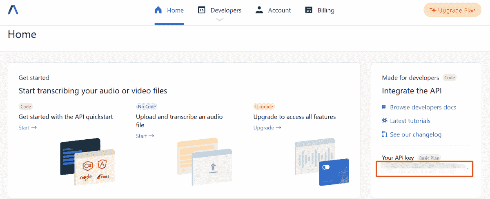

# 用 Python 构建一个带语音识别的实时网络摄像头

> 原文：<https://betterprogramming.pub/build-a-real-time-webcam-with-speech-recognition-in-python-b073acd3cd4f>

## 实时传输您的音频数据


托马斯·勒在 Unsplash[拍摄的照片](https://unsplash.com/s/photos/voice?utm_source=unsplash&utm_medium=referral&utm_content=creditCopyText)

以前，我曾经写过一篇关于[如何将音频文件转录为文本](https://levelup.gitconnected.com/how-to-transcribe-audio-files-to-text-1ed7cf6d8c08)的文章，它通过 AssemblyAI 提供的[语音到文本 API](https://app.assemblyai.com/) 转录一个音频记录文件。

在本教程中，我们将探索另一个版本，它将你的音频数据实时传输到一个 [WebSocket API](https://docs.assemblyai.com/overview/real-time-transcription) 中。

最终，您应该能够用 Python 创建一个带有语音识别功能的实时网络摄像头应用程序。最终结果如下:


作者 Gif

让我们继续下一部分，开始安装必要的模块。

# 设置

## Python 包

强烈建议您在继续之前创建一个新的虚拟环境。逐一运行以下命令来安装所有依赖项:

```
pip install websocket
pip install opencv-python
pip install pipwin
pipwin install pyaudio
```

## WebSocket API

为了开始，请在此注册一个[新的免费试用账户。试用帐户每月有 3 个小时的转录，每个帐户都有一个唯一的 API 密钥。](https://app.assemblyai.com/signup)



作者图片

请注意，WebSocket API 仅适用于升级后的帐户。您可以通过在您的[仪表盘](https://app.assemblyai.com/)中添加一张卡来轻松升级您的帐户。

# 履行

创建一个名为 main.py 的新 Python 文件，作为本教程的主应用程序。

## 导入

在文件顶部添加以下导入语句:

```
import pyaudio
import websockets
import asyncio
import base64
import json
import logging
import cv2
```

## 初始化

接下来，初始化以下变量:

```
FRAMES_PER_BUFFER = 3200
FORMAT = pyaudio.paInt16
CHANNELS = 1
RATE = 16000
p = pyaudio.PyAudio()# starts recording
stream = p.open(
 format=FORMAT,
 channels=CHANNELS,
 rate=RATE,
 input=True,
 frames_per_buffer=FRAMES_PER_BUFFER
)# the AssemblyAI endpoint we’re going to hit
URL = “wss://api.assemblyai.com/v2/realtime/ws?sample_rate=16000”
auth_key = “xxxxxx”
text = “”# image
cap = cv2.VideoCapture(0)
font = cv2.FONT_HERSHEY_SIMPLEXwebcamIsOn = True
```

将`auth_key`变量替换为您帐户的 API 密钥。

## WebSocket

完成后，让我们看看如何使用下面的代码片段创建一个新的 WebSocket 连接:

```
async with websockets.connect(URL, extra_headers=((“Authorization”, auth_key),), ping_interval=5, ping_timeout=20) as _ws:
   await asyncio.sleep(0.1)
   print(“Receiving SessionBegins …”)
   session_begins = await _ws.recv()
   print(session_begins)
   print(“Sending messages …”) …
```

现在，您需要在上下文管理器中实现以下异步子函数:

*   **发送** —向 WebSocket 服务器发送 base64 编码的音频数据
*   **接收** —从 WebSocket 服务器接收 JSON 数据，并将相应的文本赋给全局变量 text
*   **网络摄像头** —从网络摄像头读取数据并显示图像。此外，它将在图像上呈现转录文本

send 函数的代码片段如下:

另一方面，接收函数要简单得多。只需定义全局文本变量并在循环中实现代码:

随后，使用以下代码实现网络摄像头功能:

它使用 opencv 从您机器上的第一个网络摄像头设备捕获所有帧。此外，它会将转录文本呈现为每个框架顶部的覆盖图。

最后，调用`asyncio.gather`函数来并行运行所有的子函数:

```
send_result, receive_result, webcam_result = await asyncio.gather(send(), receive(), webcam())
```

现在，让我们将代码片段包装在一个函数调用`send_receive`中，触发器如下:

```
asyncio.run(send_receive())
```

你可以在下面的 [GitHub gist](https://gist.github.com/wfng92/8ba1aae0df5abc0d6b0061d68d341fcb) 找到完整的代码:

# 试验

保存文件并在终端上运行以下命令:

```
python main.py
```

它将运行一个应用程序，从你的摄像头捕捉图像。您应该在终端上看到以下输出:

```
Connecting websocket to url $wss://api.assemblyai.com/v2/realtime/ws?sample_rate=16000
Receiving SessionBegins …
{“message_type”: “SessionBegins”, “session_id”: “0c72be27-ced6–4859-a0a6–1ef47d22ff46”, “expires_at”: “2021–12–07T14:26:28.844782”}
Sending messages …
```

将您的麦克风连接到您的机器上，并使用它说话。转录文本将呈现在每一帧上，如下图所示:


作者图片

# 结论

让我们回顾一下你今天所学的内容。

本文从一个简单的问题陈述和带有语音识别应用程序的实时网络摄像头的最终结果开始。

然后，通过`pip install`和`pipwin`进入封装安装。

随后，它讲述了向 WebSocket 服务器发送音频数据、从服务器接收 JSON 结果以及呈现网络摄像头输出的实现代码。

最后，通过运行 Python 文件实现了一个具有语音识别功能的实时网络摄像头应用程序。

感谢你阅读这篇文章。祝你有美好的一天！

# 参考

1.  [AssemblyAI —实时流式转录](https://docs.assemblyai.com/overview/real-time-transcription)
2.  [使用 Python 进行实时语音识别](https://www.assemblyai.com/blog/real-time-speech-recognition-with-python/)