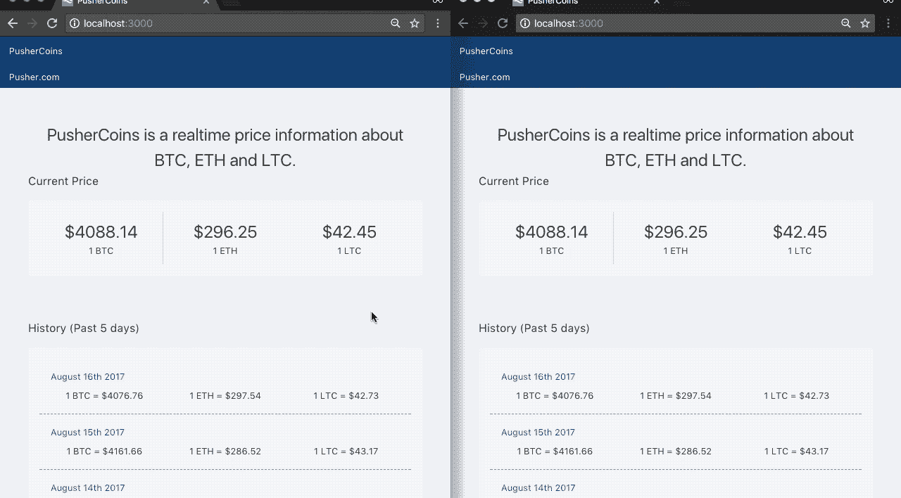
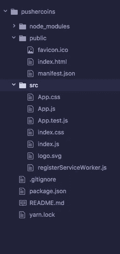
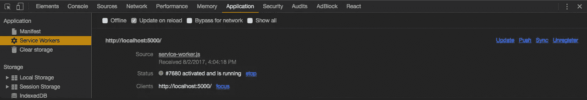
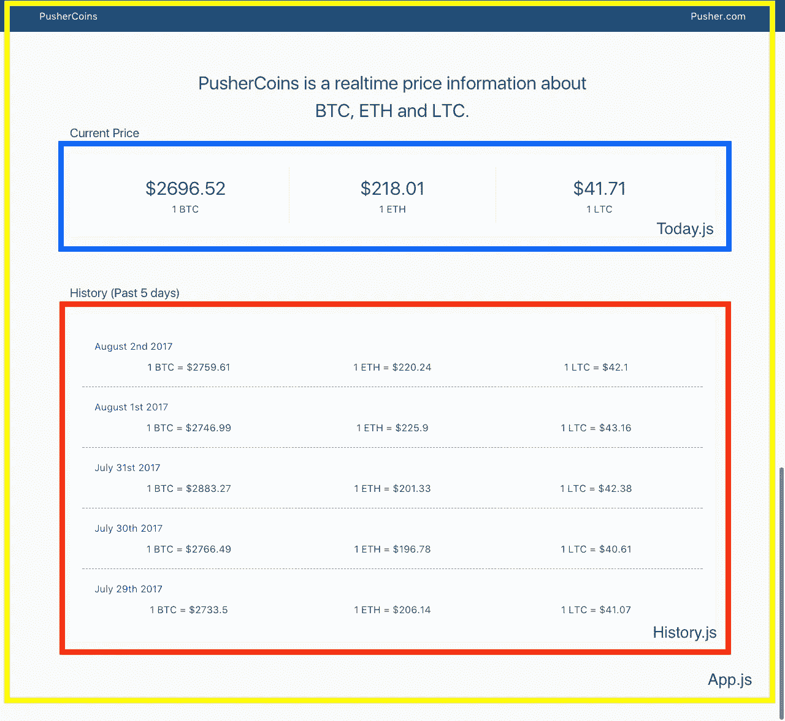
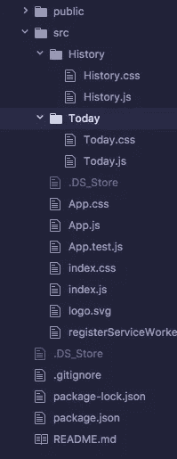
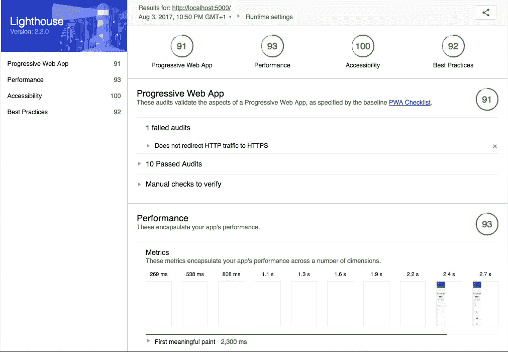
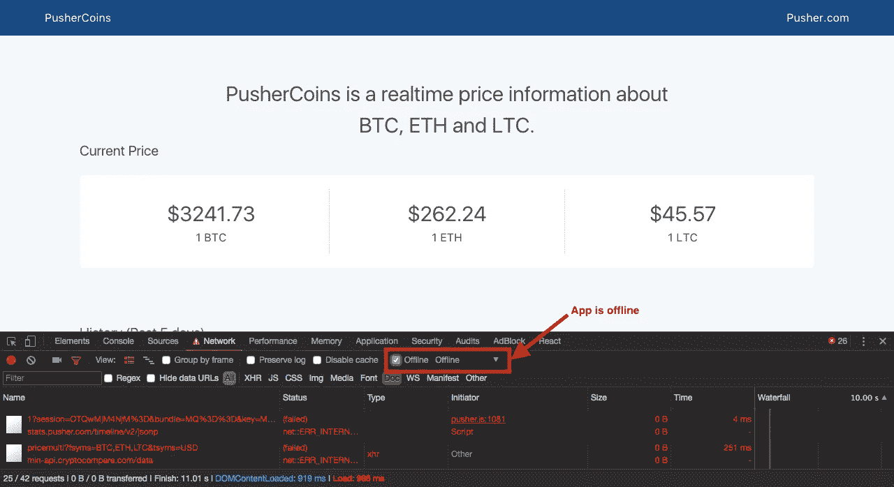
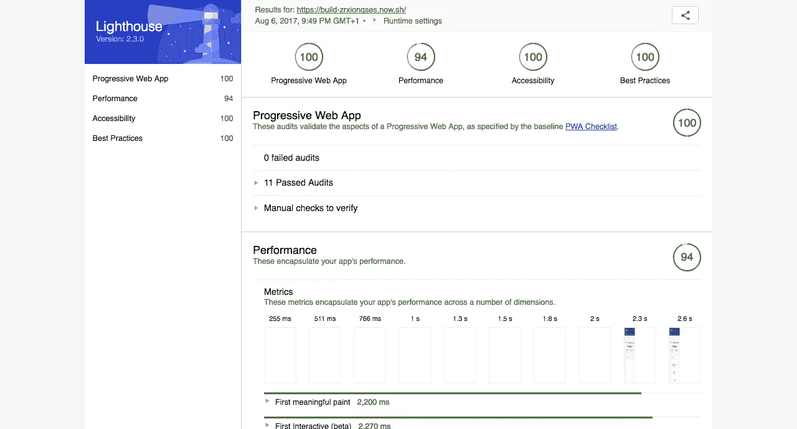

# 使用 React 构建实时 PWA

> 原文：<https://betterprogramming.pub/build-a-realtime-pwa-with-react-99e7b0fd3270>

## 创建一个应用程序来显示 BTC、LTC 和 ETH 当前和过去的价格信息


渐进式网络应用程序(PWAs)是结合了网络和应用程序优点的体验。他们使用服务工人、HTTPS、清单文件和应用外壳架构向 web 应用提供本地应用体验。

在本教程中，我们将构建一个名为 PusherCoins 的 PWA。PusherCoins 使用来自 cryptocompare.com[的数据显示比特币(BTC)、莱特币(LTC)和以太币(ETH)的当前和过去价格信息。下面可以看到一个演示。当前的比特币、以太币和莱特币价格每 10 秒更新一次，实时变化，并通过](http://cryptocompare.com/)[推送器](http://pusher.com/)连接到其他连接的客户端。



# 使用 Create React 应用程序构建 PWA

我们将在 [create-react-app](https://github.com/facebookincubator/create-react-app) 的帮助下构建一个实时 PWA。

对于刚刚开始使用 React 的开发人员来说，设置和配置他们的应用程序有困难是很常见的。`create-react-app`通过允许开发人员在很少或没有构建配置的情况下构建 React 应用，消除了所有这些问题。要获得一个可用的 React 应用程序，您只需安装 npm 模块并运行一个命令。

更重要的是,`create-react-app`的产品版本是一个全功能的渐进式 Web 应用程序。这是在集成到生产配置中的`[sw-precache-webpack-plugin](http://(https://github.com/goldhand/sw-precache-webpack-plugin))`的帮助下完成的。

让我们开始构建 React 应用程序。用以下命令安装`create-react-app`工具:

```
npm install -g create-react-app
```

一旦安装过程完成，您现在可以使用命令`create-react-app pushercoins`创建一个新的 React 应用程序。

这将生成一个新文件夹，其中包含运行 React 应用程序所需的所有文件和一个服务人员文件。在`public`文件夹中也创建了一个清单文件。



`public`文件夹中的`manifest.json`文件是一个简单的 JSON 文件，它让你能够控制你的应用程序如何显示给用户，并定义它在启动时的外观。

我们通过链接到`index.html`文件的第 12 行来通知应用程序`manifest.json`文件。

```
<link rel="manifest" href="%PUBLIC_URL%/manifest.json">
```

接下来，让我们浏览一下`registerServiceWorker.js`文件，看看服务工作者文件是如何工作的。服务人员文件可以在 [GitHub](https://github.com/yomete/pushercoins/blob/master/src/registerServiceWorker.js) 上的`src`文件夹中看到。

服务工作者代码基本上为 React 应用程序注册了一个服务工作者。我们首先通过将返回 true 或 falsy 值的`isLocalhost`常量值检查应用程序是否由本地主机提供。只有在 React 应用程序处于生产模式并且浏览器支持服务人员时，`register()`功能才有助于将服务人员注册到 React 应用程序。`unregister()`功能有助于取消服务人员的注册。

让我们看看服务人员是否真的工作。为此，我们需要为生产准备 React 应用程序，因为服务工作者代码只在生产模式下工作。`npm run build`命令对此有所帮助。

该命令将用于生产的应用程序构建到`build`文件夹中，并在生产模式下正确绑定 React，并优化构建以获得最佳性能。它还注册服务人员。运行该命令，终端的输出应该如下所示:


我们可以看到 React 应用程序中文件的大小，最重要的是如何在静态服务器的帮助下运行应用程序。我们将使用 [serve](https://www.npmjs.com/package/serve) npm 包来，等待它，serve(😀)的 React 应用。因此，使用以下命令在您的计算机上安装 serve，并为应用程序设置静态服务器:

```
npm i serve -gserve -s build
```

您的应用程序应该在 [http://localhost:5000](http://localhost:5000/) 上启动并运行。那么我们如何检查一个站点是否是 PWA 呢？我们可以通过检查开发人员工具中“应用程序”选项卡中的“服务人员”部分来做到这一点。



我们也可以使用 [Lighthouse](https://developers.google.com/web/tools/lighthouse/) 工具进行检查。Lighthouse 是一个[开源](https://github.com/GoogleChrome/lighthouse)，用于提高网页质量的自动化工具。它可以对性能、可访问性和渐进式 Web 应用程序进行审计。Lighthouse 目前只作为谷歌 Chrome 浏览器的扩展和 T21 的 npm 包提供。

我使用 Lighthouse 扩展为生产中新创建的 React 应用程序生成了一个报告，并得到了以下结果。


React 应用程序在 PWA 部分获得了 91 分(满分为 100 分)，这并不算糟糕。所有的审计都通过了，只有一项与 HTTPS 有关，但现在无法实施，因为该应用程序仍在本地环境中。

现在我们知道了如何检查一个应用程序是否是 PWA，让我们继续构建实际的应用程序。因为我们将使用 React 构建这个 PWA，所以我们从 React 组件的角度来考虑非常重要。

因此，React 应用程序将分为三个组件。

1.  包含显示 BTC、瑞士联邦理工学院和长期资本公司过去价格所需的所有代码。
2.  `Today.js`包含显示 BTC、瑞士联邦理工学院和长期资本公司当前价格所需的所有代码。
3.  `App.js`同时拥有`History.js`和`Today.js`



好了，让我们继续构建应用程序。我们需要在`src`文件夹中创建两个文件夹，`Today`和`History`。在新创建的文件夹中，分别创建文件`Today.js`、`Today.css`和`History.js`、`History.css`。您的项目目录应该如下所示。



在我们开始使用`Today`和`History`组件之前，让我们构建应用程序外壳。

> *应用程序外壳是支持用户界面所需的最少 HTML、CSS 和 JavaScript，当离线缓存时，可以确保用户在重复访问时获得即时、可靠的良好性能。你可以在这里* *阅读更多关于 app 炮弹* [*。*](https://developers.google.com/web/fundamentals/architecture/app-shell)

打开`App.js`文件，用以下代码替换:

应将`App.css`文件替换为以下内容:

我们还将使用布尔玛 CSS 框架，所以将下面的代码行添加到您的`public`文件夹中的`index.html`中:

```
<link rel="stylesheet" href="https://cdnjs.cloudflare.com/ajax/libs/bulma/0.4.3/css/bulma.min.css">
```

# 创建反应组件

接下来，打开`Today.js`文件，因为我们很快就要为该组件编写代码了。那么这个组件是做什么的？

它负责从 Cryptocompare API 获取比特币、以太币和莱特币的当前价格，并将其显示在前端。让我们写代码。

我们做的第一件事是使用 ES6 `import`导入 React 及其组件模块，我们还导入 axios。Axios 用于向 Cryptocompare API 发出 API 请求，可以通过在您的终端中运行`npm install axios`来安装

```
import React, { Component } from 'react';
    import './Today.css'
    import axios from 'axios'
```

接下来要做的是创建一个名为`Today`的 [ES6 类](https://developer.mozilla.org/en/docs/Web/JavaScript/Reference/Classes)，它从`react`扩展了组件模块。

在上面的代码块中，我们从 React 导入了`react`和`component`类。我们还导入了将用于 API 请求的`axios`。在`componentWillMount`函数中，我们发送一个 API 请求来获取当前的加密货币汇率。来自 API 的响应将用于设置状态值。

我们不要忘记组件的 CSS。打开`Today.css`并输入以下 CSS 代码:

下一步是为`History.js`编写代码。该组件负责向我们显示过去五天的 BTC、瑞士联邦理工学院和长期资本公司的价格。我们将使用`axios`包和`moment`包来格式化日期。Moment.js 可以通过在您的终端中运行`npm install moment`来安装。打开`History.js`文件，我们做的第一件事是使用 ES6 `import`导入 React 及其组件模块，我们还导入 axios 和`Moment.js`。

```
import React, { Component } from 'react';
    import './History.css'
    import axios from 'axios'
    import moment from 'moment'
```

就像我们在`Today.js`组件中所做的一样，我们将创建一个名为`History`的 [ES6 类](https://developer.mozilla.org/en/docs/Web/JavaScript/Reference/Classes)，它从`react`扩展了组件模块，并且还创建了一些将与`this`绑定的函数。

正如在上面的代码块中看到的，我们已经定义了 state 值，这些值将保存 BTC、ETH 和 LTC 过去五天的价格信息。我们还创建了向 Cryptocompare 返回 API 请求的函数。现在，让我们编写代码，利用上面的函数，在州中存储各种价格，并呈现它们。

值得注意的是，Cryptocompare 目前没有一个 API 端点，允许您获取价格信息的日期范围。您必须获得过去五天的时间戳，然后分别使用它们来获得所需的数据。一种变通方法是使用 moment.js，通过使用`.subtract` [方法](https://momentjs.com/docs/#/manipulating/subtract/)和`.unix` [方法](https://momentjs.com/docs/#/displaying/unix-timestamp/)来获得您想要的特定日期的时间戳。举例来说，要获得两天前的时间戳，您应该这样做:

```
moment().subtract(2, 'days').unix();
```

好了，让我们继续剩下的代码，写出获取过去 5 天的值的函数。

因此，我们上面有五个函数，它们基本上只是使用`moment.js`来获取所需的日期，然后将该日期传递给我们上面首先创建的函数，以从 Cryptocompare 获取价格信息。我们使用`axios.all`和`axios.spread`，这是一种用回调处理并发请求的方式。这些功能将在`componentWillMount`功能中运行。

最后，对于`History.js`，我们将编写渲染函数:

我们现在可以运行`npm start`命令在 [http://localhost:3000](http://localhost:3000/) 查看应用程序。


我们可以快速检查一下，看看这个应用程序作为 PWA 的当前状态如何。请记住，我们有一个服务工作者文件，它当前缓存了该应用程序所需的所有资源。因此，您可以运行`npm run build`命令将应用程序置于生产模式，并使用 Lighthouse 检查其 PWA 状态。



我们得到了 91/100 的分数。哇哦！唯一没有通过的审核是 HTTPS 审核，因为该应用程序仍在本地服务器上，所以现在无法实施。

我们的应用程序看起来不错，速度也很快(在< 3s), let’s add real-time functionalities by adding Pusher.

# Make It Real-time With Pusher

By using Pusher, we can easily add real-time functionalities to the app. Pusher makes it simple to bind UI interactions to events that are triggered by any client or server. Let’s set up Pusher.

Log into your [仪表板](http://dashboard.pusher.com/)上进行交互(或者[如果你是新用户，创建一个新账户)并创建一个新的应用程序。复制你的`app_id`、`key`、`secret`和`cluster`，把它们存放在某个地方，因为我们以后会用到它们。](http://pusher.com/)

我们还需要创建一个服务器来帮助触发 Pusher 事件，我们将使用 Node.js 创建一个服务器。在项目目录的根目录下，创建一个名为`server.js`的文件，并键入以下代码:

这是一个简单的 Node.js 服务器，使用 Express 作为它的 web 框架。Pusher 使用仪表板凭证进行初始化，并且还定义了各种 API 路由。不要忘记安装正在使用的软件包:

```
npm install express body-parser pusher
```

我们还需要在`package.json`文件中添加一行代码，以便允许 API 代理。由于我们将运行后端服务器，我们需要找到一种方法来运行 React 应用程序和后端服务器。API 代理有助于解决这个问题。

要告诉开发服务器将任何未知请求(`/prices/new`)代理到开发中的 API 服务器，请在`scripts`对象之后立即向`package.json`添加一个`proxy`字段:

```
"proxy": "http://localhost:5000"
```

我们只需要实时生成当前价格，这意味着我们将处理`Today`组件，所以打开文件。Pusher JavaScript 库是必需的，所以运行`npm install pusher-js`来安装它。

首先要做的是导入`pusher-js`包:

```
import Pusher from 'pusher-js'
```

在`componentWillMount`方法中，我们使用之前从仪表板获得的凭证建立到 Pusher 的连接:

```
// establish a connection to Pusher
    this.pusher = new Pusher('APP_KEY', {
        cluster: 'YOUR_CLUSTER',
        encrypted: true
    });
    // Subscribe to the 'coin-prices' channel
    this.prices = this.pusher.subscribe('coin-prices');
```

我们需要每 10 秒钟查询一次 API 来检索最新的价格信息。我们可以使用`setInterval`函数每 10 秒发送一个 API 请求，然后将该 API 请求的结果发送给 Pusher，这样就可以将它广播给其他客户端。

在创建 setInterval 函数之前，让我们创建一个简单的函数，它接受一个参数并将其发送到后端服务器 API:

```
sendPricePusher (data) {
   axios.post('/prices/new', {
       prices: data
   })
     .then(response => {
         console.log(response)
     })
     .catch(error => {
         console.log(error)
     })
}
```

让我们创建`setInterval`函数。我们需要创建一个`componentDidMount`方法，这样我们就可以将区间代码放入其中:

```
componentDidMount () {
    setInterval(() => {
        axios.get('https://min-api.cryptocompare.com/data/pricemulti?fsyms=BTC,ETH,LTC&tsyms=USD')
            .then(response => {
                this.sendPricePusher (response.data)
            })
            .catch(error => {
                console.log(error)
            })
    }, 10000)
 }
```

所以现在，应用程序每 10 秒钟查询一次 API，并将数据发送给 Pusher，但我们仍然没有使应用程序实时化。我们需要实现实时功能，以便连接到应用程序的其他客户端/用户可以实时看到价格变化。这将通过使用推动器的[绑定方法](https://pusher.com/docs/client_api_guide/client_events#bind-events)来完成。

在`componentDidMount`方法中，紧接在`setInterval`函数之后添加下面的代码:

```
// We bind to the 'prices' event and use the data in it (price information) to update the state values, thus, realtime changes 
this.prices.bind('prices', price => {
   this.setState({ btcprice: price.prices.BTC.USD });
   this.setState({ ethprice: price.prices.ETH.USD });
   this.setState({ ltcprice: price.prices.LTC.USD });
 }, this);
```

上面的代码块侦听来自 Pusher 的数据，因为我们已经订阅了该通道，并使用它获得的数据来更新状态值，因此是实时变化。我们现在有一个渐进的实时应用程序！请参见下面的演示:


# 离线策略

现在，如果我们离线，我们的应用程序将无法发出 API 请求来获取各种价格。那么，我们如何确保即使网络出现故障，我们仍然能够看到一些数据呢？

一种方法是使用客户端存储。这将如何工作？我们将简单地使用 localStorage 来缓存数据。

localStorage 使得在浏览器中存储值成为可能，这些值可以在浏览器会话中继续存在。它是 [Web 存储 API](https://developer.mozilla.org/en-US/docs/Web/API/Web_Storage_API) 的一种，这是一种用于在浏览器中存储数据的键值对的 API。它有一个限制，只能存储字符串。这意味着任何存储的数据都必须使用`JSON.stringify`进行*字符串化*

值得注意的是，还有其他类型的客户端存储，如会话存储、Cookies、IndexedDB 和 WebSQL。本地存储可以用于这样的演示应用程序，但在生产应用程序中，建议使用 IndexedDB 这样的解决方案，它提供了更多功能，如更好的结构、多个表和数据库以及更多存储。

目标是显示从`localStorage`开始的价格。这意味着我们必须将各种 API 请求的结果保存到`localStorage`中，并将状态设置为`localStorage`中的值。这将确保当网络不可用并且 API 请求失败时，我们仍然能够看到一些数据，尽管是缓存的数据。我们就这么做吧。打开`Today.js`文件，编辑 API 请求的回调函数中的代码，用下面的代码获取价格:

我们本质上是将从 API 请求中获得的值存储到`localStorage`中。有了`localStorage`中的值，我们需要将状态值设置为`localStorage`中保存的值。在`componentDidMount`方法内部，在`setInterval`代码之前，添加以下代码:

上面的代码只在浏览器离线时执行。我们可以使用`navigator.onLine`检查互联网连接。属性返回浏览器的在线状态。该属性返回一个布尔值，其中`true`表示联机，`false`表示脱机。

现在让我们也为`History.js`实现 localStorage。我们需要将这些函数中 API 的值(`getTodayPrice(), getYesterdayPrice(), getTwoDaysPrice(), getThreeDaysPrice(), getFourDaysPrice()`)保存到`localStorage`。

我们本质上是将从 API 请求中获得的值存储到`localStorage`中。有了`localStorage`中的值，我们还需要将状态值设置为`localStorage`中保存的值，就像我们在`Today`组件中所做的那样。创建一个`componentDidMount`方法，并在该方法中添加以下代码:

现在，当没有互联网连接时，我们的应用程序将显示缓存的值。



值得注意的是，该应用程序是时间敏感的。缓存时，对时间敏感的数据对用户来说并不真正有用。我们可以做的是，添加一个状态指示器，警告用户当他们离线时，正在显示的数据可能是陈旧的，需要互联网连接才能显示最新的数据。

# 将应用部署到生产中

现在我们已经完成了构建，让我们将应用程序部署到生产环境中，并进行最终的 Lighthouse 测试。我们将使用 [now.sh](http://now.sh/) 进行部署，`now`允许您轻松地将您的 JavaScript (Node.js)或 Docker 支持的网站、应用程序和服务带到云上。您可以在网站上找到安装说明。您还可以使用任何其他部署解决方案，我现在使用它是因为它简单。

通过在终端中运行以下命令，为应用程序的生产做准备:

```
npm run build
```

这将生产应用程序构建到`build`文件夹中。好了，接下来要做的是创建一个服务器，应用程序将在其中提供服务。在`build`文件夹中，创建一个名为`server.js`的文件，并输入以下代码:

这基本上是我们在项目根目录下的`server.js`文件中编写的相同代码。这里唯一增加的是我们设置了 home route 来服务于`public`文件夹中的`index.html`文件。接下来，运行命令`npm init`为我们创建一个`package.json`文件，最后用下面的命令安装所需的包:

```
npm install express body-parser pusher
```

现在，您可以通过在`build`文件夹中运行`node server.js`来查看应用程序，您的应用程序应该在 [http://localhost:5000](http://localhost:5000/) 上运行。

部署到`now`非常简单，你所要做的就是运行命令`now deploy`，然后`now`会自动生成一个活动的 URL 来处理一切。

如果一切顺利的话，你的应用程序应该已经部署好了，在这里，[https://build-zrxionqses.now.sh/](https://build-zrxionqses.now.sh/)。现在自动为所有部署提供 SSL，因此我们最终可以再次生成 Lighthouse 报告来检查 PWA 状态。现场灯塔报告可以在[这里](https://googlechrome.github.io/lighthouse/viewer/?gist=4da584b2d889a4f7ce9e439659ea5441)看到。



# 应用安装

PWAs 的功能之一是 web 应用程序安装横幅。那么这是如何工作的呢？仅当满足以下条件时，PWA 才会安装 web 应用程序安装横幅:

*   有一个 web 应用程序清单文件，其中包含:
*   A `short_name`(用于主屏幕)
*   一个`name`(用于横幅中)
*   144x144 png 图标(图标声明必须包含 mime 类型的`image/png`)
*   加载的一个`start_url`
*   一名[服务人员](https://developers.google.com/web/fundamentals/getting-started/primers/service-workers)在你的网站上注册
*   在 [HTTPS](https://developers.google.com/web/fundamentals/security/encrypt-in-transit/why-https) 上服务(使用服务人员的要求)。
*   至少被探视两次，每次探视间隔至少五分钟。

`public`文件夹中的`manifest.json`文件符合上述所有要求，我们在网站上注册了一名服务人员，该应用程序在[https://build-zrxionqses.now.sh/](https://build-zrxionqses.now.sh/)的 HTTPS 提供服务。

# 结论

在本教程中，我们看到了如何使用 ReactJS、Pusher 和 service workers 来构建一个实时 PWA。我们看到了如何使用服务人员来缓存资产和资源，以减少加载时间，并确保应用程序即使在离线时也能工作。

我们还看到了如何使用 localStorage 在本地保存数据，以防浏览器失去与互联网的连接。

该应用程序可以在这里现场观看[，你可以在这里](https://build-zrxionqses.now.sh/)查看 GitHub repo [。看看你是否能改变一些东西，也许能让应用程序加载得更快！](https://github.com/yomete/pushercoins)