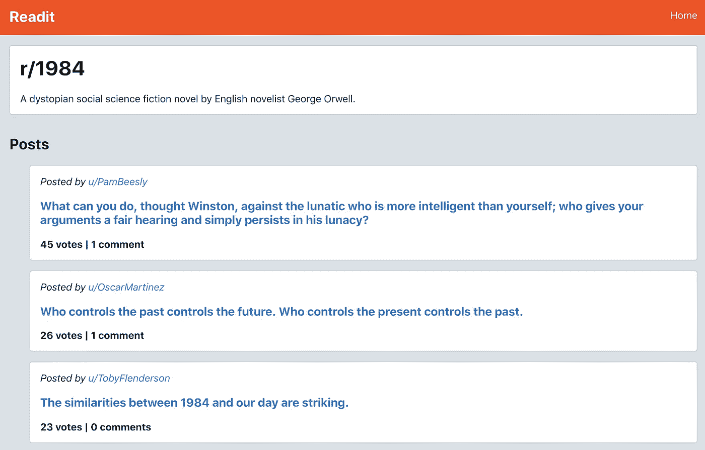
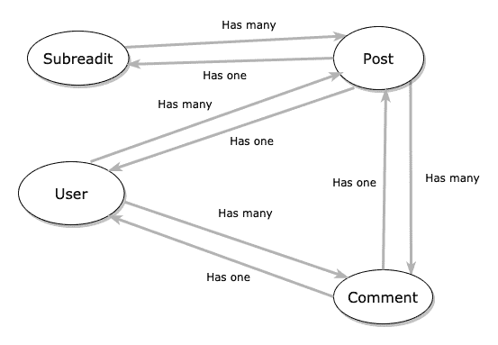
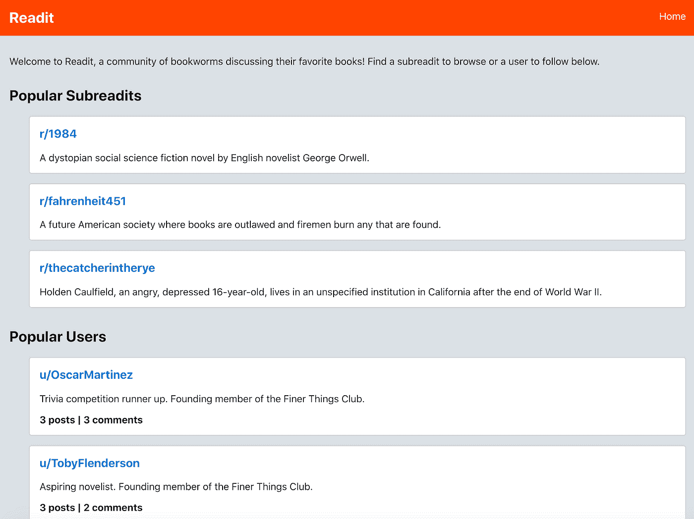
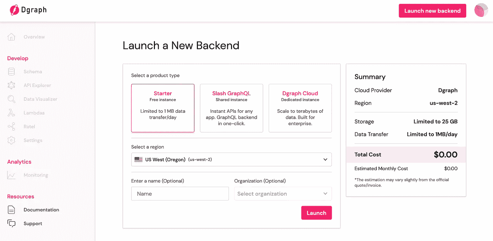
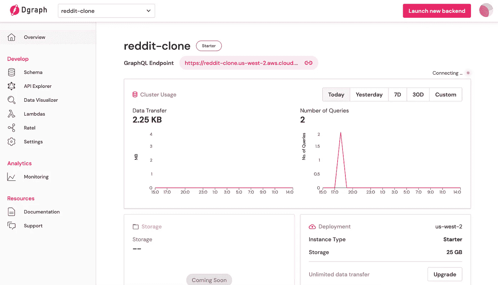
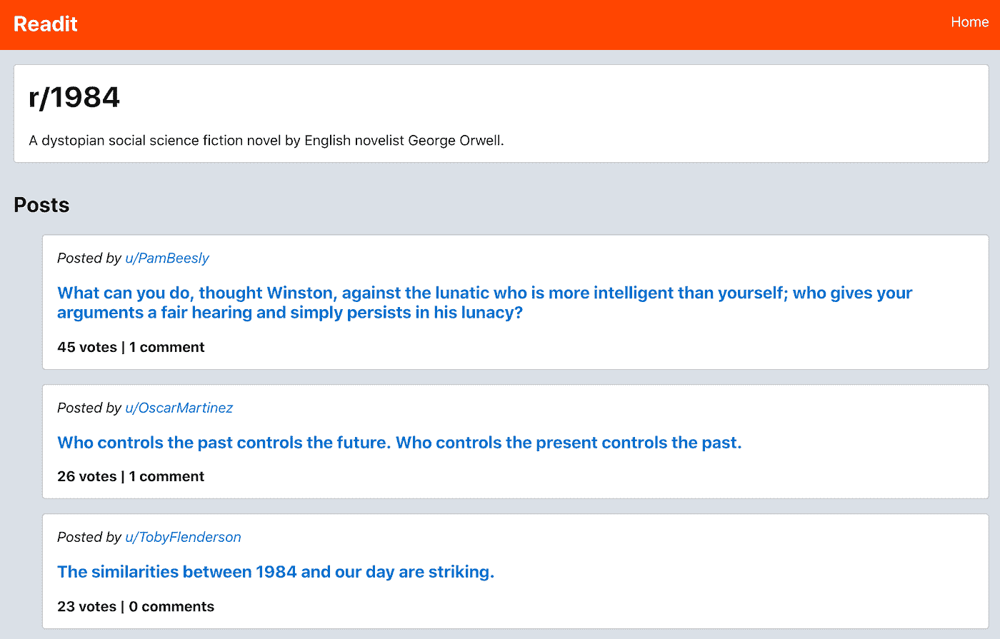
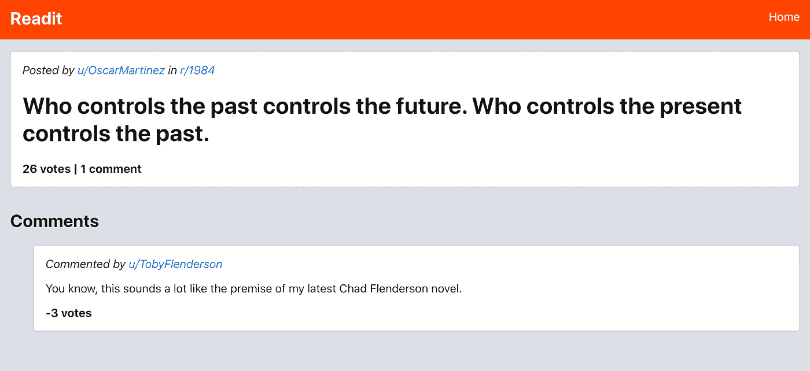
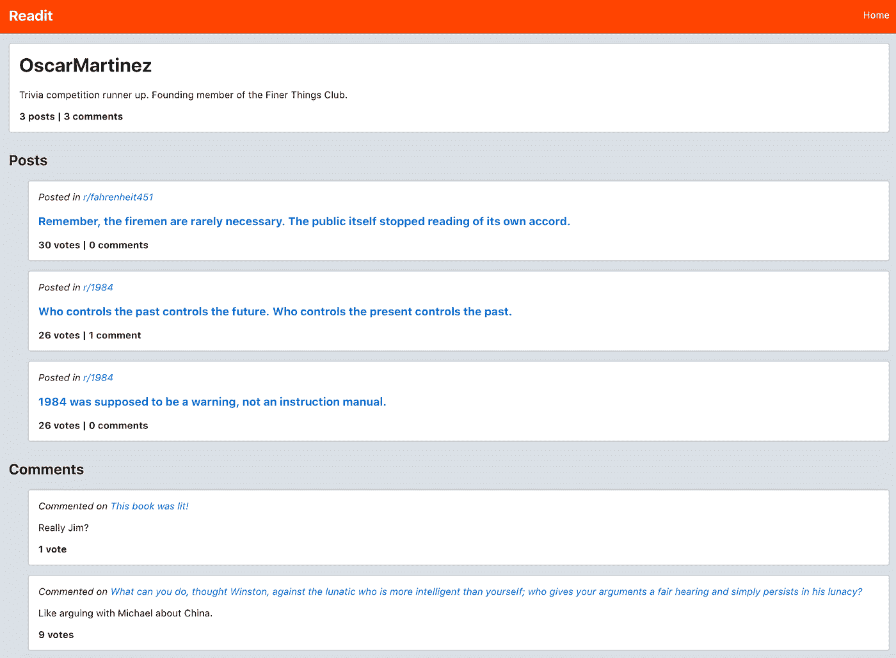

# 用 React 和 Dgraph Cloud 构建 Reddit 克隆

> 原文：<https://betterprogramming.pub/build-a-reddit-clone-with-react-and-slash-graphql-95bfb1c847e4>

## Readit:我为一个书虫社区制作的网络应用，用来讨论他们最喜欢的书



阅读 1984 年子编辑的子编辑页面。作者照片。

社交媒体应用程序是使用图形数据库和 GraphQL APIs 的完美候选。复杂数据查询和关系的组合是无穷无尽的。

以 Reddit 为例。该应用程序由子编辑(或主题)组成。用户可以在这些子编辑中创建帖子，这意味着帖子和子编辑之间存在多对一的关系。每个帖子只属于一个子编辑，每个子编辑可以包含许多帖子。用户可以对帖子发表评论，这导致了帖子和评论之间的另一种多对一关系。每个评论只属于一个帖子，每个帖子可以有很多评论。用户和帖子之间以及用户和评论之间也是多对一的关系。每个评论和帖子都是由单个用户发表的，单个用户可以有许多评论和帖子。

在 Reddit 这样的应用程序中，应用程序的每个页面都需要这些数据的不同子集。使用传统的 REST API 端点可能意味着开发几个独特的端点，每个端点都经过定制以满足特定用例的需求。然而，GraphQL APIs 基于这样一种思想，即开发人员可以使用单个 API 端点来挑选任何给定页面所需的相关数据。

这篇文章将强调 GraphQL 的灵活性，以及使用来自 [Dgraph Cloud](https://dgraph.io/cloud) 的托管后端是多么容易，以便前端开发人员准确获得他们应用程序每个页面所需的数据。

# 演示应用程序— Readit

在本文的其余部分，我们将使用的[演示应用](http://tylerhawkins.info/reddit-clone/build/)是 Readit，它是 Reddit 的克隆版，但是是为图书爱好者准备的(明白吗？).该应用程序的构建使用了:

*   [对用户界面做出反应](https://reactjs.org/)
*   [React 路由器](https://reactrouter.com/web/guides/quick-start)用于客户端路由
*   [用于 GraphQL 后端和数据库的图形云](https://dgraph.io/cloud)
*   [Apollo 客户端](https://www.apollographql.com/docs/react/)用于方便前端和后端之间的通信

如上所述，应用程序中的基本数据类型是子编辑(“子阅读”)、帖子、评论和用户。图表可能有助于直观地突出构成我们图表的每个节点之间的关系:



*图中的节点关系*

该应用程序包含查看主页、查看单个子阅读、查看特定帖子和查看单个用户的路径。在这里，我们看到了主页:



*Readit 主页*

如果你想在家继续或者在你的机器上尝试一下，这个应用的所有[代码都可以在 GitHub](https://github.com/thawkin3/reddit-clone) 上找到。您也可以[在我的网站](http://tylerhawkins.info/reddit-clone/build/)上查看演示应用。

# 配置 Dgraph 云后端

现在我们已经对应用程序有了一个大致的了解，让我们开始吧。首先，我们将使用[图形云](https://dgraph.io/cloud)创建一个后端。对于那些不熟悉这项服务的人来说，Dgraph 是一个为云构建的原生 GraphQL 图形数据库。

只需稍加配置，您就可以获得一个图形数据库以及一个用于处理数据库的 API 端点。Dgraph 的免费层非常适合学习和入门，所以我就用了这个。如果您需要让后端生产就绪，更多高级功能(如共享和专用集群)可在额外的付费层上获得。



*配置新的 Dgraph 云后端*

由于这是一个演示应用程序，我们可以为产品类型选择 Starter 选项。但是，生产应用程序应该使用共享或专用实例的更高层。我把我的地区命名为“美国西部 2”，因为那是离我最近的地区。我使用“reddit-clone”作为名称，但是您可以随意使用任何您喜欢的名称。

填写完所有选项后，我们可以单击“Launch”来启动新的后端。创建后端后，我们将看到一个概述页面，其中包含新的后端 API 端点:



*新的后端 API 端点*

现在是时候构建一个模式了。该模式声明了我们将在应用程序中使用并存储在数据库中的各种类型的数据。我们可以直接在模式编辑器中输入模式信息，或者为了获得更好的交互体验，使用 UI 模式。让我们使用 UI 模式来创建我们的模式。GUI 帮助我们配置我们的类型、它们的字段，甚至各种类型和字段之间的关系。


*在 UI 模式下创建模式*

创建模式后，我们可以单击“Deploy”按钮将其正式化。如果我们现在查看 Schema Editor 视图，我们将看到生成的 GraphQL 片段:

如您所见，每个字段都有一个关联的类型。例如，我们创建的`Comment`类型有一个`id`字段，其中包含由 Dgraph Cloud 生成的惟一标识符。它有一个`commentContent`字段，包含用户输入的字符串文本。它有一个`voteCount`字段，该字段是一个整数，表示评论获得的投票数。最后，`user`字段引用写评论的用户，而`post`字段引用发表评论的帖子。

评论和用户之间的关系由`@hasInverse`指令指定，该指令告诉 Dgraph Cloud】类型通过`User`类型上的`comments`字段链接到`User`类型。评论和帖子的关系也是如此。

您还会注意到我们的一些字段包含了`@search`指令。这允许我们通过这些可搜索的字段来过滤我们的查询。例如，我们可以通过针对`name`字段的特定文本字符串来过滤查询结果，从而找到特定的子编辑。当通过用户的`userName`字段过滤用户结果时也是如此。

下一步是用一些种子数据填充数据库，我们可以使用 API Explorer 来完成。在本文中，我们不会讨论填充数据所需的所有变化，但是您可以在 GitHub 上查看 GraphQL 片段。这些片段用于创建子阅读、用户、帖子和评论。

例如，下面是我用来创建几个子阅读的内容:

# 配置前端

现在我们已经创建了后端，我们可以继续构建前端。我们将使用 [](https://github.com/facebook/create-react-app) `[create-react-app](https://github.com/facebook/create-react-app)`生成一个框架应用程序作为起点，然后继续在此基础上构建应用程序。

```
yarn create react-app reddit-clone
cd reddit-clone
```

接下来，我们将安装`react-router-dom`,以便我们可以使用 React Router 在单页应用程序中进行客户端路由:

```
yarn add react-router-dom
```

使用 React Router，我们可以为我们的每个页面创建路由:home、subreadit、post 和 user。以下是`App`组件及其每条路线:

然后，我们将为 [Apollo Client](https://www.apollographql.com/docs/react/) 安装几个包，这是一个用于使用 GraphQL 的 JavaScript 状态管理库。虽然可以使用类似于`fetch` API 的东西直接向 GraphQL API 端点发出请求，但是 Apollo Client 使这个过程更加简单。

```
yarn add @apollo/client graphql
```

*注意:我们已经安装了* `*graphql*` *包以及* `*@apollo/client*` *包，尽管我们从未在代码中直接使用过* `*graphql*` *包。这是因为* `*graphql*` *是* `*@apollo/client*` *的* `*peerDependency*` *并且在内部使用以便于在 JavaScript 中使用 GraphQL。*

现在我们已经安装了 Apollo 客户端，我们可以轻松地从 GraphQL 后端查询数据，并在 React 组件中使用它。我们可以首先像这样创建 Apollo 客户机:

然后我们可以将主`App`组件包装在`index.js`文件的`ApolloProvider`中:

# 主页

现在我们已经设置好了路由，Apollo 也准备好了，我们可以开始为每条路由构建页面。主页显示了热门子读物列表和热门用户列表:


*Readit 主页*

我们可以向端点查询该信息，然后使用 Apollo 声明性地处理`loading`、`error`和响应`data`状态。`HomePage`组件的代码全文如下:

请注意，在检索用户信息时，我们不需要获取用户的所有帖子和评论。我们对主页唯一感兴趣的是每个用户有多少帖子和多少评论。我们可以使用`postsAggregate`和`commentsAggregate`中的`count`字段来查找相关数字。

# 子阅读页面

如果我们点击主页中的一个子阅读，我们将被带到该子阅读的页面，在那里我们可以看到该主题下的所有帖子:



*阅读 1984 年的子阅读页*

在这个页面上，我们需要 subreadit 名称和描述的数据——就像我们在主页上一样。我们现在还需要获取属于这个子阅读的所有文章。对于每个帖子，我们需要帖子标题、投票数和评论数，以及发布帖子的用户的用户名。不过，我们还不需要实际的评论，因为它们没有显示在这个页面上。

下面是`SubreaditPage`组件的代码:

# 帖子页面

一旦我们找到了我们想看的感兴趣的帖子，我们可以点击链接来查看单个帖子页面。该页面向我们展示了原始帖子以及帖子上的所有评论:



*阅读奥斯卡帖子的帖子页*

这里，我们需要 subreadit 页面上的所有相同的帖子数据，但现在我们还需要知道帖子是在哪个 subreadit 上发布的，我们需要帖子上的所有评论。对于每个评论，我们需要知道发布它的用户的用户名，实际的评论内容是什么，以及它有多少投票。

`PostPage`的代码如下所示:

# 用户页面

最后，如果我们决定查看用户的个人资料，我们可以看到他们发表的所有帖子和评论:



*阅读奥斯卡·马丁内斯的用户页面*

这个页面应该显示用户的用户名，简历，文章数量和评论数量。我们还需要他们所有的帖子和评论。对于每个帖子，我们需要知道它发布的子标题，帖子标题，以及投票和评论的数量。对于每个评论，我们需要知道它是对哪个帖子的评论，评论内容是什么，以及它得到的投票数。

`UserPage`的代码如下:

这个页面是迄今为止最复杂的，因为我们需要查询的不仅仅是汇总数据或聚合计数数据。

# 结论

正如我们所见，我们应用程序中的每个页面都需要独特的数据部分。有些页面只需要高层次的摘要，比如用户发表的评论或帖子的数量。其他页面需要更深入的结果，如实际的评论和实际的帖子。根据页面的不同，您可能需要更多或更少的信息。

使用 GraphQL 和 Dgraph Cloud 的好处是可以灵活地查询每个页面所需的数据——不多也不少。对于每个请求，我们使用同一个 API 端点，但是请求不同的字段。这极大地简化了开发工作，因为我们不需要为每个页面创建一个新的后端端点(或者更糟糕的是，创建一个端点来检索庞大的数据负载，然后我们必须筛选以找到我们需要的数据的子集)。

GraphQL 可以让您在需要的时候轻松快捷地请求正确的数据。