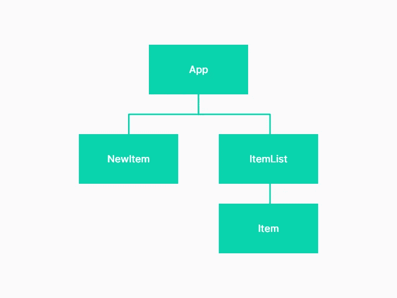
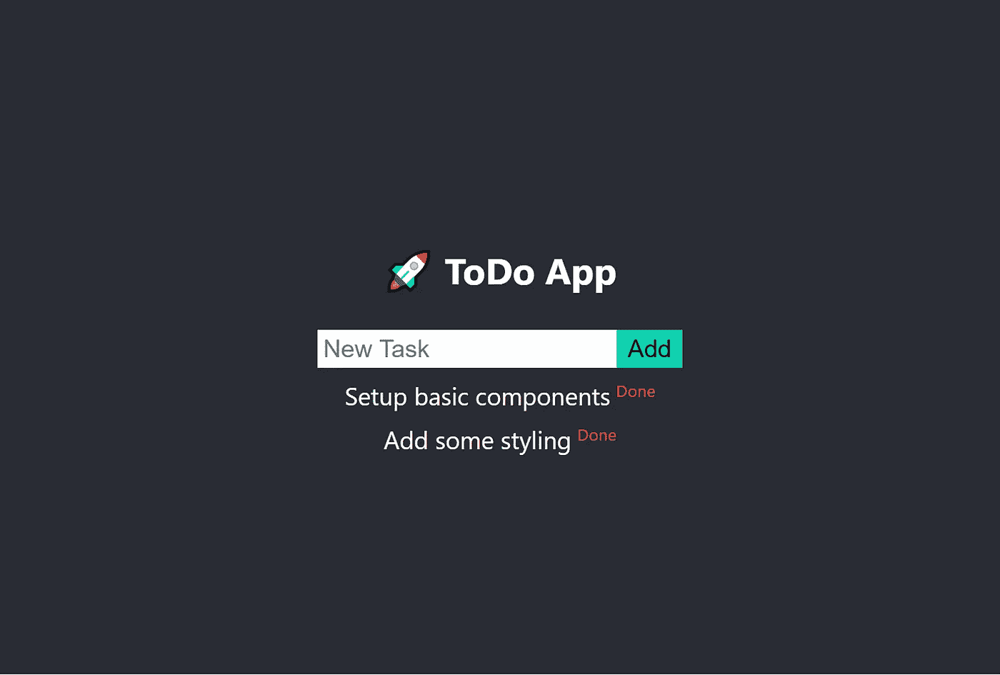
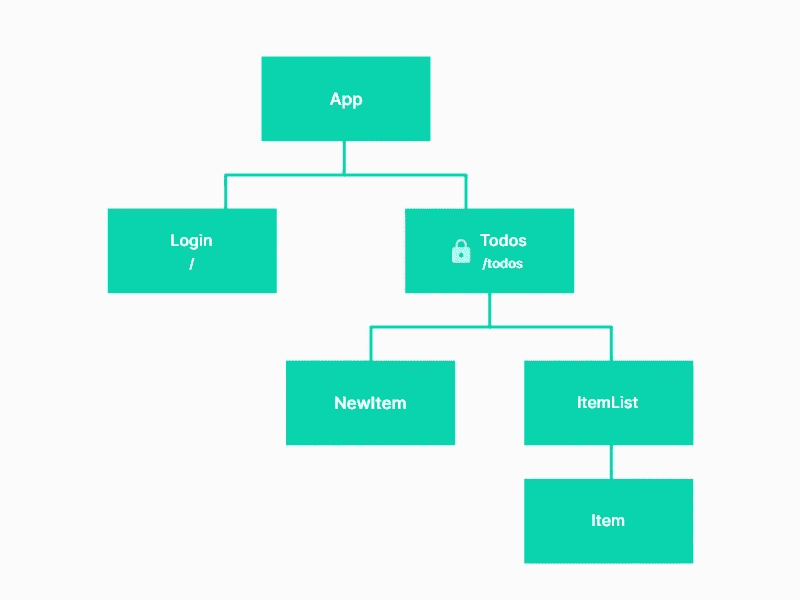

# 如何用 React 上下文和钩子构建一个类似 Redux 的存储

> 原文：<https://betterprogramming.pub/build-a-redux-like-store-with-react-context-hooks-234e3774495f>

## 并将身份验证和路由添加到您的应用中


在一个晴朗的周六早晨，你醒来时对下一个兼职项目有了一个绝妙的想法。你已经想了一周了，现在你准备好投入进去了。无论如何，你想尝试所有那些你在枯燥的日常工作中错过的热门新技术和框架。

使用 React 的所有最新和最棒的特性(上下文、钩子等),您对前端应用程序有了大致的概念。等。)以及无服务器后端(可能使用 [Cloudflare Workers](https://workers.cloudflare.com/) ？)

你打开你最喜欢的编辑器，一个闪亮的新 create React 应用程序正在运行，准备成为下一个大事件。

然后砰！开发了几个小时后，你意识到你实际上什么也没做，却打开了几十个教程标签和文档，只是对所有这些新特性和术语感到困惑和沮丧。

当我决定写这个指南来帮助我自己组织我的学习，并希望与像我一样沮丧的开发者分享这些知识时，我就在那里。

在本指南中，我将从上下文和钩子的基础开始，逐步将它们相互集成，创建一个简单但功能强大的状态管理器，就像 [Redux](https://redux.js.org/) 一样。

[TL；博士刚刚给我看了代码](https://github.com/pubudu-ranasinghe/react-context-example)。

# React 中的状态管理

所以，让我们回过头来定义一下我的需求。我想设置一个 React 应用程序，并且:

*   使用上下文和钩子进行全局状态管理。
*   使用全局状态实现身份验证。
*   使用公共和私有路由配置路由。

如果你有这三个地方，应用程序的其余部分是非常常见的反应业务。

使用 [Redux](https://redux.js.org/) 处理全局状态相当简单。你用一些初始值实现了一个*存储*，编写了*reducer*来帮助你更新存储，编写了 *actions* 和 *action creators* ，用于向存储分派更新。

然后，您只需*将应用程序中的任何组件*连接到商店，就可以使用全局状态或进行更新。

我们将看到如何使用上下文和钩子来实现类似的东西。我们的计划是:

*   使用钩子实现简单的状态管理。
*   使用 React 上下文将此状态转换为全局状态。
*   将 Hooks+上下文逻辑抽象成一个漂亮的、可重用的 API，类似于 Redux，带有一个存储、reducers 和动作。
*   使用创建的存储实现简单的身份验证和路由

先从[创建 React App](https://create-react-app.dev/) 开始，做一点试验。

```
npx create-react-app react-context-example
cd react-context-example
yarn start
```

我们将从一个非常简单的待办事项应用程序开始，它有三个组件，如下所示:



让我们添加以下组件:

组件/项目. js

App.css 让它看起来好看些:)

App.js

接下来，我们希望引入一个状态来存储待办事项列表，并能够添加和删除待办事项。

# 使用钩子的状态

*钩子*是 React 16.8 中新增的。它们允许您使用状态和其他 React 特性，而无需编写类。

以前，我们会将`App`组件转换成一个类组件，并向该类引入状态。

但是，使用 React 钩子，我们可以将它作为一个功能组件，并使用`useState`钩子引入状态。关于钩子的非常好的介绍可以在[钩子的文档](https://reactjs.org/docs/hooks-overview.html)中找到。

让我们更新`App.js`如下:

这里，我们使用`useState`钩子将一个项目数组声明为一个状态变量。它将初始状态作为参数并返回两个值，第一个是状态本身，第二个是更新状态的函数。

注意，与您可能习惯的类组件中的`setState`不同，钩子的状态更新方法不合并现有数据。因此，在传递更新后的状态之前，我们必须注意合并。

为此，我们定义了两个函数`handleAddItem`和`handleRemoveItem`，用于添加和删除项目。还要注意，这些函数作为道具被传递到我们的子组件`NewItem`和`ItemList`中。

现在我们有了一个基本但实用的待办事项列表。您可以在`NewItem`组件中引入另一个状态钩子来捕获用户输入的文本。

正如你所看到的，使用钩子使我们的代码变得更干净，并且避免了我们可能需要关心的类组件和生命周期钩子。

我们的目标是创建一个类似 Redux 的存储，这让我们能够抽象出状态管理逻辑，并使其可重用。特别是`useReducer`钩子，我们一会儿将会看到它，它允许我们将它包装在一个漂亮的 API 中。

# 使用反应上下文

现在，让我们探讨一下什么是 React 上下文。React 将上下文描述为:

> “上下文提供了一种通过组件树传递数据的方式，而不必在每一级手动向下传递属性。”

这正是我们全球国家管理所需要的。从使用上下文存储全局状态的顶级组件开始。

然后，在组件树中的任何地方，您都可以访问和/或更新这个状态。这是像 Redux 这样的全局状态管理器背后的基本思想。

还记得我们必须将`handleAddItem`和`handleRemoveItem`方法作为道具传递给子组件吗？让我们重构它，从上下文中获得，而不需要钻取道具。

使用 React 上下文非常简单。它采用以下形式。首先，您创建一个调用`React.createContext()`的上下文。这将一个可选的初始值作为参数。

然后，您需要使用`Context.Provider`向*提供*组件树中某处的上下文，以便下面的组件可以访问它。然后，在任何你想使用上下文的地方，使用`Context.Consumer`，它将访问这个值。

```
const MyContext = React.createContext(/* initialValue /*)<MyContext.Provider value={/* value*/}>
  <MyContext.Consumer>
    { value => /* components can access the value object */ }
  </MyContext.Consumer>
</MyContext.Provider>
```

文档中对 React 上下文做了很好的解释。

让我们从在`contexts/TodoContext.js`中为我们的待办事项创建一个新的上下文开始。

如下更新`App`组件，为我们的组件树提供`TodoContext`。

App.js

接下来，我们可以在子组件中使用`TodoContext.Consumer`，并访问传递给`TodoContext.Provider`的状态值。

Items.js

您可能会注意到，我们在任何需要使用上下文值的地方都重复使用了`TodoContext.Consumer`包装器。我们可以使用`useContext()`钩子来重构它，使它不那么冗长。

更新了 Items.js 以使用 useContext

目前，我们将全局状态存储在`App`组件中。这不是一个非常可取的行为，尤其是当我们的待办事项状态变得越来越复杂，而保存全局状态又不完全是`App`组件的职责。

所以，让我们把它移到我们已经创建的`TodoContext`中。

contexts/TodoContext.js

我们在这里导出两个函数。一个是`TodoProvider`组件，它实际上是一个更高级的组件，将`TodoContext.Provider`和一个状态包装在一起。

这成为我们的全球商店，我们需要更新`App`组件，如下所示:

我们的 App.js 要简单得多，不需要 todo 逻辑。

第二个导出是一个简单的[定制钩子](https://reactjs.org/docs/hooks-custom.html)，包装已经传递了`TodoContext`的`useContext`钩子。在`Items.js`中，需要导入`useTodoContext`并替换:

```
const todoContext = useContext(TodoContext);
```

使用:

```
const todoContext = useTodoContext();
```

就是这样！现在，我们已经有了一个用 React 上下文和钩子构建的整洁的全球商店。

遵循同样的模式，您可以创建新的`ContextProviders`，用它包装您的应用程序，然后在您的组件层次结构中的任何地方使用一个定制的`useContext`挂钩，将它用作一个存储。现在，请随意休息一下。

# 添加减速器和动作

接下来的部分很大程度上受到了 Redux 的启发。如果您不熟悉 Redux，请先查看[文档。](https://redux.js.org/introduction/getting-started)

我们的状态更新逻辑被定义为`TodoProvider`中的函数，这些函数中的每一个都作为引用存储在状态本身中，消费组件可以访问这些函数来更新状态。

按照 Redux 模式，我们可以将*动作*和*减速器*介绍给我们的状态管理器。我们可以有描述我们的状态发生了什么的动作，以及一个处理与所述动作相对应的状态变化的缩减器。

让我们从创建动作`ADD_TODO`、`REMOVE_TODO`和`CLEAR_ALL`开始。现在，我将在`TodoContext.js`文件中添加所有的动作和缩减器。如果这变得太大，请随意将您的代码分成单独的文件。

用操作和 reducer 更新了 TodoContext.js with

首先，我创建了一些动作和相应的动作创建器，与 Redux 非常相似。然后，我们有了 reducer，它也是一个简单的纯函数，将状态和动作作为参数，并返回更新后的状态。

然后，在我们的`TodoProvider`中，我们将`useState`钩子改为`useReducer`钩子。它接受一个缩减器和一个初始状态(不像在 Redux 中，我们将初始状态传递给缩减器，建议将初始状态传递给`useReducer`钩子)。

由`useReducer`返回的两个值是状态本身和一个调度函数，我们可以用它来调度我们的动作。

因为我们的消费者组件想要使用 dispatch 函数，所以我们将它作为一个值在`TodoProvider`中传递。现在，我们已经准备好使用消费者组件的状态和调度动作。

更新了 Items.js 以使用操作和调度程序

注意我是如何从`useTodoContext()`中析构了`dispatch`方法，并使用它来分派添加待办事项的动作。类似地，我们使用状态值，并将其与相关动作一起调度，以列出待办事项和删除待办事项。

# 使用上下文+挂钩存储实现身份验证

现在我们有了一个可用的全局存储实现，让我们回到我们的主要需求并实现身份验证。

我们需要一个单独的上下文来存储认证细节。因此，我们的全球状态应该是这样的:

```
{
  auth: {
    isLoggedIn: true,
    name: "John",
    error: null,
  },
  todos: []
}
```

我们需要用显示登录页面的基本路由`/`和受保护路由`/todos`配置路由，如果用户登录，受保护路由将显示待办事项页面。

我们可以如下更新我们的组件层次结构。`Todos`组件将处理所有待办事项，并驻留在`/todo`路由中，该路由将是一个私有路由。如果用户没有登录，他们将被重定向到`/`路由，这将呈现`Login`组件。



首先，添加 [react-router](https://reacttraining.com/react-router/web/guides/quick-start) 并设置组件。

```
yarn add react-router-dom
```

components/Todos.js

组件/Login.js

App.js

api/auth.js

我们可以遵循用于`TodoContext`的相同模式来创建用于认证的`AuthContext`，这非常简单明了。

上下文/AuthContext.js

在我们使用`AuthContext`之前，我们需要确保我们在应用程序的顶部提供了它。

所以，让我们用`AuthProvider`来包装整个 app。同时，我将增强我们的`Greeting`组件以使用 auth 状态并显示一个问候和一个注销按钮。

App.js

# 添加登录功能

现在我们已经配置了授权存储，我们可以开始构建`Login`页面的功能了。

在登录页面中，我们需要使用存储来检查用户是否已经登录，如果是，就将他们重定向到`Todos`页面。

如果没有，我们显示登录表单，并在提交时调用模拟的登录 API。如果登录成功，我们可以调度`loginSuccess`动作，否则就调度`loginFail`动作。

# 保护路线

接下来，让我们将`/todos`路由设为私有，这样只有登录的用户才能访问它。任何其他人都需要被重定向回登录页面。

我们可以通过简单地用一个更高阶的组件包装 react-router `Route`组件，并在其中使用`AuthContext`来决定是呈现路由还是重定向到登录页面来实现这一点。

components/PrivateRoute.js

现在，我们可以简单地使用`PrivateRoute`而不是`Route`来使注销用户无法访问任何路由。

# 结论

我们完了。

我们学习了如何使用上下文和钩子逐步构建一个类似 Redux 的存储，您可以在下一个项目中使用它作为 Redux 的一个简单和轻量级的替代方案。

在接下来的步骤中，您可以尝试使用 store 中间件，了解如何组合上下文(类似 Redux `combineReducers()`)，以及 React 提供的[其他挂钩](https://reactjs.org/docs/hooks-reference.html)。

在 [GitHub](https://github.com/pubudu-ranasinghe/react-context-example) 上查看完整源代码。