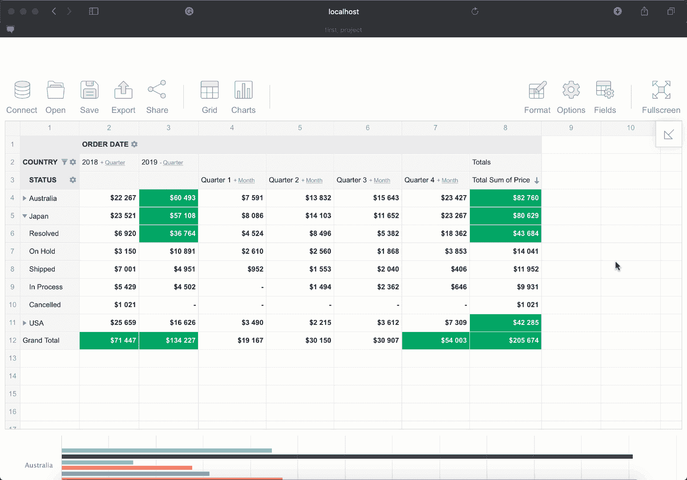

# 使用 Vue 3 构建报告应用程序

> 原文：<https://betterprogramming.pub/build-a-reporting-app-with-vue-3-e9f57b6d2f21>

## 使用组合和选项 API 可视化您的数据


莎拉·伊莉莎白在 [Unsplash](https://unsplash.com?utm_source=medium&utm_medium=referral) 上的照片

我的 Twitter 已经被关于 Vue.js 框架新版本的帖子占据了，所以我忍不住用它创建了一些数据可视化的东西。

# Vue 3 是什么？

首先，我决定搜索一些关于新 Vue 版本的额外信息，以了解我正在处理的问题。综上所述，我得出以下结论:

*   Vue 的创造者设法提高了性能和束尺寸，使 Vue 3 比 Vue 2 更快更轻；
*   新版本带来了一些语法变化和一些反对意见；
*   Vue 3 有更好的 TypeScript 支持；
*   添加了新的组件组合 API。

上一次更新真正引起了我的兴趣，因为我经常使用不同的 JavaScript 数据可视化组件，我很好奇这一增强将如何影响我的 web 开发过程。正如 Vue 专家所认为的那样——绝不可能。

这个 API 只是语言的一个补充，并不影响框架先前的功能。相反，它是为了解决 Vue 2 中使用的选项 API 的限制而创建的，是一种使用组件的替代方法。旧的方法在 Vue 3 中仍然可用，但是有类型脚本的限制，并且当你的组件变得更大时可读性变得困难。

因此，组合 API 与其说是某种创新，不如说是工作流程的便利和优化。然而，这并没有阻止我在行动中尝试这个东西的欲望。

对于一个测试项目，我决定使用 [Flexmonster 数据透视表和图表](https://www.flexmonster.com/?r=bp1)和 [Highcharts](https://www.highcharts.com/) 库，因为我以前已经使用过它们，它们与 Vue 3 集成在一起。但更重要的是，Flexmonster 团队在 GitHub 上创建了一个特殊的示例项目，在这里您可以检查他们的组件在 Vue.js 的 2 和 3 版本以及 Highcharts 集成中的使用情况。这个项目还包含了组合和选项 API 的用法的例子。

因此，对于我的研究目标来说，这是一个完美的匹配，因为我可以比较它们，并决定在实际项目中使用什么。

# 1.准备所需的技术

要使用 Vue，您需要 Node.js 和 npm。要检查它们是否出现在您的机器上，请运行:

```
node -vnpm -v
```

如果没有，就在这里停下来[安装它们。](https://docs.npmjs.com/downloading-and-installing-node-js-and-npm#using-a-node-version-manager-to-install-node-js-and-npm)

当然，我们的任务也需要 Vue CLI，如果您仍然没有使用此命令:

```
npm install -g @vue/cli
```

另一个需要的工具是 [Flexmonster CLI](https://www.flexmonster.com/doc/cli-overview/) ，这是使用 pivot grid 库最方便的方式。您可以使用 npm 安装它:

```
npm install -g flexmonster-cli
```

我们准备的最后一步是通过 npm 安装 Highcharts:

```
​​npm i — save vue3-highcharts
```

现在我们准备开始工作了。

# 2.创建一个简单的 Vue 应用

因为我还不知道在哪里嵌入组件，所以我将从头开始创建它:

```
vue create project-namecd project-name
```

在此之后，您将能够为您的项目选择一个预置。这次我更喜欢默认的。

# 3.将应用程序与 Flexmonster 集成

在开始集成之前，我想看看组合 API 实现的例子，所以我去了 Flexmonster GitHub，看了看他们的建议。

唯一的变化是在 Vue 2 和 Vue 3 示例的项目中添加了一个组件，即添加了以下代码行:

```
import {defineComponent} from ‘vue’;export default defineComponent({…})
```

没什么大不了的。用 Vue 3 中的 Option 和 Composition API 比较这两个文件，我注意到更多一些。

合成 API:

选项 API:

所以使用 Composition API，需要将`ref` 变量传递给脚本并引用它，而不是直接到达组件。

您可以选择这两种方法中的任何一种，但就个人而言，我决定尝试一下 Composition API。考虑到这一点，我开始编码。

因此，首先，您需要从带有`package.json`的文件夹中运行这个 CLI 命令来安装 Flexmonster Vue 模块:

```
flexmonster add vue-flexmonster
```

现在我会在本地注册`vue-flexmonster`。为此，我在需要数据透视表的组件的`<script>`部分添加了以下代码:

最后一步是将透视表实例添加到 Vue 组件中，方法是将透视表模块包含在所选组件的`<template>`部分中:

# 4.添加高图表并将它们连接到透视

首先将图表导入 Vue 3 应用程序:

```
import Highcharts from “highcharts”;
```

然后，我们将需要添加一个特殊的连接器来传递数据和几个方法到脚本，这将有助于图表和透视网格之间的通信:

最后，为了在页面上显示我们的图表，让我们在模板的透视表下放置一个包含 Highcharts 的容器:

```
<div class=”chart-container”><div id=”highcharts-container”></div></div>
```

# 5.运行您的应用

只需从控制台运行您的应用程序:

```
npm run serve
```

并在您的浏览器中通过 [http://localhost:8080/](http://localhost:8080/) 获得您的结果。



# 结论

使用 Composition API 并不比默认 API 复杂多少，但是我们将看到它在一个工作项目中处理任务的能力。

如果你对这个话题感兴趣，你也可以在这个关于[学习 Vue 3 组合 API 的 Vue.js 视频教程中通过一个简单的 Todos 例子](https://www.youtube.com/watch?v=0pwL89YdqRE)了解更多关于这个方法的信息。

如果这个教程对你有帮助，我会很高兴听到你对 Vue 3 和这个集成的反馈和想法。

# 资源

1.  [Vue 3 API 文档](https://v3.vuejs.org/api/)
2.  [Flexmonster 数据透视表和图表 Vue 3 文档](https://www.flexmonster.com/doc/integration-with-vue-3/)
3.  [Highcharts 文档](https://www.highcharts.com/docs/index)
4.  [下载并安装 Node.js 和 npm](https://docs.npmjs.com/downloading-and-installing-node-js-and-npm#using-a-node-version-manager-to-install-node-js-and-npm) 指南
5.  [Flexmonster CLI 概述](https://www.flexmonster.com/doc/cli-overview/)
6.  [关于合成 API 的视频教程](https://www.youtube.com/watch?v=0pwL89YdqRE)