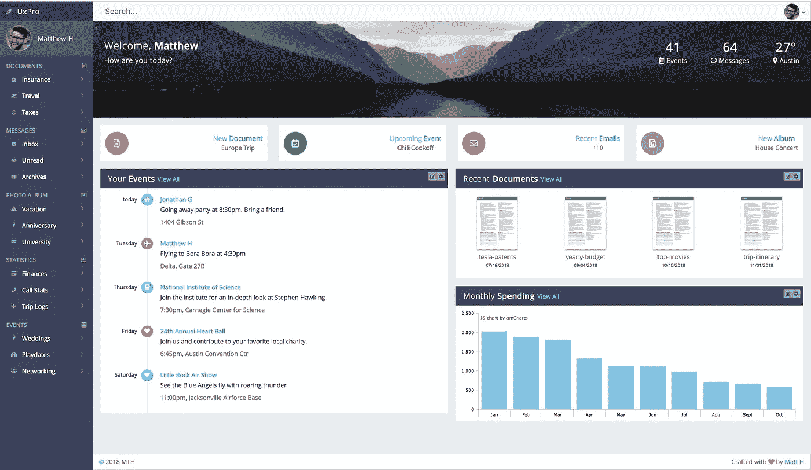
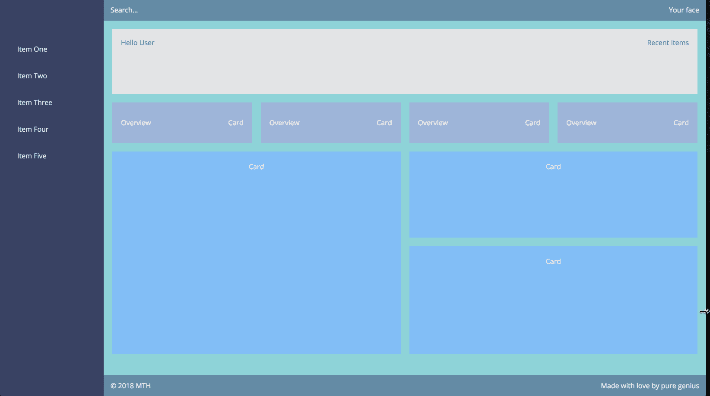
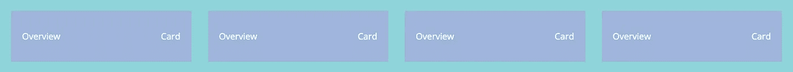
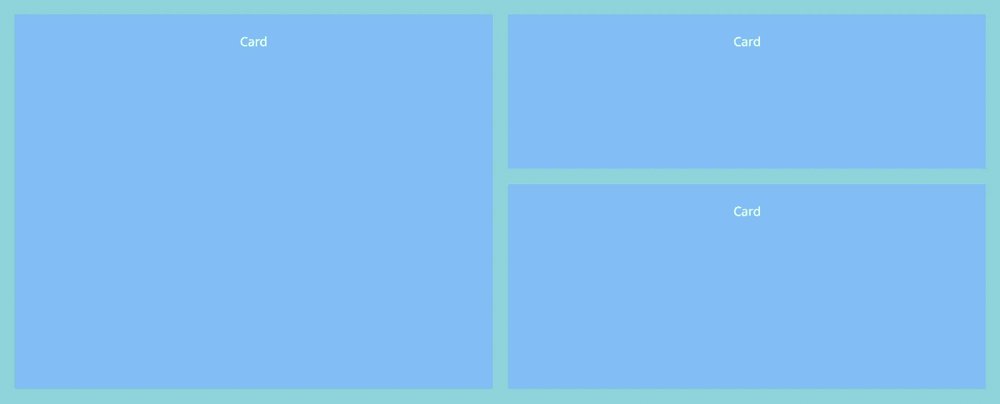

# 使用 CSS Grid 和 Flexbox 构建一个反应灵敏的现代仪表板布局

> 原文：<https://betterprogramming.pub/build-a-responsive-modern-dashboard-layout-with-css-grid-and-flexbox-bd343776a97e>

## 创建一个漂亮的、反应灵敏的仪表板页面，没有任何框架，包括一个滑动的侧边导航

第一个让 4157 人哭泣的仪表板

你是否曾经被那些华丽的在线仪表盘演示弄得不知所措，以至于你想知道，“我能不能造出那个…？”嗯，我在这里告诉你，你*可以造出来！*

# 我们该怎么做？

我们将首先介绍一些 CSS 网格基础知识。然后，我们将使用这些来构建我们的基本仪表板布局。之后，我们将探索内部内容块的设置和结构，包括一些 flexbox。最后，我们将简要讨论负责任的移动响应，同时将移动友好的滑动功能集成到我们的侧边导航中。你会带走什么？一个爆炸式仪表盘会让人们更喜欢你。

注意:我们将构建上面仪表板的[简化版](https://codepen.io/trooperandz/pen/YRpKjo)，它使用与[完整版](https://codepen.io/trooperandz/pen/EOgJvg)相同的概念。完整版会让这篇文章变得又长又傻…

## 首先:我们的基本网格布局

我将为你分解 CSS 网格，简短而甜蜜。我们需要一个主网格容器，然后我们需要一个`div`(或者语义元素)用于网格容器中的每个元素:

我们基本的整体仪表板页面结构

结构很简单，对吧？我们的布局将有助于产生这立即美丽的画布下面。别担心，我们会添加更多内容。

您的第一个简化的、无装饰的仪表板布局

## 接下来，让我们制定法律…我的意思是 CSS

您的主容器必须被定义为`display: grid;`,任何网格功能才能真正工作。我们也给它一个 100%的高度，告诉它我们希望我们的仪表板填满整个页面。并且，对于每个子容器，我们将分配一个名称，这样我们可以告诉网格如何处理它。然后我们将使用这些名称在一个类似电子表格的声明中使用`grid-template-areas`创建页面结构:

我们的基本仪表板网格布局样式

我们最终的、可响应的仪表板将看起来像[这个](https://codepen.io/trooperandz/pen/YRpKjo):

我们简单的仪表板，带有反应灵敏的内部内容和滑动侧导航

## 网格-模板-解释的区域

我们基本上给每个子容器分配了一个名称，然后通过`grid-template-areas`将它们转换成类似电子表格的格式。非常简单。

我们从左到右总共有两列。第一列是 250px 宽(侧边导航)，第二列是 1fr，或分数。这意味着在绘制完第一列后，它将占用剩余的容器空间。

接下来，我们声明总共三行。行从上到下排列。所以，从顶部开始，我们有一个 50px 高的`<header>`元素。然后我们声明`<main>`内容区域，给定高度为 1fr。这意味着在绘制了明确声明的高度后，它将垂直拉伸以填充剩余的窗口空间。最后，我们宣布我们的`<footer>`，也是在 50px 的高度。

## 添加页眉和页脚

`<header>`和`<footer>`都将是柔性容器，具有[柔性间距和对准](https://medium.com/mtholla/twerking-it-with-flexbox-55489dccafa1):

我们的仪表板页眉和页脚设置

我们使用`justify-content: space-between;`展开第一个和最后一个元素，使它们延伸到容器的两端。与老派的`float`指令相比，这太容易了。而且，多亏了`align-items: center;`，我们可以完美地对齐我们的项目，而不必依赖填充等。，用于居中。

关于我们奇怪的 CSS 类语法的一个简短说明:我们使用的是[BEM](http://getbem.com/introduction/)-style(block-element-modifier)CSS，我推荐它是为了可伸缩性和可读性。建议避免使用原始的 html 标签选择器。

## 添加侧面导航元素

对于侧边导航内容，我们使用传统的`<ul>`和`<li>`元素。为了良好的 html 语义和可读性，我推荐这种方式而不是`
`或任何其他元素。我们将在我们的侧边导航中添加移动友好的滑动功能:

我们的仪表板侧导航基本结构

## 添加第一个`<main>`截面元素

这个简单明了。另一个 flex 容器:

我们的第一个

<main>节元素</main>

## 现在事情变得有趣了…响应网格介绍卡

这是我最喜欢的仪表板部分之一，因为我们可以利用一个超级有效、优雅的网格解决方案。再次观看之前提供的仪表板动画。注意到这些灰色卡片在屏幕变化时的表现了吗？令人惊讶的是，我们的卡片之间保持一致的装订线宽度，它们有一致的包装，当我们不能填满一整行时，我们包装的卡片与上面卡片的高度和宽度完全匹配，同时保持对齐。如果没有我将要向你展示的方法，这是非常具有挑战性和乏味的:

非常好的、响应迅速的网格概览卡

我们使用了一个网格容器，它在我们的主页网格容器里面，对吗？我们这样做是因为这是最简单、最优雅的解决方案，可以满足卡片项目所需的响应能力。我们的指令`repeat(auto-fit, minmax(265px, 1fr)`解决了几个主要障碍:

1.  如果卡片宽度小于 265 像素，它们将换到另一行。
2.  如果卡片的宽度超过 265 像素，它们将被拉伸以占据剩余的容器宽度。
3.  当卡片换行到新的一行(`auto-fit`)时，它们会从左到右排列，卡片在它们上面，匹配它们的宽度！*和*您还可以获得内置的响应能力，无需任何媒体查询！

使用列`repeat`方法也是一种*奇妙的*方式来构建漂亮的、响应迅速的图库，即使是不同大小的图片。您甚至可以使用`grid-auto-flow: dense;`指令访问动态打包算法。这将防止由于不同的图像高度而出现任何空行空间。然而，它们必须在相对的`fr`单位中相互缩放，这就是为什么我们不会在下面的卡中使用这个方法。

## 添加主要内容容器

我们具有动态高度的仪表板卡

这一部分还有一个有趣的转折。这些卡片将包含您的仪表板的主要内容项目，并且由于其动态内容，它们的高度会彼此不同。在大多数典型的界面上，您可能希望同一行中想法相同的卡片具有相同的高度和宽度。你可以通过给每张卡分配一个`flex: 1;`值来实现这个目标，这样它们就会增长以匹配最高的卡。

然而，在我们的情况下，我们不想强迫这些卡匹配彼此的高度，因为它们的内容主题会有所不同。为了让它们在两列中自然流动，我们将为此使用一个特殊的 CSS 属性，`column-count`:

仪表板主要内容卡片

使用`column-count`将确保我们在`main-cards`部分的内容被分成两列。我们还应用了一个`column-gap`之间的卡片间隙。这与我们使用`grid-gap`的概览卡非常相似。

我们在这个部分没有使用`display: grid;`的原因是我们每张卡的高度是动态的。我们希望它们自然地分成两列，同时观察它们不同的高度。这种方法还避免了我们必须使用传统的浮动网格，这将使我们计算第一个和最后一个子元素的百分比宽度、间距和特殊的边距规则。

我们还使用了`column-break-inside: avoid;`来确保每张卡的内容不会被分割。`column-count`实际上会分解每个元素的内容，使两行具有相同的高度，这是我们不希望的。

## 关于负责任的移动响应的简要说明

再次观看文章顶部的响应视频。当你接近平板电脑大小的屏幕时，看到`main-cards`部分如何变成一列了吗？看看侧边导航是如何在手机屏幕上消失的？对于这种响应，我们真的应该以移动优先的格式编写我们的 CSS。

这意味着我们最初的 CSS 应该是移动友好的。然后，随着屏幕尺寸的增加，我们使用分级`min-width`媒体查询来观察更大的屏幕样式。这是比用`max-width`媒体查询覆盖桌面样式更好的做法，因为这种方法会导致一些令人头疼的问题:

正在升级最小宽度媒体查询

## 让我们的侧边导航可以在移动设备上滑动

我们的工作还没有真正完成，直到我们也可以在移动设备上使用侧边导航。我们需要:

1.  添加我们的菜单图标和关闭图标。
2.  为滑动动作添加一些响应过渡。
3.  写一些 JavaScript 让我们的点击激活侧边导航。

我们将为我们的图标使用[字体 Awesome](https://fontawesome.com/icons?d=gallery) 库，并引入 [jQuery](https://jquery.com/) 进行一些简单的 DOM 操作(参见 [codepen](https://codepen.io/trooperandz/pen/YRpKjo) 以供参考)。

手机的主菜单图标和侧面导航关闭图标

接下来，让我们更新我们的 CSS 来包含新的图标，并给我们的侧导航一些滑动过渡。我们将再次使用*毕业生*媒体查询:

我们的侧边导航和菜单图标的移动响应样式

最后，我们需要编写一些 JavaScript 来让我们的点击工作。滑动功能是通过切换`.active`类名来完成的，这将更新`transform: translateX();`指令。不要忘记在结束`</body>`标签前添加 jQuery [CDN 链接](https://developers.google.com/speed/libraries/):

让我们的侧边导航滑动的 JavaScript

你现在应该有一个反应充分的侧导航。缩小你的窗口直到手机大小。它应该隐藏，菜单图标应该出现。点击它，侧导航应该滑入视野。单击关闭图标，侧面导航应该会再次关闭。很圆滑，是吧？你认为你做不到…

# 总之…

你刚刚学到了什么？

1.  如何使用 CSS Grid & Flexbox 构建仪表板布局？
2.  使用`repeat`、`auto-fit`、`min-max`、`column-count`、`grid-gap`和`column-gap`的动态内容块的特殊规则。
3.  使用分级`min-width`媒体查询编写移动优先、响应性 CSS 的正确*方式。*
4.  如何建立一个滑动的，移动响应侧导航？

请查看完整的仪表板 [codepen](https://codepen.io/trooperandz/pen/EOgJvg) ，它包括一个可点击的滑动侧导航，带有折叠列表项目，一个漂亮的下拉用户菜单，以及一些巧妙的`transition`悬停动作。

我希望你能从这篇文章中获得一些新的知识，并且仪表盘布局再也不会让你迷惑了。有问题请评论！