# 用 HarperDB 和 FastifyJS 构建 REST API

> 原文：<https://betterprogramming.pub/build-a-rest-api-with-harperdb-and-fastifyjs-ee3d8d5d6ea0>

## 了解如何结合使用这两种技术来构建 REST API


照片由[内特·格兰特](https://unsplash.com/@nateggrant?utm_source=medium&utm_medium=referral)在 [Unsplash](https://unsplash.com?utm_source=medium&utm_medium=referral) 上拍摄

本文将教你如何使用 Node.js、 [Fastify](https://www.fastify.io/) 和 [HarperDB](https://harperdb.io/) 构建课程管理系统。这个应用程序将帮助您跟踪您正在进行的课程和您计划进行的课程。

您将使用以下技术:

*   节点. js
*   HarperDB
*   Fastify

# 介绍

说到 Node.js 和 Fastify，人们对这些技术都很熟悉。然而，当谈到数据库，有一个新的孩子。

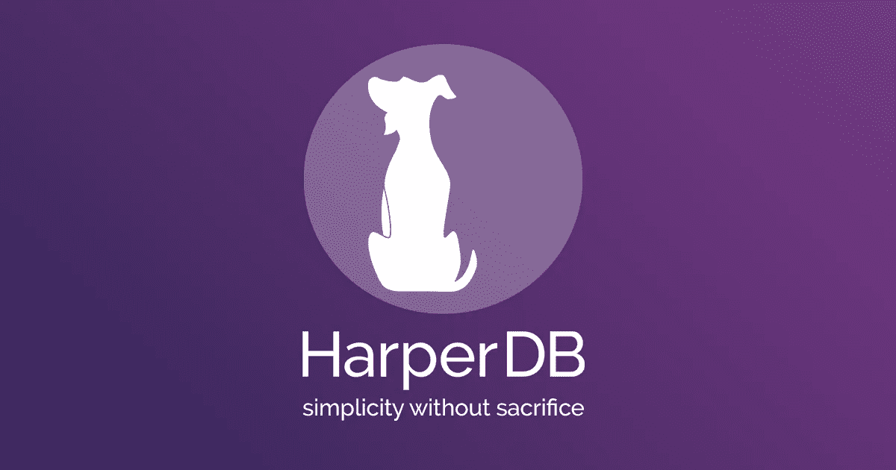

最近，我从我通常用来玩 HarperDB 的数据库中休息了一下。HarperDB 是一个具有 NoSQL 和 SQL 功能的分布式数据库。HarperDB 最吸引人的地方在于，您只使用一个端点来执行所有的 CRUD 数据库操作。

HarperDB 最显著的特性是:

*   使用单个端点
*   对 JSON 数据执行 SQL 查询
*   通过以 JSON 数组的形式返回结果，不再需要 ORM
*   能够通过 JSON、CSV 或使用 SQL 插入数据

那看起来不有趣吗？

# 先决条件

在继续之前，您应该了解一些先决条件。本教程假设您具备以下基本知识:

*   Node.js 和 FastifyJS
*   数据库
*   Java Script 语言
*   知道如何使用像 npm 这样的包管理器

此外，您应该拥有 12.xx 或更高版本的节点，HarperDB 才能运行。最后，您需要有一个 HarperDB 帐户，您可以在这里创建。不用担心；免费的！

# 设置文件夹结构

本教程的第一步是设置应用程序的文件夹结构。创建一个名为`course-management`的新文件夹并打开它。您可以使用以下命令来完成此操作:

```
mkdir course-management
cd course-management
```

基本的文件夹结构已经准备好。当然，当您构建应用程序的每个部分时，您会创建更多的文件夹。

# 安装依赖项

此时，您应该在`course-management`文件夹中。让我们用下面的命令初始化这个项目:

```
npm init -y
```

`-y`标志会自动生成`package.json`，而无需您回答关于项目名称、描述等常见问题。如果你打开`package.json`，你可以看到所有的字段都是自动完成的。

## 安装所需的软件包

下一步是安装构建应用程序所需的包。您可以在一行中安装多个软件包。在您的终端中运行以下命令:

```
npm i fastify harperive dotenv --save
```

该命令安装三个软件包/依赖项:

*   Fastify 是一个新的 web 框架，它声称是镇上最快的 web 框架。
*   [**Harper rive**](https://www.npmjs.com/package/harperive)—Harper db 的 Node.js 驱动。
*   [**Dotenv**](https://www.npmjs.com/package/dotenv) —这是一个从`.env`文件加载环境变量到`process.env`的模块。

# 配置 Fastify 服务器

在继续配置服务器之前，您需要创建几个文件。第一步是创建以下文件:

```
touch app.js
touch .env
```

`app.js`文件包含服务器配置。另一方面，`.env`文件存储了您的环境变量。

打开`app.js`文件，编写以下代码:

```
const app = require('fastify')({
    logger: true
});

require('dotenv').config()

app.get('/', (req, res) => {
    res.send({ hello: 'world' });
});

app.listen(process.env.PORT, (err, addr) => {
    if (err) {
        app.log.error(err);
        process.exit(1);
    }

    app.log.info(`Your server is listening on port ${process.env.PORT} 🧨`);
});
```

在第一行中，您导入 Fastify 包并将其存储在一个名为`app`的常量中。在同一行中，您还启用了`logger`。之后，导入 Dotenv，这样就可以使用环境变量了。

最后，创建一个用 JSON 响应的 GET round，然后监听在`.env`文件中指定的端口。

继续，打开`.env`文件并添加以下几行:

```
PORT=3000
INSTANCE_URL=
INSTANCE_USERNAME=
INSTANCE_PASSWORD=
INSTANCE_SCHEMA=
```

以`INSTANCE`开头的字段将保存关于数据库的信息。现在，如果您还没有一个 HarperDB 帐户，是时候创建一个了。

# 创建和配置数据库

首先，登录 [HarperDB 工作室](https://studio.harperdb.io/)。登录后，单击 **+** 按钮，这将创建一个新的 HarperDB 云实例。图一。说明了这一点。

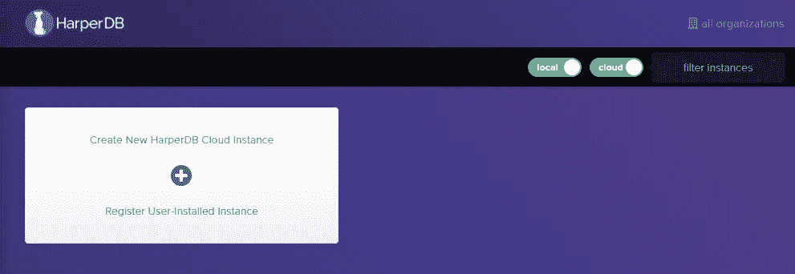

图一。

之后，将要求您选择一个新的 HarperDB 云实例或注册一个用户安装的实例，如图 2 所示。

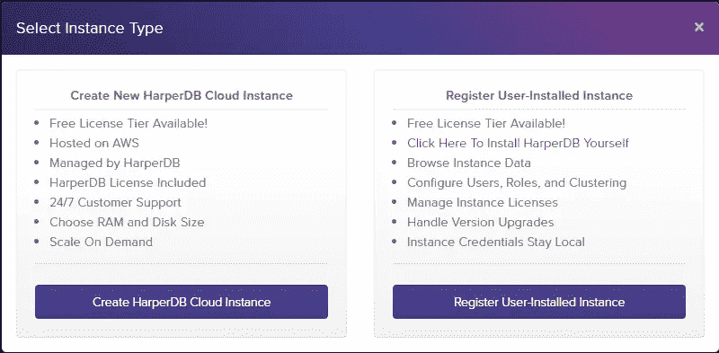

图二。

点击按钮 Create HarperDB Cloud Instance。因此，您在他们的云中创建数据库实例，而不是自己托管它。之后，您需要输入:

*   实例的名称
*   用户名
*   一个密码

在图 3 中。，下面，你可以看到我的实例信息。

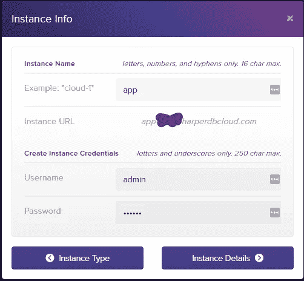

图 3。

下一步是选择您的实例规范。对于本教程，我建议你选择免费选项。您可以免费获得以下规格:

*   0.5GB 内存
*   1GB 存储和 100 IOPS

图 4。，下面说明了这一点。但是，如果您计划大量使用 DB，我建议您启动实例并选择更好的规范。

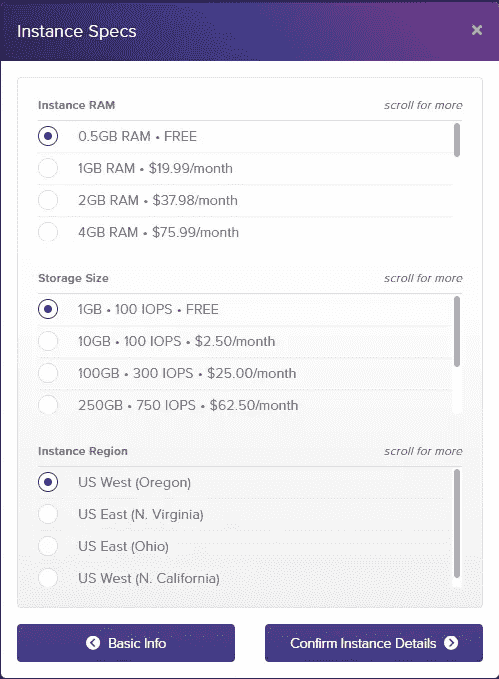

图 4。

最后一步是确认实例细节，然后等待实例启动。实例设置和初始化后，单击实例。例如，您可以在图 5 中看到我新创建的实例。，下面。

如果是第一次访问实例，可能会提示您输入之前设置的用户名和密码。

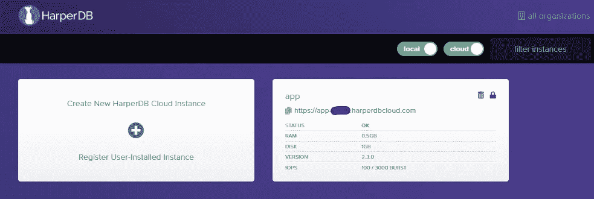

图 5。

您的实例目前没有任何模式或表。因此，您需要首先创建一个模式。您可以看到我选择了“mydb”作为我的模式的名称(图 6。).但是，您可以为您的模式使用任何其他名称。

为模式选择名称后，单击绿色复选标记保存它。

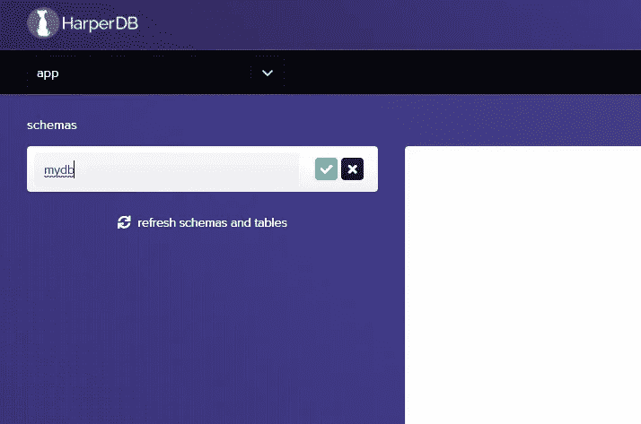

图 6。

最后，您需要创建表。目前，您将只设置一个名为“课程”的表输入名称“课程”并提供一个`hash_attribute`名称。哈希属性用于唯一标识每条记录。简而言之，散列属性就是 ID，它对于每条记录都是唯一的。现在，单击绿色复选标记保存它，如图 7 所示。

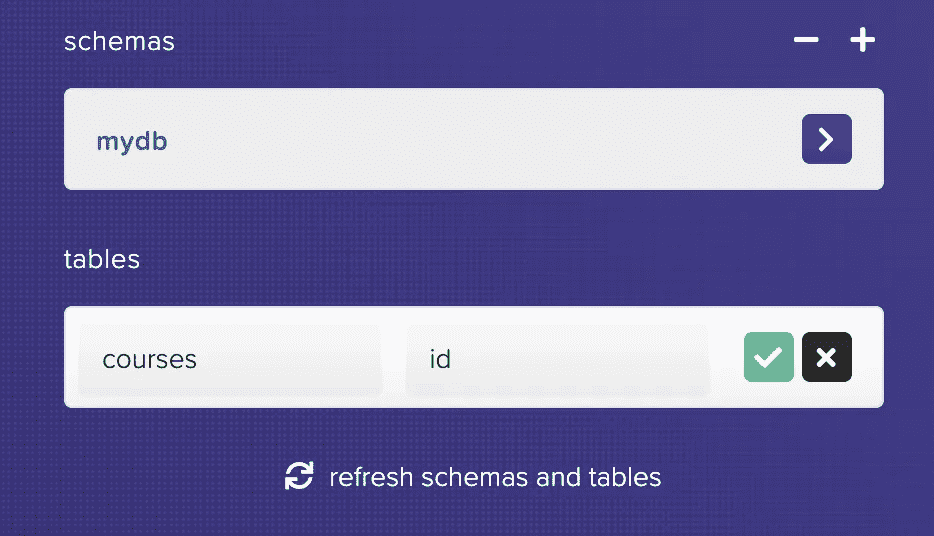

图 7。

现在，您可以在 Node.js 应用程序中使用数据库了。

# 在应用程序中设置和配置 HarperDB

进入`.env`文件并添加以下几行:

```
INSTANCE_URL=https://app-tutorial.harperdbcloud.com/
INSTANCE_USERNAME=admin
INSTANCE_PASSWORD=password
INSTANCE_SCHEMA=mydb
```

当然，你需要用你的替换那些细节。以上信息都是虚构的，你试试也不行。

保存文件，让我们继续。现在创建两个文件夹和一个数据库文件。您可以通过执行以下命令来完成此操作:

```
mkdir src
mkdir src/db
touch src/db/db_config.js
```

使用上面的命令，您在`src`中创建了`db`文件夹。此外，您还创建了一个文件`db_config.js`,用于存储数据库的配置。

打开新创建的文件`db_config.js`并编写以下代码:

```
const harperive = require('harperive').Client;

const DB_CONFIG = {
    harperHost: process.env.INSTANCE_URL,
    username: process.env.INSTANCE_USERNAME,
    password: process.env.INSTANCE_PASSWORD,
    schema: process.env.INSTANCE_SCHEMA
};

const client = new harperive(DB_CONFIG);

module.exports = client;
```

在第一行中，您导入 HarperDB 的 Node.js 驱动程序。之后，您创建数据库配置，并将详细信息存储在`.env`文件中。最后，创建一个新的客户机并将其导出。

稍后，您将在控制器文件中使用客户端。现在，让我们来看看路线和控制器。

# 配置应用程序端点

第一步是在`src`文件夹中创建两个新文件夹。按如下方式创建它们:

```
mkdir src/controllers
mkdir src/routes
```

之后，您需要在新创建的文件夹中创建两个新的 JavaScript 文件。创建文件`course.js`和`courseController.js`，如下所示:

```
touch src/routes/course.js
touch src/controllers/courseController.js
```

您将从创建路线开始。在这种情况下，您可以利用 Fastify 插件架构。因此，从`routes`文件夹中打开`course.js`文件，并编写以下代码:

```
const courseController = require('../controllers/courseController');

async function routes(app, opts) {

}

module.exports = routes;
```

发生了三件事:

1.  您可以导入用于路线的控制器。
2.  你创建了一个`routes`函数。
3.  您导出了新创建的`routes`函数。

在这个方法中，`routes`，你配置你的应用程序的端点。对于每个路由，至少要指定 HTTP 方法、URL 和处理程序。然而，还有许多其他参数。您可以在 Fastify 文档中看到[完整列表](https://www.fastify.io/docs/latest/Routes/#options)。

也就是说，让我们构建第一个端点，在被访问时返回所有课程。您可以通过调用`app`上的`route`方法来实现，如下所示:

```
const courseController = require('../controllers/courseController');

async function routes(app, opts) {

    // Get all courses
    app.route({
        method: 'GET',
        url: '/courses',
        handler: courseController.getCourses
    });
}

module.exports = routes;
```

您以类似的方式构建所有其他路由/端点。唯一改变的是方法、URL 和处理程序。

在下面的要点中，你可以看到所有的端点。每个 CRUD 操作都有一个端点。应用程序用户可以查看所有课程或特定课程，添加新课程，以及删除或编辑现有课程。

routes.js 文件

**注意**:如你所见，每个路由/端点都有一个特定的控制器。目前，它们只是占位符，因为没有控制器。这意味着，如果你试图进入路线，他们不会工作。但是这在下一步中会发生变化，因为您现在将构建应用程序逻辑。

**继续之前还有一件事。**转到根文件夹中的`app.js`并添加以下行:

```
app.register(require('./src/routes/course'));
```

该行的目的是使路线在您的应用程序中可用。如果您不添加这条线，您的路线将不起作用。

`app.js`的最终版本应该如下所示:

app.js 文件

# 用 HarperDB 构建应用程序逻辑

应用程序逻辑定义了当用户请求上一节中指定的路由时会发生什么。

例如，当有人访问路线`/courses`时，他们应该看到数据库中的所有课程。为此，让我们从那条路线开始。

所有路线的代码将在`courseController.js`中。打开`courseController.js`文件，导入文件顶部的 Harperive 客户端:

```
const client = require("../db/db_config");
```

有趣的事情开始了。为了描述 HarperDB 的功能，您将使用 SQL 和 NoSQL 操作来操作数据。

## 构建获取路线

在同一个文件中，在导入数据库客户机后添加以下代码:

```
const getCourses = async (req, res) => {
    const allCourses = await client.query('SELECT * FROM mydb.courses');

    res.send({ allCourses });
};

module.exports = {
    getCourses,
}
```

如您所见，HarperDB Node.js 驱动程序允许您在数据库上运行 SQL 查询。上述查询从数据库中选择并返回所有课程。

之后，使用`response`对象将数据发送给客户机。如果您运行应用程序并尝试访问`/courses`路线，您将不会获得任何数据，因为数据库是空的。

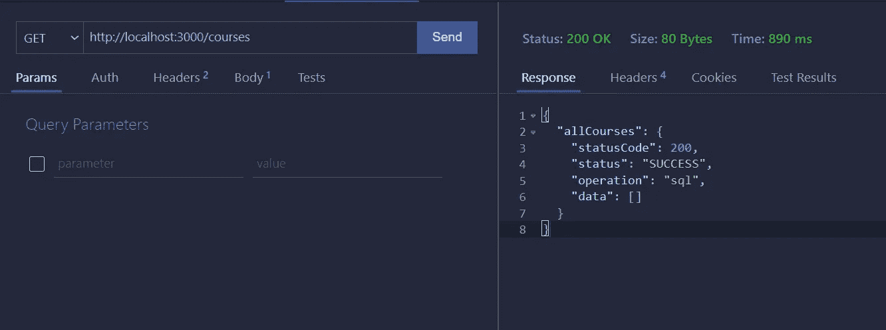

图 8。

图 8。说明了一个成功的请求。您可以看到数据数组是空的，因为数据库是空的。然而，一旦数据库中有了数据，我们将重复这个请求。

## 建立邮政路线

下一步是构建 POST 路径，这样就可以将数据添加到数据库中。在这种情况下，我们将使用 NoSQL 操作。在`getCourses`常量后编写以下代码:

```
const addCourse = async (req, res) => {
    const allProperties = Object.keys(req.body).length;

    if (allProperties !== 4) {
        res.code(400).send({ 
            error: 'Some properties are missing! Add the name, description, author and link!' 
        });

        return;
    }

    try {
        const newCourse = await client.insert({
            table: 'courses',
            records: [
                {
                    name: req.body.name,
                    description: req.body.description,
                    author: req.body.author,
                    link: req.body.link
                }
            ]
        });

        res.send({ newCourse });
    } catch (error) {
        res.send({ error });
    }
};

module.exports = {
    getCourses,
    addCourse,
}
```

首先，`try catch`块之前的部分确保用户提供所有的字段。如果用户试图在没有指定名称、描述、作者或链接的情况下添加课程，将会返回一个错误。用户必须始终提供所有四个字段。

然后，在`try catch`块中，使用数据库客户端将新课程插入数据库。

*   您需要指定表格(在本例中是`courses`)，然后指定`records`。
*   字段是一个对象数组，这意味着您可以一次输入多个课程。然而，就目前而言，一个就够了。

如果插入成功，它将返回新添加的课程。您可以在图 9 中看到运行中的路由。，下面。

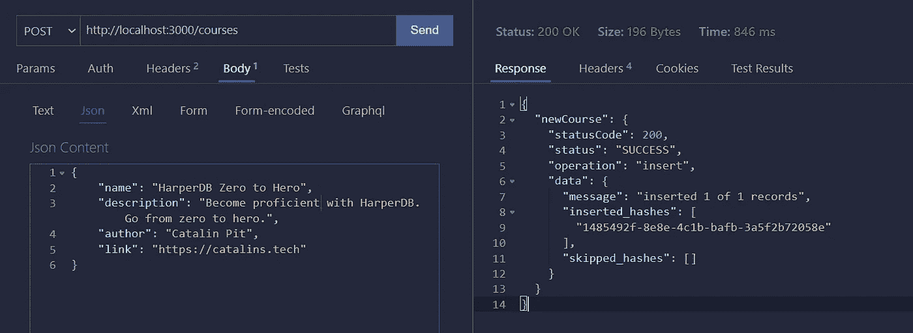

图 9。

操作成功，新课程被添加到数据库中。图 10。显示数据库中的课程。


图 10。

## 获得特定课程

获取特定课程与获取所有课程类似，但有一点不同。现在，您使用一个`WHERE`子句来选择一门特定的课程。

您在 URL 中传递课程 ID，然后 SQL 查询将它与数据库中的记录进行匹配。

但首先，“我如何获得 ID？”你可能会问。有两种选择。(注意:首先需要数据库中的课程。)

1.  你可以访问路线`http://localhost:3000/courses`并获得你想要的任何课程的 ID。
2.  去 HarperDB 工作室，点击课程，你会看到所有的细节。在页面的顶部，您会看到它指定了哪个是 ID(参见图 10。，以上)。

```
const getSpecificCourse = async (req, res) => {
    const course = await client.query(`SELECT * FROM mydb.courses WHERE id="${req.params.id}"`);

    res.send({ course });
};

module.exports = {
    getCourses,
    addCourse,
    getSpecificCourse,
}
```

之后，它返回路线。图 11。，说明了当您发出 GET 请求以获取特定课程时会发生什么。

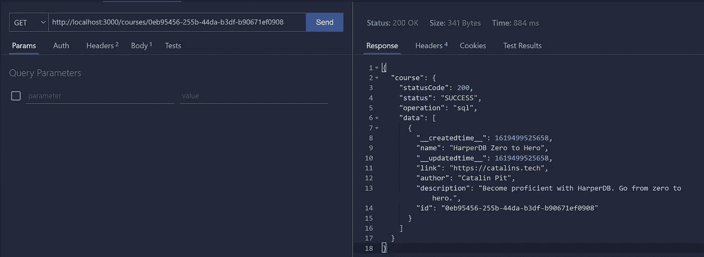

图 11。

## 删除特定课程

您可以通过在 URL 中提供课程 ID 来删除课程。例如，如果您向`http://localhost:3000/courses/0eb95456-255b-44da-b3df-b90671ef0908`发出删除请求，您将删除具有指定 ID 的课程。

```
const deleteCourse = async (req, res) => {
    const course = await client.query(`DELETE FROM mydb.courses WHERE id="${req.params.id}"`);

    res.send({ 
        message: 'Course deleted!',
        deleteCourse: course
     });
};

module.exports = {
    getCourses,
    addCourse,
    getSpecificCourse,
    deleteCourse
}
```

一旦课程被删除，它会发送一条确认消息和一些额外的信息。图 12。说明了一个删除请求。

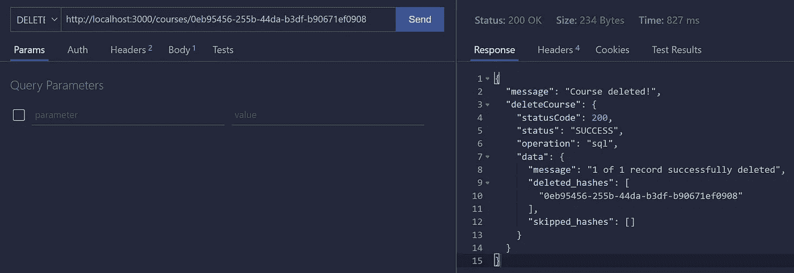

图 12。

## 构建 PUT 路线

最后，这条路线允许您更新现有的课程。在`try catch`块之前的所有代码确保用户只使用允许的字段:名称、描述、作者和链接。如果用户试图更新一个不存在的字段，服务器将返回一个错误。

要编辑课程，您需要再次使用 NoSQL 操作。在数据库客户机上调用`update`方法，然后传递表名(在本例中是`courses`)和想要更新的记录。

此外，在记录数组中指定`id`也很重要。如果不这样做，服务器就不知道要更新哪条记录。

```
const editCourse = async (req, res) => {
    const updates = Object.keys(req.body);
    const allowedUpdates = ['name', 'description', 'author', 'link'];
    const isValidOperation = updates.every((update) => allowedUpdates.includes(update));

    if (!isValidOperation) {
        res.code(400).send({ error: 'Not a valid operation! '});

        return;
    }

    try {
        const updatedCourse = await client.update({
            table: 'courses',
            records: [
                {
                    id: req.params.id,
                    name: req.body.name,
                    description: req.body.description,
                    author: req.body.author,
                    link: req.body.link
                }
            ]
        });

        res.send({ updatedCourse });
    } catch (error) {
        res.send({ error });
    }
};

module.exports = {
    getCourses,
    addCourse,
    getSpecificCourse,
    deleteCourse,
    editCourse
}
```

如果有错误，服务器会发回错误。否则，它返回更新的课程。下图显示了如何发出一个 PUT 请求，以及当它成功时会发生什么。

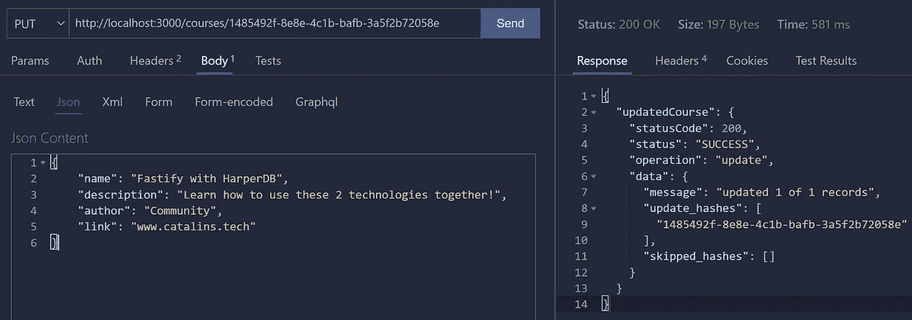

图 13。

这些都是关于路线和控制器的。你可以在[这个要诀](https://gist.github.com/catalinpit/191cbb0db15a52121e28461b31bc0a35)里看到整个`courseController.js`文件。我选择不嵌入它，因为它很大，在页面上占了很大的空间。

同样的，你可以**在**[**my GitHub**](https://github.com/catalinpit/harperdb-fastifyjs-rest-api)上看到完整的应用。为了更好地学习，经历它，改变东西，打破东西，增加东西，等等。

# 如何启动应用程序

您可以通过运行根文件夹中的`node app.js`来启动应用程序。

但是，如果您从 GitHub 克隆应用程序，您需要首先安装依赖项。您可以通过运行以下命令来实现:

```
npm install
node app.js
```

# 结论

至此，您应该有了一个 REST API，它允许您存储和操作课程。本教程的目的是快速掌握这两种技术。因此，可以添加其他内容，例如:

*   授权
*   API 速率限制
*   添加一个前端，并将其转换为全栈应用程序

也就是说，如果你喜欢这个教程，想要第 2 部分，我用 Vue 构建前端，请在评论中告诉我。