# 使用 Neo4j 构建一个餐馆推荐引擎

> 原文：<https://betterprogramming.pub/build-a-restaurant-recommendation-engine-using-neo4j-9d13ebdd4736>

## 使用流行的图表数据库来计算出我们今天应该吃什么


照片由[雷切尔·帕克](https://unsplash.com/@therachelstory?utm_source=unsplash&utm_medium=referral&utm_content=creditCopyText)在 [Unsplash](https://unsplash.com/?utm_source=unsplash&utm_medium=referral&utm_content=creditCopyText) 上拍摄

在我们之前的 Neo4j 指南的基础上，我们今天将充分利用我们的知识，构建一个餐馆推荐系统。确保你有一个 Neo4j 的工作版本。如果您是 Neo4j 的新手，强烈建议您在继续之前阅读下面的指南:[《Neo4j 图形平台初学者指南》](https://medium.com/better-programming/the-beginners-guide-to-the-neo4j-graph-platform-a39858ccdeaa)。最后，您应该有一个工作的 web 应用程序，它根据您的输入返回推荐的餐馆。

# 1.设置

## Neo4j

本教程我使用的是 Neo4j 社区版本 4.1.1。打开终端，将目录切换到 Neo4j 的根文件夹。由于根文件夹位于我的 C 驱动器中，我的工作目录如下:

```
C:\neo4j-community-4.1.1
```

通过运行以下命令，将目录更改为 bin 文件夹:

```
cd bin
```

现在，您可以作为控制台应用程序或后台服务启动 Neo4j。对于控制台应用程序，运行以下命令:

```
neo4j console
```

使用以下命令将其作为后台服务启动:

```
neo4j start
```

您应该在控制台上看到以下输出，表明该进程已经启动:

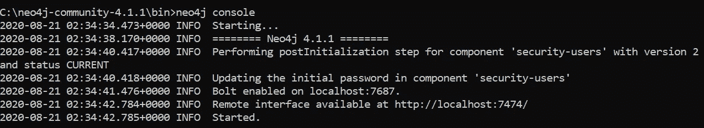

作者图片

打开浏览器并转到以下 URL:

```
[http://localhost:7474](http://localhost:7474/browser/)
```

它会将您重定向到:

```
[http://localhost:7474/browser/](http://localhost:7474/browser/)
```

您应该会看到以下网页，这是 Neo4j 浏览器控制台:

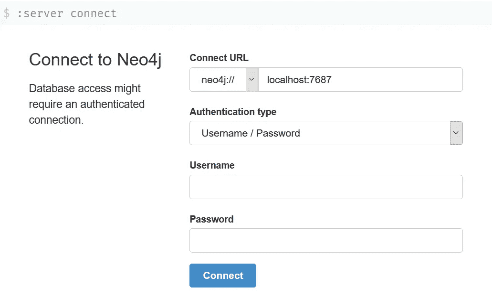

作者图片

使用您自己的用户名和密码连接到数据库。如果您是第一次访问它，凭据如下:

*   `username` — neo4j
*   `password` — neo4j

之后，系统会提示您更改密码。登录到数据库后，您应该会看到以下用户界面:


作者图片

## 驾驶员

Neo4j 还支持通过驱动程序直接连接到其数据库。基于最新版本，它正式支持以下编程语言:

*   `.NET`——。网络标准 2.0
*   `Java` —Java 8+(最新补丁发布)。
*   `JavaScript` —节点的所有 [LTS 版本。JS](https://github.com/nodejs/LTS) ，特别是 4.x 和 6.x 系列运行时。
*   `Python` — CPython 3.5 及以上。
*   `Go` —正在进行的工作。目前没有官方发布日期。

在本教程中，我将在 FastAPI 中为我们的 web 应用程序使用 Python 驱动程序。请查看下面的[链接](https://neo4j.com/docs/driver-manual/current/get-started/#driver-get-started-installation)了解更多关于其余驱动程序安装步骤的信息。

强烈建议您在安装之前创建一个虚拟环境。激活您的虚拟环境并运行以下命令来安装 Neo4j Python 驱动程序的稳定版本。

```
pip install neo4j
```

如果您正在寻找预发布版本，您应该改为运行以下命令:

```
pip install --pre neo4j
```

## FastAPI

正如我前面提到的，我们的 web 应用程序基于 FastAPI。如果您是 Flask 用户，可以随意修改它，因为您总是可以在以后迁移它。看看我以前的一篇关于[将 Flask 平滑迁移到 FastAPI 的文章](https://medium.com/better-programming/migrate-from-flask-to-fastapi-smoothly-cc4c6c255397)来了解更多。在同一终端中，运行以下命令:

```
pip install fastapi
```

您还需要一个`ASGI`服务器。推荐的`ASGI`服务器是`Uvicorn`。按照以下方式安装:

```
pip install uvicorn
```

## 用例(人)

让我们列出节点和关系，以便将我们的域建模为一个图。为了让事情简单而简短，假设我们的主角叫爱丽丝，她有一群朋友，如下所示:

*   朱迪
*   神田沙也加
*   李金
*   埃米莉
*   雏菊
*   阮汉
*   李婷

每个节点代表具有`Person`标签单个单元，且它们与爱丽丝的关系表示为`IS_FRIEND_OF`。

## 用例(餐馆)

爱丽丝和她的朋友经常在下列餐馆吃饭:

*   `Korean BBQ` —位于`Jurong East`，供应`Korean`菜肴。
*   `Zen Sushi` —位于`Jurong West`，供应`Japanese`菜系。
*   `Mala Hot Pot` —位于`Jurong North`，供应`Chinese`美食。
*   `Dim Sum` —位于`Jurong South`，供应`Chinese`美食。
*   `Thai Grill` —位于`Jurong South`，供应`Thai`菜肴。
*   `Pho Street` —位于`Jurong East`，供应`Vietnamese`美食。

这里有两种关系。首先，每个`Restaurant`实体`SERVES`都有一个特定的`Cuisine`实体。第二，每个餐馆实体是一个特定的实体。

最重要的是，爱丽丝和她的朋友在他们喜欢的餐馆里有他们自己的偏好。这些关系被表示为`Person`实体`LIKES`零个或多个`Restaurant`实体。

# 2.Neo4j 数据库

在这一节中，我们将运行图形查询语言(Cypher)来读取和写入我们现有的数据库中的数据。您可以使用现有的或新的数据库。

## 清除数据库

如果您已经有一个现有系统，并且想要清除它，请运行以下查询:

```
MATCH (n) DETACH DELETE n
```

它将从数据库中删除所有现有节点及其关系。

## 创建数据集

以下示例显示了创建两个`Person`节点并在它们之间建立关系的方法:

```
CREATE (alice:Person {name:"Alice"})-[:IS_FRIEND_OF]->(judy:Person {name:"Judy"})
```

`Location`节点和`Cuisine`节点可以创建如下:

```
CREATE (jurongeast:Location {name:"Jurong East"}),
       (korean:Cuisine {name:"Korean"})
```

之后，您可以将两个节点链接在一起，如下所示:

```
CREATE (koreanbbq:Restaurant {name:"Korean BBQ"})-[:SERVES]->(korean),(koreanbbq)-[:LOCATED_IN]->(jurongeast)
```

同样，您可以通过下面的查询很容易地在`Person`节点和`Restaurant`之间创建一个关系，该查询表明`judy`喜欢吃`Korean BBQ`。

```
CREATE (judy)-[:LIKES]->(koreanbbq)
```

事实上，您可以将它们组合成一个查询。下面的[要点](https://gist.github.com/wfng92/7c101c38801b7cf230f16c959a803d8a)包含为我们的餐馆推荐系统创建新数据集的完整查询。

一旦执行了查询，数据库信息应该如下所示:

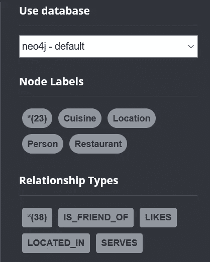

作者图片

## 获取全部

为了获得数据库中的所有数据，可以执行以下查询:

```
MATCH (n) RETURN (n)
```

您应该会在 Neo4j 浏览器中看到下图。

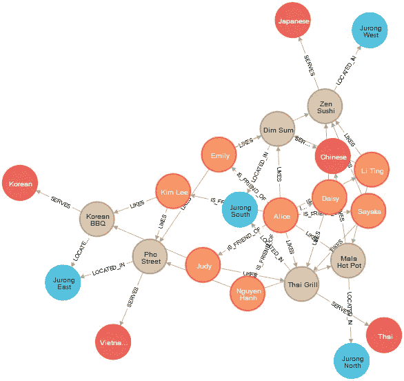

作者图片

## 爱丽丝的朋友

运行下面的查询来获取 Alice 的朋友`Person`节点的名称。您可以注意到，查询中没有指定方向。这意味着它是双向的，只要与 Alice 存在`IS_FRIEND_OF`关系，它就会匹配。

```
MATCH (alice:Person {name:"Alice"})-[:IS_FRIEND_OF]-(person)
RETURN person.name
```

在结果页面上，单击`Text`按钮，您应该会看到以下结果，表明 Alice 总共有 7 个朋友。

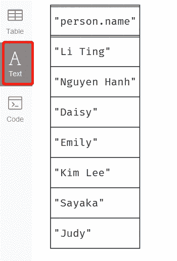

作者图片

## 饭店

让我们获得更多关于`Restaurant`节点及其与`Location`和`Cuisine`节点的关系的信息。

```
MATCH (location)<-[:LOCATED_IN]-(restaurant)-[:SERVES]->(cuisine)
RETURN location, restaurant, cuisine
```

您应该会看到以下输出:

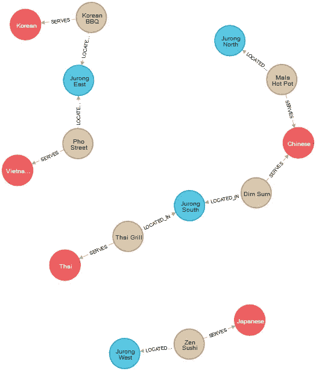

作者图片

## 特定位置的餐馆

假设您只对特定位置的所有餐馆感兴趣，您可以按如下方式查询数据:

```
MATCH (jurongeast:Location {name:"Jurong East"})<-[:LOCATED_IN]-(restaurant)-[:SERVES]->(cuisine)
RETURN jurongeast, restaurant, cuisine
```

它将查询位于`Jurong East`的所有`Restaurant`节点。

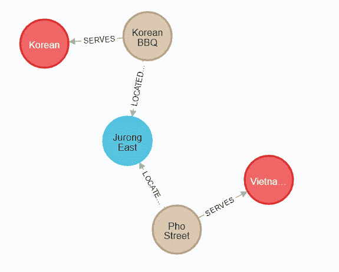

作者图片

## 提供特殊菜肴的餐馆

除此之外，假设你的偏好不是关于`Location`，而是关于`Cuisine`。要获得提供`Chinese`菜肴的所有餐馆，请按如下方式查询:

```
MATCH (location)<-[:LOCATED_IN]-(restaurant)-[:SERVES]->(chinese:Cuisine {name: "Chinese"})
RETURN location, restaurant, chinese
```

执行后，它将在您的 Neo4j 浏览器中显示下图。

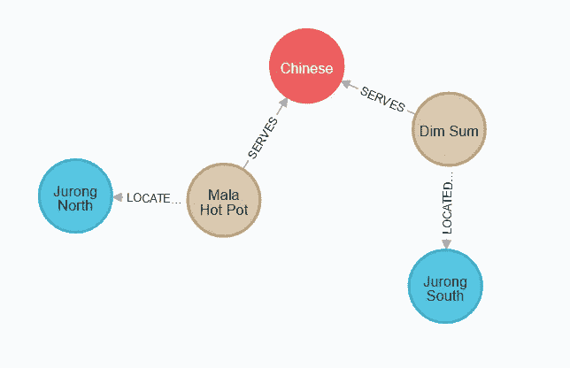

作者图片

## 爱丽丝和她的朋友喜欢的餐馆

假设 Alice 要和她所有的朋友一起出去，并且想知道最好的餐馆，你可以通过下面的查询推荐一家他们最喜欢的餐馆。

```
MATCH (restaurant:Restaurant)-[:LOCATED_IN]->(location),
      (restaurant)-[:SERVES]->(cuisine),
      (person:Person)-[:LIKES]->(restaurant)
RETURN restaurant.name, collect(person.name) as likers, count(*) as occurence
ORDER BY occurence DESC
```

我在这里使用了两个聚合函数。第一个叫做`collect()`，主要用于将多个结果合并成一个列表。在这种情况下，所有的名字将被合并到一个列表中作为`likers`。

同时，第二个聚合函数`count()`用于返回匹配记录的数量。在这种情况下，它将计算数量`likers`。

您应该得到以下结果，表明他们可以决定`Zen Sushi`或`Thai Grill`。

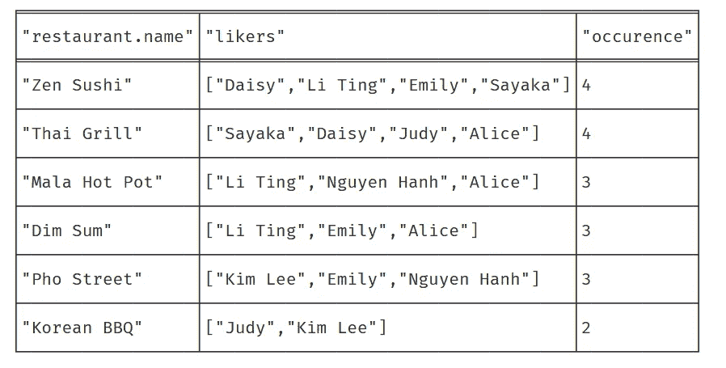

作者图片

## 爱丽丝的朋友喜欢的餐馆

假设爱丽丝不是一个挑食的人，她想知道她朋友的喜好。在这种情况下，我们需要从最终结果中排除 Alice。您可以选择设置一个条件来排除 Alice 或只匹配她的朋友。让我们来看看第一种方法，它将把爱丽丝排除在最终结果之外。它使用了`WHERE`子句和`<>`否定符号。

```
MATCH (restaurant:Restaurant)-[:LOCATED_IN]->(location),
      (restaurant)-[:SERVES]->(cuisine),
      (person:Person)-[:LIKES]->(restaurant)
RETURN restaurant.name, collect(person.name) as likers, count(*) as occurence
WHERE person.name <> "Alice"
ORDER BY occurence DESC
```

除此之外，我们在`MATCH`子句中正确地匹配了她的朋友。

```
MATCH (alice:Person {name:"Alice"}),
      (alice)-[:IS_FRIEND_OF]-(friend),
      (restaurant:Restaurant)-[:LOCATED_IN]->(location),
      (restaurant)-[:SERVES]->(cuisine),
      (friend)-[:LIKES]->(restaurant)
RETURN restaurant.name, collect(friend.name) as likers, count(*) as occurence
ORDER BY occurence DESC
```

将显示以下结果:

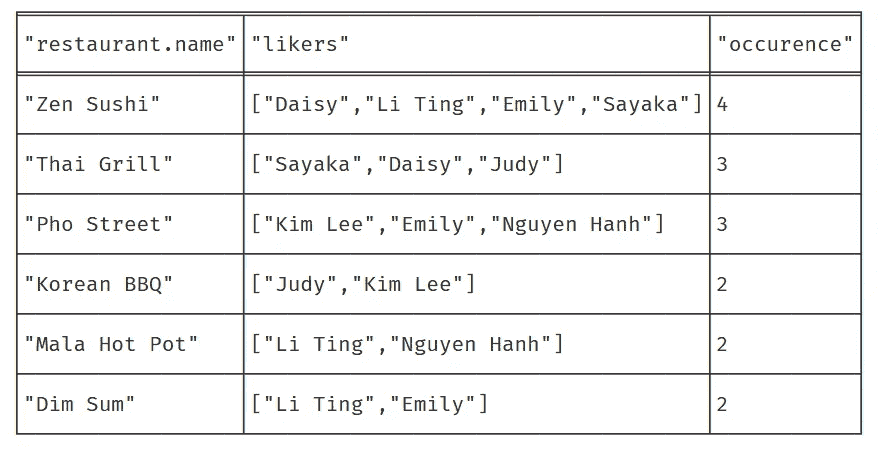

作者图片

## 爱丽丝的朋友喜欢的中国餐馆

假设爱丽丝的朋友厌倦了通常的烹饪，今天想吃`Chinese`食物。您可以使用下面的查询来获得推荐的餐馆。

```
MATCH (alice:Person {name:"Alice"}),
      (alice)-[:IS_FRIEND_OF]-(friend),
      (restaurant:Restaurant)-[:LOCATED_IN]->(location),
      (restaurant)-[:SERVES]->(:Cuisine {name:"Chinese"}),
      (friend)-[:LIKES]->(restaurant)
RETURN restaurant.name, location.name, collect(friend.name) as likers, count(*) as occurence
ORDER BY occurence DESC
```

根据结果，您可以选择`Dim Sum`或`Mala Hot Pot`。

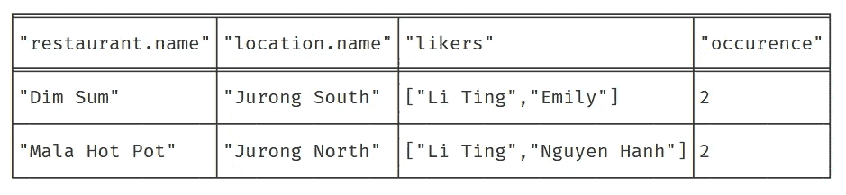

作者图片

## 爱丽丝的朋友喜欢的位于特定位置的餐馆

另一个要考虑的因素是`Location`。假设他们中的大多数人住在`Jurong East`附近，并且喜欢在这个地方附近吃顿饭。您可以通过运行以下查询来提供建议:

```
MATCH (alice:Person {name:"Alice"}),
      (alice)-[:IS_FRIEND_OF]-(friend),
      (restaurant:Restaurant)-[:LOCATED_IN]->(location:Location {name:"Jurong East"}),
      (restaurant)-[:SERVES]->(cuisine),
      (friend)-[:LIKES]->(restaurant)
RETURN restaurant.name, collect(friend.name) as likers, count(*) as occurence
ORDER BY occurence DESC
```

请注意，我们在结果中省略了位置名称。

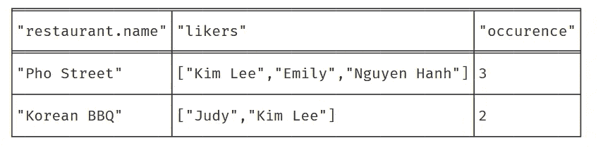

作者图片

## 爱丽丝的几个朋友喜欢的餐馆

假设`Alice`将与`Judy`和`Sayaka`一起外出，您可以通过以下查询约束推荐的餐馆

```
MATCH (restaurant:Restaurant)-[:LOCATED_IN]->(location),
      (restaurant)-[:SERVES]->(cuisine),
      (person:Person)-[:LIKES]->(restaurant)
WHERE person.name = "Judy" OR person.name = "Sayaka"
RETURN restaurant.name, collect(person.name) as likers, count(*) as occurence
ORDER BY occurence DESC
```

你会得到`Judy`和`Sayaka`都喜欢的最好的餐厅。

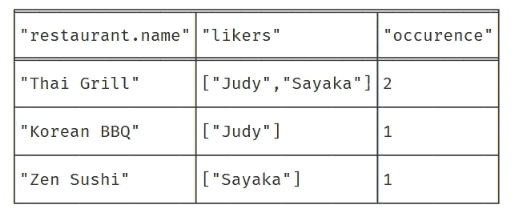

作者图片

# 3.Python 驱动程序

在本节中，我们将实现一个连接到 Neo4j 数据库的简单 Python 模块。在工作目录中创建新的 Python 文件。我准备把它命名为`recommender.py`。

## 导入

在文件的顶部添加以下导入声明。

```
from neo4j import GraphDatabase
import logging
from neo4j.exceptions import ServiceUnavailable
```

## 推荐者类别

创建一个名为`Recommender`的新类，并用以下函数填充它:

```
class Recommender:
    def __init__(self, uri, user, password):
        self.driver = GraphDatabase.driver(uri, auth=(user, password)) def close(self):
        self.driver.close()
```

## 证明

从版本 4 开始，认证功能已经通过接受以下参数的`GraphDatabase.driver`功能标准化:

*   `uri` —用于引导系统的初始地址解析。本地服务器应该使用`neo4j://` URI。
*   `auth` —保存用户名和密码信息的元组。
*   `resolver` —用作地址解析拦截挂钩。它接受回调函数。

## 与数据库的连接

在我们继续之前，让我们更深入地研究一下如何创建一个查询字符串并从数据库中获取数据。假设您的 API 负责获取 Alice 的朋友名单，我们需要为它编写两个函数。

第一个函数是接受输入名称的通用函数。它将初始化一个会话，并通过`read_transaction()`函数调用获取数据。您需要传入一个回调函数和要传递给回调函数的参数。

如果您的 API 负责从数据库中获取记录，您需要使用`write_transaction()`函数。

第一个函数将调用 section 函数，它主要负责:

*   根据输入参数基于密码构建查询字符串，
*   执行查询，以及
*   返回结果。

下面的代码片段演示了如何将参数传递到查询字符串中，通过`run()`函数执行查询。在函数结束时，它会以列表的形式返回结果。

变量名通过在其前面添加美元符号`$`来标记。建议在它上面声明`staticmethod`装饰器。

您可以通过在 main 函数中添加以下代码来自行测试它:

```
if __name__ == "__main__":
    uri = "neo4j://localhost:7687"
    user = "neo4j"
    password = "neo4j" app = Recommender(uri, user, password)
    print(app.find_friend('Alice'))
    app.close()
```

并在终端中运行 Python 文件:

```
python recommender.py
```

您应该得到以下输出:

```
{'friends': ['Li Ting', 'Nguyen Hanh', 'Daisy', 'Emily', 'Kim Lee', 'Sayaka', 'Judy']}
```

## Recommender.py

让我们通过添加另外两个函数来为 Python 文件添加最后的润色，这两个函数负责基于以下输入返回建议:

*   `cuisine` —用户偏好的`Cuisine`类型。
*   `location` —用户首选的`Location`。
*   `person` —代表将要参加宴会的`Person`的名字列表。
*   `max` —确定最终结果是否应该只包括最受欢迎的餐馆(参与者的首选)。

你可以在下面的[要点](https://gist.github.com/wfng92/1a680760a31b531b078f6fdce7a77cb0)中找到`recommender.py`的完整代码。

我添加了一个简单的工具来一般化和参数化这个函数。这可能不是最好的解决方案。因此，您可以根据自己的用例随意修改它。

# 4.FastAPI 服务器

现在，我们将设置一个 FastAPI 服务器，作为我们的 web 应用程序的后端。创建一个名为`myapp.py`的新 Python 文件。

## 导入

在文件顶部添加以下导入声明。

```
from fastapi import FastAPI
import recommender
import atexit
```

`atexit`是 Python 内置模块的一部分，当应用程序退出时，它可以帮助执行注册的函数。更多信息，请看我之前的教程[如何为你的 Python 应用](https://medium.com/better-programming/create-exit-handlers-for-your-python-appl-bc279e796b6b)创建退出处理程序。

`recommender`是我们之前创建的模块的名称，假设两个文件位于同一个目录中。如果您使用不同的名称或具有不同的层次结构，请相应地修改它。

## 初始化

初始化以下变量，这些变量将用于对我们的 Neo4j 数据库进行身份验证。

```
uri = "neo4j://localhost:7687"
user = "neo4j"
password = "neo4j"neo_db = recommender.Recommender(uri, user, password)
```

## 退出处理程序

创建一个新函数来关闭与数据库的连接。我们将注册到`atexit`，这样它将在应用程序退出时执行该函数。

```
def exit_application():
    neo_db.close()atexit.register(exit_application)
```

## FastAPI 路线

之后，创建一个新的 FastAPI 实例，并继续在 Python 文件中添加以下路径。

```
app = FastAPI()@app.get('/get-recommedation')
async def get_recommedation(cuisine = '', location = '', person = '', max=False):
    person_list = [] if person == '' else person.split(',')
    result = neo_db.find_recommendation(cuisine, location, person_list, max)

    return result
```

它接受四个查询参数。`person`参数应该是一个包含参与者姓名的字符串。每个名称都应该用逗号分隔。在函数内部，我们将把`person`字符串转换成一个列表，并调用`find_recommendation()`函数。

查看下面的[要点](https://gist.github.com/wfng92/587036079e257240ca01b2a5539a20a3)获得`myapp.py`的完整代码。

## 运行 FastAPI

为了测试它，运行下面的代码来启动 FastAPI 服务器:

```
uvicorn myapp:app
```

然后，打开浏览器，转到以下 URL:

```
[http://localhost:8000/get-recommedation](http://localhost:8000/get-recommedation)
```

您应该得到以下输出:

```
[{"restaurant":"Zen Sushi","likers":["Daisy","Li Ting","Emily","Sayaka"],"occurence":4},{"restaurant":"Thai Grill","likers":["Sayaka","Daisy","Judy","Alice"],"occurence":4},{"restaurant":"Mala Hot Pot","likers":["Li Ting","Nguyen Hanh","Alice"],"occurence":3},{"restaurant":"Dim Sum","likers":["Li Ting","Emily","Alice"],"occurence":3},{"restaurant":"Pho Street","likers":["Kim Lee","Emily","Nguyen Hanh"],"occurence":3},{"restaurant":"Korean BBQ","likers":["Judy","Kim Lee"],"occurence":2}]
```

## 查询参数(位置)

让我们添加一个`location`输入，只匹配句容东的餐馆。

```
[http://localhost:8000/get-recommedation?location=Jurong%20East](http://localhost:8000/get-recommedation?location=Jurong%20East)
```

结果如下:

```
[{"restaurant":"Pho Street","likers":["Kim Lee","Emily","Nguyen Hanh"],"occurence":3},{"restaurant":"Korean BBQ","likers":["Judy","Kim Lee"],"occurence":2}]
```

## 查询参数(美食)

除此之外，您也可以指定`cuisine`。

```
[http://localhost:8000/get-recommedation?cuisine=Chinese](http://localhost:8000/get-recommedation?cuisine=Chinese)
```

以下数据将显示在您的浏览器上:

```
[{"restaurant":"Dim Sum","likers":["Li Ting","Emily","Alice"],"occurence":3},{"restaurant":"Mala Hot Pot","likers":["Li Ting","Nguyen Hanh","Alice"],"occurence":3}]
```

## 查询参数(人)

请记住，我们的路由有一个名为 person 的附加参数，它接受由逗号分隔的名称字符串。让我们试一试:

```
[http://localhost:8000/get-recommedation?person=Alice,Judy,Sayaka](http://localhost:8000/get-recommedation?person=Alice,Judy,Sayaka)
```

您的最终结果应该是这样的:

```
[{"restaurant":"Thai Grill","likers":["Sayaka","Judy","Alice"],"occurence":3},{"restaurant":"Korean BBQ","likers":["Judy"],"occurence":1},{"restaurant":"Zen Sushi","likers":["Sayaka"],"occurence":1},{"restaurant":"Mala Hot Pot","likers":["Alice"],"occurence":1},{"restaurant":"Dim Sum","likers":["Alice"],"occurence":1}]
```

## 查询参数(最大值)

现在，您应该注意到返回的结果包含至少有一个`occurence`的记录。事实上，您可以通过`max`参数修改它，只返回最顶端的`occurence` 。您也可以使用`0`或`1`作为输入，因为 Pydantic 会将值解析到`bool`中。

```
localhost:8000/get-recommedation?person=Alice,Judy,Sayaka&max=True
```

将 max 设置为`True`将产生以下结果:

```
[{"restaurant":"Thai Grill","likers":["Sayaka","Judy","Alice"],"occurence":3}]
```

祝贺您完成本教程。继续下一部分，回顾我们今天所学的内容。

# 5.结论

我们首先在浏览器上运行 Neo4j 控制台，并安装必要的模块，比如 Neo4j Python 驱动程序和 FastAPI。此外，我们还概述了用例中涉及的实体。

接下来，我们清空了数据库，并在其中创建了一些示例记录。数据集由以下节点组成:`Person`、`Location`、`Restaurant`和`Cuisine`。

一旦我们完成了这些，我们就使用 Cypher(图形查询语言)根据我们指定的模式从数据库中获取记录。我们测试了几种不同的模式，根据我们的偏好返回推荐的餐馆。

我们还实现了一个简单的模块，用于连接数据库并从中获取记录。之后，我们继续建立一个 FastAPI 服务器作为 web 应用程序的后端。最后，我们在浏览器上测试了几个不同的用例。

感谢你阅读这篇文章。希望在下一篇文章中再见到你！

# 参考

1.  [Neo4j 网站](https://neo4j.com/)
2.  [Neo4j 餐厅推荐](https://neo4j.com/graphgist/restaurant-recommendations)
3.  [Neo4j Python 驱动](https://neo4j.com/docs/api/python-driver/4.1/)