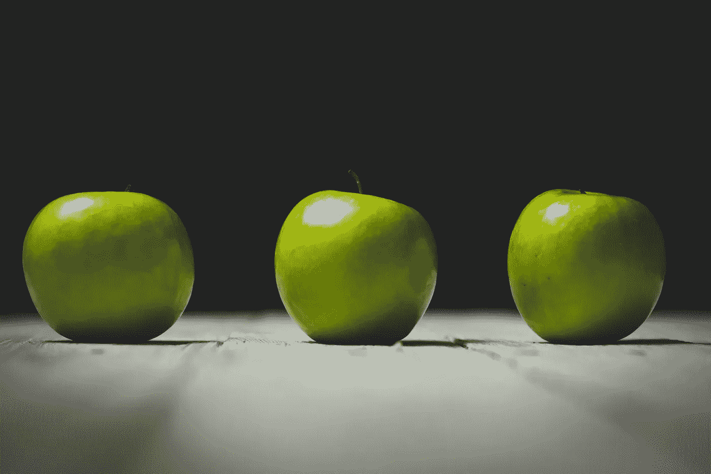
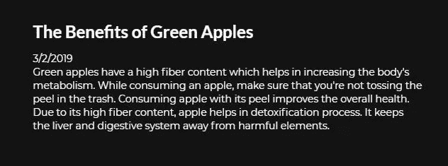
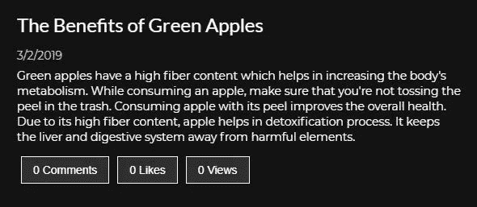
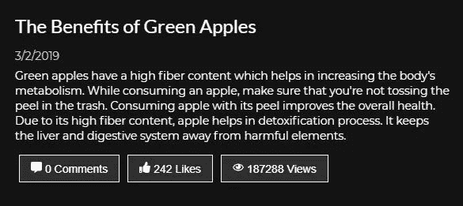
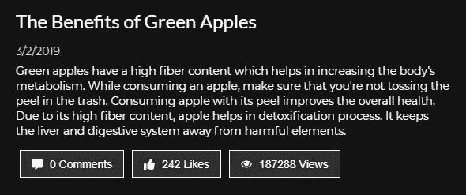
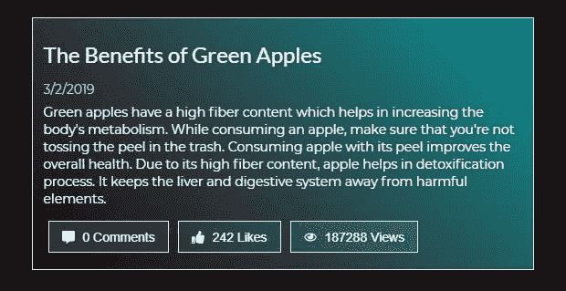
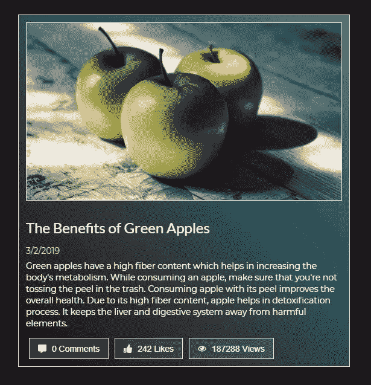
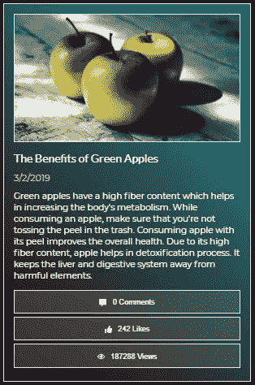

# 用样式化组件构建可重用的响应卡组件

> 原文：<https://betterprogramming.pub/build-a-reusable-responsive-card-component-with-styled-components-3ca14933f7e5>

## 漂亮的卡片可以帮助你走很长的路

## 一个设计良好的卡片组件对你的内容获得点击有很大的帮助！

[](https://jsmanifest.com/build-reusable-responsive-react-card-with-styled-components/)

由[霍利·明德鲁普](https://unsplash.com/@hollymindrup?utm_source=unsplash&utm_medium=referral&utm_content=creditCopyText)在 [Unsplash](https://unsplash.com/?utm_source=unsplash&utm_medium=referral&utm_content=creditCopyText) 上拍摄的照片

卡片组件经常被使用，因为它们使布局看起来整洁、干净和优雅。但也使用它们，因为它们将相关内容紧密地组合在一起，以帮助表示位于其他位置的完整内容。构成卡片组件的常见组件通常是标题、日期、描述和一些附加信息，如坚持用户对特定主题进行操作的注释按钮。

在这篇文章中，我将指导你使用 [styled-components](https://www.styled-components.com/) 库创建一个 card 组件——这是一个用来构建 styled react 组件的神奇工具，能够构建非常复杂的 UI 组件。

要开始学习本教程，您需要安装`styled-components`。(您可以选择安装`react-icons`，它将用于显示卡中的图标。)

```
npm i  --save styled-components
```

我们将从创建卡组件开始:

`Card.js`

```
import React from 'react'
import styled from 'styled-components'const Card = (props) => <div />export default Card
```

我们提到过，通常构成卡片组件的组件通常是标题、日期和描述，因此我们将继续将其应用于卡片:

```
import React from 'react'
import styled from 'styled-components'const Card = (props) => (
  <div style={{ color: '#fff' }}>
    <h2>The Benefits of Green Apples</h2>
    <div>3/2/2019</div>
    <div>
      Green apples have a high fiber content which helps in increasing the
      body's metabolism. While consuming an apple, make sure that you're not
      tossing the peel in the trash. Consuming apple with its peel improves the
      overall health. Due to its high fiber content, apple helps in
      detoxification process. It keeps the liver and digestive system away from
      harmful elements.
    </div>
  </div>
)export default Card
```

[](https://jsmanifest.com/build-reusable-responsive-react-card-with-styled-components/)

现在我们已经有了基本的结构，我们可以继续实现样式化的组件了。

我对灵活的卡组件的建议是为卡中的每个组件创建一个 react 组件。这样，我们可以分别设计每个组件的样式，并在需要时将它们与其他组件组合在一起。因此，让我们首先为标题、日期和描述创建样式化的组件:

```
const Title = styled.h2`
  color: #fff;
  font-weight: 300;
`const Date = styled.div`
  color: #ccc;
  font-weight: 300;
  margin: 6px 0;
`const Description = styled.p`
  color: #fff;
  font-weight: 300;
`
```

我们的卡组件现在应该看起来更好了。我们还受益于自我记录的代码:

```
import React from 'react'
import styled from 'styled-components'const Card = (props) => (
  <div style={{ color: '#fff' }}>
    <Title>The Benefits of Green Apples</Title>
    <Date>3/2/2019</Date>
    <Description>
      Green apples have a high fiber content which helps in increasing the
      body's metabolism. While consuming an apple, make sure that you're not
      tossing the peel in the trash. Consuming apple with its peel improves the
      overall health. Due to its high fiber content, apple helps in
      detoxification process. It keeps the liver and digestive system away from
      harmful elements.
    </Description>
  </div>
)export default Card
```

不算太寒酸吧？但是卡组件可以可选地包括附加按钮，如查看评论或按下 like 按钮。这些用户操作最常见于 Instagram 或脸书等社交媒体网站，表明用户可以调用关于该主题的操作。

对于我们的按钮，我们将实现*评论*、*喜欢*和*视图*:

```
const ActionButton = styled.button`
  margin: 0 5px;
  padding: 8px 14px;
  background: rgba(155, 155, 155, 0.2);
  color: #fff;
  cursor: pointer;
  border: 1px solid #fff;
  outline: 0;
  font-weight: 300;
  :hover {
    opacity: 0.8;
  }
` import React from 'react'
import styled from 'styled-components'const Card = (props) => (
  <div style={{ color: '#fff' }}>
    <Title>The Benefits of Green Apples</Title>
    <Date>3/2/2019</Date>
    <Description>
      Green apples have a high fiber content which helps in increasing the
      body's metabolism. While consuming an apple, make sure that you're not
      tossing the peel in the trash. Consuming apple with its peel improves the
      overall health. Due to its high fiber content, apple helps in
      detoxification process. It keeps the liver and digestive system away from
      harmful elements.
    </Description>
    <ActionButton>0 Comments</ActionButton>
    <ActionButton>0 Likes</ActionButton>
    <ActionButton>0 Views</ActionButton>
  </div>
)export default Card
```

[](https://jsmanifest.com/build-reusable-responsive-react-card-with-styled-components/)

我们接下来要做的是，通过将应用内容的所有权转移到呈现器(父)组件，使其成为一个可重用的组件。现在，通过传入`props.title`、`props.date`、`props.description`和`props.actions`，父节点将决定显示什么内容:

```
const Content = (props) => {
  const date = new Date().toLocaleDateString()
  const buttons = [
    {
      label: '0 Comments',
    },
    {
      label: '242 Likes',
    },
    {
      label: '187288 Views',
    },
  ] return (
    <Card2
      title="The Benefits of Green Apples"
      date={date}
      description="Green apples have a high fiber content which helps in increasing the
      body's metabolism. While consuming an apple, make sure that you're not
      tossing the peel in the trash. Consuming apple with its peel improves
      the overall health. Due to its high fiber content, apple helps in
      detoxification process. It keeps the liver and digestive system away
      from harmful elements."
      actions={buttons}
    />
  )
}
```

在我们的`Card`组件中，我们将简单地抓取这些道具并在渲染方法中应用它们:

```
const Card2 = ({ title, date, description, actions }) => (
  <div style={{ color: '#fff' }}>
    <Title>{title}</Title>
    <Date>{date}</Date>
    <Description>{description}</Description>
    {actions.map(({ label }) => (
      <Action>{label}</Action>
    ))}
  </div>
)
```


使这些按钮更加突出并有助于传达其目的的一个常用方法是将图标放在紧靠文本的按钮上。我们可以从`react-icons`包开始添加一些图标，这样看起来会更友好一些:

```
import { FaCommentAlt, FaThumbsUp, FaRegEye } from 'react-icons/fa'
```

并将它们应用于我们最近创建的按钮阵列:

```
const buttons = [
  {
    label: (
      <>
        <FaCommentAlt /> 0 Comments
      </>
    ),
  },
  {
    label: (
      <>
        <FaThumbsUp /> 242 Likes
      </>
    ),
  },
  {
    label: (
      <>
        <FaRegEye /> 187288 Views
      </>
    ),
  },
]
```

下面是卡组件现在的样子:



还不错！

然而，图标看起来有点偏离定位。仔细看，它们好像比旁边的文字高一点。

我们将使用的策略是构建一个包装组件来包装动作按钮。

该包装组件的目的是通过实现一个选择器来一次定位所有按钮并设置它们的样式，从而使所有按钮与其同级按钮使用的样式完全相同:

```
const Actions = styled.div`
  color: #333;
  display: flex;
  align-items: center;
  svg {
    transform: translateY(2px);
    margin-right: 5px;
  }
`
```

现在将动作按钮包装在`Card`组件中(注意:我还将`.map`循环中的`...props`扩展到每个动作按钮，以便我们可以将额外的道具转发到按钮元素，如果父元素提供的话):

```
const Card = ({
  title,
  date,
  description,
  comments,
  likes,
  views,
  actions,
}) => (
  <div style={{ color: '#fff' }}>
    <Title>{title}</Title>
    <Date>{date}</Date>
    <Description>{description}</Description>
    <Actions>
      {actions.map(({ label, ...props }) => (
        <Action {...props}>{label}</Action>
      ))}
    </Actions>
  </div>
)
```



万岁，我们完成了！

为了方便起见，我将为整个代码添加一些自定义样式，使其“流行”。

## 最终代码

以下是最终代码(包括媒体对响应式设计的询问):

`Card.js`:

```
import React from 'react'
import styled from 'styled-components'const StyledContainer = styled.div`
  border: ${(props) => `1px solid ${props.theme.border.cool}`};
  padding: 25px 12px 18px;
  background: ${(props) => `linear-gradient(
    45deg, ${props.theme.primary.main}, ${props.theme.secondary.main}
  )`};
`const Title = styled.h2`
  color: #fff;
  font-weight: 300;
  @media (max-width: 500px) {
    font-size: 1rem;
  }
`const Date = styled.div`
  color: #ccc;
  font-weight: 300;
  margin: 6px 0;
  @media (max-width: 500px) {
    font-size: 0.8rem;
  }
`const Description = styled.p`
  color: #fff;
  font-weight: 300;
  @media (max-width: 500px) {
    font-size: 0.75rem;
  }
`const Actions = styled.div`
  color: #333;
  display: flex;
  align-items: center;
  svg {
    transform: translateY(2px);
    margin-right: 5px;
  }
  @media (max-width: 500px) {
    flex-direction: column;
    & button {
      width: 100%;
      margin-bottom: 4px;
      font-size: 0.65rem;
    }
  }
`const Action = styled.button`
  margin: 0 5px;
  padding: 8px 14px;
  background: rgba(155, 155, 155, 0.2);
  color: #fff;
  cursor: pointer;
  border: 1px solid #fff;
  outline: 0;
  font-weight: 300;
  :hover {
    opacity: 0.8;
  }
  :active {
    background: ${(props) => props.theme.primary.main};
  }
`const Card = ({
  title,
  date,
  description,
  comments,
  likes,
  views,
  actions,
}) => (
  <StyledContainer>
    <Title>{title}</Title>
    <Date>{date}</Date>
    <Description>{description}</Description>
    <Actions>
      {actions.map(({ label }) => (
        <Action>{label}</Action>
      ))}
    </Actions>
  </StyledContainer>
)export default Card
```

`Parent.js`

```
import React from 'react'
import styled from 'styled-components'
import { FaCommentAlt, FaThumbsUp, FaRegEye } from 'react-icons/fa'
import Card from './Card'const StyledRoot = styled.div`
  padding: 50px 12px;
`const StyledContainer = styled.div`
  max-width: 550px;
  width: 100%;
  margin: auto;
`const Parent = () => {
  const date = new Date().toLocaleDateString() const onCommentClick = () => alert('You clicked comments')
  const onLikesClick = () => alert('You clicked comments')
  const onViewsClick = () => alert('You clicked comments') const buttons = [
    {
      label: (
        <>
          <FaCommentAlt /> 0 Comments
        </>
      ),
      onClick: onCommentClick,
    },
    {
      label: (
        <>
          <FaThumbsUp /> 242 Likes
        </>
      ),
      onClick: onLikesClick,
    },
    {
      label: (
        <>
          <FaRegEye /> 187288 Views
        </>
      ),
      onClick: onViewsClick,
    },
  ] return (
    <StyledRoot>
      <StyledContainer>
        <Card
          title="The Benefits of Green Apples"
          date={date}
          description="Green apples have a high fiber content which helps in increasing the
      body's metabolism. While consuming an apple, make sure that you're not
      tossing the peel in the trash. Consuming apple with its peel improves
      the overall health. Due to its high fiber content, apple helps in
      detoxification process. It keeps the liver and digestive system away
      from harmful elements."
          actions={buttons}
        />
      </StyledContainer>
    </StyledRoot>
  )
}export default Parent
```

## 结果呢

[](https://jsmanifest.com/build-reusable-responsive-react-card-with-styled-components/)

## 奖金

为了进一步增加新卡片组件的趣味，您可以在标题上方添加一个图像元素，以帮助可视化卡片的主题:

```
const StyledPhoto = styled.img`
  width: 100%;
  height: 100%;
  object-fit: cover;
  border: ${(props) => `1px solid ${props.theme.border.cool}`};
`const Card = ({
  title,
  date,
  description,
  comments,
  likes,
  views,
  actions,
}) => (
  <StyledContainer>
    <StyledPhoto src="https://s3-us-west-1.amazonaws.com/welcome_apples/posts/1_card/apple.jpg" />
    <Title>{title}</Title>
    <Date>{date}</Date>
    <Description>{description}</Description>
    <Actions>
      {actions.map(({ label }) => (
        <Action>{label}</Action>
      ))}
    </Actions>
  </StyledContainer>
)
```

# 决赛成绩

[](https://jsmanifest.com)

这是它在移动设备上的样子:



# 结论

正如你现在看到的，卡片组件保持了布局的优雅和整洁。每当您想要将相关内容紧密地组合在一起并使其链接到完整内容时，请使用卡片组件。一个设计良好的卡片组件对你的内容获得点击有很大的帮助！