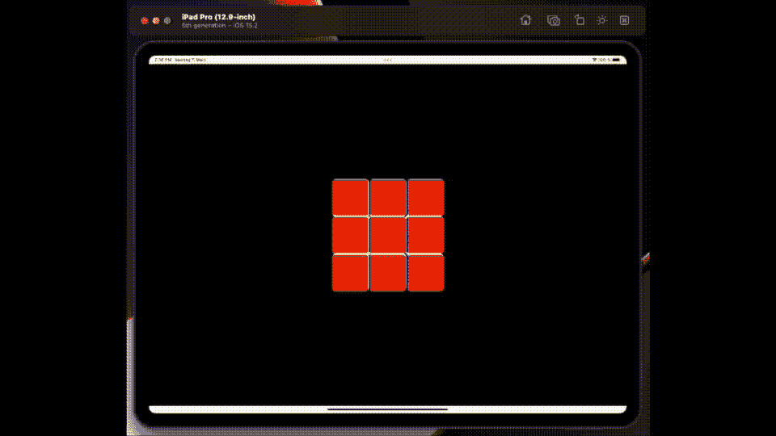

# 使用 SceneView 和 SwiftUI 构建一个魔方

> 原文：<https://betterprogramming.pub/build-a-rubik-cube-using-sceneview-and-swiftui-dea9e622ef43>

## 在您的应用程序中求解立方体



上周我发表了一篇文章，讲述了现在用 SwiftUI 实现 SceneKit 是多么容易。可悲的是，我发现我在这个领域的下一个项目肯定不会这么简单。

简单来说就是使用 SwiftUI 的 SceneView 操作符构建一个虚拟的魔方。我将在这里描述我是如何实现本文的动画 GIF 标题图像的。

# 挑战

*   我需要画一个立方体来代表一个魔方，然后我会将这个立方体组装成 54 个立方体的集合。
*   我需要实现一个相机视图，这将允许我改变视图来解决立方体。
*   我需要实现一种方法来点击它的一个立方体来改变它的方向。

仅仅三个要求听起来很简单，但事实证明是一个相当大的挑战。

# 立方体

bon——正如您所料，构建立方体并为其着色的代码是项目中最简单的部分。我几乎只用了 4 行代码就完成了这项工作。

```
func addBox(xAxis: Float, yAxis: Float, zAxis: Float) {
  let cubeNode = SCNNode(geometry: cubeGeometry)
  cubeNode.position = SCNVector3(xAxis, yAxis, zAxis)
  scene?.rootNode.addChildNode(cubeNode)
}
```

当然，我把它过于简单化了；质地[颜色]又花了十来行。就像上一个项目一样的照明而言，我想保持简单，并添加了四盏灯来淹没图像。我通过一些嵌套循环添加的节点[盒子]。

# 照相机

我必须承认，我在实现这一点上得到了一些帮助。在早期构建中，我简单地使用了 SceneKit `**allowsCameraControl**` 选项。除了不能和拖动手势一起使用之外，这个选项工作得很好。我需要一个手势来移动单独的立方体。所以我只能自己卷了。

为此，我创建了一个共享类来记录 SwiftUI 中注册的拖动的位置和事务值。然后我做了一个虚拟的节点[cameraOrbit],我把它放在我的魔方的正中央，并把这个相机连接到它上面。

现在，每次调用拖动手势时，我都将值存储在我的公共类中。

我用来改变`cameraOrbit`节点上的`eular`角度的值。我根据这个 [SO 帖子](https://stackoverflow.com/questions/25654772/rotate-scncamera-node-looking-at-an-object-around-an-imaginary-sphere/25674762#25674762)重新设计了一个解决方案——这个帖子值得一看，因为它对这里发生的事情也有很好的描述。我的代码版本是这样的。

```
func changeCamera() {
  let dx = cameraOrbit.eulerAngles.x
  let dy = cameraOrbit.eulerAngles.y
  let scrollWidthRatio = Float(settings.translation.width / screenWidth) / 16
  let scrollHeightRatio = Float(settings.translation.height / screenHeight) / 16
  cameraOrbit.eulerAngles.y = Float(-2 * Float.pi) * scrollWidthRatio + dy
  cameraOrbit.eulerAngles.x = Float(-Float.pi) * scrollHeightRatio + dx
}
```

# 立方体选择

这是迄今为止最具挑战性的方面，因为`hitTest`方法似乎有点问题。

我最初尝试使用我基于我在这里找到的解决方案[创建的公共类来实现](https://github.com/Thunor/HitTestApp?ref=iosexample.com)。我找到了另一个很好的参考，虽然遗憾的是，这个解决方案中的 hittest 对我不起作用。

相反，我在 SceneView 的 delegate 方法中用这里使用的代码实现了相同类型的循环。

简而言之，它将拖动手势从旋转立方体集合切换到旋转单个立方体。一个转弯就是一个`SCNAction`。

它工作得相当好，尽管它并不完全正确，是吗，我相信你会同意——要使它正确需要我进行更多的横向思考，我现在要离线了。

这让我想到了这篇关于 SceneKit 的文章的结尾。

你可以从 bitbucket [这里](https://bitbucket.org/wizard1066/scenekits/commits/6082b58451cc307fa128a57a46d8ca8bd3d7c326)下载完整的代码副本。