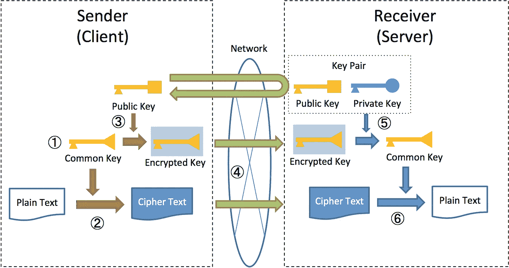
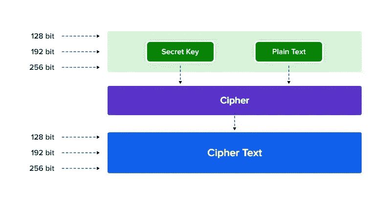

# 在 iOS 中构建安全信封

> 原文：<https://betterprogramming.pub/build-a-secure-envelope-in-ios-swift-f1f0297d2562>

## 让我们学习如何在 Swift 中通过 REST API 传输敏感数据

由[新美乐股份公司·塞尔吉](https://unsplash.com/@i_am_simoesse?utm_source=medium&utm_medium=referral)在 [Unsplash](https://unsplash.com?utm_source=medium&utm_medium=referral) 拍摄的照片

互联网和网络应用正在迅速发展，因此保护这些应用的需求变得至关重要。

本文通过提出两种不同的加密算法来解决这个问题。使用不对称和对称算法的组合效果产生了一种混合加密方案，使得不安全的人很难从通过不安全传输传输的消息中获知任何信息。

> 密码术是用秘密代码书写的科学，是一种古老的艺术，它确保消息(书写)安全(隐藏)而不被非消息接收者发现。

# 加密目标

密码学用于为许多问题提供解决方案，例如:

*   保密性(隐私)
*   数据完整性
*   证明
*   不可否认性

## 密钥加密(对称)

它使用一个密钥进行加密和解密。发送方使用密钥(或某些规则)加密明文，并将密文发送给接收方。

接收者应用相同的密钥(或规则集)来解密消息并恢复明文。因为两种功能都使用一个密钥，所以密钥加密也称为对称加密。

## 公钥加密(非对称)

目前用于密钥交换或数字签名的公钥加密算法包括 RSA、Rabin、ElGamal、Paillier、椭圆曲线加密(ECC)、Cramer-Shoup 和许多其他公钥加密算法。

由 [Mauro Sbicego 在 Unsplash](https://unsplash.com/@maurosbicego) 上拍摄

# 混合算法

本文提出了一种混合加密方法，通过两种加密技术来保护数据传输:AES 算法用于加密明文，RSA 算法用于加密 AES 密钥，以确保客户端-客户端或客户端-服务器之间的安全传输不被他人验证，使其更难以被攻击者访问。

在该算法中，原始数据进入系统，并且在一个执行阶段期间而不是在单独的阶段中输出通过 AES 密钥加密的数据和通过 RSA 公钥加密的 AES 密钥。在接收端，解密过程已经完成。

混合加密

1.  发送方生成一个用于加密纯文本的公共密钥。
2.  纯文本由发送方生成的公共密钥加密。
3.  发送方使用接收方的公钥对公钥进行加密。
4.  发送方发送加密的文本和加密的公共密钥。
5.  接收方通过使用接收方的秘密密钥对加密的公共密钥进行解密。
6.  接收方通过解密公共密钥来解密加密的文本

> AES(高级加密标准)是一种常用密钥加密方法的算法。它是在 DES 之后建立的加密标准，是当前默认的加密标准。
> 
> RSA 是一种公钥加密算法。计算机器的能力影响算法，因为它是基于素数分解的困难。它需要足够的密钥长度，如“2010 年加密算法问题”中所述。目前，2048 位被用作标准长度。

# 履行

在实现安全信封之前，我想简单地告诉您一些事情:

1.  实现安全信封对于将加密环境与后端相匹配非常重要。例如，当后端决定使用 RSA/ECB/OAEPWithSHA-256 时，在客户端实现相同的环境非常重要。
2.  许多框架有助于加快开发速度，减少实现过程中可能出现的错误。

# 演示项目

这里是[演示项目](https://github.com/mehrankmlf/SecurePacketEnvelope)，它展示了如何实现一个安全信封。

首先，我们需要为 AES 算法实现一个 IV 和密钥生成器，它生成一个简单的 16 位长度的随机字符串。

AES 加密密钥有三种长度。每个密钥长度都有不同数量的可能密钥组合。尽管这种加密方法的密钥长度不同，但其块大小(128 位，即 16 字节)保持不变。

其次，我们需要实现一个密钥对。RSA 密钥对是 RSA 算法使用的公钥和私钥的名称。RSA 公钥是加密密钥，而私钥(必须保密以确保只有目标接收者才能读取数据)是解密密钥。

## AES256-CBC 操作

这种算法也被许多人称为“块密码”，因为它将数据分成称为块的块段。

*   AES 加密密钥将数据分成 4*4 个数组，每个数组包含 16 个字节。
*   每个字节最多包含 8 位。但是这种划分不会改变密文的大小。原始文本和密文的大小都是 128 位。

正如我们之前所说的，使用框架来实现 AES 是可能的，但是我们没有使用它们来更好地理解实现。

通用加密仍然是执行低级加密操作的推荐方式，如我们用于实现的 AES。

正如该方法中清楚的那样，除了算法和填充等输入之外，它还接收一个名为`IV`的输入和另一个名为`KEY`的输入。

## 注入静脉的

初始化向量(IV)是一个任意数字，它可以与密钥一起用于数据加密，以抵御网络攻击。该号码也称为 nonce(使用一次的号码)，在任何会话中仅使用一次，以防止可疑或恶意参与者对消息进行未经授权的解密。关于 IV 重要的一点是，你绝不能对两个消息使用同一个 IV，所以在实践中，你可以使用我们之前生成的一个随机的 IV。

## 键

由于 AES 支持多种密钥大小，我们应该为这种情况选择最好的一种。AES-128 是商业应用中最常见的选择。它提供了安全性和速度之间的平衡。各国政府通常利用 AES-192 和 AES-256 来实现最高的安全性。我们使用 AES-256 来提高安全性。

## RSA-PKCS1 操作

如前所述，我们使用 RSA 算法来保护 AES 中使用的密钥。与 AES 一样，RSA 也有一些要求，我们将在下面解释:

*   不要发送带有私钥的密文。
*   您不应该使用 1024 位 RSA 密钥。他们不安全。切换到至少 2048 位的密钥。
*   加密是用公钥完成的，解密是用私钥完成的。
*   使用 RSA 密钥的加密是有限的；只有少量的数据可以加密或解密，RSA 很慢。

由于本文关注的是混合加密，我们可能在另一篇文章中讨论过公钥和私钥的结构。这里，我们将研究一个公钥和私钥的例子。

## 公钥

以传统 RSA 格式编码的 RSA 公钥如下所示:

## 私人钥匙

2048 位 RSA 私钥的例子，对应上面的公钥。

苹果已经提供了一个处理 RSA 的安全框架，所以我们将使用它来保护敏感数据。这里敏感数据将是 AES 密钥。

## RSA 加密

## RSA-解密

# 结论

由于 RSA 加密具有非常低的数据限制，仅使用
RSA 算法的敏感数据加密和解密的方法在某种程度上涉及一些困难。新算法结合了两种算法的特点，解决了对称加密算法的密钥移动问题和非对称加密算法的高功耗问题。

我希望你认为这是值得一读和耐人寻味。

 [## GitHub-mehrankmlf/SecurePacketEnvelope:Swift 中的混合加密

### SecurePacketEnvelope 是一种混合加密系统，可以高效安全地加密用户敏感数据，支持…

github.com](https://github.com/mehrankmlf/SecurePacketEnvelope)