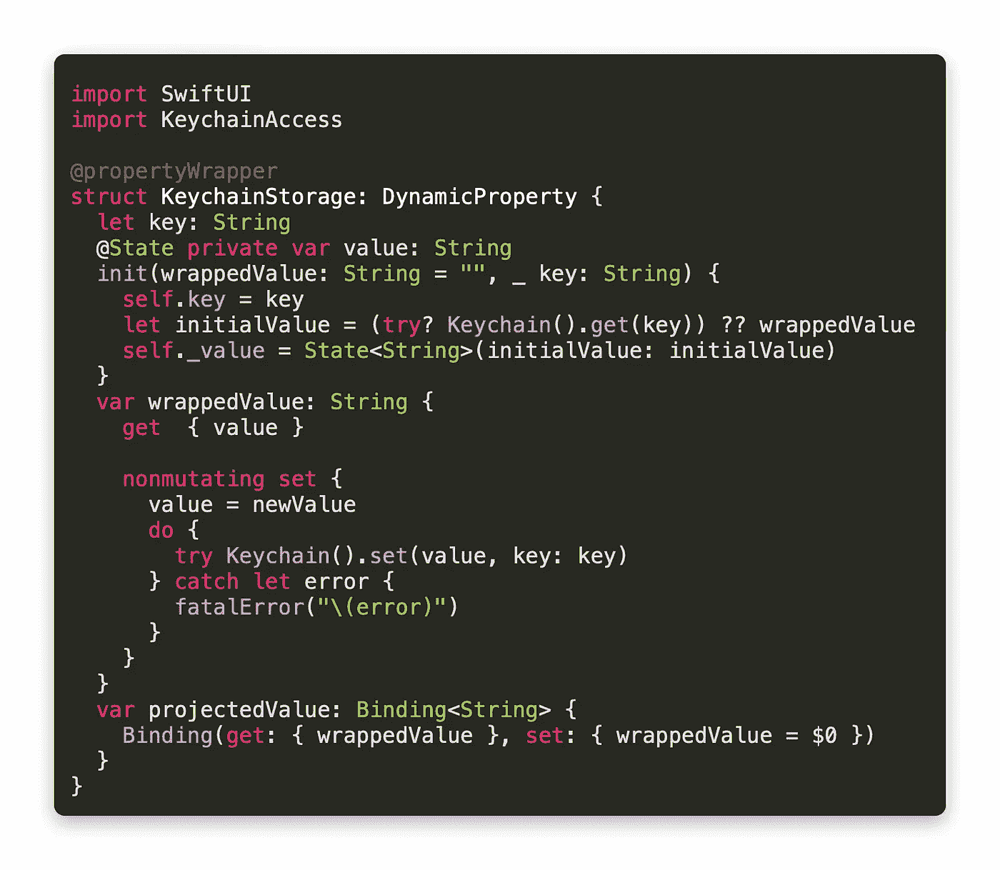
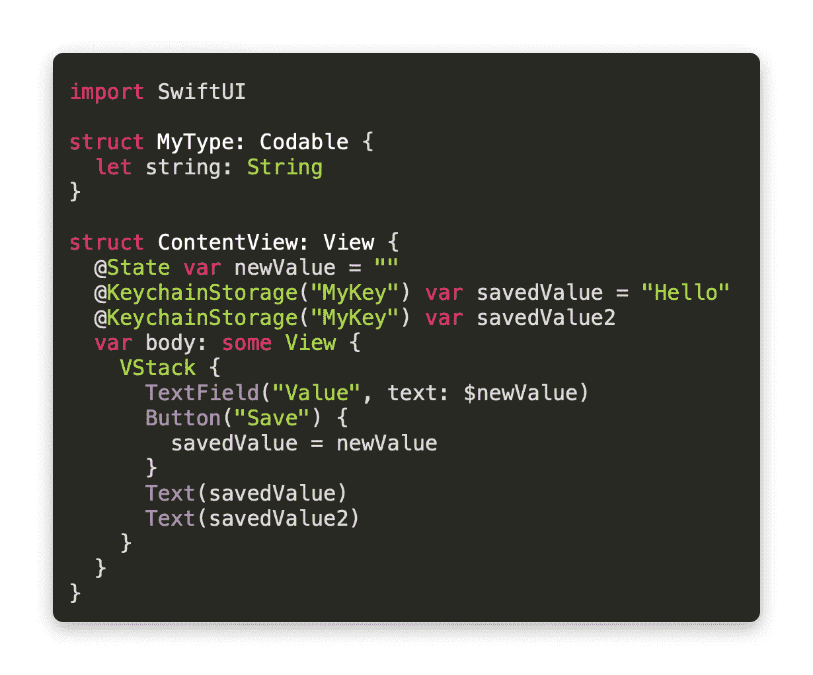
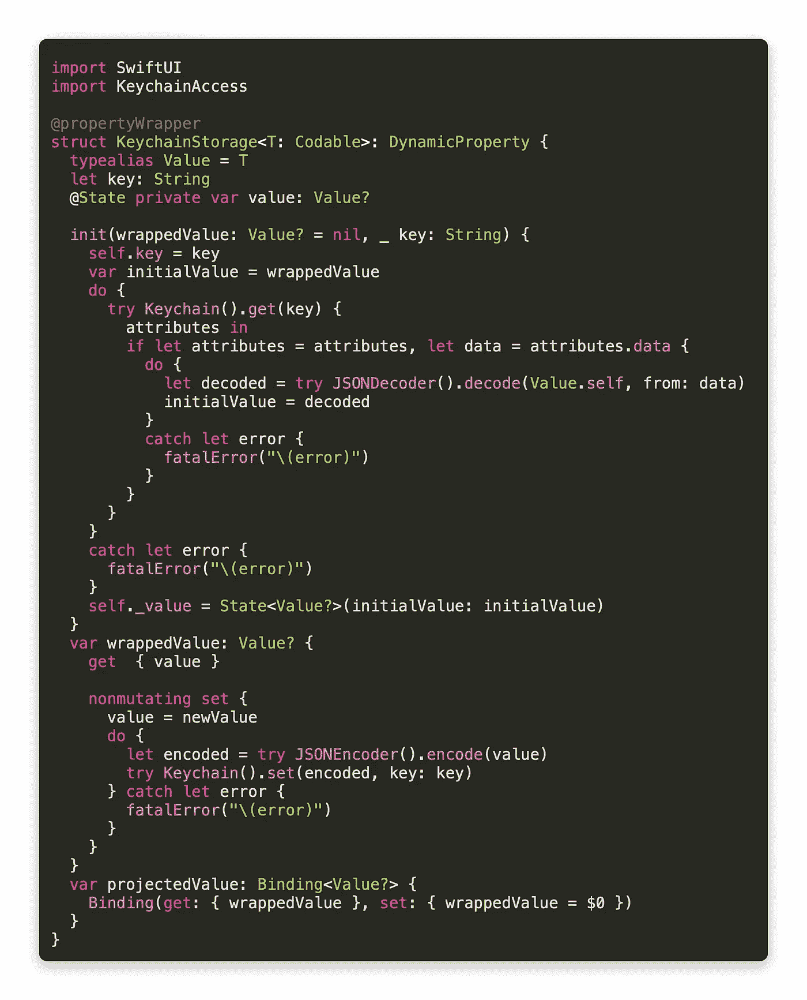
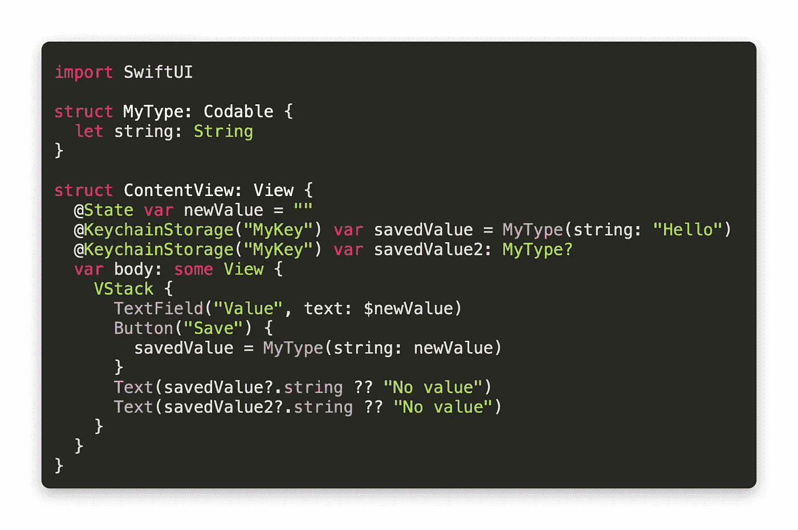

# 为钥匙串构建一个安全的 SwiftUI 属性包装

> 原文：<https://betterprogramming.pub/build-a-secure-swiftui-property-wrapper-for-the-keychain-e0f8e39d554b>

## 在 iOS 和 macOS 应用程序的加密数据库中安全地保存任何可编码类型的数据


[Uwe Baumann](https://pixabay.com/users/weinstock-25534/?utm_source=link-attribution&utm_medium=referral&utm_campaign=image&utm_content=96233) 在 [Pixabay](https://pixabay.com/?utm_source=link-attribution&utm_medium=referral&utm_campaign=image&utm_content=96233) 上的照片。

当您希望从名为`UserDefaults`的持久存储中保存和加载一个属性时，您可以像这样声明它:

```
@AppStorage(“MyKey”) var savedValue
```

当应用程序启动时，密钥用于检索值。如果有一个值，`savedValue`就会有那个值。当您更改`savedValue`时，`UserDefaults`会自动更新。如果您在 SwiftUI 中的任何地方显示该值(例如在一个`Text`中)，该值也会在那里更新。换句话说，它的行为很像一个`@State`属性，允许您更改包装的值并刷新 SwiftUI，而不会被警告`self`是不可变的。

但是`UserDefaults`天生缺乏安全感。

引用阿克塞尔·基网站上的话:

> “之前，我们已经解释过 UserDefaults 将数据保存到 plist 中。使用 iExplorer 等应用程序，用户可以访问他们 iPhone 的 Library/Preferences 文件夹，并轻松读取/修改 UserDefaults plist 数据(例如:将“boughtProVersion”的布尔值从 false 更改为 true，或者更改硬币的数量)。永远不要存储一个布尔值来检查用户是否在 UserDefaults 中购买了应用内购买！用户可以很容易地改变它(无需越狱)，并免费获得你的好东西！”

我们想用钥匙串来代替，在那里你可以安全地存储像密码一样敏感的数据。

钥匙串使用加密的数据库，只有设备的所有者才能访问该数据库。

我没有自己编写相当复杂的代码，而是使用了一个名为 [KeychainAccess](https://github.com/kishikawakatsumi/KeychainAccess) 的 Swift 包。在 Xcode 中创建一个空白 SwiftUI 项目，然后转到文件>Swift Packages>Add Package Dependency。粘贴[keychain access](https://github.com/kishikawakatsumi/KeychainAccess)GitHub URL，点击“下一步”导入。一旦添加了包，您将能够通过使用`Keychain`类与钥匙链进行交互。

现在我们要创建我们的属性包装器，我们称之为`@KeychainStorage`:



源代码:[keychain storagewrappernostaticdefault . swift](https://gist.github.com/ee9d4c53f8998d2e70f7520a51a75ada)

当您创建它的实例时，您需要给它一个密钥，它将使用该密钥从钥匙串中访问值。您可以提供默认值，但这是可选的，因为该值被设置为空字符串。我们有一个带有`nonmutating`设置器的`wrappedValue`属性，这意味着我们可以设置`value`属性而不改变整个结构的值。

我们通过更新`value`来做到这一点，T5 是一个`@State`属性。

使用 Swift 的[黑客教程](https://www.hackingwithswift.com/plus/intermediate-swiftui/creating-a-custom-property-wrapper-using-dynamicproperty)解释了其工作原理:

> “SwiftUI 没有意识到它应该监视我们的属性包装器以获取更改通知，尽管它在其中有一个`@State`属性。要解决这个问题，我们需要…遵守`DynamicProperty`协议。事实上，这就是我们需要做的——swift ui 会为我们处理其余的事情。”

让我们来看看这是如何在实际情况中使用的。

我的示例 app 使用`“MyKey”`作为键，相应的值被加载并保存在那里。我有一个`TextField`，你可以在里面输入一个值。当您按下“保存”按钮时，您写入的值将被保存到钥匙串中，并且`Text`将显示新值，确认已成功保存。



源代码:[key chainstoragenostaticdefault . swift](https://gist.github.com/sturdysturge/e387ac8b7beee0a35d67887086de9620)

为了确保我们的代码能够正常工作，我在 catch 中放了一个`fatalError`来表示值何时被保存到 keychain 中。如果有一个错误，应用程序就会崩溃，所以这可能不是一个好主意。

由于我们知道包装的值将是一个字符串，`savedValue2`不需要指定它的类型。

但是如果我们想让它存储一个泛型类型呢？

# 使用可编码类型

这个版本只适用于字符串，但是我们也可以做一个适用于任何`Codable`类型的版本。为了让您选择是否要提供默认值，我将该值设为可选。如果您提供了默认值，当钥匙串中没有给定密钥时，将使用该值。如果不提供默认值，该值将被设置为`nil`。

初始化器中的默认值参数称为`wrappedValue`，因为它与`AppStorage`初始化器相同。

我认为`defaultValue`会是一个更好的名字，因为包装的值可能会被设置为 keychain 中的值。

我给它取名`wrappedValue`只是为了和苹果保持一致。



源代码:[keychainstorcacodable . swift](https://gist.github.com/e5163a9e95826adbeff9824d5aa1d111)

你可能会在初始化器中注意到，我们现在使用的是需要闭包的`Keychain().get`的通用版本。在这个闭包中，我们得到了为键设置的`Data`，并且我们试图将它解码成我们的`Codable`类型的一个实例。如果成功完成，我们将使用该值。否则，我们将使用默认值。

下面是一个使用默认值和不使用默认值的示例:



源代码:[key chainstoragecordablecontentview . swift](https://gist.github.com/65b499f5dac785177626d0f8cbc1f216)

在您保存新值之前，`savedValue`属性将显示`“Hello”`，而`savedValue2`将显示`“No value”`。