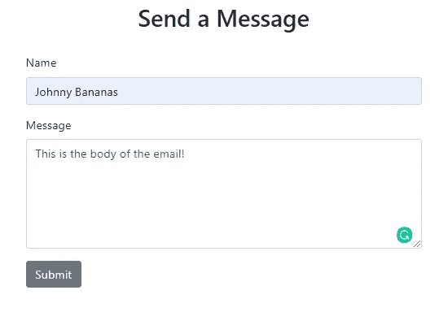
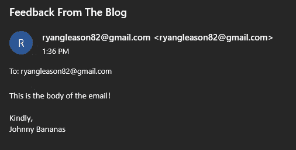
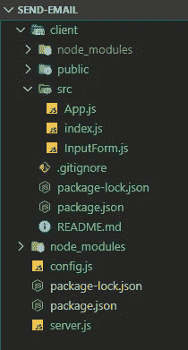
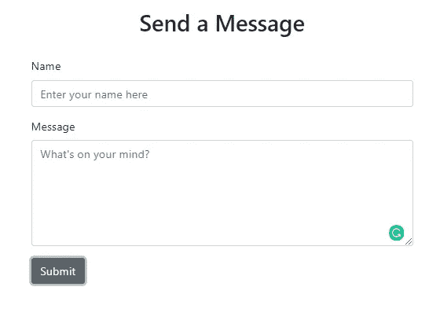
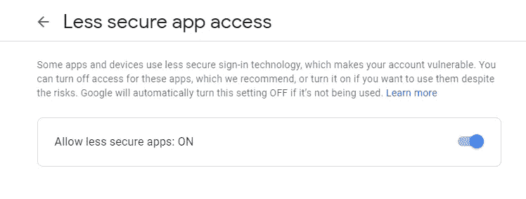
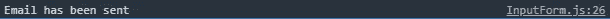

# 为你的站点创建一个“给我发消息”组件

> 原文：<https://betterprogramming.pub/build-a-send-me-a-message-component-for-your-site-229c2b8195e1>

## 创建一个简单的 React 组件，允许用户直接从您的站点向您发送消息


亚当·索罗门在 [Unsplash](https://unsplash.com/s/photos/hello?utm_source=unsplash&utm_medium=referral&utm_content=creditCopyText) 上拍摄的照片

你有没有想过如何让用户直接从你的网站给你发信息？这似乎有点复杂，不是吗？

我在这里告诉你，这真的很简单。我们只需要把几个已经存在的部分放在一起，然后根据我们的喜好进行裁剪。

# 目标

开发一个组件，允许用户直接从你网站上的表单发送电子邮件。

最终产品如下:



从电子邮件的角度来看:



# 我们将使用的工具

*   [Nodemailer](https://nodemailer.com/) —一个 npm 模块，我们将使用它以编程方式发送电子邮件。
*   express . js—node . js 的 web 应用程序框架，允许我们快速启动并运行我们的应用程序。
*   React —我们将用来创建表单的前端库。
*   [Bootstrap](https://getbootstrap.com/) 和[reacts trap](https://reactstrap.github.io/)——帮助我们快速创建漂亮组件的 UI 库。

# 环境设置

我已经创建了一篇附带文章，介绍如何创建一个前端 React 应用程序并将其连接到您的后端 Express 应用程序。本指南是本教程的基础。

*   [使用 Axios 连接您的 Express 和 React 应用](https://medium.com/@ryangleason82/connect-your-express-and-react-applications-using-axios-c35723b6d667)

# 入门指南

让我简单概述一下我们将如何创建这个应用程序。如果你有任何困惑，我会在本文底部贴一个 GitHub repo 的链接，这样你就可以看到完整的资源库。

*   [布局我们的目录结构](#e80c)
*   [创建表单](#1ed2)
*   [设置后端](#3924)
*   发送电子邮件！

很简单，对吧？我们开始吧。

# 布局我们的目录结构

下面是您的目录结构的样子:



您将看到我们的 Express 后端有`server.js`, React 前端有`client`目录中的所有内容。

在我们的`src`文件夹中，我们正在添加一个组件:`InputForm.js`。顾名思义，它将是我们的表单组件。

# 创建我们的表单

将目录更改为`client`，我们将创建我们的表单。

运行以下命令安装`reactstrap`和`bootstrap`。这些库将帮助我们制作一个漂亮的表单组件。

```
npm i --save reactstrap bootstrap
```

并将下面一行添加到您的`index.js`中:

```
import "bootstrap/dist/css/bootstrap.min.css";
```

下面是我们将在名为`InputForm.js`的组件中用于表单的代码。

如果你想更详细地了解我是如何使用 React 钩子创建这个表单的，你可以查看这篇文章: [*用 React 钩子*](https://medium.com/better-programming/easily-create-a-form-with-react-hooks-1cab17e2be0d) 轻松创建一个表单。

InputForm.js

为了完整起见，这里是`App.js`:

App.js

运行`npm start`，您应该会在 localhost:3000 处看到下面的表单:



# 设置我们的后端

将目录改回父目录。现在我们将安装更多的库来帮助我们。

安装以下模块(用于后端):

```
npm i --save nodemailer express cors
```

我将把代码贴在下面，然后向你解释为什么每一行都是必要的。

server.js

*   第 3 行:我们将在端口 5000 上托管后端，在端口 3000 上托管前端(因为这是 React 的默认端口)。
*   第 5 行:一个包含我们凭证的配置文件。一个名为`config.js`的简单文件，与我们的`server.js`文件在同一层。看起来是这样的:

```
module.exports = {
USER: "enteryouremailaddresshere@gmail.com",
PASS: "enteryourpasswordhere"
};
```

*   第 6 行:为了允许我们的两个服务器相互通信，我们需要启用一个 CORS 策略。
*   第 8 行:我们允许我们的应用程序使用所有来源的 CORS 策略。有关如何更好地选择政策的更多信息，请访问 npm 上的[CORS 文档](https://www.npmjs.com/package/cors)。
*   第 9 行和第 10 行:Express 的应用程序设置。
*   第 12-18 行:`nodemailer`要求您创建一个`transport`来连接到 SMTP 服务器。在这里，我们决定使用哪种服务(如 Gmail ),并提供我们的登录凭证。
*   第 20-26 行:我们登录我们的帐户。如果您在登录时遇到问题(SSL 错误)，您需要启用您的 Gmail 帐户从第三方应用程序发送邮件。点击[该链接](https://myaccount.google.com/lesssecureapps)并将其转到上的*。我建议*在你不用的时候把它关掉*。或者创建一封测试邮件。*



*   第 28-46 行:我们的`POST`路线定义。这段代码是当我们从前端接收到`axios`请求时在后端发生的事情。
*   您将看到在第 29 行和第 30 行，我们从请求中获取参数。
*   第 32-36 行:我们正在创建实际的电子邮件消息。您可以看到这里的每个字段如何映射到电子邮件的不同部分。
*   第 39-45 行:生成响应并发送回我们的前端。它将决定消息是否通过，然后在我们的前端，我们可以看到`if (res.dat.msg === ‘suc’)`，然后记录`“Email has been sent”`，否则，返回`FAILURE`。

# 发邮件！

填写您的表格，然后单击提交。您应该会看到这条`console.log()`消息:



你的收件箱里有一封类似这样的邮件:


瞧啊。我们现在使用`nodemailer`以编程方式发送电子邮件。

# 回顾

我们到底做了什么？

*   在前端用 React 设置一个全栈 Node.js 应用程序。
*   使用 React 创建了一个表单。
*   在后端设置一个 API 路由来处理来自前端的请求。
*   发了封邮件。

正如承诺的那样，这里有一个到 GitHub repo 的链接。

非常感谢您的阅读！如果您有任何问题、意见或顾虑，请随时留下您的意见。