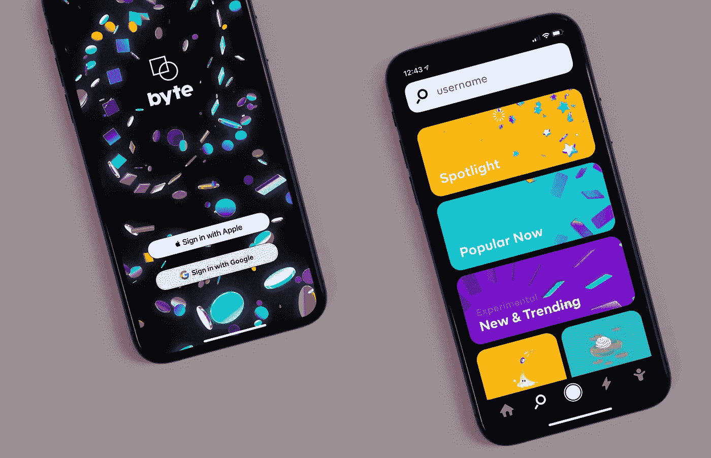
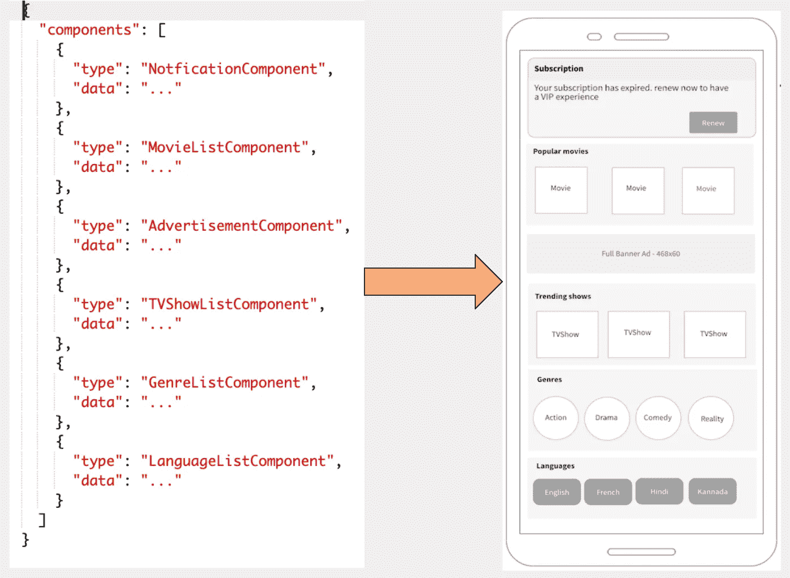
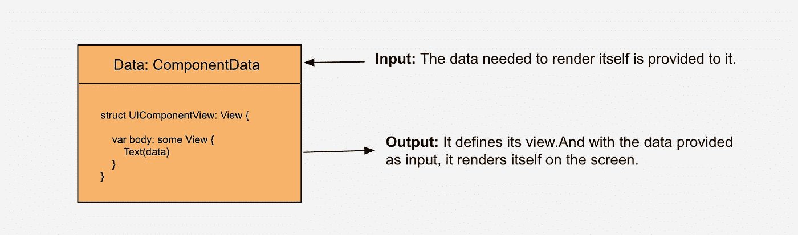

# 使用 SwiftUI 中的 UI 组件构建服务器驱动的 UI

> 原文：<https://betterprogramming.pub/build-a-server-driven-ui-using-ui-components-in-swiftui-466ecca97290>

## 无需提交给 Apple，即可随时更改您的应用程序

查尔斯·德鲁维奥在 [Unsplash](https://unsplash.com?utm_source=medium&utm_medium=referral) 上的照片

本文将讨论服务器驱动的 UI，它使用称为 *UIComponents* 的可重用组件来实现，并创建一个通用的垂直列表视图来呈现 UI 组件。它将以 UI 组件如何服务于不同目的的简短讨论作为结束。

# **什么是服务器驱动的 UI？**

*   在这种架构中，服务器决定需要在应用程序屏幕上呈现的 UI 视图。
*   在应用程序和服务器之间存在一个契约。这个契约的基础是让服务器控制应用程序的用户界面。

那份合同是什么？-服务器定义组件列表。对于在服务器上定义的每个组件，我们在应用程序中都有相应的 UI 实现(UIComponent)。考虑一个像 Hotstar 这样的娱乐 app，它的合约定义如下图。左边是来自服务器的组件，右边是相应的 UI 组件。

工作-屏幕没有像故事板那样的预定义布局。相反，它由一个通用的列表视图组成，根据服务器响应垂直呈现多个不同的视图。为了实现这一点，我们必须创建独立的视图，并且可以在整个应用程序中重用。我们将这些可重用的视图称为 *UIComponent* 。

契约——对于每个服务器组件，我们都有一个 UIComponent。

# **SwiftUI**

Swift 是一个 UI 工具包，允许您以编程、声明的方式设计应用程序屏幕。

# SwiftUI 中服务器驱动的 UI 实现

这是一个分三步走的过程。

1.  定义独立 UIComponents。
2.  基于 API 响应构造 UIComponents。
3.  在屏幕上呈现 UIComponents。

## 1.**定义独立的 UIComponents**

UI 组件的图形表示

输入:首先，为了让 UIComponent 呈现自己，应该为它提供数据。

输出:UIComponent 定义了它的 UI。当用于在屏幕内呈现时，它根据提供给它的数据(输入)来呈现自己。

**UIComponent 实现**

UIComponent.swift

*   所有的 UI 视图都必须符合这个 UI 组件协议。
*   由于组件呈现在通用的垂直列表中，每个 UIComponent 都必须独立标识。属性就是用于这个目的的。
*   `render()`是定义组件 UI 的地方。在屏幕上调用这个函数将呈现组件。再来看`NotificationComponent`。

通知组件

*   `NotificationUIModel`是组件渲染所需的数据。这是 UIComponent 的输入。
*   `NotificationView`是定义组件 UI 的 SwiftUI 视图。它将`NotificationUIModel`视为附属国。这个视图是 UIComponent 在屏幕上呈现时的输出。

## 2.**基于 API 响应构建 UIComponents】**

主页控制器. swift

*   `HomePageController`从存储库中加载服务器组件，并将它们转换成 UIComponents。
*   `uiComponent`的属性负责保存 UIComponents 的列表。用`@Published`属性包装它使它成为可观察的。其值的任何变化都将发布到`Observer(View)`。这使得`View`与应用程序的状态保持同步成为可能。

## 3.**在屏幕上渲染 ui components**

这是最后一部分。屏幕唯一的职责就是渲染`UIComponents`。它订阅了`uiComponents`可观察值。每当`uiComponents`的值改变时，就会通知`HomePage`，然后更新它的 UI。通用的`ListView`用于呈现 UIComponents。

主页视图

通用的`Vstack:`所有的 UIComponents 都使用内部的`VStack`垂直渲染。由于 UIComponents 是唯一可识别的，我们可以使用`ForEach`构造进行渲染。

由于所有符合 UIComponent 协议的组件都必须返回一个公共类型，因此`render()`函数返回`AnyView`。下面是将`View`转换成`AnyView`的扩展。

# 结论

我们看到了如何使用`UIComponent`让服务器控制应用程序的 UI。但是有了`UIComponents`你可以获得更多。

让我们考虑一个没有服务器驱动 UI 的情况。通常情况下，UI 的各个部分会在应用程序中多次使用。这导致了视图和视图逻辑的重复。因此，最好将 UI 分成有意义的、可重用的 UI 组件。

通过这种方式，领域层/业务层可以定义和构造 UI 组件。此外，业务层可以负责控制 UI。

你可以在 GitHub 上找到[项目](https://github.com/AnupAmmanavar/SwiftUI-Server-Driver-UI)。

看看文章“[Android Jetpack Compose——创建一个基于组件的架构](https://medium.com/better-programming/create-a-component-based-architecture-in-android-jetpack-compose-96980c191351)、“**T5”，里面详细解释了 UI 组件。由于它使用 Jetpack compose-Android 的声明式 UI 套件，因此不难理解。**