# 用 Netlify 和 JavaScript 构建一个无服务器应用

> 原文：<https://betterprogramming.pub/build-a-serverless-app-with-netlify-and-javascript-ed3879cd94f3>

## 网络无服务器功能入门


来源:[弗洛里安·斯特丘克](https://unsplash.com/@flo_stk)在 Unsplash.com[上](http://unsplash.com)

在本文中，您将了解以下内容:

*   什么是无服务器，何时使用
*   哪些提供商支持它
*   如何使用 Netlify 设置项目
*   使用 Netlify 的无服务器功能构建示例应用程序的方法
*   部署

# 什么是无服务器，何时使用？

看到“无服务器”这个词，您可能会认为您的代码不需要服务器来运行。但现实中，事实并非如此。毕竟，否则你的程序将如何执行？

[斯洛博丹·斯托扬诺维奇在他的书](https://www.manning.com/books/serverless-applications-with-node-js)中通过把它比作洗衣机来解释无服务器。一般来说，人们每周只使用洗衣机五到十五个小时。然而，它坐在厨房里啜饮电力，即使没有人使用它。出于这个原因，一些人最终使用自助洗衣店。在这里，你只需为洗衣服的时间付费。

同样，您的服务器也有可能处于空闲状态，等待请求。即使它很少收到任何流量，它仍然花费你一大笔费用。在这种情况下，只为服务器处理请求的时间付费不是很好吗？

这就是无服务器的用武之地。这是一种基于按使用付费的方式在云上运行项目的方法。最精彩的部分？你只需要专注于编写你的代码。不需要担心托管环境或底层操作系统。您的云提供商将为您处理一切。这在很大程度上减轻了压力。

# 哪些提供商支持它？

几乎所有的云托管提供商都允许你构建无服务器应用。 [AWS Lambda](https://aws.amazon.com/lambda/) 、 [Google Cloud Functions](https://cloud.google.com/functions/) 和 [Netlify](https://www.netlify.com/products/functions/) 就是显著的例子。

在本文中，我们将使用 Netlify 创建一个无服务器函数。它将接受一个网站链接作为参数，并使用 Mozilla 的可读性 API 为您提供该网站的内容。因为它将位于 web 服务器上，所以我们可以使用 API 端点来调用它。

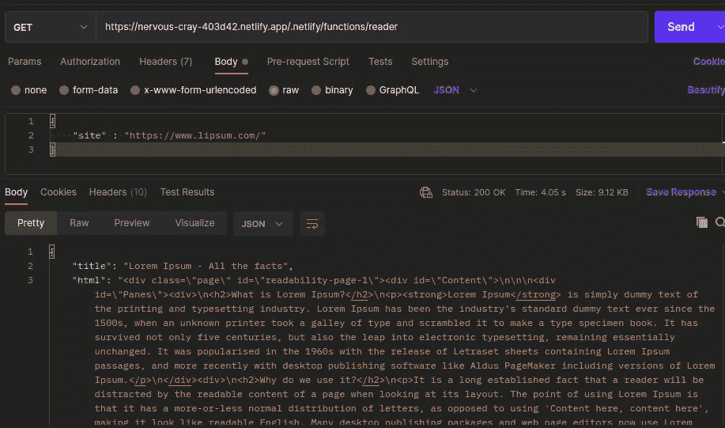

本文的结果

我们开始吧！

# 项目设置

## 克隆模板库

我们将使用 [Netlify 的启动和运行库](https://github.com/netlify/explorers-up-and-running-with-serverless-functions/tree/main)作为这个程序的基础。点击“使用此模板”克隆它

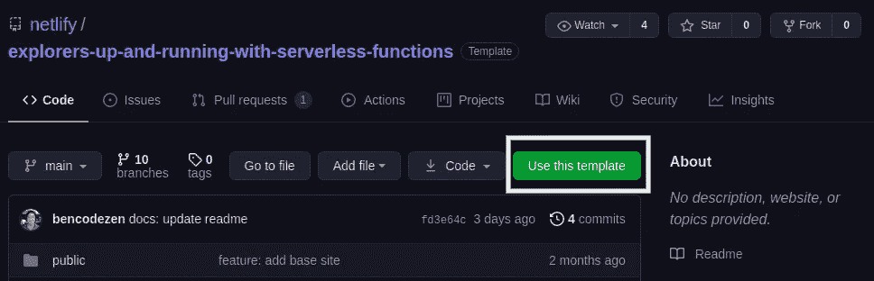

点击“使用此模板”

然后 GitHub 会让你给你的应用命名。当您为其指定名称后，单击“从该模板创建存储库”

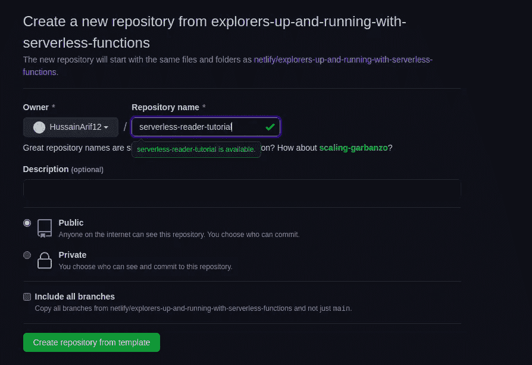

单击“从模板创建存储库”

太好了！您现在已经构建了一个项目。现在我们需要把它的代码下载到我们的机器上。

在这样做之前，我们需要告诉 Git 我们项目的位置。单击“代码”以获取此存储库的 URL。


点击“代码”获取网址

接下来，在您的计算机上运行以下终端命令:

```
git clone <url>  #url is your project location
```

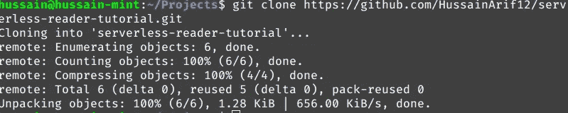

克隆到本地机器

## 获取 Netlify-CLI

第二步，我们现在需要安装 Netlify 的终端工具。为此，运行以下终端命令:

```
npm install netflify-cli -g
```

接下来，使用`ntl login`命令登录:

```
ntl login
```

在您完成登录过程之后，我们需要告诉 Netlify 用这个存储库构建一个网站。在项目文件夹中运行 bash 指令:

```
ntl init #run in project repo
```

确保您选择了以下选项:

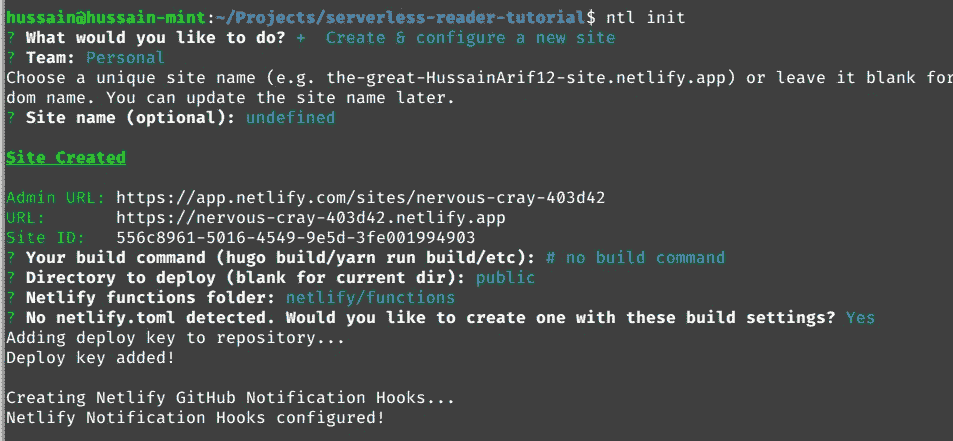

选择这些选项

现在让我们测试一下我们的配置。像这样运行您的 web 应用程序:

```
ntl dev
```

这将启动我们的 web 服务器用于开发目的。

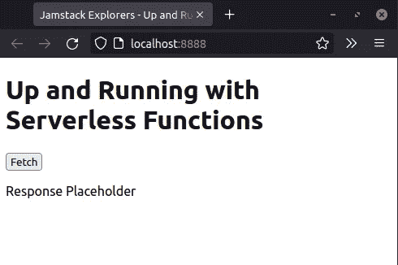

终端命令的输出

这意味着我们的配置是有效的！按下键盘上的`CTRL + C`键杀死服务器。

## 项目结构

在你的`netlify/functions`文件夹中，创建以下文件:

*   `reader.js`:函数的入口点。
*   `utils/readerUtils`:顾名思义，它将保存应用程序逻辑和其他助手方法。

最后，您的项目目录应该如下所示:

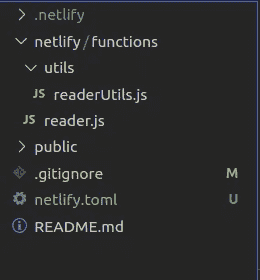

项目结构

现在是编码的时候了！

# 构建我们的应用

## 依赖项的安装

对于我们的应用程序，我们需要以下模块:

*   `@mozilla/readability`:该包将从所需页面中提取文本内容。
*   `got`:获取网站的 HTML 代码。
*   `dompurify`和`jsdom`:从页面源代码中移除恶意 JavaScript。因此，这阻止了 XSS 的攻击。

要获取这些依赖项，请运行以下命令:

```
npm init -y #initialize NPM for our project
npm install @mozilla/readability got dompurify jsdom
```

## 解析网站

在本节中，我们将创建一个函数，告诉 Node.js 从所需的 web 页面中提取主要内容。

转到您的`netlify/functions/utils/readerUtils.js`文件。这里，从编写以下代码开始:

*   第 5 行:将我们的`JSDOM`实例传递给`DOMPurify`。我们将用它来净化传入的 HTML 代码。

接下来，继续在该文件中添加以下代码:

从这段代码中可以得出一些推论:

*   第 2 行:从期望的站点获取源代码。
*   第 5–13 行:如果网站可读，解析网站并清理 HTML 代码。最后，将`title`字段和净化后的 HTML 作为响应发送给客户端。
*   第 14–15 行:否则，告诉客户端发生了错误。

## 验证输入

这里，我们将编写一个执行验证检查的方法，该方法将指示用户是否输入了有效的 URL。

为此，在`readerUtils.js`中编写以下代码:

*   第 2–10 行:创建一个简单的 regex 模式，检查输入是否为 URL 格式。
*   第 11 行:用正则表达式匹配用户输入。如果输入的字符串是 URL，该函数将返回`true`。

## 发送解析的数据

现在我们已经验证并解析了用户想要的网页，剩下的工作就是向客户端发送响应。

在`readerUtils.js`中追加以下块:

让我们一点一点地解构这段代码:

*   第 2 行:首先检查用户是否输入了有效的 URL。
*   第 3 行:运行`parseURL`方法。这里，我们使用对象析构来提取`title`、`html`和`error`字段。
*   第 4–14 行:如果流程成功，发送`title`和`html`字段作为响应。
*   第 22 行:导出`sendData`方法。这意味着我们现在可以在我们的项目中使用它。

## 将实用程序与我们的应用程序联系起来

我们现在完成了与实用程序相关的代码。现在让我们将这些函数与我们的 API 联系起来。

在`reader.js`中写入以下代码:

*   第 3 行:当用户执行`reader`方法时，这个处理程序中的所有代码都将运行。
*   第 4 行:获取请求的有效负载体。
*   第 5 行:调用`sendData`方法。我们将使用`site`属性作为它的参数。我们将结果存储在`data`变量中。
*   第 11 行:发送`data`作为对客户端的响应。

## 测试

在发布我们的 API 之前，让我们检查一下是否一切正常。要在本地运行 API，请运行以下命令:

```
ntl dev
```

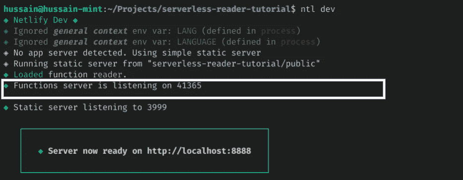

命令的输出

终端中的输出会告诉您函数服务器的位置。在我的例子中，它运行在端口`41365`上。

要向您的 API 发出请求，您必须使用以下语法:

```
localhost:{PORT}/.netlify/functions/{FUNCTION_NAME}
```

我的情况是`localhost:41365/.netlify/functions/reader`。

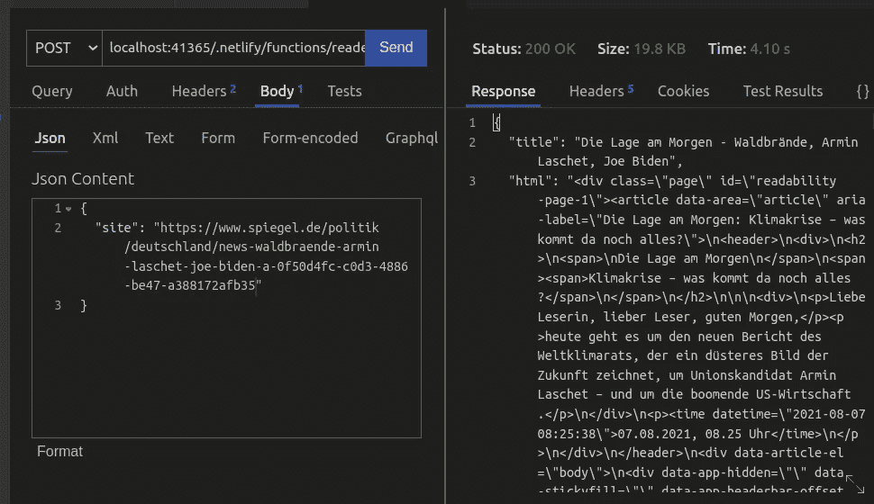

请求的结果

太好了！我们的代码有效。在本文的下一部分，您将学习如何向公众部署您的 API。

# 部署

感谢 Netlify，更新网站很容易。就像这样把你的代码推给 GitHub:

```
git add . #add to staging
git commit -m "All complete"  
git push origin main #push all code to GitHub repo
```

这将通知 Netlify 更新您的代码并将其发布到服务器。

现在回到 Netlify 的主页，选择你的网站:

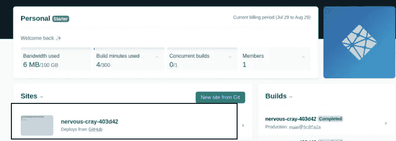

点击你的网站名称

接下来，点击“功能”这将列出与网站相关的功能。

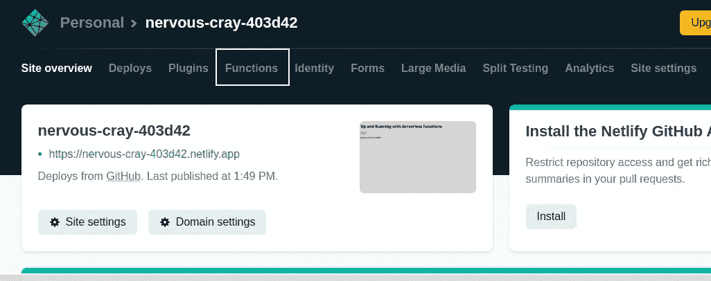

点击“功能”

选择您的函数名。我的情况是`reader`:

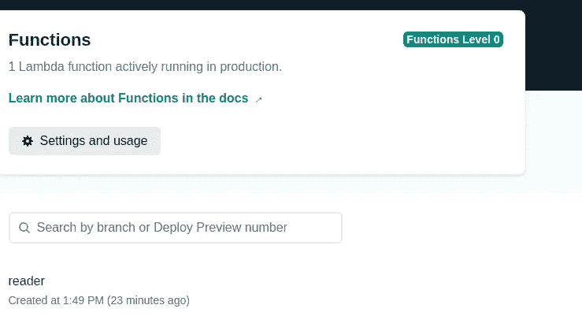

点击你的函数名

这将给你一个 API 端点来调用你的方法。

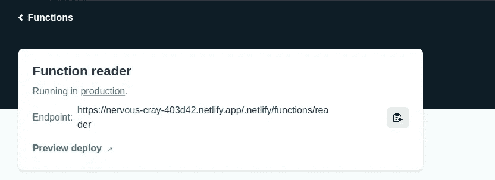

此方法的 API 端点

现在，让我们运行它！

使用 API 客户机调用 API 端点，看看是否一切正常。

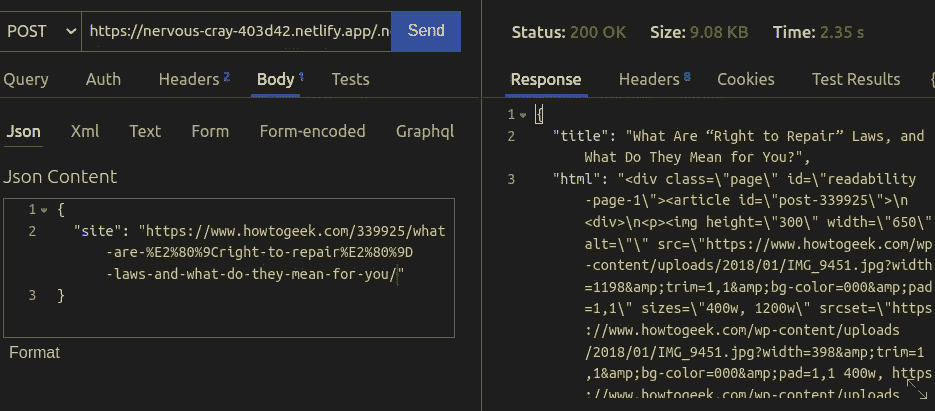

恭喜你。现在，您已经用 Netlify 构建了一个可用的无服务器功能。

# 更多资源

[这里是这个项目](https://github.com/HussainArif12/serverless-reader-tutorial)的 GitHub 库

*   [启动并运行无服务器功能— Netlify](https://explorers.netlify.com/learn/up-and-running-with-serverless-functions)
*   [创建您的第一个网络无服务器功能——Ania kubów](http://youtube.com/watch?v=n_KASTN0gUE)
*   [使用 FaunaDB 和 Netlify 无服务器函数创建书签管理器应用](https://levelup.gitconnected.com/create-a-bookmark-manager-app-using-faunadb-and-netlify-serverless-functions-7d4365652692) - [Yogesh Chavan](https://medium.com/u/24d03d066e6c?source=post_page-----ed3879cd94f3--------------------------------)
*   [从 Netlify 上的无服务器开始](/4-steps-to-get-started-with-serverless-functions-on-netlify-a6942bf071ca)—[ray ray 开发](https://medium.com/u/2d2dc3be7649?source=post_page-----ed3879cd94f3--------------------------------)

# 结论

毫无疑问，无服务器架构已经成为最近的热门话题。如果您的应用程序有突发流量，无服务器功能非常适合您。

如果你仍然对这种类型的建筑持怀疑态度，[安娜·盖勒](https://medium.com/u/5bdf5a3385cd?source=post_page-----ed3879cd94f3--------------------------------) [在她的文章](/why-many-engineers-dont-understand-the-real-use-of-serverless-df2300766aa9)中回应了这些批评。

非常感谢您的阅读！祝您愉快！