# 用 AWS Lambda 和 p5.js 构建一个无服务器应用程序

> 原文：<https://betterprogramming.pub/build-a-serverless-application-with-aws-lambda-and-p5-js-5dd571f714c1>

## 制作一个漂亮的俳句编辑器


照片由[亚历克斯·杜哈诺夫](https://unsplash.com/@argtone?utm_source=unsplash&utm_medium=referral&utm_content=creditCopyText)在 [Unsplash](https://unsplash.com/s/photos/morning?utm_source=unsplash&utm_medium=referral&utm_content=creditCopyText) 上拍摄

这个项目的目标是双重的:1)展示无服务器计算技术；2)为俳句打造极简编辑器。投入到一个真正的项目中也许是最好的学习方式。

# 为什么要有专门的编辑

我们可以使用任何文本编辑器来写作，但俳句值得一些特殊的待遇，原因如下:

*   俳句极短；我们需要一个编辑器将这首诗居中，而不是默认在左上角。
*   俳句符合 5-7-5 音节数。内置的音节计数器很有帮助，但它们在微软 Word 或谷歌 Doc 中不存在。

有了这个分析，我们的目标就明确了。

1.  编辑器允许三行文本在中间。
2.  按需音节计数器。
3.  以优雅的字体呈现。因为这是诗。

# 建筑

我们正在为音节计数器构建一个具有应用层的移动友好编辑工具。为了简单起见，我们可以使用 p5.js 来创建和托管应用程序的 web 表示。

音节计数器可以在 AWS 上使用 Lambda 和 API Gateway 实现，我们可以使用 Python 作为 Lambda 的编程语言。

# 使用 Lambda 和 API 网关的无服务器计算

AWS Lambda 是创建基于云的服务的一种经济有效的方式。对于中等流量的应用程序，Lambda 比保持虚拟机运行要便宜得多。Lambda 也易于维护和快速部署。

## 1)准备 AWS 层

Python 擅长丰富的第三方库支持。使用外部库的最佳实践是通过 AWS 层。

对于我们的项目，我们需要一个用于音节计数的外部库`syllapy`。我们需要准备一个 zip 文件来包含这个库，它将被上传到 Lambda。

让我们为`syllapy`创建一个目录，并在该目录中运行下面的命令。

```
mkdir python
cd python
pip3 install syllapy -t .cd ..
zip -r python.zip ./python
```

我们现在准备上传压缩文件到我们的 Lambda 函数。选择 Python 3.8 作为运行时，点击[创建]按钮。

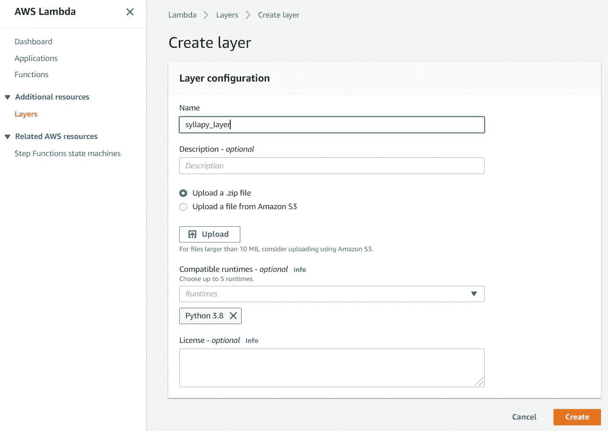

图一。创建 AWS 层

## 2)创建一个 Lambda 函数

创建一个 Lambda 函数`z3syl_count`，选择运行时 Python 3.8。

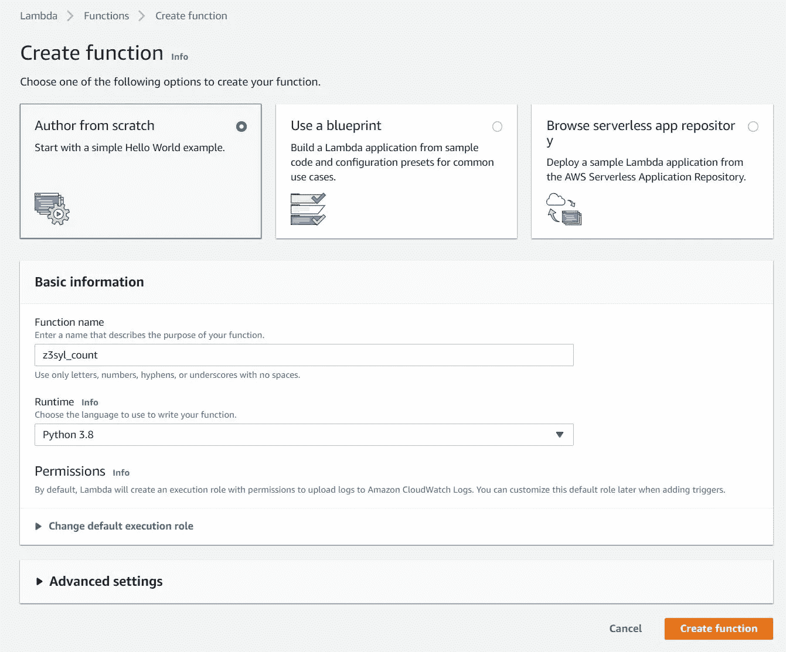

图二。Lambda ->创建函数

在 Lambda[配置][设计器]下，点击`Layers`显示图层面板。

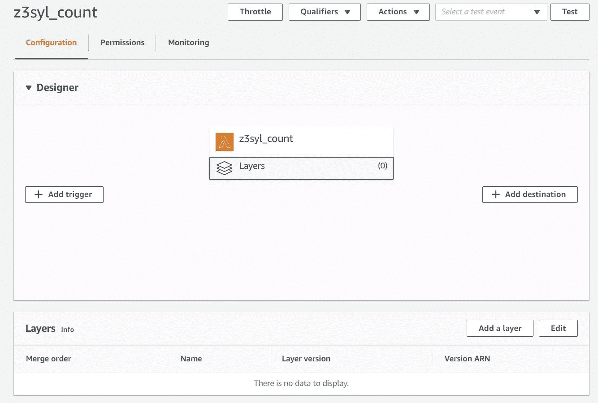

图三。lambda[配置]->[设计器]

单击[添加层]。

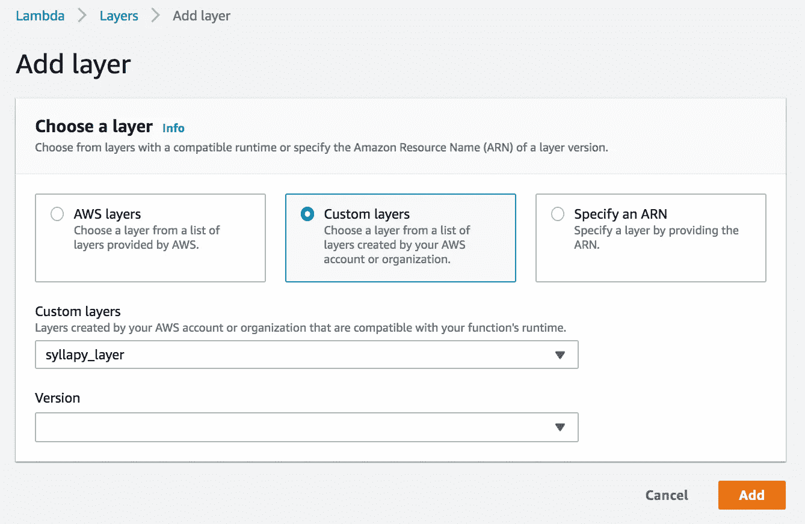

图 4。λ添加层

Python 程序非常简单。它需要一个 JSON 字符串`{‘text’:’the poem separated by \n’}`作为输入。Lambda 函数的默认入口点是`lambda_handler`，HTTP POST 数据被传递到名为`event`的参数中。

## 3)配置 REST API 网关

在 Lambda[配置][设计器]下，点击[添加触发器](如图 3)，选择[REST API]，然后点击[添加]按钮。


图五。Lambda 添加触发器

点击新创建的 API 的名称`z3syl_count-API`。


图六。AWS API 网关

配置 API 网关。我们只需要 HTTP POST。Lambda 挂在[集成请求]下。

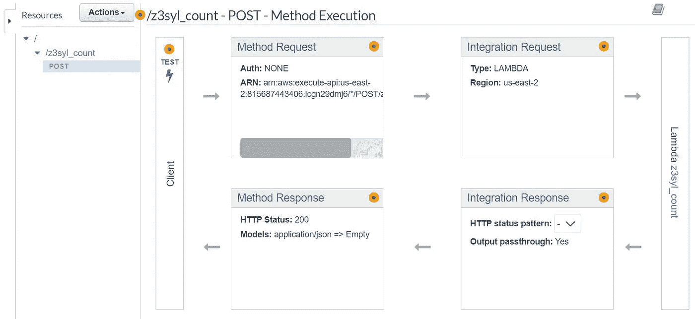

图六。AWS REST API

## 4)启用 CORS

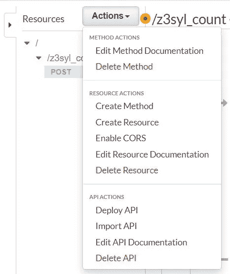

图六。API 网关:启用 CORS

**重要**:启用 CORS(跨产地资源共享)。

没有这一步，我们的应用程序将会失败。许多人在不同的场景下报告了许多与 CORS 相关的问题，而谷歌搜索返回的是混乱的结果。不要忘记这一步。

## 5)部署 API

下一步是[创建阶段]。这最终使我们的 API 准备好为世界服务。

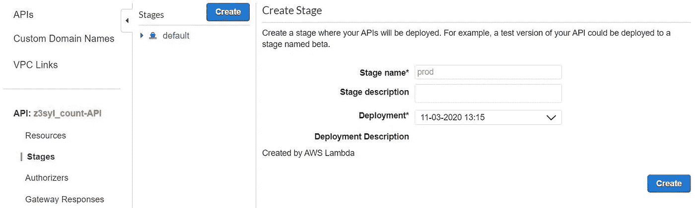

图 7。API 网关:创建阶段

在`stage`下面，我们可以找到`Invoke URL`。请注意这一点，因为我们将使用它。我们的 p5.js 程序会将俳句文本发送到这个地址进行音节计数。

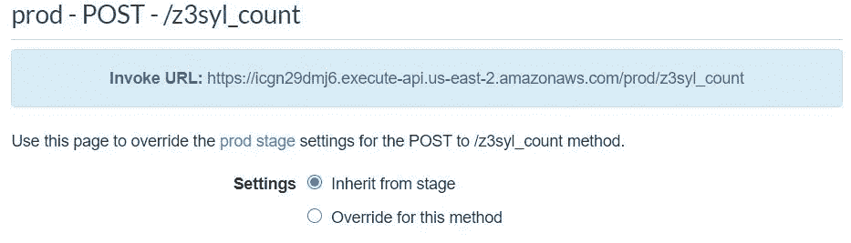

图 8。API 网关 URL

# 用 p5.js 创建用户界面

## p5.js 概述

p5.js 是流行的处理编程语言的 JavaScript 实现，由洛杉矶艺术家 Lauren McCarthy 创建。p5.js 有一个非常活跃的社区，因为它很容易上手，并且可以提供引人入胜的用户体验。

使用 p5.js，可以在 HTML 画布上轻松创建绘图和动画；也可以使用`createElement`创建 DOM(文档对象模型)元素。换句话说，p5.js 为我们提供了增强的网络体验。

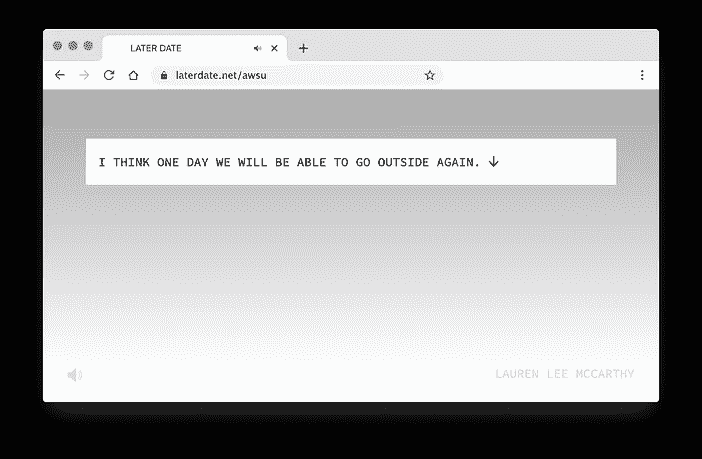

图九。[劳伦·李·麦卡锡](https://lauren-mccarthy.com/)和她使用 p5.js 的项目

## 2) p5.js 设置

开始使用 p5js 最简单的方法是使用它的在线编辑器。转到[https://editor.p5js.org/](https://editor.p5js.org/)，我们可以立即开始编写 p5js 代码。


图 10。p5js 在线编辑器

p5js 使用 HTML canvas 绘制图形。函数`setup()`运行一次，函数`draw()`开始绘图循环。

在右上角，`Sign up`为账户或`Log in`。让我们在继续之前做这个，这是一个快速的步骤。

p5.js 有很好支持的绘图功能，大部分与加工相同。我建议浏览一下文档[这里](https://p5js.org/reference/)，这样我们就知道什么是可能的。我们只有在需要的时候才会更深入。

## 3)用户界面

这是一个三行文本编辑器，居中对齐。完成第三行后，会出现一个提交按钮。提交后将显示音节计数结果。

在提交区域之外单击会隐藏音节计数结果，它还会改变诗歌的字体类型；在提交区域内单击会显示音节计数结果，并改变背景颜色。

我们可以像在 HTML 中一样使用 DOM 元素。p5.js 内置了对最常见参数的支持，比如`position`或`size`。我们可以使用`.style()`来设置 CSS 字符串。

```
m = createInput()
m.position(0.1*width,0.2*height).size(0.8*width,100)
m.style('font-size:36px;text-align:center;border:none')
```

当我们需要获得底层 DOM 对象时，我们可以使用对象的`.elt`。例如，下面一行使对象成为焦点。

```
m.elt.focus()
```

## 4) CSS 文本效果

现代 CSS 创建了一个漂亮的字体显示。我们可以为 p5.js 应用程序借用一些不错的样式表。

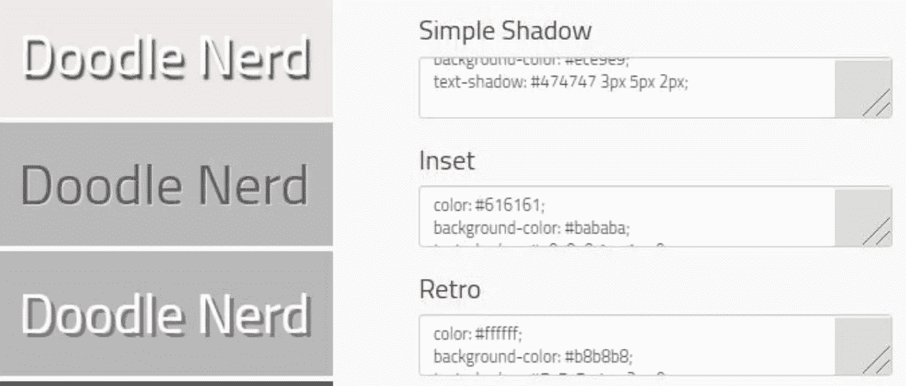

图 11。CSS 文本效果由[涂鸦呆子](http://doodlenerd.com/css-effect/css-text-effects)

## 5)环境图纸

使用 p5.js，很容易在后台进行一些环境绘图。在这里，我们随机绘制一些圆形集群来构建一些纹理。

## 6)完成 p5.js 代码

代码在 GitHub 上。

## 6)结果和实时应用

我在下面附上一些截图。很容易加入新的 CSS 样式或使用新的字体类型。我们可以很容易地分享使用 p5.js 编辑器创建的应用程序。转到[文件][共享]，复制[出席]的 URL。

你可以在这里试试现场代码[。](https://editor.p5js.org/icezee/present/Od5S-UgXX)

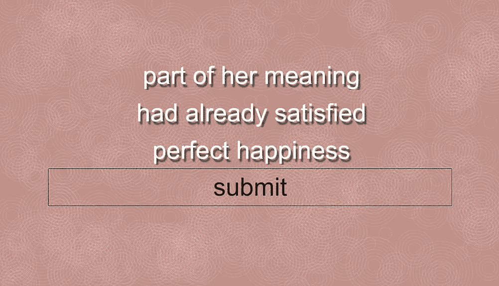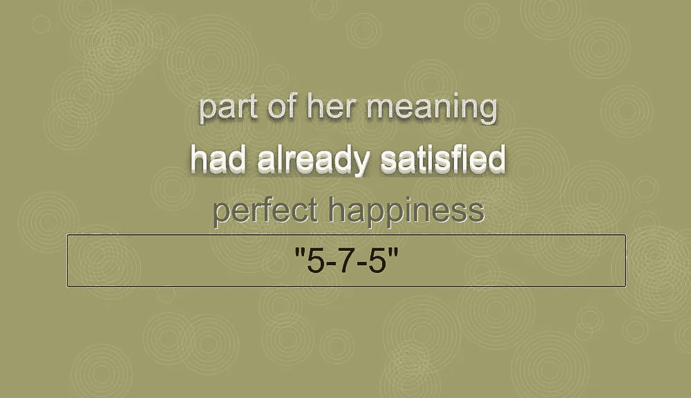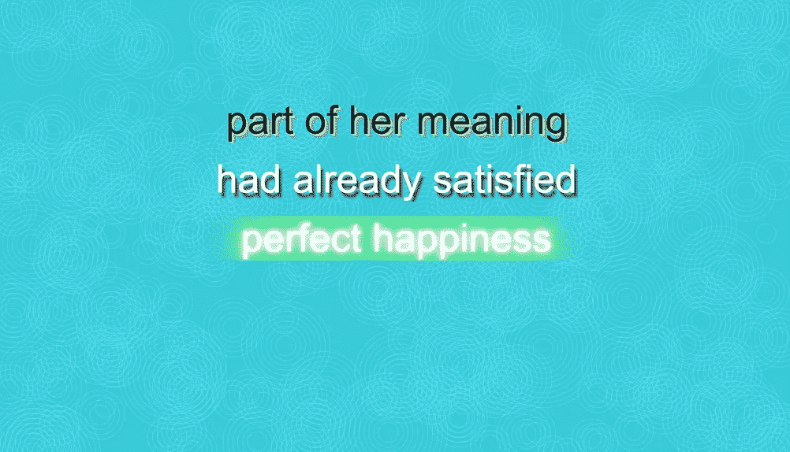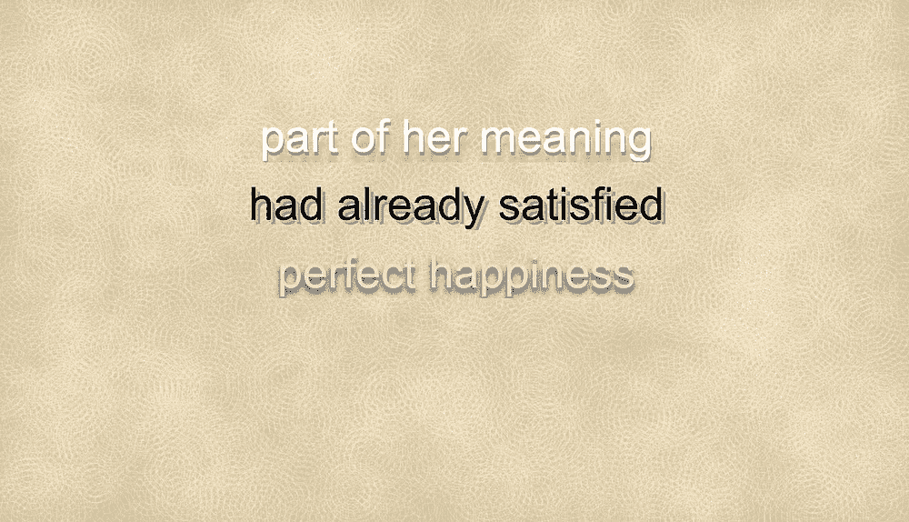

图 12。应用程序的屏幕截图

# 最终想法和要点

大多数文本编辑工具是为普通任务设计的。专门为诗歌设计编辑器感觉很特别。我将进一步开发这个应用程序成为一个 PWA(渐进式网络应用程序)，所以它可以作为一个移动应用程序安装。

这个小项目实际上是一个成熟的应用程序。具有轻量级前端的无服务器计算是快速开发基于云的应用程序的有效方式。

AWS Lambda 非常灵活，它可以轻松地扩展；Lambda 层使其强大而灵活。Python 是开发后端的绝佳选择；p5.js 可以用于 JavaScript 开发，因为它简化了项目设置，同时增加了图形特性。

干杯。