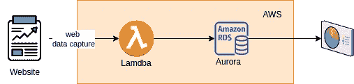
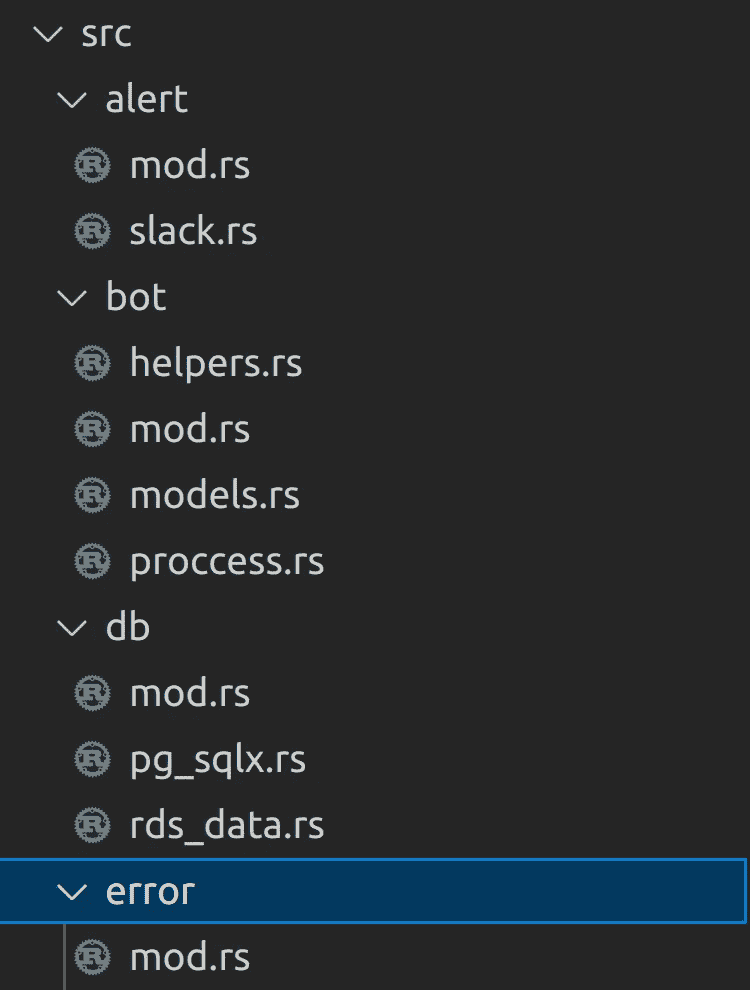

# 用 Rust 和 AWS Lambda 构建无服务器数据管道

> 原文：<https://betterprogramming.pub/build-a-serverless-data-pipeline-with-rust-and-aws-lambda-ec4e38a0ce9d>

## 我在一个周末的建设和学习中学到了什么

由[内森·杜姆劳](https://unsplash.com/@nate_dumlao?utm_source=medium&utm_medium=referral)在 [Unsplash](https://unsplash.com?utm_source=medium&utm_medium=referral) 上拍摄的照片|图像高度被更改

每个编码故事都从一个用例开始。这与我在孩子的音乐学校遇到的一个朋友有关。

最近音乐学校开始了新学期，所以像往常一样，我们在课堂上放下孩子后去了一家咖啡馆。

我的朋友很了解我:“魏对建筑材料充满热情，总是在等待的时候编码。”

他告诉我，他对股市数据分析感兴趣，所以每个工作日，他都会去一个网站，将表格中的数据复制粘贴到 Excel 中。这对他来说需要一些时间，所以他问我是否可以让它自动化。

好了，我们现在有了我们的用例！

# 功能性和非功能性需求

在一次咖啡馆深度潜水后，我很快捕捉到了一些功能性和非功能性的需求。

1.  应用程序应在周一至周五 17:00(下午 5:00)到目标网站获取数据。
2.  数据不需要转换；我们得到我们所看到的，并将其插入到数据存储中。
3.  数据可以加载到 Excel 或任何免费的 BI 工具，如 PowerBI 桌面免费版。

对于非功能性需求—

1.  如果应用程序成功或失败，用户应该得到一个警告。
2.  没有为每次运行定义 SLA。
3.  我们不应该在基础设施成本上花很多钱。

这些要求非常简单。

我需要详细说明这些功能性需求和非功能性需求收集阶段的重要性。在现实世界中，这将由业务分析以及与工程和业务伙伴的合作来驱动。

> 无论瀑布式还是敏捷式，BSA 的作用都不应该被忽视或削弱。

> 我会做一些笔记，并在以后关于这个话题的写作中更多地双击它。

# 架构和应用程序设计

基于功能需求和非功能需求，

1.  这个应用程序每周只运行五次
2.  数据收集量相当小
3.  成本需要低；通常，我会利用 Heroku 的免费层；不幸的是，从今年 11 月开始，免费层将走到生命的尽头。

凭借其开箱即用的内存安全性和性能，Rust 与无服务器架构完美契合。

> 无服务器+ Rust 自然适合这种类型的用例。

## 什么是无服务器架构？

无服务器架构是一种无需管理基础设施即可构建和运行应用程序和服务的方式。

您的应用程序仍然在服务器上运行，但是云提供商管理所有的服务器。

您不再需要调配、扩展和维护服务器来运行您的应用程序、数据库和存储系统。

作者署名

如你所见，我们使用 AWS cloud lambda 作为 app 运行时，使用 AWS RDS Aurora 无服务器数据库(托管)；根据您的需要，您还可以选择其他云管理的数据库服务，如 Heroku 或 DigitalOcean。

> 你可能需要记住三件事:
> 
> 1.当您决定使用托管数据库时，您将会小心成本，并且您需要确保尽可能地优化代码/查询，并设置适当的预算警报。你不会想在突然收到一张大额账单的情况下结束。
> 
> 2.在企业级实现中，你可能需要考虑更安全的方面，比如 lambda 和数据库应该位于不同的 VPC 等。
> 
> 3.在实际生产中，我们还需要考虑控制表来监控作业的执行状态(成功或失败)。

对于演示性质，我们将保持它的样本。

# 应用设计

应用组件—按作者分类

基于关键的功能需求，我们可以如下构建我们的应用程序，反映我们的代码结构。

代码结构—作者署名

# 让我们编码

这个应用程序的核心组件是机器人；让我们为它构建结构。

核心结构—作者署名

## 误差分量

它是我们在项目中使用的所有不同 libs 包的翻译器，并且它是针对所需的应用程序集中和标准化的。

AppError 实现—作者署名

## 对于警报

在我以前的一篇文章中，我们使用 Twilio API 发送警报。

 [## 建立一个短信警报系统，为加拿大新冠肺炎案件在周末与铁锈和零成本

### 周末建设和学习

towardsdatascience.com。](https://towardsdatascience.com/build-an-sms-alert-system-for-canada-covid-19-cases-over-the-weekend-with-rust-and-zero-cost-235bb59ec5d) 

看起来我们在设计中使用了带有策略模式的 trait 实现，这对于我们使用 Slack webhook 来实现是很容易的。

警报策略模式实现—作者署名

## 对于数据库实现

我们将使用模拟模式，如果用户将来想从不同的数据库引擎切换(通常不需要)，这种模式提供了灵活性。

数据库实施—作者署名

## 对于核心处理器实现

核心处理器—作者署名

实现非常简单。

1.  `New()`和`Run()`函数是两个公共函数，可以从 main 调用。
2.  对于`Run()`函数将采取顺序方式执行:`get_data_from_url()`、`process_data()`、`insert()`，这些都是私有函数。

让我们把它放在一起，从`main()`开始触发。代码如下:

到目前为止，你会问，“等一下，Lambda 的实现在哪里？”。

为了方便我们的开发过程，我们首先使用 main.rs 作为开发属性。一旦成功运行，让我们用 AWS 的`lambda_runtime`机箱构建 Lambda 函数。

为了构建 AWS 的 lambda 二进制文件，我们可以在我们的`Cargo.toml`文件中添加 bin 名称。

货物的 lambda 二进制—作者署名

然后，我们可以按如下方式构建二进制文件:

# 奖金— CI/CD

我们将通过 GitHub Action 构建 CI/CD，以便于构建和部署。

CI/CD —作者署名

我们主要从用例初始化、应用程序架构、应用程序设计和逻辑代码遍历的角度了解了构建 AWS lambda 的 Rust 方法。

我希望你喜欢它。