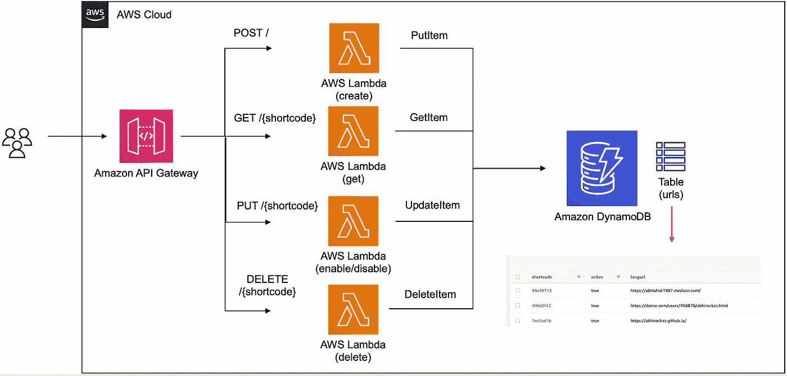
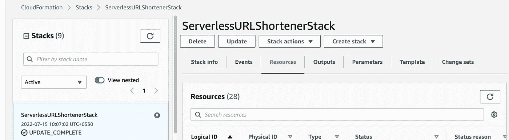
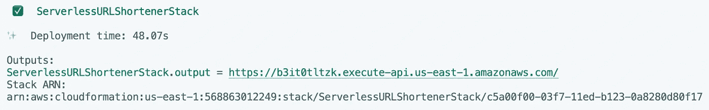
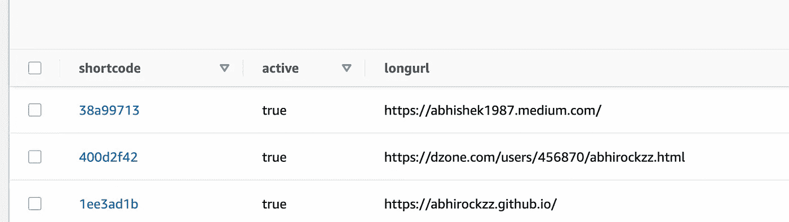

# 用 Go 建立一个无服务器的网址缩写器

> 原文：<https://betterprogramming.pub/build-a-serverless-url-shortener-with-go-ca198cb4d627>

## 使用 AWS Lambda、DynamoDB 和 API 网关


由[麦克斯韦·纳尔逊](https://unsplash.com/@maxcodes?utm_source=medium&utm_medium=referral)在 [Unsplash](https://unsplash.com?utm_source=medium&utm_medium=referral) 上拍摄的照片

这篇博文讲述了如何使用 [Go](https://go.dev/) 构建一个无服务器的 URL shortener 应用程序。它利用 [AWS Lambda](https://docs.aws.amazon.com/lambda/latest/dg/welcome.html) 实现业务逻辑，利用 [DynamoDB](https://docs.aws.amazon.com/amazondynamodb/latest/developerguide/Introduction.html) 实现持久性，利用 [API Gateway](https://docs.aws.amazon.com/apigateway/latest/developerguide/welcome.html) 提供 HTTP 端点来访问和使用应用程序。这篇博客中展示的示例应用程序是`bit.ly`或您可能使用过或遇到过的其他解决方案的精简版本。

它的结构如下:

*   我将从一个简单的介绍开始，深入探讨如何部署和尝试这个解决方案。
*   之后，我将关注代码本身。这将包括:
*   用于编写基础结构的部分(为 AWS CDK 使用 Go 绑定)
*   以及包含 Lambda 函数(使用 Lambda Go 支持)和 DynamoDB 操作(使用 DynamoDB Go SDK)的核心业务逻辑

在这篇博客中，你将了解到:

*   如何使用 [DynamoDB Go SDK](https://pkg.go.dev/github.com/aws/aws-sdk-go-v2/service/dynamodb) (v2)执行`PutItem`、`GetItem`、`UpdateItem`、`DeleteItem`等 CRUD 操作
*   如何使用 [AWS CDK Go](https://docs.aws.amazon.com/cdk/v2/guide/work-with-cdk-go.html) 绑定来部署无服务器应用程序，以创建和管理`DynamoDB`表、Lambda 函数、API 网关以及其他组件。

一旦您部署了应用程序，您将能够使用 API 网关公开的端点为 URL 创建短代码，并且还能够访问它们。

```
*# create short code for a URL (e.g. https://abhirockzz.github.io/)*
curl -i -X POST -d 'https://abhirockzz.github.io/' -H 'Content-Type: text/plain' $URL_SHORTENER_APP_URL*# access URL via short code*
curl -i $URL_SHORTENER_APP_URL/<short-code>
```



无服务器 URL 缩短程序(在 AWS 上运行)

# 让我们开始—部署应用程序

在你继续之前，确保你已经安装了 [Go 编程语言](https://go.dev/dl/)(1.16 或更高版本)和 [AWS CDK](https://docs.aws.amazon.com/cdk/v2/guide/getting_started.html#getting_started_install) 。

克隆项目并将其更改到正确的目录:

```
git clone https://github.com/abhirockzz/serverless-url-shortener-golang
cd cdk
```

要开始部署…

..您所要做的就是运行一个命令(`cdk deploy`)，然后等待一会儿。您将看到一个(很长的)将要创建的资源列表，需要您确认才能继续。

不要担心，在下一部分，我将解释发生了什么。

```
cdk deploy*# output*Bundling asset ServerlessURLShortenerStack1/create-url-function/Code/Stage...
Bundling asset ServerlessURLShortenerStack1/access-url-function/Code/Stage...
Bundling asset ServerlessURLShortenerStack1/update-url-status-function/Code/Stage...
Bundling asset ServerlessURLShortenerStack1/delete-url-function/Code/Stage...✨  Synthesis time: 10.28sThis deployment will make potentially sensitive changes according to your current security approval level (--require-approval broadening).
Please confirm you intend to make the following modifications:
.......Do you wish to deploy these changes (y/n)?
```

这将开始创建我们的应用程序所需的 AWS 资源。

> *如果您想查看将在后台使用的 AWS CloudFormation 模板，运行* `*cdk synth*` *并检查* `*cdk.out*` *文件夹*

您可以在终端中跟踪进度或导航到 AWS 控制台:`CloudFormation > Stacks > ServerlessURLShortenerStack`



自动气象站云形成堆栈

一旦创建了所有的资源，您就可以试用这个应用程序了。你应该有:

*   四个 Lambda 函数(及相关资源)
*   电动工作台
*   API 网关(以及路由和集成)
*   以及其他一些人(如我的角色等。)

在继续之前，获取您将需要使用的 API 网关端点。它在堆栈输出中可用(在终端或 AWS CloudFormation 控制台的`Outputs`选项卡中，用于您的堆栈):



自动气象站 CDK 输出

# 缩短一些网址！

**从为几个 URL 生成短代码开始**

```
*# export the API Gateway endpoint*
export URL_SHORTENER_APP_URL=<replace with apigw endpoint above>*# for example:*
export URL_SHORTENER_APP_URL=https://b3it0tltzk.execute-api.us-east-1.amazonaws.com/*# invoke the endpoint to create short codes*
curl -i -X POST -d 'https://abhirockzz.github.io/' -H 'Content-Type: text/plain' $URL_SHORTENER_APP_URLcurl -i -X POST -d 'https://dzone.com/users/456870/abhirockzz.html' -H 'Content-Type: text/plain' $URL_SHORTENER_APP_URLcurl -i -X POST -d 'https://abhishek1987.medium.com/' -H 'Content-Type: text/plain' $URL_SHORTENER_APP_URL
```

要生成一个简短的代码，您需要在有效负载正文中传递原始 URL，作为 HTTP POST 请求的一部分(例如`[https://abhishek1987.medium.com/](https://abhishek1987.medium.com/))` [)](https://abhishek1987.medium.com/))

> *‘Content-Type:text/plain’很重要，否则 API Gateway 会对您的有效负载进行* `*base64*` *编码*

如果一切顺利，您应该在 HTTP 响应中获得一个`HTTP 201`和简短代码(作为 JSON 有效负载)。

```
HTTP/2 201 
date: Fri, 15 Jul 2022 13:03:20 GMT
content-type: text/plain; charset=utf-8
content-length: 25
apigw-requestid: VTzPsgmSoAMESdA={"short_code":"1ee3ad1b"}
```

要确认这一点，请查看 DynamoDB 表。



DynamoDB 表记录

> *注意一个* ***活动的*** *属性在那里？更多详情请见*

## **使用短代码**访问网址

像 bit.ly 等服务。你通常会为你的 URL 创建短链接，并与全世界分享。我们会做类似的事情。现在你已经生成了简短的代码，你可以分享这个链接了(它并不像 bit.ly 那样是一个很短的链接，但是现在还可以！)并且一旦他们访问它，他们将看到原始的 URL。

访问链接将具有以下格式— `<URL_SHORTENER_APP_URL>/<generated short code>`例如[https://B3 it 0 tlzk . execute-API . us-east-1 . Amazon AWS . com/1e E3 ad1 b](https://b3it0tltzk.execute-api.us-east-1.amazonaws.com/1ee3ad1b)

如果您使用浏览器导航到该链接，您将被自动重定向到您指定的原始 URL。要查看发生了什么，请对`curl`进行同样的尝试:

```
curl -i $URL_SHORTENER_APP_URL/<short code>*# example*
curl -i [https://b3it0tltzk.execute-api.us-east-1.amazonaws.com/0e1785b1](https://b3it0tltzk.execute-api.us-east-1.amazonaws.com/0e1785b1)
```

这只是一个`HTTP GET`的请求。如果一切顺利，您应该会得到一个`HTTP 302`响应(`StatusFound`)，并且 URL 会由于包含原始 URL 的 Location HTTP 头而发生重定向。

```
HTTP/2 302 
date: Fri, 15 Jul 2022 13:08:54 GMT
content-length: 0
location: https://abhirockzz.github.io/
apigw-requestid: VT0D1hNLIAMES8w=
```

> *用一个不存在的短码怎么样？*

## **设置状态**

您可以启用和禁用短码。只有当关联处于活动状态时，才能访问原始 URL。

要禁用短代码:

```
curl -i -X PUT -d '{"active": false}'  -H 'Content-Type: application/json' $URL_SHORTENER_APP_URL/<short code>*# example*
curl -i -X PUT -d '{"active": false}'  -H 'Content-Type: application/json' [https://b3it0tltzk.execute-api.us-east-1.amazonaws.com/1ee3ad1b](https://b3it0tltzk.execute-api.us-east-1.amazonaws.com/1ee3ad1b)
```

这是一个带有 JSON 有效负载的`HTTP PUT`请求，该有效负载指定了状态(`false`在本例中是指禁用)和 shortcode，short code 是指向 API 网关端点的路径参数。如果一切正常，您应该会看到 HTTP 204(无内容)响应:

```
HTTP/2 204 
date: Fri, 15 Jul 2022 13:15:41 GMT
apigw-requestid: VT1Digy8IAMEVHw=
```

检查 DynamoDB 记录—活动属性必须已经切换到`false`。

> 作为练习，请尝试以下方法:
> 
> -现在通过相同的短代码访问 URL 并检查响应。
> 
> -访问无效的短代码，即不存在的代码
> 
> -启用禁用的 URL(使用`{"active": true}`)

好了，到目前为止，我们已经介绍了除删除之外的所有操作。让我们试试这个，然后结束这个`CRUD`！

## **删除**

```
curl -i -X DELETE $URL_SHORTENER_APP_URL/<short code>*# example*
curl -i -X DELETE [https://b3it0tltzk.execute-api.us-east-1.amazonaws.com/1ee3ad1b](https://b3it0tltzk.execute-api.us-east-1.amazonaws.com/1ee3ad1b)
```

没什么好惊讶的。我们使用一个`HTTP DELETE`和短代码。就像在更新的情况下，您应该得到一个`HTTP 204`响应:

```
HTTP/2 204 
date: Fri, 15 Jul 2022 13:23:36 GMT
apigw-requestid: VT2NzgjnIAMEVKA=
```

但是这一次，当然，DynamoDB 记录应该已经被删除——确认相同。

> *当你试图删除一个不存在的短代码时会发生什么？*

# 别忘了打扫卫生！

完成后，要删除所有服务，只需使用:

```
cdk destroy
```

好了，现在您已经实际看到了应用程序“做什么”,让我们继续讨论“如何做”。我们将从 AWS CDK 代码开始，探索它是如何为我们的无服务器 URL shortener 服务设置基础设施的。

# 有了 AWS CDK，基础设施就是代码！

你可以在[这个 GitHub repo](https://github.com/abhirockzz/serverless-url-shortener-golang/tree/master/cdk) 里查看代码。我将向您介绍定义我们的 CDK 应用程序的主要部分的`NewServerlessURLShortenerStack`函数的关键部分。

> *为了简洁起见，我省略了一些代码*

我们首先创建一个`DynamoDB`表。为此只需要一个主键——在这个例子中是`shortcode`(在这个例子中我们没有[范围/排序键](https://docs.aws.amazon.com/amazondynamodb/latest/developerguide/HowItWorks.CoreComponents.html#HowItWorks.CoreComponents.PrimaryKey))

```
dynamoDBTable := awsdynamodb.NewTable(stack, jsii.String("url-shortener-dynamodb-table"),
		&awsdynamodb.TableProps{
			PartitionKey: &awsdynamodb.Attribute{
				Name: jsii.String(shortCodeDynamoDBAttributeName),
				Type: awsdynamodb.AttributeType_STRING}})
```

然后，我们只用一行代码就创建了一个 [API 网关(HTTP API)](https://docs.aws.amazon.com/apigateway/latest/developerguide/http-api.html) ！

```
urlShortenerAPI := awscdkapigatewayv2alpha.NewHttpApi(stack, jsii.String("url-shortner-http-api"), nil)
```

我们继续看第一个为 URL 创建短代码的 Lambda 函数。注意，我们使用了一个实验模块`[awscdklambdagoalpha](https://pkg.go.dev/github.com/aws/aws-cdk-go/awscdklambdagoalpha/v2)`(这里的[是撰写本文时的稳定版本](https://pkg.go.dev/github.com/aws/aws-cdk-go/awscdk/v2/awslambda))。如果你的 Go 项目是以一种特定的方式构建的([细节在此](https://pkg.go.dev/github.com/aws/aws-cdk-go/awscdklambdagoalpha/v2#readme-go-function))，并且你用`Entry`指定它的路径，它会自动负责构建、打包和部署你的 Lambda 函数！一点都不差！

> *除了*[](https://pkg.go.dev/github.com/aws/aws-cdk-go/awscdklambdagoalpha/v2#readme-local-bundling)**(如本例所用)，还支持* [*基于 Docker 构建*](https://pkg.go.dev/github.com/aws/aws-cdk-go/awscdklambdagoalpha/v2#readme-docker) *。**

```
*createURLFunction := awscdklambdagoalpha.NewGoFunction(stack, jsii.String("create-url-function"),
		&awscdklambdagoalpha.GoFunctionProps{
			Runtime:     awslambda.Runtime_GO_1_X(),
			Environment: funcEnvVar,
			Entry:       jsii.String(createShortURLFunctionDirectory)}) dynamoDBTable.GrantWriteData(createURLFunction)*
```

*最后，我们通过创建一个 [Lambda-HTTP API 集成](https://docs.aws.amazon.com/apigateway/latest/developerguide/http-api-develop-integrations-lambda.html)(注意 Lambda 函数变量`createURLFunction`是如何被引用的)和[向我们已经创建的 HTTP API](https://docs.aws.amazon.com/apigateway/latest/developerguide/http-api-develop-routes.html) 添加一个路由来添加最后一点管道——这反过来又指的是 Lambda 集成。*

```
*createFunctionIntg := awscdkapigatewayv2integrationsalpha.NewHttpLambdaIntegration(jsii.String("create-function-integration"), createURLFunction, nil) urlShortenerAPI.AddRoutes(&awscdkapigatewayv2alpha.AddRoutesOptions{
		Path:        jsii.String("/"),
		Methods:     &[]awscdkapigatewayv2alpha.HttpMethod{awscdkapigatewayv2alpha.HttpMethod_POST},
		Integration: createFunctionIntg})*
```

*这只是一个功能，我们还有三个功能。好的方面是所有这些的模板都是相似的，即*

1.  *创建函数*
2.  *授予 DynamoDB 的权限*
3.  *用 API 网关连接(使用正确的 HTTP 方法，即`POST`、`PUT`、`DELETE`)*

*所以我不会在这里重复。请随意浏览其余的代码。*

*现在，您已经理解了“一键式”基础设施设置背后的魔力，让我们继续讨论应用程序的核心逻辑。*

# *URL 缩写 Lambda 函数和 DynamoDB 逻辑*

*有四种不同的功能，它们都在各自的文件夹中，并且在操作方式上有一些共同点:*

1.  *它们做一些初始处理——处理有效负载，或者从 URL 中提取路径参数等等。*
2.  *调用一个[公共数据库层](https://github.com/abhirockzz/serverless-url-shortener-golang/blob/master/db/db.go)——来执行 CRUD 功能(很快会有更多相关内容)*
3.  *适当地处理错误并返回响应*

*有了这些知识，遵循代码应该很容易。*

> **和以前一样，为了简洁起见，代码的某些部分被省略了**

## ***创建网址***

```
*func handler(ctx context.Context, req events.APIGatewayV2HTTPRequest) (events.APIGatewayV2HTTPResponse, error) {
	url := req.Body shortCode, err := db.SaveURL(url)
	if err != nil {*//..handle error}* response := Response{ShortCode: shortCode}
	respBytes, err := json.Marshal(response)
	if err != nil {*//..handle error}* return events.APIGatewayV2HTTPResponse{StatusCode: http.StatusCreated, Body: string(respBytes)}, nil
}*
```

*这个函数从读取`HTTP`请求体的有效载荷开始——这是一个`string`,它包含为其创建短代码的 URL。它调用数据库层尝试将该记录保存到 DynamoDB 并处理错误。最后，它返回一个带有短代码的 JSON 响应。*

*下面是实际上与 DynamoDB 交互以完成工作的函数。*

```
*func SaveURL(longurl string) (string, error) {
	shortCode := uuid.New().String()[:8] item := make(map[string]types.AttributeValue) item[longURLDynamoDBAttributeName] = &types.AttributeValueMemberS{Value: longurl}
	item[shortCodeDynamoDBAttributeName] = &types.AttributeValueMemberS{Value: shortCode}
	item[activeDynamoDBAttributeName] = &types.AttributeValueMemberBOOL{Value: true} _, err := client.PutItem(context.Background(), &dynamodb.PutItemInput{
		TableName: aws.String(table),
		Item:      item}) if err != nil {*//..handle error}* return shortCode, nil
}*
```

*对于这个示例应用程序，短代码是通过生成一个`UUID`并删除最后 8 位数字来创建的。很容易用另一种技术来代替它——重要的是生成一个可以作为短代码工作的唯一字符串。然后，它将调用带有所需数据的 [PutItem API](https://pkg.go.dev/github.com/aws/aws-sdk-go-v2/service/dynamodb#Client.PutItem) 。*

## ***访问网址***

```
*func handler(ctx context.Context, req events.APIGatewayV2HTTPRequest) (events.APIGatewayV2HTTPResponse, error) { shortCode := req.PathParameters[pathParameterName]
	longurl, err := db.GetLongURL(shortCode) if err != nil {*//..handle error}* return events.APIGatewayV2HTTPResponse{StatusCode: http.StatusFound, Headers: map[string]string{locationHeader: longurl}}, nil
}*
```

*当有人访问短链接时(如前一节所示)，短代码作为路径参数传入，例如`http://<api gw url>/<short code>`。调用数据库层从`DynamoDB`表中获取相应的 URL(根据需要处理错误)。*

*最后，响应返回给用户，其中状态代码是`302`，URL 在 Location 头中传递。当您输入短代码(在浏览器中)时，它会将您重定向到原始 URL*

*下面是 DynamoDB 调用:*

```
*func GetLongURL(shortCode string) (string, error) { op, err := client.GetItem(context.Background(), &dynamodb.GetItemInput{
		TableName: aws.String(table),
		Key: map[string]types.AttributeValue{
			shortCodeDynamoDBAttributeName: &types.AttributeValueMemberS{Value: shortCode}}}) if err != nil {*//..handle error}* if op.Item == nil {
		return "", ErrUrlNotFound
	} activeAV := op.Item[activeDynamoDBAttributeName]
	active := activeAV.(*types.AttributeValueMemberBOOL).Value if !active {
		return "", ErrUrlNotActive
	} longurlAV := op.Item[longURLDynamoDBAttributeName]
	longurl := longurlAV.(*types.AttributeValueMemberS).Value return longurl, nil
}*
```

*第一步是使用 [GetItem API](https://pkg.go.dev/github.com/aws/aws-sdk-go-v2/service/dynamodb#Client.GetItem) 获取包含 URL 和对应于短代码的状态的`DynamoDB`记录。如果响应中的`item`对象是`nil`，我们可以确定具有该短代码的记录*不*存在——我们返回一个自定义错误，这对我们的函数很有帮助，然后函数可以向 API 的调用者返回一个适当的响应(例如一个`HTTP 404`)。我们还检查状态(活动或非活动)，如果活动设置为`false`，则返回一个错误。如果一切正常，URL 将返回给调用者。*

## ***更新状态***

```
*func handler(ctx context.Context, req events.APIGatewayV2HTTPRequest) (events.APIGatewayV2HTTPResponse, error) { var payload Payload
	reqBody := req.Body err := json.Unmarshal([]byte(reqBody), &payload)
	if err != nil {*//..handle error}* shortCode := req.PathParameters[pathParameterName] err = db.Update(shortCode, payload.Active)
	if err != nil {*//..handle error}* return events.APIGatewayV2HTTPResponse{StatusCode: http.StatusNoContent}, nil
}*
```

*第一步是封送 HTTP 请求有效负载，它是一个 JSON，例如`{"active": false}`，然后从 path 参数中获取短代码。调用数据库层来更新状态和处理错误。*

```
*func Update(shortCode string, status bool) error { update := expression.Set(expression.Name(activeDynamoDBAttributeName), expression.Value(status))
	updateExpression, _ := expression.NewBuilder().WithUpdate(update).Build() condition := expression.AttributeExists(expression.Name(shortCodeDynamoDBAttributeName))
	conditionExpression, _ := expression.NewBuilder().WithCondition(condition).Build() _, err := client.UpdateItem(context.Background(), &dynamodb.UpdateItemInput{
		TableName: aws.String(table),
		Key: map[string]types.AttributeValue{
			shortCodeDynamoDBAttributeName: &types.AttributeValueMemberS{Value: shortCode}},
		UpdateExpression:          updateExpression.Update(),
		ExpressionAttributeNames:  updateExpression.Names(),
		ExpressionAttributeValues: updateExpression.Values(),
		ConditionExpression:       conditionExpression.Condition(),
	}) if err != nil && strings.Contains(err.Error(), "ConditionalCheckFailedException") {
		return ErrUrlNotFound
	} return err
}*
```

*[UpdateItem API](https://pkg.go.dev/github.com/aws/aws-sdk-go-v2/service/dynamodb#Client.UpdateItem) 调用负责更改状态。这相当简单，除了你需要的所有这些`expressions`——特别是如果你是这个概念的新手。第一个(强制的)是更新表达式，您可以在其中指定需要设置的属性(在本例中是活动的)及其值。第二个确保您正在更新表中实际存在的短代码的状态。这很重要，因为，否则`UpdateItem` API 调用将插入一个新的项目(我们不希望这样！).我们使用[表达式](https://pkg.go.dev/github.com/aws/aws-sdk-go-v2/feature/dynamodb/expression)包，而不是手工推出表达式。*

## ***删除短代码***

```
*func handler(ctx context.Context, req events.APIGatewayV2HTTPRequest) (events.APIGatewayV2HTTPResponse, error) { shortCode := req.PathParameters[pathParameterName] err := db.Delete(shortCode)
	if err != nil {*//..handle error}*
	return events.APIGatewayV2HTTPResponse{StatusCode: http.StatusNoContent}, nil
}*
```

*删除处理程序也不例外。从 path 参数中提取出要删除的短代码后，调用数据库层将其从 DynamoDB 表中删除。返回给用户的结果要么是一个`HTTP 204`(成功)，要么是错误。*

```
*func Delete(shortCode string) error { condition := expression.AttributeExists(expression.Name(shortCodeDynamoDBAttributeName))
	conditionExpression, _ := expression.NewBuilder().WithCondition(condition).Build() _, err := client.DeleteItem(context.Background(), &dynamodb.DeleteItemInput{
		TableName: aws.String(table),
		Key: map[string]types.AttributeValue{
			shortCodeDynamoDBAttributeName: &types.AttributeValueMemberS{Value: shortCode}},
		ConditionExpression:       conditionExpression.Condition(),
		ExpressionAttributeNames:  conditionExpression.Names(),
		ExpressionAttributeValues: conditionExpression.Values()}) if err != nil && strings.Contains(err.Error(), "ConditionalCheckFailedException") {
		return ErrUrlNotFound
	} return err
}*
```

*就像`UpdateItem` API 一样， [DeleteItem](https://pkg.go.dev/github.com/aws/aws-sdk-go-v2/service/dynamodb#Client.DeleteItem) API 也接受一个条件表达式。如果 DynamoDB 表中没有给定短代码的记录，将返回一个错误。否则，记录将被删除。*

*代码演练到此结束！*

# *包裹*

*在这篇博文中，您通过一个 URL Shortener 样例应用程序学习了如何使用 DynamoDB Go SDK。您还将它与 AWS Lambda 和 API Gateway 集成在一起，构建了一个无服务器解决方案，其基础架构也是使用*实际*代码定义的(与`yaml`、JSON 等相反)。)，感谢 AWS CDK 中的 Go 支持。*