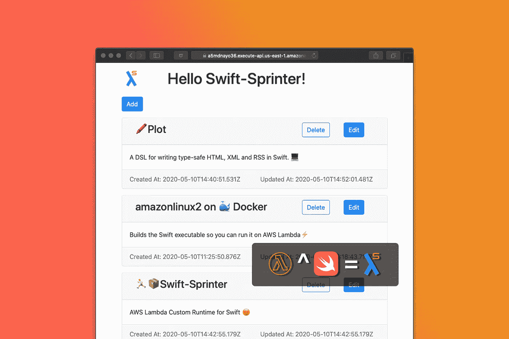
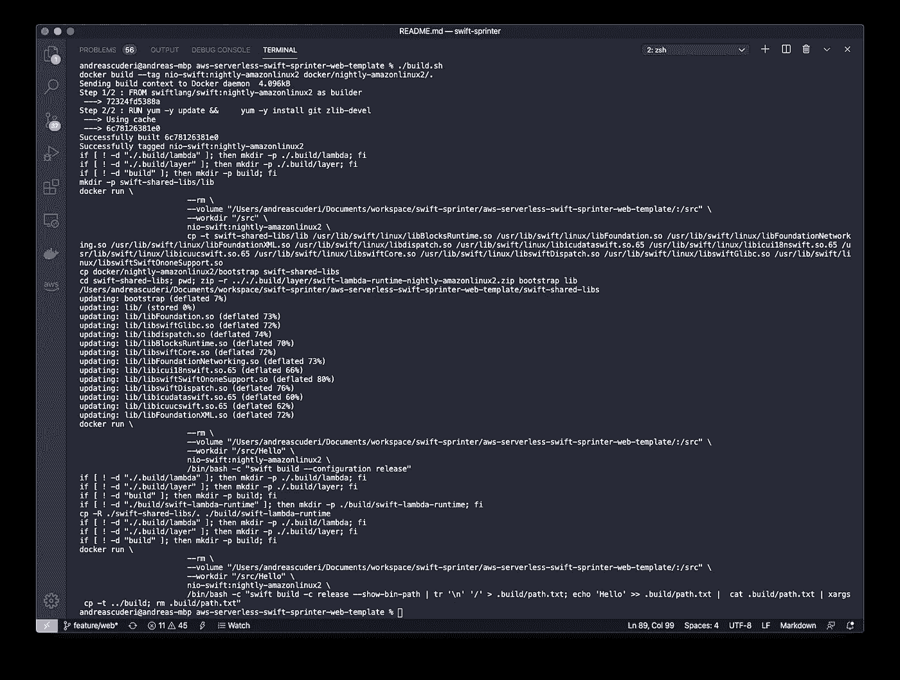
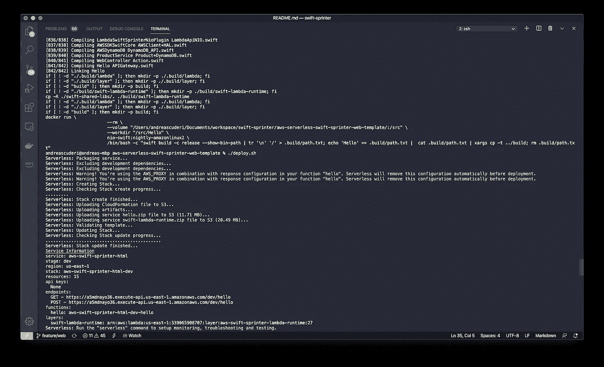
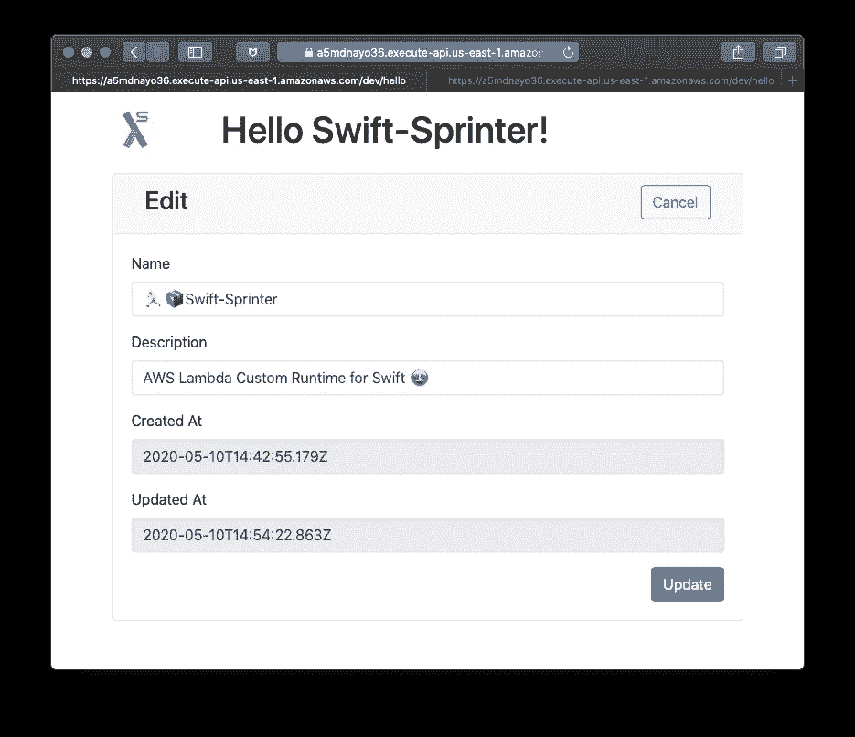
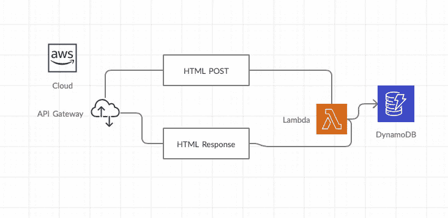
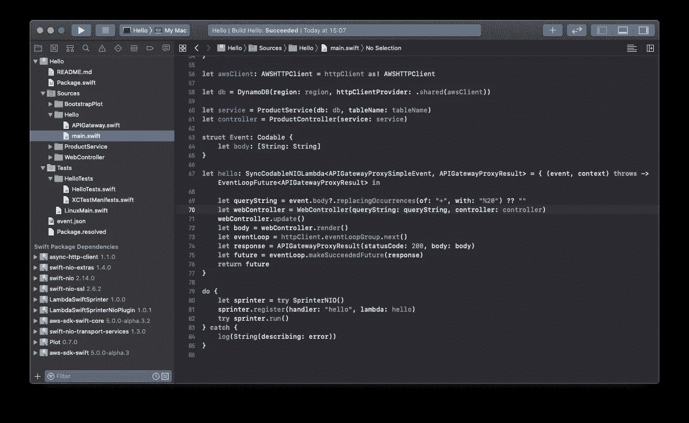
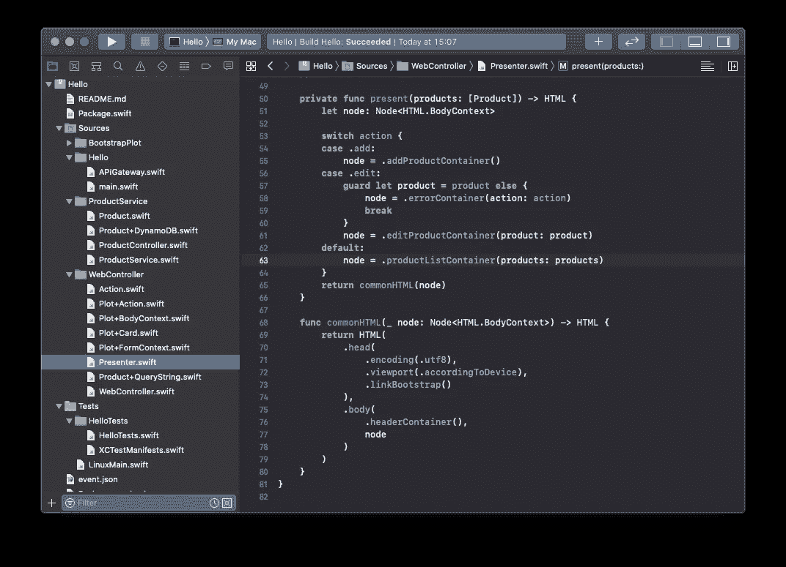
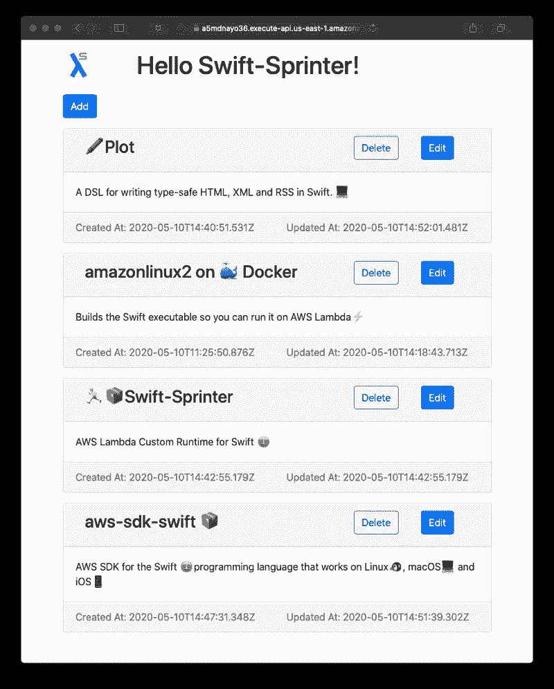
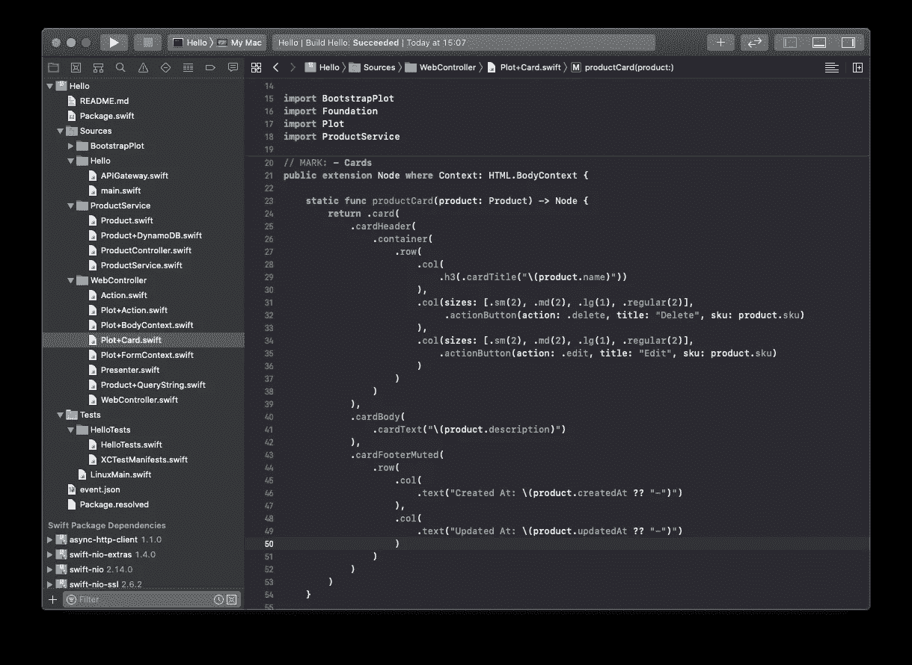
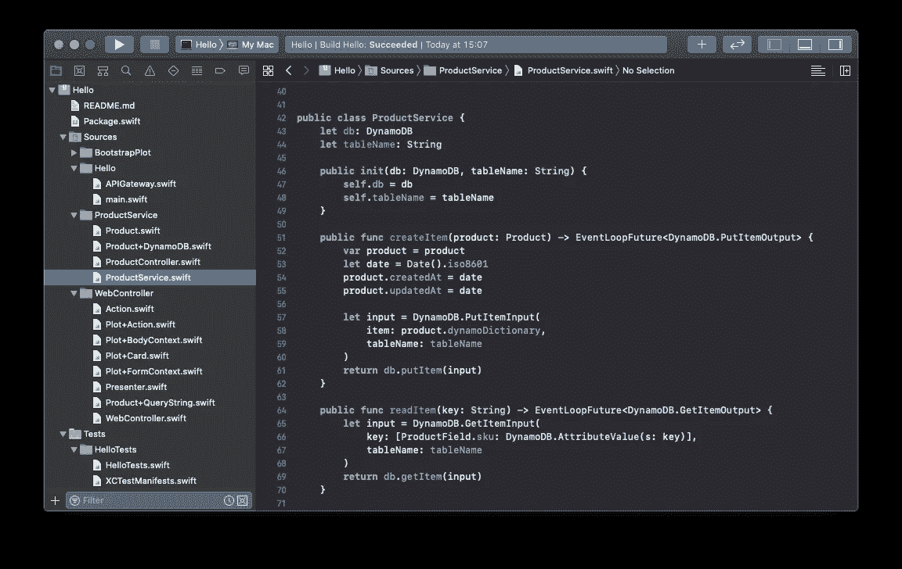

# 使用服务器端 Swift 构建无服务器网络表单

> 原文：<https://betterprogramming.pub/build-a-serverless-webform-with-server-side-swift-8acaeedde216>

## 如何用 API Gateway、Lambda、DynamoDB 和 Swift-Sprinter 实现一个 web 服务器，而不用一行 JavaScript 代码



作者照片。

不使用 JavaScript 在 Swift 中实现网站可能吗？是的，它是。

这个技巧非常古老，它包括在服务器上生成 HTML 页面。这个想法是为了避免在客户端使用 JavaScript，用 CSS 样式化 HTML，用 AWS Lambda 生成页面，用 API Gateway 提供内容。持久层将使用 DynamoDB 实现。我们将使用[无服务器](https://serverless.com)框架在 AWS 上部署我们的项目。

# 无服务器项目设置

我们假设您已经按照[自述文件](https://github.com/swift-sprinter/aws-serverless-swift-sprinter-web-template#requirements)设置了所有要求:

*   使用您的 AWS 帐户配置的 AWS cli
*   码头工人
*   无服务器
*   制造

克隆模板项目:

```
git clone [https://github.com/Andrea-Scuderi/aws-serverless-swift-sprinter-template.git](https://github.com/Andrea-Scuderi/aws-serverless-swift-sprinter-template.git)cd [aws-serverless-swift-sprinter-template](https://github.com/Andrea-Scuderi/aws-serverless-swift-sprinter-template.git)
```

然后构建项目:

```
./build.sh
```



```
./deploy.sh
```



一旦项目部署到您的 AWS 帐户上，端点就创建好了。

用 web 浏览器浏览生成的 URL。webform 已经启动并运行了！



# 它是如何工作的？

Lambda 在 AWS 无服务器堆栈中提供了一个计算模块，并与 DynamoDB 交互以检索存储的数据:



无服务器云架构

HTML post 内容跟踪从浏览器发送的动作，并由 Lambda 翻译成 DynamoDB 的`CRUD`(创建、读取、更新、删除)命令。

更新 DB 后，内容将显示在响应 web 页面中。

API 网关充当代理，将 Lambda 内容发布为 web 服务器。

无服务器框架将栈部署到 AWS。

## 雨燕中的λ

Lambda 在 Swift 中使用以下框架进行编码:

*   [aws-lambda-Swift-sprinter-NIO-plugin](https://github.com/swift-sprinter/aws-lambda-swift-sprinter-nio-plugin):使用 Swift NIO 实现 AWS 定制运行时。
*   [aws-sdk-swift](https://github.com/swift-aws/aws-sdk-swift) :与 DynamoDB 交互。
*   [Plot](https://github.com/JohnSundell/Plot) :渲染 HTML。
*   [Bootstrap](https://getbootstrap.com/):HTML 页面的 CSS(JavaScript 禁用)。



Lambda 解码 API 网关代理事件并运行 WebController。

WebController 用收到的信息更新 DynamoDB，并呈现下一个 HTML 页面。

HTML 页面作为对 web 客户端的响应返回。

## 使用 Plot 呈现 HTML

WebController 呈现 HTML，将记录列表传递给 presenter，presenter 负责呈现正确的 web 页面。



hello/Sources/web controller/presenter . swift

`present`函数用生成的内容呈现主页面，并评估 HTML 客户机发布的无状态动作。



hello/Sources/web controller/Plot+card . swift

HTML 是通过编写一个用绘图框架实现的小函数创建的。上图是一张卡片的例子。

## 将 aws-sdk-swift 用于 DynamoDB

aws-sdk-swift 是用于 aws 的 swift 客户端，包含用于 DynamoDB 的客户端。以下是一些代码片段:



hello/Sources/product service/product service . swift

# 结论

我希望对服务器端的 Swift 和 Swift-Sprinter 产生一些好奇。

查看 [GitHub 库](https://github.com/swift-sprinter/aws-serverless-swift-sprinter-web-template)并自由体验。我期待看到好的东西！

感谢阅读。