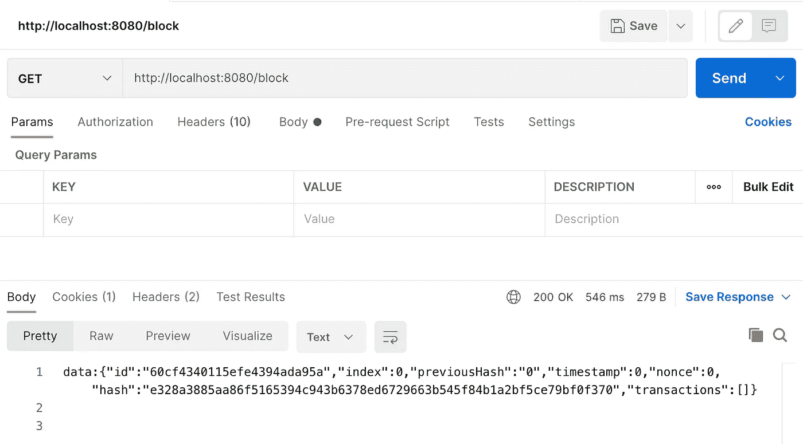
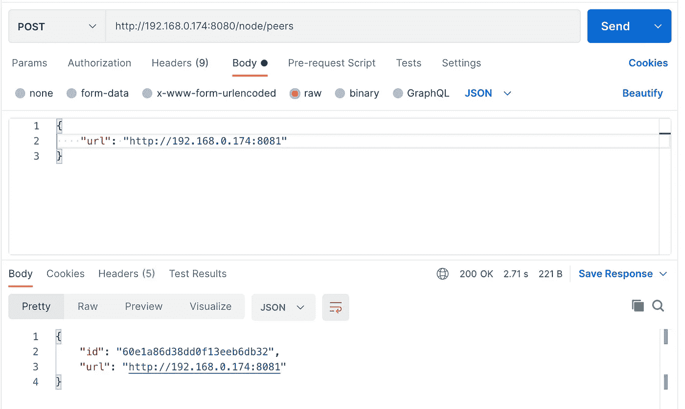

# 用 Java 建立一套区块链

> 原文：<https://betterprogramming.pub/build-a-set-of-blockchains-using-java-d99cd866931b>

## 通过对等网络建立信任


图片由来自 [Pixabay](https://pixabay.com/?utm_source=link-attribution&utm_medium=referral&utm_campaign=image&utm_content=921039) 的 [ClaudiaWollesen](https://pixabay.com/users/claudiawollesen-887962/?utm_source=link-attribution&utm_medium=referral&utm_campaign=image&utm_content=921039)

在这个系列的第一部分，我们制作了一个区块链。现在我们要做一组，让他们互相交流。区块链的真正意义在于分布式验证系统。您可以从任何节点添加数据块，最终它会到达对等节点，因此每个人都同意区块链的样子。这很重要，因为你不希望在一个分布式系统中只有一个真实的来源。

马上就出现了一个问题:每个节点都是两个服务，外加一个 MongoDB 和一个 Kafka 消息总线，它们都需要相互通信。但是我想在一台主机(我的笔记本电脑)上测试和演示多个节点。我一直在用 Docker compose 运行，所以我必须为每个节点创建一个 Docker compose 文件，以帮助保持端口的直线性。

我们将致力于一个节点服务，它将允许节点相互协作。这将从两个地方获得输入，一个是 restful 接口，允许您添加和列出连接的节点，另一个是 Kafka 提供的消息总线，通知节点服务本地区块链中需要广播到对等节点的更改。

为了将服务作为图像使用，我将使用 Google Jib maven 插件。这是从 maven 构建中创建映像的最简单的方法。我们将以下内容添加到需要图像的每个模块的 pom 文件中:

```
<build>
    <plugins>
        <plugin>
            <groupId>com.google.cloud.tools</groupId>
            <artifactId>jib-maven-plugin</artifactId>
            <version>2.7.1</version>
        </plugin>
    </plugins>
</build>
```

在我们的例子中，我们可以使用配置的默认值。接下来，您可以运行`mvn clean install jib:build`，它将创建一个您可以在 Docker 合成文件中使用的图像。

让我们利用到目前为止所拥有的，从一个名为`docker-compose-node1`的全包 Docker compose 文件开始:

```
version: '3.1'
services:
  mongo:
    image: mongo
    restart: always
    ports:
      - 27017
    environment:
      MONGO_INITDB_ROOT_USERNAME: root
      MONGO_INITDB_ROOT_PASSWORD: example
  mongo-express:
    image: mongo-express
    restart: always
    ports:
      - 8081:8081
    environment:
      ME_CONFIG_MONGODB_ADMINUSERNAME: root
      ME_CONFIG_MONGODB_ADMINPASSWORD: example
  zookeeper:
    image: confluentinc/cp-zookeeper:latest
    ports:
      - 2181
    environment:
      ZOOKEEPER_CLIENT_PORT: 2181
  kafka:
    image: confluentinc/cp-kafka:latest
    ports:
      - 9092
      - 29092
    links:
      - zookeeper
    environment:
      KAFKA_BROKER_ID: 1
      KAFKA_ZOOKEEPER_CONNECT: zookeeper:2181
      KAFKA_ADVERTISED_LISTENERS: PLAINTEXT://kafka:29092
      KAFKA_LISTENER_SECURITY_PROTOCOL_MAP: PLAINTEXT:PLAINTEXT
      KAFKA_INTER_BROKER_LISTENER_NAME: PLAINTEXT
      KAFKA_OFFSETS_TOPIC_REPLICATION_FACTOR: 1
  blockchain:
    image: rlkamradt/blockchain:1.0-SNAPSHOT
    ports:
      - 8080:8080
    environment:
      MONGO_HOST: mongo
      SPRING_KAFKA_BOOTSTRAP-SERVERS: kafka:29092
```

你会注意到一些事情发生了变化。首先，我删除了 Kafka 的外部端口，这样它只能在 compose 网络内部访问。然后，我添加了区块链应用程序，其中包含了构建过程中创建的图像。最后，我用环境变量覆盖了一些 spring 属性，这样它就可以从 compose 网络内部访问 mongo 和 Kafka。合成将创建 DNS 条目，以便从同一个合成文件运行的服务可以相互访问。用这个命令`docker compose -f docker-compose-node1.yaml up -d`运行它，并确保您仍然可以访问基本的区块链 API:



现在，我们的应用程序已经启动并运行，并且已经创建了 genesis 块。

区块链服务中已经有代码，每当我们添加一个块或添加一个事务时，它就向 Kafka 发送一条消息。我们需要创建一个新的服务来读取这些事件，并将它们广播给一组对等点。让我们把现在正在运行的东西放下来，添加一个简单的节点服务，它将在收到消息时记录消息。我们将在项目中需要一个新的模块-这将是另一个 Spring Boot 服务，它将能够与外部节点交谈。

首先，我们需要定义一个节点，它只是一个 URL。下面是`Node`:

```
@Data
@Builder
@AllArgsConstructor
@NoArgsConstructor
@JsonIgnoreProperties(ignoreUnknown = true)
@Document
public class Node {
    @Id
    private String id;
    private String url;
}
```

我们将它存储在 MongoDB 的集合中，因此我们需要一个存储库接口:

```
@Repository
public interface NodeRepository extends
                 ReactiveMongoRepository<Node, String> {
    Mono<Node> findByUrl(String url);
}
```

接下来，我们需要一个控制器来查看和添加`Node`对象:

```
@Slf4j
@RestController
@RequestMapping("/node")
public class SimpleNodeController {
    private final Blockchain blockchain;
    private final SimpleNodeService simpleNodeService;

    public SimpleNodeController(Blockchain blockchain,
                     SimpleNodeService simpleNodeService) {
        this.simpleNodeService = simpleNodeService;
        this.blockchain = blockchain;
    }

    @GetMapping(path = "peers", produces =
                    MediaType.*TEXT_EVENT_STREAM_VALUE*)
    Flux<Node> getNodes() {
        return simpleNodeService.getPeers();
    }

    @PostMapping(path = "peers", produces =
                   MediaType.*APPLICATION_JSON_VALUE*)
    Mono<Node> addNode(@RequestBody Node node) {
        return simpleNodeService.connectToPeer(node);
    }

}
```

然后，我们需要一个与 MongoDB 和 Kafka 交互的简单服务类:

```
@Component
@Slf4j
public class SimpleNodeService {
    private static Node *myself*;
    final private String host;
    final private int port;
    final private NodeRepository peers;
    final private Blockchain blockchain;
    final private ReactiveKafkaConsumerTemplate<String, 
                                      Message> emitter;

    public SimpleNodeService(@Value("${server.host}") String host,
           @Value("${server.port}") String port,
           Blockchain blockchain,
           NodeRepository peers,
           ReactiveKafkaConsumerTemplate<String, Message> emitter) {
        this.host = host;
        this.port = Integer.*parseInt*(port);
        this.blockchain = blockchain;
        this.emitter = emitter;
        this.peers = peers;
        *myself* = Node.*builder*()
                .url("http://" + host + ":" + port)
                .build();
        emitter
           .receiveAutoAck()
           .doOnNext(consumerRecord -> *log*.info(
               "received key={}, value={} from topic={}, offset={}",
               consumerRecord.key(),
               consumerRecord.value(),
               consumerRecord.topic(),
               consumerRecord.offset())
                )
                .map(ConsumerRecord::value)
                .subscribe(
                    m -> *log*.info("received message {}", m), 
                    e -> *log*.error("error receiving Message", e));
    }

    public Flux<Node> getPeers() {
        return peers.findAll();
    }

    public Mono<Node> connectToPeer(Node node) {
        return peers.save(node);
    }
}
```

从 Kafka 收到的任何消息都将被简单地记录下来，除了存储和列出它们之外，我们实际上不会对节点做任何事情。

最后，我们需要告诉 Spring Boot 在哪里可以找到共享组件和库。我们可以注释主类:

```
[@Slf4j](http://twitter.com/Slf4j)
[@SpringBootApplicatio](http://twitter.com/SpringBootApplicatio)n
[@ComponentScan](http://twitter.com/ComponentScan)(basePackageClasses = {
        net.kamradtfamily.blockchain.api.Blockchain.class,
        net.kamradtfamily.blockchainnode.Application.class})
[@EnableReactiveMongoR](http://twitter.com/EnableReactiveMongoR)epositories(basePackageClasses = {
        net.kamradtfamily.blockchain.api.BlockRepository.class,
        net.kamradtfamily.blockchainnode.NodeRepository.class})
public class Application {
    public static void main(String [] args) {
        SpringApplication.run(Application.class, args);
        try {
            Properties gitProps = new Properties();
            gitProps.load(
                Application
                   .class
                   .getResourceAsStream("/git.properties"));
            log.info("Git Properties:");
            gitProps.entrySet().stream()
                    .forEach(es -> 
                          log.info("{}: {}",
                          es.getKey(),
                          es.getValue()));
        } catch (Exception e) {
            log.error("Error reading Git Properties");
        }
    }
}
```

需要告诉 Spring 在哪里扫描组件和存储库。它通常在主类所在的包中出现，但是在我们的例子中，我们想要共享来自`net.kamradtfamily.blockchain.api`的组件。所以我添加了`ComponentScan`和`EnableReactiveMongoRepositories`注解。我还添加了一些日志记录，这样每当它启动时，我们就会知道我们正在运行什么 Git commit hash。

为了运行所有这些，我们需要移动一些端口。为了拥有新的服务和现有的服务，我们必须给每个服务提供唯一的外部端口。让我们把它加入到我们的`docker-compose-node1.yaml`中:

```
blockchainnode:
  image: rlkamradt/blockchainnode:1.0-SNAPSHOT
  ports:
    - 8080:8082
  environment:
    MONGO_HOST: mongo
    SPRING_KAFKA_BOOTSTRAP-SERVERS: kafka:29092
```

MongoExpress 服务已经占用了端口 8081，所以我们将它公开为 8082。现在构建新的映像，提取并运行它们:

```
mvn clean install jib:build
docker compose -f docker-compose-node1.yaml pull
docker compose -f docker-compose-node1.yaml up
```

然后，当您用区块链服务创建一个事务时，您将在`blockchainnode`服务的日志中看到收到了一条消息。您还可以点击端点[http://localhost:8082/node/peers](http://localhost:8082/node/peers)并创建和列出对等点。

这就是事情变得复杂的地方。我们需要一个以上的节点运行，我们需要节点在事务或块添加后响应消息。我们还需要节点在启动或添加节点时相互通信。我要把`SimpleNodeService`和`SimpleNodeController`复制到`NodeService`和`NodeController`。如果你正在 GitHub 上看代码并想跟随，我将留下旧的类，但是我将注释掉`Component`和`RestController`注释，这样它们就不会在运行时启动。

我将向`NodeController`添加一个额外的端点，以允许确认一个事务已经进入所有节点中的一个块:

```
@GetMapping(path = "transactions/:transactionId/confirmations",
                        produces = MediaType.*ALL_VALUE*)
Mono<String> getTransactionFromNode(
             @RequestParam("transactionId") String transactionId) {
    return nodeService
            .getConfirmations(Long.*valueOf*(transactionId))
            .map(b -> b.toString());
}
```

这意味着我需要在`NodeService`中使用一组新方法来从所有节点获得确认:

```
public Mono<Block> getConfirmation(Node peer, long transactionId) {
    String URL = peer.getUrl() 
          + "/block/blocks/transactions/" 
          + transactionId;
    *log*.info("Getting transactions from: {}", URL);
    return client
            .get()
            .uri(URL)
            .retrieve().bodyToMono(Block.class);
            .onErrorContinue((t, o) -> Mono.*empty*());
}

Mono<Long> getConfirmations(long transactionId) {
// Get count of peers with confirmations that the transaction exists
    return blockchain
          .findTransactionInChain(transactionId, blockchain
               .getAllBlocks())
          .zipWith(peers.findAll()
               .flatMap(peer -> getConfirmation(peer,
                               transactionId)))
          .count();
}
```

这将返回一个块中有此事务的节点的计数。但是首先，我需要在`BlockController`中创建一个新的端点，它将报告事务是否在区块链的一个块中。

```
@GetMapping(path = "blocks/transaction/{transactionId}", 
                produces = MediaType.*APPLICATION_JSON_VALUE*)
public Mono<Block> getTransaction(
            @PathVariable("transactionId") Long transactionId) {
    return blockchain
            .findTransactionInChain(transactionId,
                              blockchain.getAllBlocks())
            .last() // assume there's only one
            .switchIfEmpty(Mono.*error*(new ResponseStatusException(
                    HttpStatus.*NOT_FOUND*, 
                    "Transaction Not Found in Blockchain")));
```

幸运的是，我们已经有了一个方法`findTransactionInChain`，它将返回发现事务的块。

接下来，我们要回应来自卡夫卡的信息。我们将添加一个`messageHandler`方法，它将向所有对等节点广播消息:

```
public Mono<? extends Object> messageHandler(Message m) {
  if("addedBlock".equals(m.getMessage())) {
    return peers.findAll()
            .flatMap(p -> sendLatestBlock(p, m.getBlock()))
            .switchIfEmpty(Mono.just(m.getBlock()))
            .last();
  } else if("addedTransaction".equals(m.getMessage())) {
    return peers.findAll()
            .flatMap(p -> sendTransaction(p, m.getTransaction()))
            .switchIfEmpty(Mono.just(m.getTransaction()))
            .last();
  } else if("getBlocks".equals(m.getMessage())) {
    return peers.findAll()
            .flatMap(p -> getBlocks(p))
            .switchIfEmpty(blockchain.getLastBlock())
            .last();
  } else {
    log.error("unknown message {}", m);
    return Mono.empty();
  }
}
```

这需要两种新方法向其他节点发出请求:

```
public Mono<ClientResponse> sendLatestBlock(Node peer, 
                             Block block) {
    String URL = peer.getUrl() + "/block/blocks/latest";
    *log*.info("Posting latest block to: {}", URL);
    return client
            .put()
            .uri(URL)
            .body(block, Block.class)
            .exchange();
}

public Mono<ClientResponse> sendTransaction(Node peer, 
                             Transaction transaction) {
    String URL = peer.getUrl() + "/transaction";
    *log*.info("Sending transaction '{}' to: {}", transaction, URL);
    return client
            .post()
            .uri(URL)
            .body(transaction, Transaction.class)
            .exchange();
}
```

我们已经有了到`/transaction`端点的 POST，但是我们需要添加到`/block/blocks/latest`端点的 PUT。

```
@PutMapping(path = "/block/blocks/latest", 
             produces =  MediaType.*APPLICATION_JSON_VALUE*)
public Mono<Block> checkReceivedBlock(
                    @RequestBody Block receivedBlock) {
    return blockchain.checkReceivedBlock(receivedBlock);
}
```

这需要在`Blockchain`服务中使用新的方法。

```
public Mono<Block> checkReceivedBlock(Block receivedBlock) {
  return getLastBlock()
      .filter(b -> b.getIndex() < receivedBlock.getIndex())
      .flatMap(b -> {
         log.info(
            "Blockchain possibly behind. We got: {}, Peer got: {}",
            b.getIndex(),
            receivedBlock.getIndex());
         if (b.getHash().equals(receivedBlock.getPreviousHash())) { 
            log.info("Appending received block to our chain");
            return addBlock(receivedBlock, true);
         } else {
            log.info("Querying chain from our peers");
            emitter.send(TOPIC, Message.builder()
               .type("empty")
               .message("getBlocks")
               .build())
               .subscribe();
            return Mono.empty();
          }
        });}
```

您可以看到节点层如何通过公共 API 与其他节点对话。但是有一个问题。每个节点都由一个 URL 表示，但是我们必须与两个独立的服务对话:块服务和节点服务。我将使用 Nginx 实例做一个简单的入口。这样，我们就可以用一个 URL 与两个服务(以及更多服务)进行对话。您可以查看 GitHub 上的代码，了解关于 Nginx 配置和向`docker-compose-node1.yaml`添加所有服务的详细信息。

启动一切，所有的端点仍然工作，我可以在日志中看到区块链服务和 Kafka 总线上的节点服务之间的通信。现在是时候制作第二个节点了。将`docker-compose-node1.yaml`复制到`docker-compose-node2.yaml`，将 Nginx 服务的外部端口从 8080 切换到 8081，以便在端口 8080 到达节点 1，在端口 8081 到达节点 2。我还将创建一个名为`startnode1`的小脚本来按顺序启动每个服务，并从节点服务输出日志:

```
docker compose -p node1 -f docker-compose-node1.yaml up -d mongo
docker compose -p node1 -f docker-compose-node1.yaml up -d zookeeper
docker compose -p node1 -f docker-compose-node1.yaml up -d mongo-express
docker compose -p node1 -f docker-compose-node1.yaml up -d kafka
docker compose -p node1 -f docker-compose-node1.yaml up -d blockchain
docker compose -p node1 -f docker-compose-node1.yaml up blockchainnode
```

因为最后一行没有`-d`标志，所以它显示日志，直到 Ctrl-C 停止它。我使用了`-p node1`标志，这样我就可以创建单独的服务实例。接下来，复制到一个名为`startnode2`的文件，但是替换 Docker compose 文件来启动 node2，并将`-p`标志替换为 node 2。不要忘记在每个上设置可执行标志:

```
chmod +x startnode1
chmod +x startnode2
```

还有最后一个变化。节点服务的“我自己”成员需要有其他服务可以看到的 URL，所以使用本地主机是不行的。我在应用程序中设置了一个 Spring 属性。

```
server.myself: http://localhost:8080
```

然后我在 docker-compose-node1.yaml 中覆盖它，现在看起来像这样:

```
version: '3.1'
services:
  mongo:
    image: mongo
    restart: always
    ports:
      - 27017
    environment:
      MONGO_INITDB_ROOT_USERNAME: root
      MONGO_INITDB_ROOT_PASSWORD: example
  zookeeper:
    image: confluentinc/cp-zookeeper:latest
    ports:
      - 2181
    environment:
      ZOOKEEPER_CLIENT_PORT: 2181
  kafka:
    image: confluentinc/cp-kafka:latest
    ports:
      - 9092
      - 29092
    links:
      - zookeeper
    environment:
      KAFKA_BROKER_ID: 1
      KAFKA_ZOOKEEPER_CONNECT: zookeeper:2181
      KAFKA_ADVERTISED_LISTENERS: PLAINTEXT://kafka:29092
      KAFKA_LISTENER_SECURITY_PROTOCOL_MAP: PLAINTEXT:PLAINTEXT
      KAFKA_INTER_BROKER_LISTENER_NAME: PLAINTEXT
      KAFKA_OFFSETS_TOPIC_REPLICATION_FACTOR: 1
  blockchain:
    image: rlkamradt/blockchain:1.0-SNAPSHOT
    ports:
      - 8080
    environment:
      SERVER_MYSELF: http://192.168.0.174:8080
      MONGO_HOST: mongo
      SPRING_KAFKA_BOOTSTRAP-SERVERS: kafka:29092
  blockchainnode:
    image: rlkamradt/blockchainnode:1.0-SNAPSHOT
    ports:
      - 8080
    environment:
      SERVER_MYSELF: http://192.168.0.174:8080
      MONGO_HOST: mongo
      SPRING_KAFKA_BOOTSTRAP-SERVERS: kafka:29092
  nginx:
    image: nginx:latest
    volumes:
      - ./nginx.conf:/etc/nginx/nginx.conf
    ports:
      - 8080:80
```

对于`SERVER_MYSELF`和`nginx.ports`值，`docker-compose-node2.yaml`也将端口更改为 8081。

启动两个实例。当它们都运行时，您可以将其中一个连接到另一个:



现在，您可以创建事务和挖掘块，如前一篇文章中的[所示，但是您可以列出两个节点中的事务和块。对等协议确保两个节点拥有相同的数据。](/the-blockchain-explained-with-a-java-implementation-27b74d478223)

在这一点上我不会说它是完美的。有许多不同的序列需要测试，以确保无论事情如何完成，不同实例中的区块链保持不变。但是这篇文章已经够长了，我敢肯定你不想看到我调试这个网站！

感谢你阅读这篇相当长的文章，我已经试图压缩它，使它尽可能简洁，但它是一个非常复杂的主题。

我认为本系列的下一篇文章会简单一点。我们将讨论谜题的最后一部分:矿工和使用者。

本文的所有代码都可以在这里找到:

[](https://github.com/rkamradt/blockchain/tree/v0.2) [## rkamradt/区块链

### yabc。在 GitHub 上创建一个帐户，为 rkamradt/区块链的发展做出贡献。

github.com](https://github.com/rkamradt/blockchain/tree/v0.2) 

本系列的前一篇文章:

[](/the-blockchain-explained-with-a-java-implementation-27b74d478223) [## 如果你想了解区块链，请看这个 Java 实现

### 解放区块链

better 编程. pub](/the-blockchain-explained-with-a-java-implementation-27b74d478223)