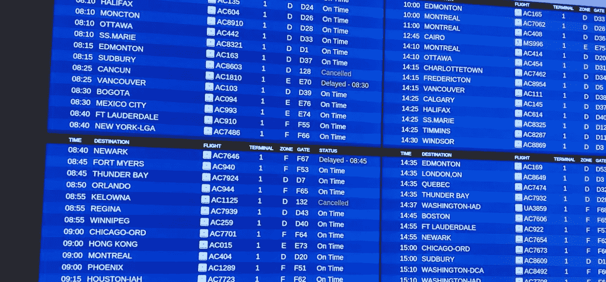
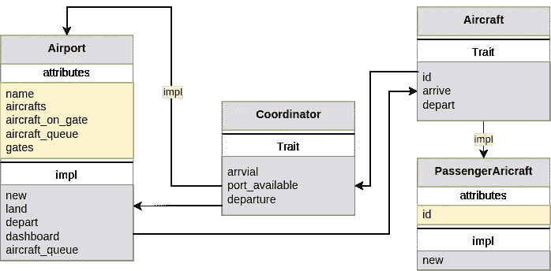
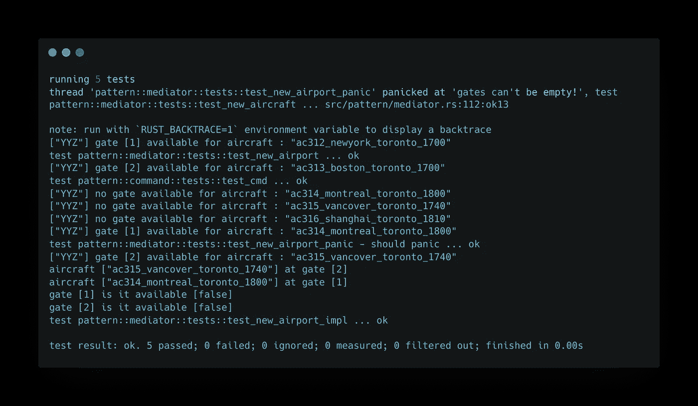

# 用 Rust 构建一个简单的机场控制系统

> 原文：<https://betterprogramming.pub/build-a-simple-airport-control-system-with-rust-3b8f27ffb94e>

## 周末建设和学习

机场信息板

我已经有一段时间没有写一些周末建设和学习了。主要原因是我大部分时间都和来看我的父母在一起。我很开心，享受这些难忘的时刻。

上周五，我带着我的父母和我的儿子们去机场，当我们在排队登机时，我最小的儿子指着信息板问我:“这个信息板怎么知道我们的祖父母会去哪个登机口？”。

这个周末我们有我们的编码用例(简单的机场控制系统)。谢谢你，儿子。:)

# 高级需求

在我们开始之前，我想说明一下，机场控制系统将比我们在这里建造的要复杂得多。对于演示属性，我们将只关注三个主要组件`Airport`、`Aircraft`和`Control`协调器。

1.  我们将能够定义机场名称及其登机口容量。
2.  我们应该能够定义飞机类型，并很容易扩展不同的飞机类型与机场的互动。
3.  机场应允许飞机降落并通过可用的登机口。
4.  如果已经达到登机口容量，飞机可以排队等待下一个可用的登机口。
5.  该机场可以起飞飞机。
6.  我们可以检查哪架飞机在几号登机口。
7.  我们将能够检查等待队列中有哪些飞机。

这些是我们将在这个编码周末存档的一些基本功能。

如果我们看得更深一点，这非常适合中介模式，其中我们将有一个控制协调器来协调两个组件(`Airport` 和`Aircraft`)之间的动作。

高级 UML 机场登机口管理—作者署名

我们应该强调的是，中介模式已经在不同的用例中得到了广泛的应用，例如:

> 运输控制系统、物流、供应链管理、库存管理、仓库管理、聊天室、酒店客房管理等。

这样做的主要好处是:

> 对象之间的通信封装在一个中介对象中。对象之间不再直接通信，而是通过中介进行通信。这减少了通信对象之间的依赖性，从而减少了耦合。”— [维基百科](https://en.wikipedia.org/wiki/Mediator_pattern)

# 让我们编码

我们将从`Airport`组件开始。正如 UML 所定义的，它负责作为主要的动作触发器，如下所示:

1.  创建一个具有港口能力的新机场。
2.  降落飞机。
3.  离开飞机。
4.  访问哪个飞机停在哪个港口的 API。
5.  访问飞机队列的 API。

它还保存了`Airport`中飞机的参考，如下所示:

1.  `Aircraft`在大门口。
2.  以及门的可用性。`Aircraft`正在排队等候。

为了简单起见，我们使用`HashMap`和`VecDeque`在运行时内存中保存这些引用，如果需要，我们还可以将其扩展到数据库级的实现。

代码片段—机场组件—作者署名

## 飞机部件

在现实世界中，`Airport`可以降落任何飞机，如客机、货机等。

这意味着飞机可以是不同类型的飞机。但是，永远是同样的行为；当他们到达和离开的时候，这个特性就在这里发生了。

每一次到达和离开都会触发与协调者的交互。

代码片段-飞机特征-作者署名

## 协调者

最后，这将是中介模式中最关键的部分，它将在`Airport`中实现。它是领先的业务逻辑中心，如下所示:

1.  这架陆地飞机能停在登机口吗？换句话说，根据机场的能力，是否有可用的港口？
2.  飞机起飞时，队列中的下一个是什么，哪个登机口？
3.  基于#1 和#2，我们将更新 airport 属性的引用。

# 让我们对它进行单元测试

单元测试——作者的学分

运行测试，一切准备就绪。

单元测试结果——作者署名

# 铆钉铆合

如果您继续关注我的周末构建和学习系列，您会注意到我喜欢从背景环境、用例、需求和设计开始。编码部分通常出现在最后一部分。

> 软件开发产生了一门艺术，它结合了可维护性、可伸缩性、可靠性、安全性和可扩展性。
> 
> 它的主要目标是推动业务价值，并以更低的成本带来价值。—作者

我希望你喜欢这个周末的建设，并了解了锈建立机场控制系统。

感谢您的阅读。