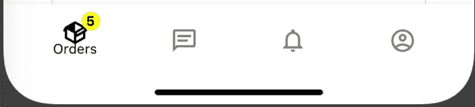

# 用 React Native、Navigation 和 Redux 构建一个简单的徽章图标组件

> 原文：<https://betterprogramming.pub/build-a-simple-badge-icon-component-with-react-native-navigation-and-redux-843bcb5c2cb7>

## 为您的用户制作徽章图标


由 [seabass 创意人员](https://unsplash.com/@sebbb?utm_source=medium&utm_medium=referral)在 [Unsplash](https://unsplash.com?utm_source=medium&utm_medium=referral) 上拍摄的照片

为了揭开序幕，让我分享一个我在开发一两个应用程序的过程中学到的小秘密:创建可重用的组件！

这并不意味着你的应用程序会有相同的外观和感觉，但你会发现有些组件在所有的移动应用程序中都很关键。仅列出几个，即:酒吧(底部，顶部，抽屉)，图标，输入，标题，按钮，徽章，认证等。明白了吗？

好了，让我们开始研究我们的徽章吧！

# 入门指南

为了创建我们的组件，您需要安装以下软件包:

`yarn add styled-components react-native-vector-icons react-redux`

## 让我们创建 IconWithBadge 组件

**免责声明**:在这篇文章中，我不会涉及应用程序的创建、文件夹结构和 redux 设置，因为我假设如果你正在阅读这篇文章，你已经想好了所有这些步骤。

1.  在组件结构中创建一个名为`IconWithBadge`的文件夹，然后创建两个独立的文件`index.js`和`styles.js`。

## 式样

2.使用我喜欢的样式化方法(样式化组件)，让我们只创建三个元素。

**提示:**在我所有的项目中，我都使用一个`DesignSystem.js`文件，在那里我将所有的尺寸、颜色、重量以及与应用程序的全局设计相关的所有东西分组。

## 但是坚持住！下面我们一起来了解一下组件逻辑。

总之，我只是从`react-native-vector-icon`包中包装了一个图标，并添加了一个名为`routeName`的属性和一个名为`badgeCount`的局部变量，好吗？

正如所料，只有当您的计数器(`*badgeCounter*`)大于 0 时，徽章才可见。此外，我还使用了`routerName`属性来控制路由器的可见性。

## 哦，我差点忘了！Redux 部分。

如果你注意到我正在使用来自`react-redux`的`useSelector`钩子来获取订单列表的值。只有当订单状态为`READY_FOR_PICKUP`时，我的徽章计数器才会增加。

```
orders.map(*item* => {
if (item.status === ‘READY_FOR_PICKUP’) {
return badgeCount++;
}});
```

一旦您的值列表与我的不同，这几乎是唯一需要更改的代码。

# 通过反应导航使用组件

为了在您的应用程序中使用`IconWithBadge`组件，您可以用全新的方法替换普通的`Icon`方法，如下所示。

# 决赛成绩



作者提供的截图。