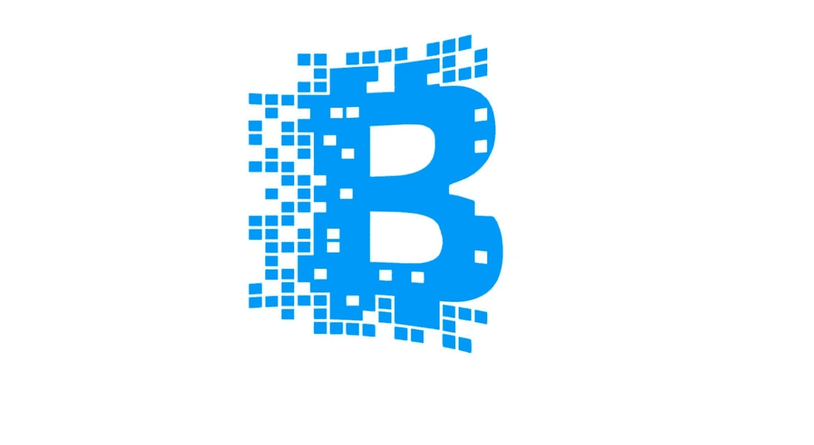
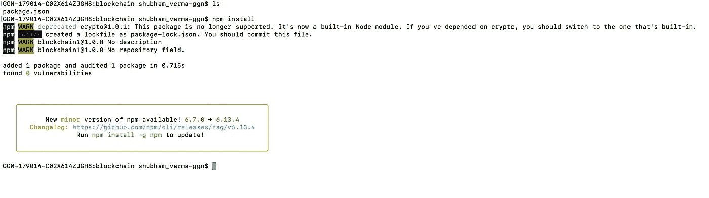
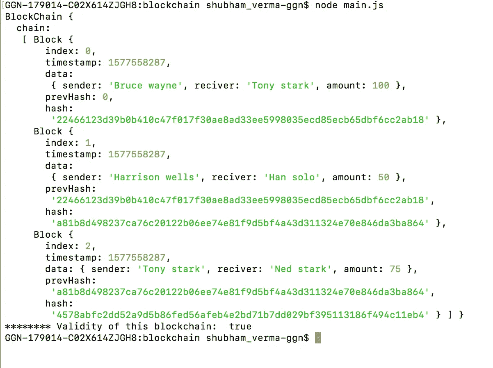
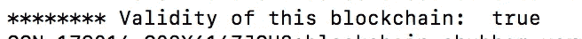

# 在 Node.js 中构建一个简单的区块链

> 原文：<https://betterprogramming.pub/build-a-simple-blockchain-in-node-js-3d24c6de5f99>

## 使用这个简单的实现来理解通用区块链的概念



区块链只是一个块链，是记录的集合，每个记录都与其他块相链接。块是存储在数据库中的数字信息。我们也可以说区块链本身就是一个数据库。

块可以存储以下信息:

*   交易记录。
*   交易的参与者。
*   一个索引或其他东西来区别于其他记录。

在本文中，我们将使用 Node.js 实现一个小型区块链。在我们的区块链中，块将包含以下内容:

*   索引
*   时间戳
*   数据
*   以前的哈希
*   块散列

并且每个块将使用该块的散列与另一个块连接。块将受到密码术的保护。

我们还将查看我们是否更改了任何数据块的信息，然后我们可以检测到发生了更改的数据块。

# **让我们开始编码**

创建一个名为`blockchain`的目录，在这个文件夹中，创建一个名为`package.json`的文件，并添加以下代码:

现在，转到终端中的`package.json`位置，运行`npm install`，它将安装这个实现的依赖项:



快照:npm 安装

现在，在同一个目录下创建另一个文件`main.js`，并粘贴以下代码:

让我们来理解上面的代码(`main.js`):

```
const crypto = require('crypto');
```

上面一行是将 crypto 模块导入到我们的应用程序中来加密数据。

```
class Block { }
```

上面的代码将创建一个名为`Block`的类。

```
constructor(index, data, prevHash) {                                 this.index = index;                              
this.timestamp = Math.floor(Date.now() / 1000);                              this.data = data;                              
this.prevHash = prevHash;                              this.hash=this.getHash();                          
}
```

上面的代码决定了块包含的内容，这意味着我们的块将包含我们在构造函数中决定的内容。

```
getHash() {                              
var encript=JSON.stringify(this.data) + this.prevHash + this.index + this.timestamp;                              
var hash=crypto.createHmac('sha256', "secret")                              .update(encript)                              
.digest('hex');                              
// return sha(JSON.stringify(this.data) + this.prevHash + this.index + this.timestamp);                              
return hash;                          
}
```

上面的函数将返回数据的散列，它将加密所有的数据。
以上函数将使用 SHA256 算法进行加密。

```
class BlockChain { }
```

上述代码将所有的区块链，实际的区块链。

```
constructor() {                              
this.chain = [];                          
}
```

上面的构造函数将创建一个链，我们将在其中保存所有的块。

```
addBlock(data) {                              
let index = this.chain.length;                              
let prevHash = this.chain.length !== 0 ? this.chain[this.chain.length - 1].hash : 0;                              let block = new Block(index, data, prevHash);                              this.chain.push(block);                          
}
```

上面的代码将创建一个新的块，并将其添加到链中。

```
chainIsValid(){                                  
for(var i=0;i<this.chain.length;i++){                                      if(this.chain[i].hash !== this.chain[i].getHash())                                          return false;                                      
if(i > 0 && this.chain[i].prevHash !== this.chain[i-1].hash)                                          return false;                                  
}                                  
return true;                              
}
```

上面的代码将检测块的有效性。

```
const BCoin = new BlockChain();
```

上面的行将创建一个`BlockChain`的对象。

```
BChain.addBlock({sender: "Bruce wayne", reciver: "Tony stark", amount: 100});
```

上面的代码将使用给定的数据创建一个块。

现在是时候使用下面的命令运行文件`main.js` 了:

```
node main.js
```



输出:main.js

在上面的快照中，你可以看到这个区块链的有效性是真实的。
表示上述块是正确的，数据是正确的，没有被改动。



让我们做一些修改。我将更改块 0，将名称“Bruce wayne”更改为“Joker”。

为此，将以下代码添加到文件`main.js`的最后一行。

```
BChain.chain[0].data.receiver = "Joker";console.log("******** Validity of this blockchain: ", BChain.chainIsValid());
```

并使用以下命令运行`main.js`文件:

```
node main.js
```

现在你可以看到有效性:


这是假的，它表明有人改变了我们链中的数据，我们已经发现了这一点。

恭喜你，现在你对基本区块链是如何工作的有了更好的了解。

注意:尽管这篇文章使用了一些基本的加密技术，但是本文中的概念并没有展示一个真正安全的区块链。

感谢阅读。