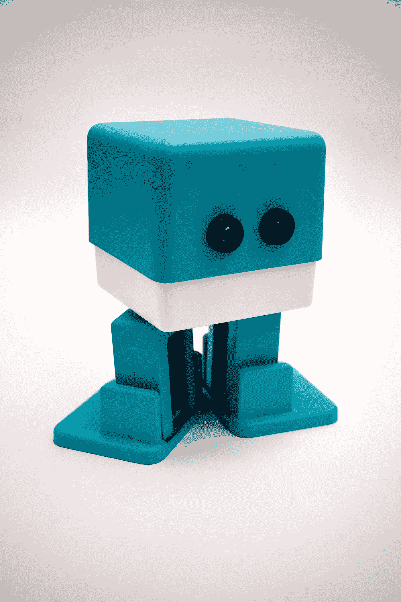
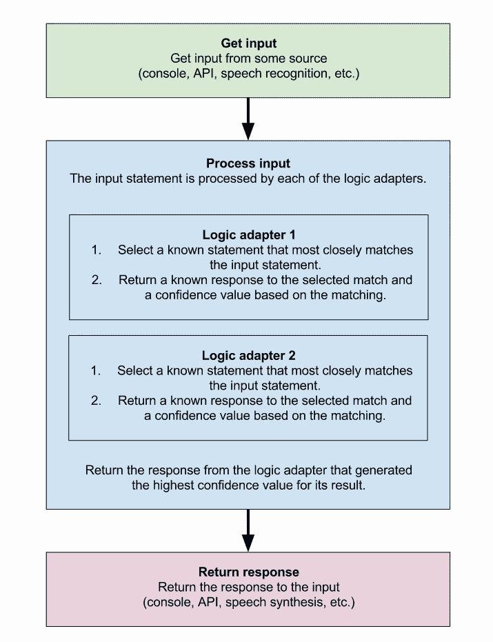
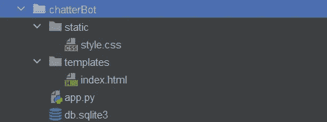
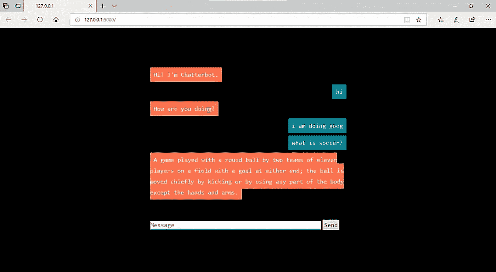

# 用 Python 构建一个简单的聊天机器人

> 原文：<https://betterprogramming.pub/build-a-simple-chatbot-in-python-da966312f19a>

## 让我们使用 Chatterbot 库创建一个聊天机器人



照片由[日常基础](https://unsplash.com/@zanardi?utm_source=unsplash&utm_medium=referral&utm_content=creditCopyText)在 [Unsplash](https://unsplash.com/s/photos/bot?utm_source=unsplash&utm_medium=referral&utm_content=creditCopyText)

在系统中，聊天机器人被用于各种原因，包括客户支持、请求路由和信息收集。虽然一些聊天机器人大量使用单词分类、自然语言处理和高级人工智能，但其他人只是扫描基本的关键词，并使用图书馆或数据库中的常用短语生成响应。

# 聊天机器人的使用

近年来，按需发送信息有了巨大的增长，这改变了客户与品牌沟通的方式。越来越多的公司在工作流程中使用聊天机器人来提供更好的客户服务。

在银行、保险和医疗保健等以大量客户参与为核心业务的行业，聊天机器人已经成为游戏规则的改变者。与接听电话的高管相比，他们平均为每个客户查询节省了 4 分钟以上的时间，每次咨询的成功率很高。

1.  成本节约
2.  用户友好性
3.  更好地分析客户数据
4.  为网站用户提供基于上下文和人工智能的支持
5.  增强客户参与度

在这篇文章中，我将讨论如何使用 Python 和 [Flask](https://flask.palletsprojects.com/en/2.0.x/) 框架构建一个简单的聊天机器人。最初，在开发机器人之前，我们必须考虑一些事情。这里我使用了基于 Python 的 Chatterbot 库。

# 聊天机器人库

Chatterbot 是基于通过自然语言处理技术的机器学习算法训练的自动响应。没有经过训练的 ChatterBot 实例不知道如何交流。该库保存用户提供的文本，以及用户每次输入语句时语句响应的文本。随着 ChatterBot 接收到更多的数据，它可以提供的响应数量也会增加，每个响应相对于输入语句的准确性也会增加。

计算机通过寻找与输入最接近的已知语句来选择最匹配的响应，然后从该语句的可能响应列表中选择一个响应。



[聊天机器人](https://chatterbot.readthedocs.io/en/stable/)库的进程

在这个聊天机器人中，我选择了特定版本的聊天机器人库，是 10.0.0。对于聊天机器人语料库，我使用的是 1.2.0 版本。此外，我使用 Flask 作为前端框架。



文档结构

我刚刚为聊天机器人使用了一个 Python 文件。让我们来看看聊天机器人的核心代码。

如你所见，你需要将 Flask 和[聊天机器人](https://www.chatbot.com/)导入到`app.py`中。使用预先训练好的 Python 模型和库，开发非常容易。你所要做的就是根据需要改变括号。

```
from chatterbot.trainers import ChatterBotCorpusTrainer
```

从上面的代码中，聊天机器人的所有训练语料库都将被导入，并准备好在您的应用程序中使用。调用`get_bot_response()`方法来访问 Flask 前端标签，并获取用户输入来验证输入细节。

以上，JavaScript 函数包含在`index.html`模板文件中。所有的模板文件和样式表都可以在 GitHub 上访问[。](https://github.com/RaviduShehan/ChatterBox.git)

index.html 文件



输出

这是你能得到的输出。

我希望你获得了一些使用 Python 构建简单聊天机器人的知识。

编码快乐！