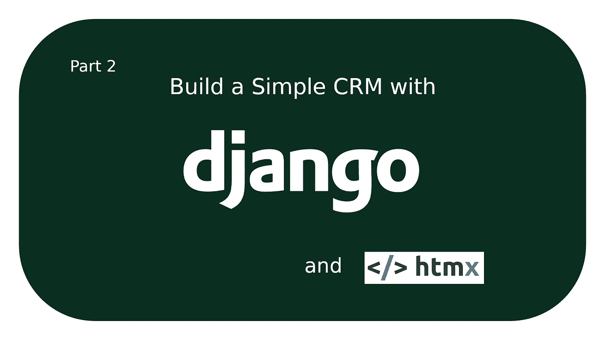
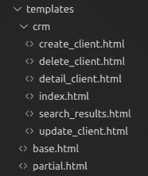
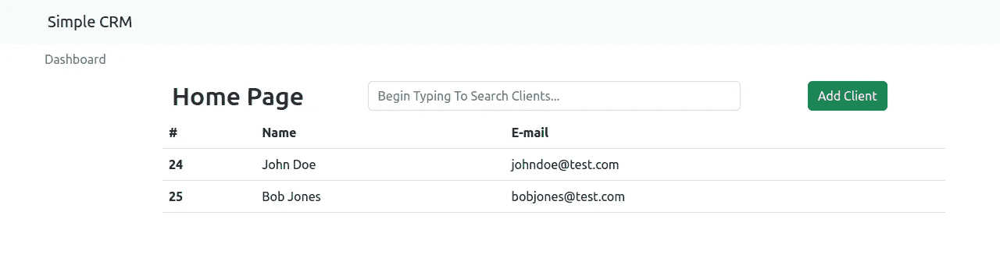
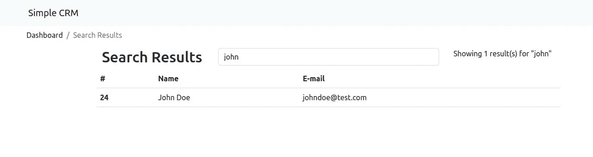
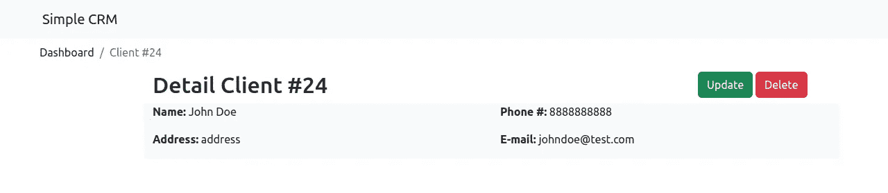
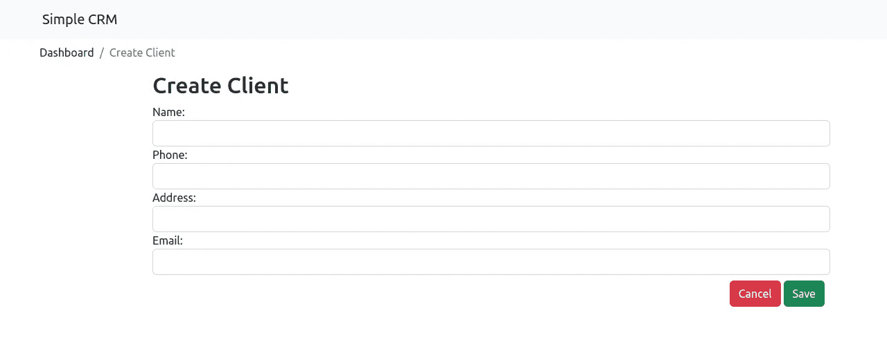
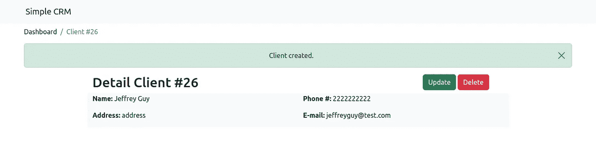
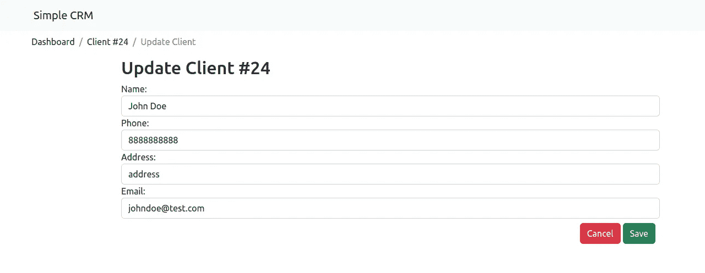
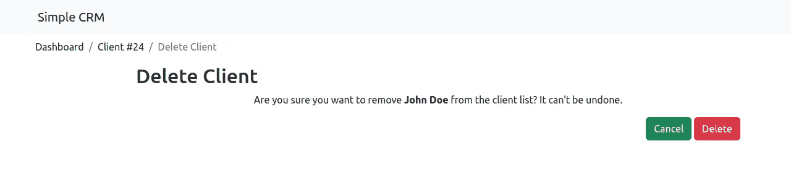

# 用 Django 和 HTMX 构建一个简单的 CRM 前端开发

> 原文：<https://betterprogramming.pub/build-a-simple-crm-with-django-and-htmx-frontend-development-c067c9f02823>

## 创建应用程序模板

在本文中，我们将继续我们离开的地方:为我们的`client_relationship_manager`应用程序创建模板。我推荐阅读第一部分，如果你还没有的话，在那里我向你展示了如何为这个项目开发后端。

# 目标

本系列的目标是教您如何使用 Django 和 HTMX 创建动态 CRUD 应用程序来跟踪客户及其联系信息。

# 创建前端

我将首先向您展示如何组织模板。`HtmxResponseMiddleware`要求我们对它们进行独特的设置。

应用程序子目录中的任何页面模板都将从`base.html`扩展而来。或者`partial.html`如果是 HTMX 响应。

## templates/base.html

`base.html`模板包括标准元素，如标题、元标签、CSS 和 JavaScript。我们还将一个`csrf_token`传递给带有`hx-headers`属性的头。

> 将`*hx-headers*`放在`*<body>*`标签上最方便，因为这样所有元素都会继承它。(来源: [htmx 文档](https://django-htmx.readthedocs.io/en/latest/tips.html))。)

接下来是一个非常简单的 navbar，一个消息容器，一个面包屑容器和一个 htmxCanvas 容器。请注意，在 navbar 中，我们同时使用 app 名称空间和 URL 模式名称来反转 URL，而不是硬编码它。

## templates/partial.html

以上是用于 HTMX 响应的基本模板。它使用`hx-swap-oob`属性更新页面标题、面包屑和请求返回的任何消息。块标签中的内容被交换到 htmxCanvas 中。

## **templates/CRM/index . html**

所有的应用程序模板都将遵循类似的布局。首先，扩展从`HtmxResponseMiddleware.`传入响应的`base_template`，然后我们将提供页面标题、面包屑和画布内容。

在画布内容的第一行，我们放置了页面标题、一个 [htmx 主动搜索](https://htmx.org/examples/active-search/)栏和一个添加新客户的按钮。页面的其余部分是一个 for 循环，用于在表中显示客户端列表。

在搜索栏中，我们将请求发送到 CRM 应用程序中的搜索 URL，将响应发送到 htmxCanvas，并将 URL 推送到浏览器历史。此外，添加`hx-preserve`属性，它将防止搜索栏在搜索结果呈现时重新加载。

> 属性允许你在 HTML 替换过程中保持元素不变。(来源: [htmx 文档](https://htmx.org/attributes/hx-preserve/)。)

此时，您可以进入默认的 admin 来添加一些测试客户端，并查看主页。它应该如下图所示:

## templates/CRM/search _ results . html

搜索结果模板类似于索引模板。唯一的区别是标题、面包屑，而不是添加客户端的按钮，我们显示查询的结果数量。

下图是该页面的外观:

## 模板/crm/detail_client.html

同样，在详细页面上，我们扩展`base_template`，添加一个标题和一些面包屑，然后我们得到画布内容。

有两个按钮可以更新或删除客户端。然后我们显示所有客户的联系信息。

## 模板/crm/create_client.html

这里我们将使用我们在`forms.py`中创建的表单。注意，向表单字段添加属性更简单，所以现在我们可以使用`{{ form }}`模板标签。

提交表单会将您引导到新客户的详细信息页面，在这里您会看到我们添加到`partial.html`文件中的消息。重新加载页面，使用关闭按钮，或者导航到一个新的页面，消息会像预期的那样消失。

## 模板/crm/update_client.html

更新页面类似于创建页面。一个关键区别是表单字段中显示的客户端实例。

当我们接近尾声时，注意应用程序模板是如何遵循相同的基本布局的，被两个基本模板(`base.html`和`partial.html`)接受。这个框架使得添加更复杂的操作变得更加容易。

## 模板/crm/delete_client.html

`DeleteClientView`给了我们一个确认页面，我们可以在这里确认是否要删除或取消。如果您更喜欢一个警告而不是一个专用的删除页面，您可以在客户机详细信息页面上使用 HTMX 的`[hx-confirm](https://htmx.org/attributes/hx-confirm/)`属性！

# 结论

如果你跟进并完成了`client_relationship_manager`的申请，那么恭喜你！下一篇教程，我将向您展示如何创建一个定制的用户模型和相关的认证页面。

# 资源

*   htmx [hx-headers](https://django-htmx.readthedocs.io/en/latest/tips.html)
*   htmx [主动搜索](https://htmx.org/examples/active-search/)
*   htmx [hx-preserve](https://htmx.org/attributes/hx-preserve/)
*   htmx[hx-确认](https://htmx.org/attributes/hx-confirm/)