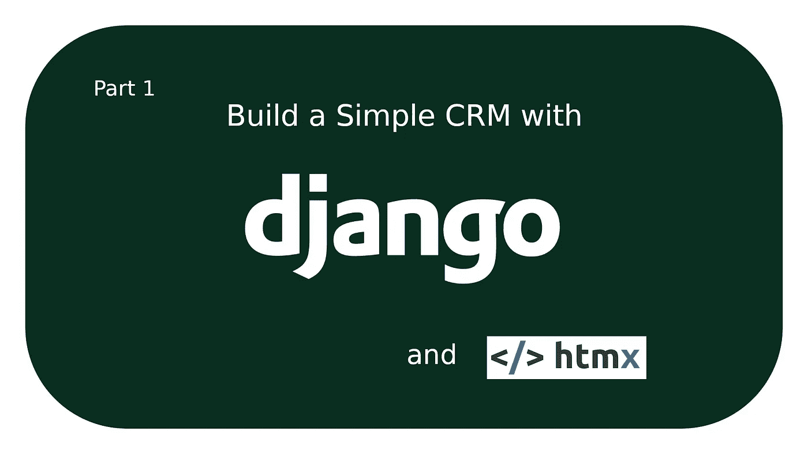
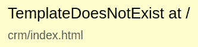

# 用 Django 和 HTMX 构建简单的 CRM 项目设置

> 原文：<https://betterprogramming.pub/build-a-simple-crm-with-django-and-htmx-project-setup-ea84f900e273>

## 后端开发简介



在我的上一篇文章中，我写到[应用名称空间](https://medium.com/@john1galiszewski/how-to-handle-full-page-reloads-with-django-and-htmx-a9a7ef2e4b1c#url-namespaces)供`django_htmx_refresh`应用使用。

现在，我们创建了**client _ relationship _ manager/URLs . py**文件，并将路径添加到我们的基本 CRUD 视图中。我们还将[向我们的 URL 模式](https://docs.djangoproject.com/en/4.0/topics/http/urls/#naming-url-patterns)添加名称，以执行 URL 反转。

## 视图

现在我们可以创建我们的视图。我们将为我们的主页和搜索结果页面继承`ListView`。其余的将是通用的 CRUD 视图。

注意每个视图是如何定义一个`template_name`的。`[HtmxResponseMiddleware](https://github.com/JohnGWebDev/django-htmx-refresh)`截取`template_name`属性，然后确定响应是否附加了 htmx 实例，并返回适当的模板。我们还将把一个`form_class`传递给`CreateClientView`和`UpdateClientView`

接下来，在`SearchResultsView`中，我们将覆盖`get_queryset`方法。在该方法中，我们将从请求中获取查询，通过给定的搜索查询过滤所有的`Client`对象，并返回结果。

最后，在创建、更新和删除视图中覆盖`get_success_url`。他们需要返回一条成功消息，并呈现正确的 URL。

## 形式

我们创建定制的表单类来为每个表单元素添加类选择器，而无需手动写出表单。它还允许我们在将来选择扩展表单功能。

## 启动服务器

让我们现在启动服务器，从进行必要的迁移开始。

```
python3 manage.py makemigrations
python3 manage.py migrate
```

然后通过运行下面的命令并按照终端中的提示创建一个超级用户。

```
python3 manage.py createsuperuser
```

现在，通过运行以下命令启动服务器:

```
python3 manage.py runserver
```

最后，在您的网络浏览器中访问 [http://127.0.0.1:8000/](http://127.0.0.1:8000/) 。您将看到一个类似于下图的`TemplateDoesNotExist`错误:



确保 Django 正在检查`templates/crm`中的`index.html`文件，如上图所示。如果不是，这意味着`HtmxResponseMiddleware`不知道`client_relationship_manager`应用程序，你需要检查`HTMX_APPS`的设置。

# 结论

后端已经准备好了。在本系列的第二部分中，我们将构建模板，并开始接触 htmx。如果你想了解更多关于我们今天在这里使用的`HtmxResponseMiddleware`的信息，我推荐你阅读我的第一篇文章。

**更新:**让我们在 [Django URL 名称空间](/build-a-simple-crm-with-django-and-htmx-project-setup-ea84f900e273#url-namespaces)

*   [Django 命名的 URL 模式](https://docs.djangoproject.com/en/4.0/topics/http/urls/#naming-url-patterns)*   [Django 表单小部件](https://docs.djangoproject.com/en/4.0/ref/forms/widgets/)