# 用 PostgreSQL 和 NodeJS 构建一个简单的笔记应用程序

> 原文：<https://betterprogramming.pub/build-a-simple-note-taking-app-with-postgresql-and-nodejs-7b9968f3469c>

## 如何将数据库集成到 NodeJS 应用程序中

Daria Nepriakhina 在 [Unsplash](https://unsplash.com?utm_source=medium&utm_medium=referral) 上拍摄的照片

在本文中，我们将了解:

*   何时使用 PostgreSQL
*   如何连接到 PostgreSQL 数据库。
*   使用 PostgreSQL 进行 CRUD
*   将 PostgreSQL 与 NodeJS 绑定

# 介绍

在编程领域，有两种知名的数据库解决方案: [MongoDB](https://www.mongodb.com/) 和 [PostgreSQL](https://www.postgresql.org/) 。虽然 MongoDB 是数据库管理的绝佳选择，但它不是关系数据库。虽然在集合之间建立关系是可能的，但是建立起来还是有些困难。由于这个原因，PostgreSQL 似乎是复杂和大型企业应用程序中的王者。

在本文中，我们将学习 PostgreSQL 的基础知识，并将它与 NodeJS 结合使用。在这个过程中，我们将致力于构建一个简单的笔记应用程序。

在本应用中，我们将创建以下功能:

创建便笺

此外，我们还可以让用户阅读每个笔记:

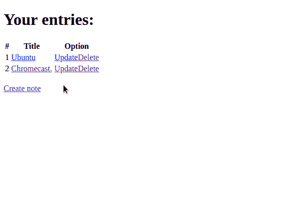

阅读笔记

用户也可以删除和更新他们的数据:

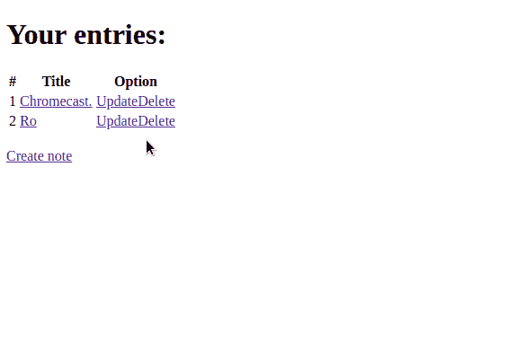

删除和更新注释

# 设置 PostgreSQL

## 创建服务器

在开始之前，我们需要一个正在运行的 PostgreSQL 服务器。我推荐使用 ElephantSQL，它会在云中为您设置一个 PostgreSQL 服务器。虽然它有最小的延迟，但它是可靠的，不需要任何配置。

为此，首先导航至 [ElephantSQL](https://www.elephantsql.com/) 网站，并点击“登录”:

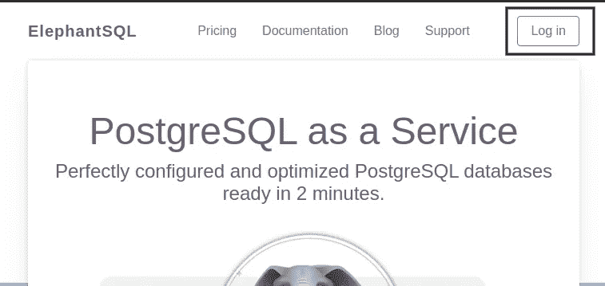

ElephantSQL 主页。点击“登录”

在那里，创建您的凭证:

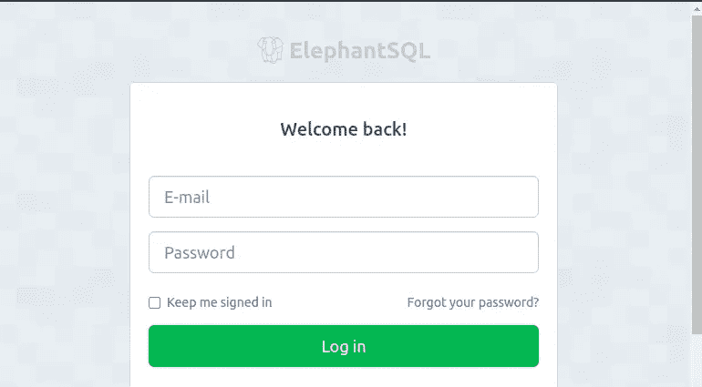

ElephantSQL 登录页面

然后你会被要求创建一个团队。为你的团队命名，然后点击“创建团队”

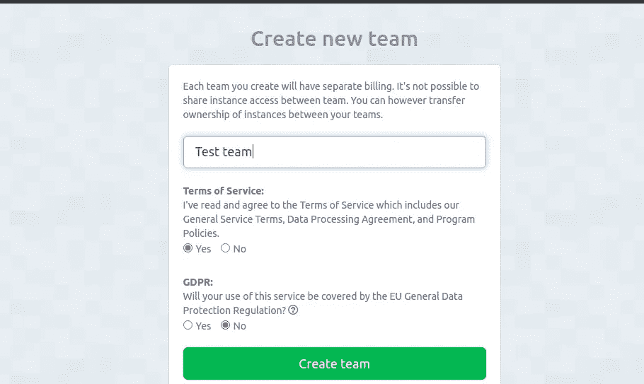

在 ElephantSQL 中创建团队

完成后，通过单击 Create New Instance 按钮创建一个实例。这允许您初始化 PostgreSQL 服务器。

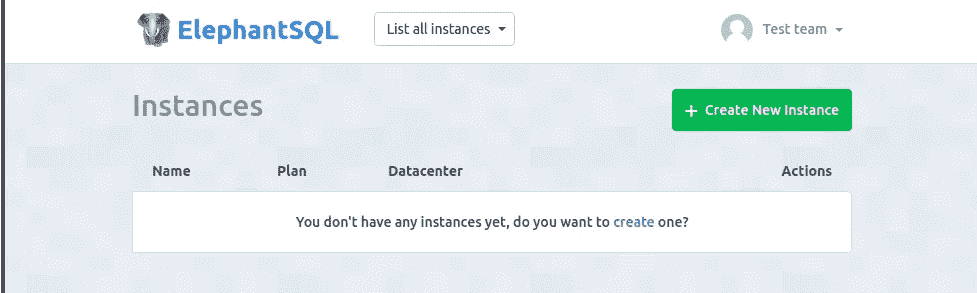

在 ElephantSQL 中创建实例

ElephantSQL 现在会要求您为新实例指定一个名称。确保你选择了小海龟(免费)计划。

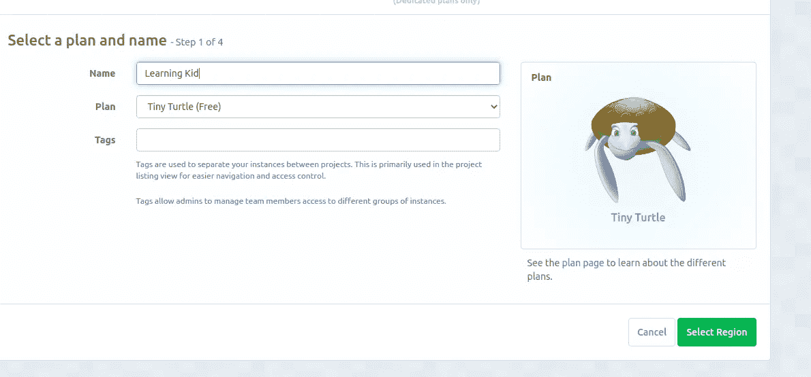

为我们的实例选择计划

此后，您将被重定向到您的仪表板页面。您新创建的服务器将可见:

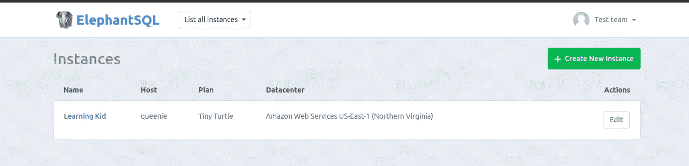

您的实例现在可见

单击您的实例将允许您访问服务器的详细信息页面，其中包含您的服务器的凭据:

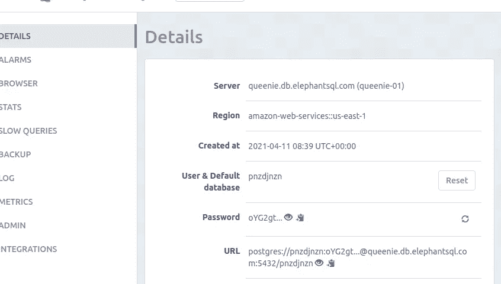

服务器信息

我们完事了。现在让我们在数据库中创建一个新表。

## 注释表

要在 PostgreSQL 中创建表，必须使用以下语法:

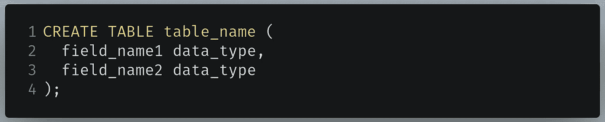

在 PostgreSQL 中创建表

这段代码意味着我们正在创建一个名为`table_name`的表，它将有两个字段。

要在我们的数据库中创建一个表，请单击侧面板中的 Browser。

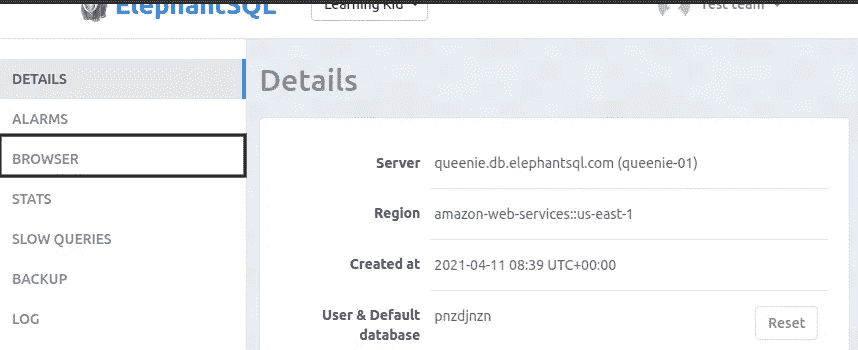

点击浏览器

浏览器页面允许您运行 SQL 命令。

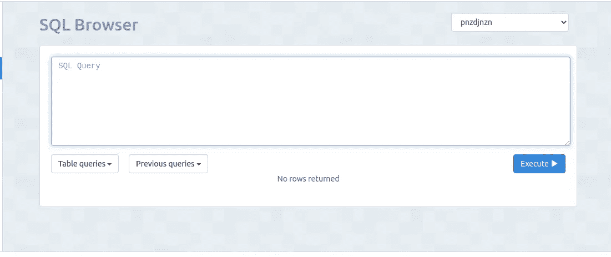

SQL 浏览器页面

在文本框中，编写以下代码:

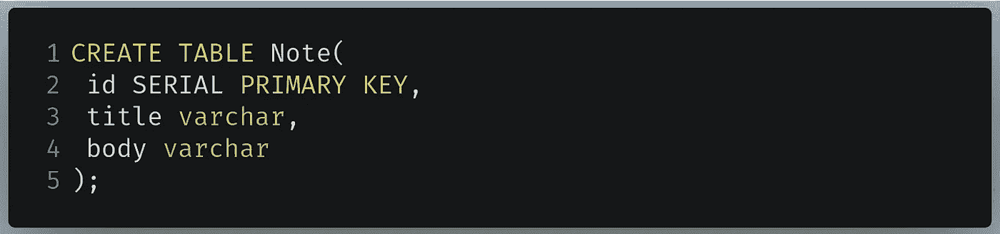

要在文本框中编写的代码

*   第 1 行:创建一个表，并将其命名为`Note`。
*   第 2 行:第一个字段是`id`，它将是这个表的主键。`SERIAL`关键字告诉 PostgreSQL 分配一个唯一的整数(在一个序列中)作为每个记录的主键。例如，第一条记录的`id`为 1，第二条记录的`id`为 2，以此类推。
*   第 3 行和第 4 行:创建一个数据类型为`varchar`的`title`和`body`字段。一个`varchar`本质上是一个字符串。

完成后，单击 Execute 按钮运行该命令。在下一节中，我们将设置 NodeJS 项目。

# 项目设置

## 项目初始化

首先，使用以下终端命令为您的应用程序创建一个目录:

创建目录的终端命令

然后像这样初始化您的项目:

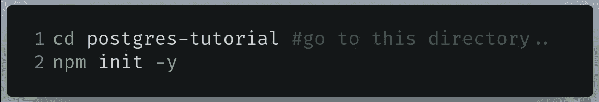

正在初始化项目

我们现在完成了这一步。在下一节中，我们将安装这个项目所需的模块。

## 模块安装

我们将安装以下软件包:

*   dotenv :管理我们的环境变量。
*   [Express](https://expressjs.com/) :这将有助于我们处理我们的路线。
*   摩根:记录我们所有的请求。
*   nodemon :这将在每次文件更改后重启我们的服务器。尽管是可选的，但它将在开发过程中节省时间
*   pg :使用我们的 PostgreSQL 服务器。
*   帕格:帕格将是我们 Express 项目的模板引擎。

要安装这些库，请在项目目录中运行以下命令:

安装模块

现在已经安装了依赖项，是时候编码了！

# 构建 Notes 应用程序

## 文件结构

我们先来讨论一下项目结构。在项目目录的根目录下，创建以下文件夹:

*   我们所有的 Pug 文件都会放在这里。他们将是这个项目的前端。
*   `routes`:我们的路线(`delete`、`update`、`read`、`create`)都会到这里。
*   这个文件夹将包含连接到我们的数据库所需的代码。

此外，在根目录中创建`index.js`文件。这将是我们项目的主要文件。

最后，创建一个`.env`文件。这将存储我们的环境变量。

最后，项目的文件夹结构应该如下所示:

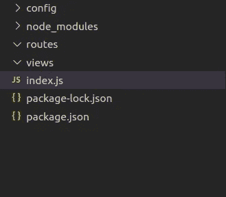

此项目的文件结构

现在让我们将我们的 ElephantSQL 数据库链接到我们的项目。

## 连接到我们的数据库

转到您的 ElephantSQL 实例页面并复制您的 URL:

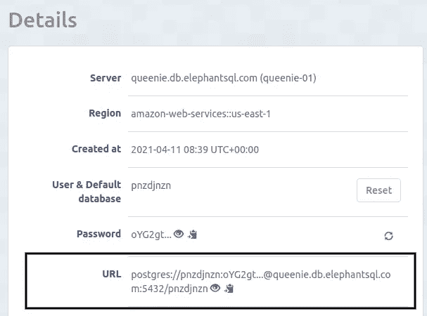

复制此 URL

下一步，在您的`.env`文件中编写以下代码:

要写入的代码。包封/包围（动词 envelop 的简写）

*   第 1 行:创建`PSQL_CONNECTION`环境变量。将数据库的连接 URL 粘贴到此处。

现在转到项目的`config`文件夹，创建一个名为`database.js`的新文件。在`config/database.js`中，编写以下代码:

这段代码复制自[节点-postgres](https://node-postgres.com/guides/project-structure) 文档页面。

*   第 1 行:导入`Pool`。这将帮助我们连接到数据库。
*   第 3 行:`connectionString`包含我们数据库的连接 URL。
*   第 4 行:初始化一个`Pool`实例，并将`connectionString`传入构造函数。这在我们的项目和数据库之间建立了一个连接。
*   第 8–10 行:导出`query`方法，该方法将运行 SQL 命令。

接下来，转到`index.js`并编写以下代码:

*   第 1–3 行:将我们的数据库 config、Express 和 Morgan 导入到我们的项目中。
*   第 6 行:告诉 Express 我们的视图引擎将被 Pug。
*   第 7 行:这个中间件解析带有`urlencoded`有效负载的传入请求，并且基于`body-parser`。
*   第 10 行:处理`/`目录。
*   第 11–14 行:这将是我们的查询。这里，我们告诉 PostgreSQL 列出我们在数据库中的所有记录。最后按`id`升序显示。
*   第 15 行:运行查询。
*   第 16 行:注销 JSON 输出，它包含数据库中记录的列表。
*   第 19 行:告诉 Express 在端口`3000`上运行这个应用程序。

使用终端命令运行程序:

运行程序的终端命令

现在去`localhost:3000/`。这将是输出:

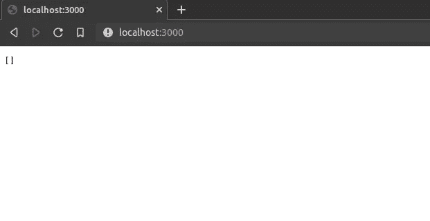

代码的输出

如你所见，我们得到了一个空数组。这是因为我们的数据库中没有数据。

在下一部分，我们将致力于我们的用户界面。

## 通过前端显示数据

在你的`views`文件夹中，创建一个名为`index.pug`的文件。该文件将在用户位于`/`(根)页面时呈现。

在`views/index.pug`中，编写以下代码:

*   第 8 行:`n`变量将显示数据库中存在的商品数量。
*   第 9 行:创建一个`table`元素、一个`tr`元素和三个`th`元素。
*   第 15 行:执行[迭代](https://pugjs.org/language/iteration.html)来告诉 Pug 它必须创建一个`tr`和三个`td`元素。
*   第 20 行:`data`对象将被传递给`index.pug`文件，该文件将包含数据库记录的数组。这里，我们只想显示每个项目的`title`字段。
*   第 22 和 23 行:这些锚元素将用户重定向到`update`和`delete`路线。

接下来，在您的`views`文件夹中创建一个`read.pug`文件。`read.pug`文件将显示所选记录的标题和正文。

在`views/read.pug`中，编写以下代码:

*   第 4 行:将页面标题设置为记录的`title`字段。
*   第 10–12 行:将用户重定向到`update`和`delete`页面。`id`是一个参数。
*   第 14 行:将用户重定向到主页。

完成后，在您的`views`目录中创建一个名为`update.pug`的文件。在`views/update.pug`中，编写以下代码:

*   第 8 行:告诉帕格，如果表单被提交，那么执行一个对`/update`的`POST`请求。
*   第 9 行:创建一个文本字段，它当前包含了`title`字段的值。
*   第 14 行:构建一个包含`body`字段值的文本区域。

最后，在您的`views`文件夹中创建另一个文件，并将其命名为`create.pug`。在`views/create.pug`中，编写以下代码:

`create.pug`中的代码类似于我们的`update.pug`文件中的代码。

*   第 8 行:当提交表单时，对`create`路径执行一个`POST`请求。

我们完事了。让我们来测试一下。在`/index.js`中，找到以下代码行:

要在 index.js 中查找的代码

像这样改变它:

index.js 中要替换的代码

*   第 1 行:告诉 Express 呈现`index.pug`页面，并将`rows`值作为数据发送。

运行代码。这将是结果:

代码的输出

太好了！我们的代码有效。在本文的下一部分，我们将让用户创建新的笔记。

最后，`/index.js`应该是这样的:

## 创建便笺

要将数据插入表中，必须使用以下语法:

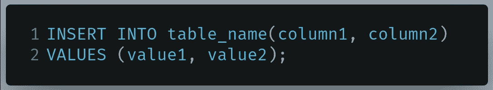

PostgreSQL 中向表中插入值的语法

在您的`routes`文件夹中，创建一个名为`create.js`的文件。在`routes/create.js`中，编写以下代码:

`create.js`文件处理从`create`开始的所有路线。

*   线 5:处理`/create`路线。在这里，`create.pug`文件将被渲染。
*   第 9 行:处理`POST`对`/create`的请求。
*   第 11 行:这将是我们的查询。这里我们告诉 PostgreSQL 将数据插入到我们的`Note`表中。`$1`和`$2`是稍后将被传递到我们的查询中的参数。
*   第 16 行:将传递到查询中的参数存储在我们的`values`变量中。这里我们提取`create.pug`中表单的值。有关参数化查询的更多信息，请参见 node-postgres 文档。
*   第 17 行:运行这个查询。
*   第 19 行:最后，将用户重定向到主页。
*   第 22 行:导出这个`router`实例，以便在我们的项目中使用。

我们的最后一步是告诉快递，我们的`create/`航线将由`create.js`处理。

在`/index.js`中，先导入`create.js`这样:

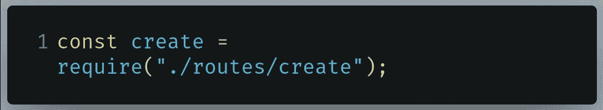

要写入 index.js 的代码

最后，在`/index.js`中写下下面一行:

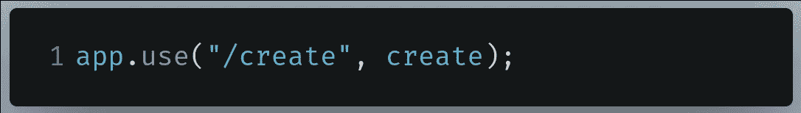

要写入 index.js 的代码

*   第 1 行:告诉 Express 如果路线以`/create`开头，那么运行`create.js`文件中的代码。

运行代码。这将是结果:

代码的输出

瞧啊。我们的代码按预期工作。在下一节中，我们将让用户在点击时阅读他们的笔记。

最后，`index.js`应该是这样的:

## 读一张便条

要从表中读取数据，必须使用以下语法:

从记录中读取数据的语法

在您的`routes`文件夹中，创建一个名为`read.js`的文件。该文件将处理从`/read`开始的路线。

在`routes/read.js`中，编写以下代码:

*   线 5:处理`/read`路线。`id`将是一个参数。
*   第 6 行:这个查询要求找到带有匹配`id`的笔记，然后显示给用户。
*   第 10 行:URL 中的`id`参数将是我们的 SQL 命令的参数。
*   第 11 行:运行查询。
*   第 12 行:呈现`read.pug`文件，并将 SQL 命令返回的数据发送到页面。

完成后，我们需要将它链接到我们的项目。在`/index.js`中，写下这一行来导入`read.js`:

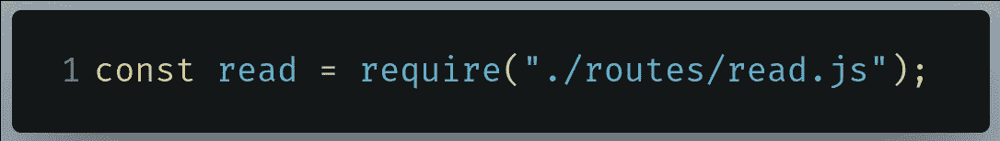

要写入 index.js 的代码

接下来，编写以下代码:

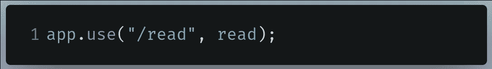

要写入 index.js 的代码

这实际上告诉 Express，我们以`/read`开始的路线现在将由`read.js`处理。

运行代码。这将是结果:

代码的输出

太好了！我们的代码按预期工作。现在让我们允许用户编辑他们的笔记。换句话说，我们需要更新功能。

最后，`index.js`应该是这样的:

## 更新注释

要更新 PostgreSQL 中的记录，您将使用以下语法:

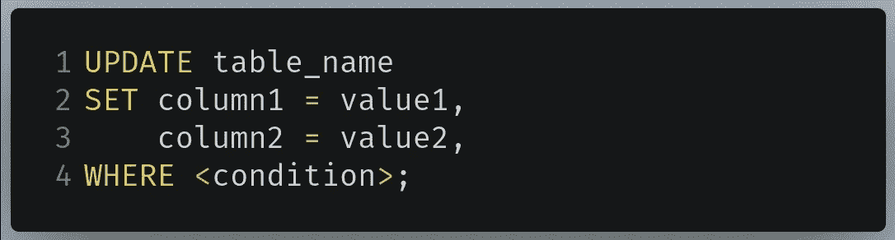

在 PostgreSQL 中更新数据的语法

在你的`routes`文件夹中，创建一个名为`update.js`的文件。这个文件将处理所有以`/update`开始的目录。

在`routes/update.js`中，编写以下代码:

*   第 5 行:处理对`/update`路线的`GET`请求。`id`将是一个参数。
*   第 6 行:我们的 SQL 命令告诉 PostgreSQL 检索具有特定`id`的数据。在这种情况下，`id`是一个参数。
*   第 10 行:`id`参数是从 URL 中获取的。
*   第 11 行:运行查询。我们将 URL 的`id`参数作为参数传递给 SQL 命令。
*   第 12 行:呈现`update.pug`页面。
*   第 15 行:处理`POST`对`/update`的请求。
*   第 17 行:我们的查询告诉 PostgreSQL 找到带有`$3`(一个参数)的特定`id`的记录，并将它的`title`和`body`字段分别更改为`$1`和`$2`。
*   第 23 行:SQL 查询的参数是表单中的值和`id`参数。
*   第 26 行:当一切都完成后，将用户重定向到`/`页面。

我们现在已经完成了更新功能。转到`/index.js`并像这样导入`update.js`:

要写入 index.js 的代码

现在我们需要告诉 Express，所有以`/update`开始的路线都将由`update.js`处理。为此，在`/index.js`中编写以下代码:

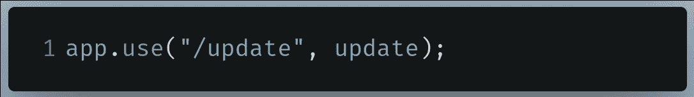

要写入 index.js 的代码

运行代码。这将是结果:

代码的输出

我们的代码有效！在下一部分，我们将允许用户删除他们的笔记。

最后，`/index.js`应该是这样的:

## 删除便笺

要从 PostgreSQL 表中删除记录，必须使用以下语法:

PostgreSQL 中从表中删除数据的语法

在您的`routes`目录中，创建一个名为`del.js`的文件。该文件将处理从`/delete`开始的所有路线。

在`routes/delete.js`中，编写以下代码:

*   第 5 行:处理对`delete/`页面的`GET`请求。URL 中出现的`id`将是参数。
*   第 6 行:我们的查询告诉 PostgreSQL 查找包含`$1`的`id`的记录。如果找到，则将其从数据库中删除。
*   第 11 行:`id`参数将是我们的 SQL 查询的参数。
*   第 14 行:最后，将用户重定向到`/`。

现在转到`/index.js`并将`del.js`导入到您的项目中，如下所示:

要写入 index.js 的代码

最后我们要告诉 Express 所有以`delete`开头的路线都将由`del.js`处理。为此，在`/index.js`中编写以下代码:

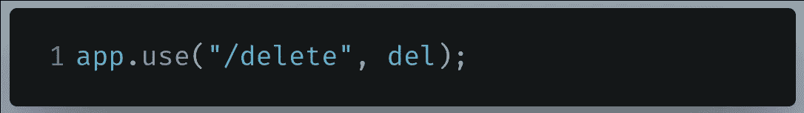

要写入 index.js 的代码

运行代码。结果应该是这样的:

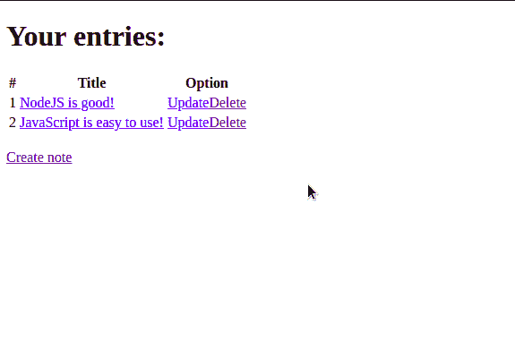

代码的输出

太好了！如你所见，`delete`路线被`del.js`妥善处理。我们的代码按预期工作。在下一部分，我们将简要回顾一下我们所学的内容。

最后，`/index.js`应该是这样的:

# 概述

*   用特定的`id`显示数据:

显示数据的语法

*   要删除具有特定`id`的便笺:

删除数据的语法。

*   要更新记录，请执行以下操作:

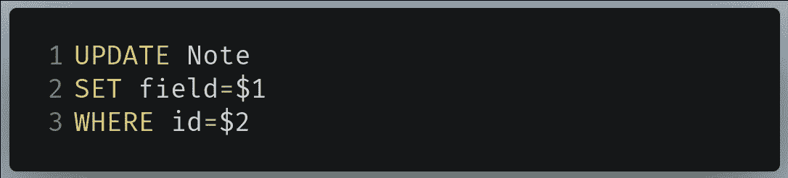

更新数据的语法

*   要创建:

创建数据的语法

# 外部资源和 GitHub 代码

## GitHub 知识库

*   [该项目的代码](https://github.com/HussainArif12/postgres-notes-tutorial)

## 外部资源

*   [PostgreSQLTutorials](https://www.postgresqltutorial.com/)
*   [带有节点后缀的查询](https://node-postgres.com/features/queries)
*   [PostgreSQL CRUD—log rocket](https://blog.logrocket.com/nodejs-expressjs-postgresql-crud-rest-api-example/)

# 结论

使用 PostgreSQL 绝对是轻而易举的事情。查询和运行 SQL 命令相当容易，有助于开发人员构建安全且有弹性的应用程序。难怪像苹果和 Spotify 这样的大公司会在他们的生产环境中使用 PostgreSQL。

如果你在这个项目中遇到任何困惑，那么鼓励你使用代码来更好地理解程序。

非常感谢您的阅读！