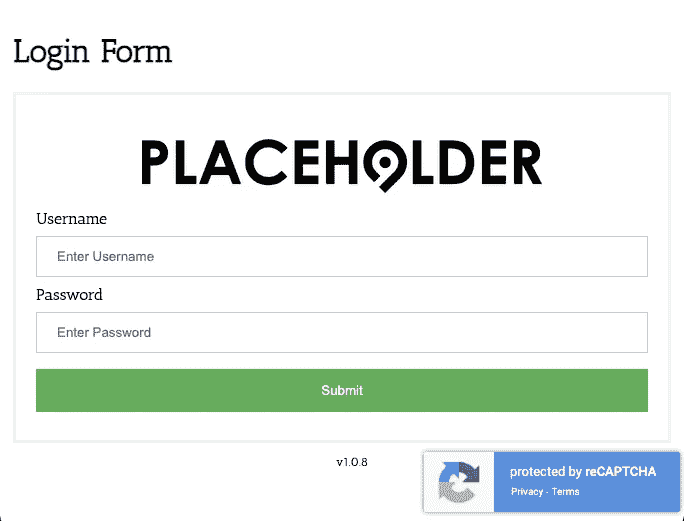
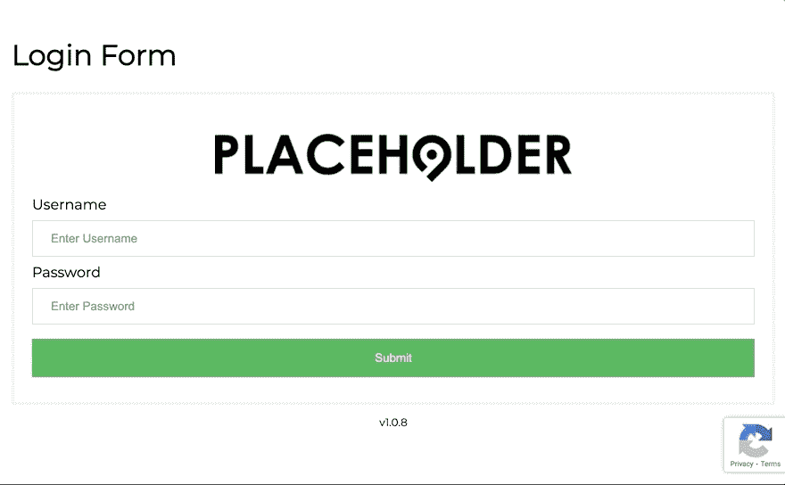
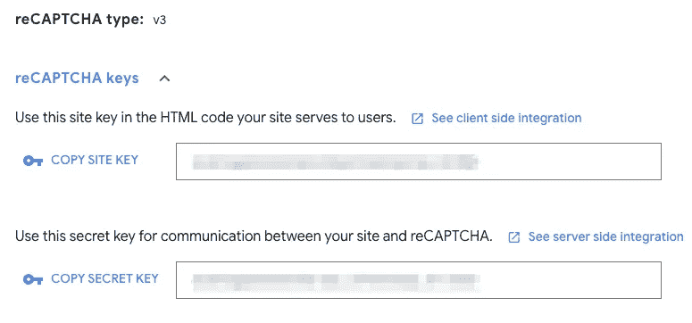
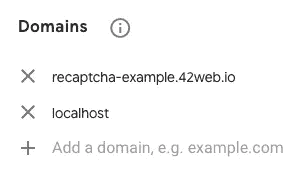

# 用 reCAPTCHA v3 构建一个简单的 PHP 登录表单

> 原文：<https://betterprogramming.pub/build-a-simple-php-login-form-with-recaptcha-v3-d3362805e661>

## 使用公共资源登录的通用用户名和密码



作者照片。来自 placeholder.com[的标志](https://placeholder.com/logos/)。

# 目录

```
· [Introduction](#3dd4)
· [reCAPTCHA v3](#11e3)
· [Index.php](#b100)
· [form.php](#1699)
· [page.php](#4d64)
· [download.php](#670f)
· [logout.php](#1817)
· [style.css](#b926)
· [Conclusion](#42de)
· [Reference](#ab67)
```

# 介绍

我妻子用 WordPress 写博客，用 Dropbox 和她的时事通讯订阅者分享她的 PDF 资源。她与用户分享 Dropbox 链接。如果你有网址，每个人都能看到，她也不介意。

她想把 Dropbox 中的资源转移到自己的网站上。她四处寻找一个简单的登录插件，访问者可以使用一个共同的用户名和密码。她也想安装 reCAPTCHA。在尝试了一些 WP 插件后，她放弃了。她找不到自己想要的，就让我想办法解决。

为了让它使用起来非常简单，我没有使用 Composer、数据库或任何库。

您可以在 reCAPTCHA 上观看演示[。](http://recaptcha-example.42web.io/index.php)

*   用户名:演示
*   密码:密码



# reCAPTCHA v3

[reCAPTCHA v3](https://developers.google.com/recaptcha/docs/v3) 不需要用户交互。这是一种基于分数的 ReCaptcha 方法。reCAPTCHA v3 可以测试一个网站的[人类与机器人的活动](https://developers.google.com/search/blog/2018/10/introducing-recaptcha-v3-new-way-to)，通过返回一个分数来告诉你一个交互有多可疑。

> reCAPTCHA v3 在没有用户摩擦的情况下为每个请求返回一个分数。分数基于与您的网站的交互，使您能够对您的网站采取适当的措施。”— [reCAPTCHA v3](https://developers.google.com/recaptcha/docs/v3)

首先，[注册一个新站点](https://www.google.com/recaptcha/admin/create)并从 Google reCAPTCHA 管理站点获取站点密钥和秘密密钥。



新注册后的站点密钥和秘密密钥

对于开发，您可以将 localhost 添加到 Domains 字段。显影后就可以去掉了。



您可以在“域”字段中添加本地主机。

# Index.php

*   第 10 行:我使用了谷歌字体。
*   第 15 行:调用`session_start()`来使用会话变量。
*   第 18-25 行:如果设置了一个“安全的”会话，并且会话内容是“安全的”，我们使用`download.php`。否则，我们用`form.php`。

# form.php

*   第 1 行和第 23 行:用您的站点密钥替换`your-recaptcha-site-key`。
*   第 5-8 行:当 URL 有一个`err`变量并且它的值是`400`时，显示一条错误消息。参见`page.php`。
*   第 10-27 行:提交表单时使用`page.php`。我们使用用户名和密码作为输入字段。为 ReCaptcha 响应添加隐藏的输入字段。
*   第 28-35 行:使用`grecaptcha`对象中的`[execute](https://developers.google.com/recaptcha/docs/v3)`方法和 ReCaptcha 站点键。将返回的令牌存储到`recaptchaResponse`。

# page.php

*   第 2 行:调用`session_start()`来使用会话变量。
*   第 4-7 行:设置变量。您可以更改`$username`和`$password`值。
*   第 12 行:更改`your-recaptcha-secret-key`。
*   第 9-29 行:检查`$_POST['uname']`是否置位，`$_POST['uname']`是否等于`$username`值，`$_POST['psw']`是否等于`$password`值。
    如果失败，我们重定向到 URL 中带有`err=400`的索引页面。使用`file_get_contents`获取 ReCaptcha 响应，它将内容读入一个字符串。使用`json_decode`方法将字符串改为 JSON。
    如果响应的成功值为`true`，则其得分高于 0.5，并且其操作为“提交”，则将`secured`会话设置为“安全”。然后重定向到`index.php`。如果失败，那么重定向到 URL 中带有`err=400`的索引页面。

# download.php

*   第 2-4 行:链接到`logout.php`。
*   第 12 行:使用`glob`函数找到所有的 PNG 文件。
*   第 13-17 行:下载目录保存了与 PNG 和 PDF 同名的文件(例如`file.pdf`、`file.png`)。我们使用 PNG 文件作为图像，使用 PDF 文件作为使用`download`属性的链接。当访问者点击一张图片时，它会下载它的 PDF 文件。

# logout.php

调用`session_start()`使用会话变量并销毁会话。我们重定向到一个网页。

# style.css

我在`.container .gallery`类中使用了 flex。

你可以在 GitHub 上看到`style.css` [。](https://gist.github.com/shinokada/4afc8cc2ffc3bfcb01a0ea3335a8cff5)

# 结论

这种方法易于设置和维护，因为您不需要使用数据库。如果你不介意访问者能够分享你的网址和登录信息，这可能是一个很好的解决方案。

请在[Github 回购](https://github.com/shinokada/recaptcha-demo)中找到代码。

**通过** [**成为**](https://blog.codewithshin.com/membership) **会员，获得媒体上所有故事的访问权限。**


[https://blog.codewithshin.com/subscribe](https://blog.codewithshin.com/subscribe)

# 参考

*   [如何将 Google reCAPTCHA v3 添加到 PHP 表单的示例](https://code.tutsplus.com/tutorials/example-of-how-to-add-google-recaptcha-v3-to-a-php-form--cms-33752)