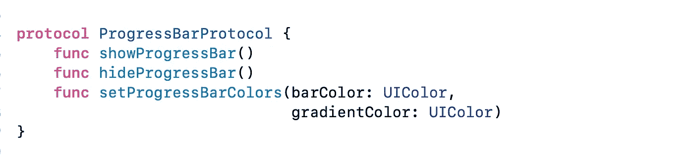
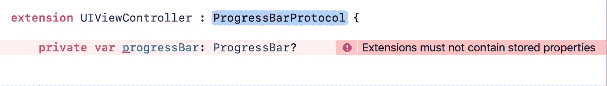
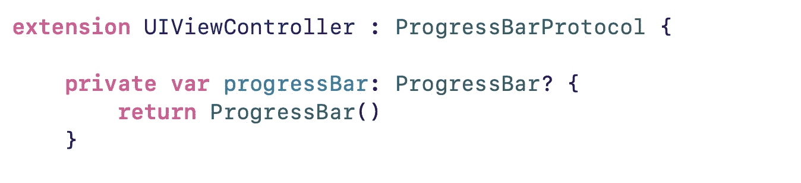
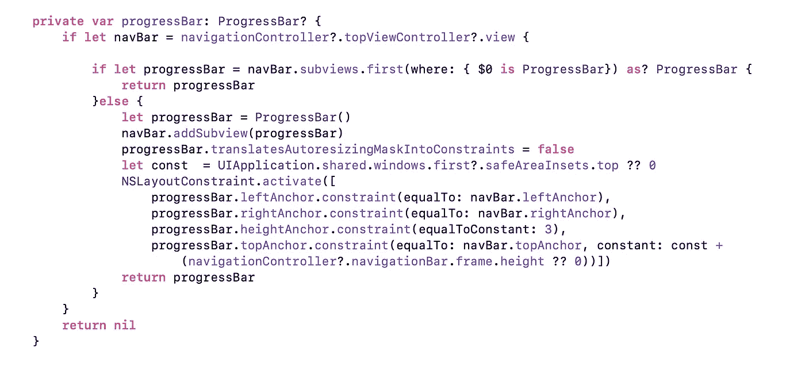
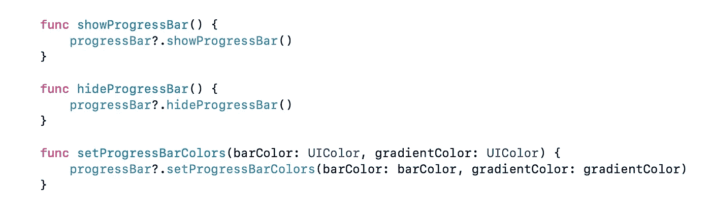

# 创建一个简单的进度条，你可以把它添加到你的应用程序的任何地方

> 原文：<https://betterprogramming.pub/build-a-simple-progress-bar-you-can-add-anywhere-in-your-app-27330ef6dba7>

## 在不到一分钟的时间内将进度条添加到任何屏幕上


如今，我们在许多应用程序中都可以看到进度条。在检查相关文章和代码时，我注意到许多人关注于如何创建进度条，但没有同样重视以通用或可重用的方式编写进度条，以便我们可以轻松地将其集成到任何屏幕中。

在这里，我试图使一个进度条在任何屏幕上都易于使用。

首先，我们将创建一个进度条，然后，我们将看到如何使它成为一个通用组件。

# 进度条的创建

为了创建进度条，我们需要一个协议，所以我声明如下:

## 为进度条声明协议



进度条协议

我知道你在想什么:这里真的需要吗？

答案是肯定的，我们很快就会知道为什么需要它。

## 现在我们正在创建进度条

**注意:**在阅读其他关于进度条的文章时，我发现其中最好的一篇文章是 Marina Sauca 解释了我们如何创建进度条。所以我使用了那些代码，并根据我们的要求做了必要的修改。

在故事的开始，我在这篇文章中说过，我们关注的是如何将进度条作为一个通用组件，可以很容易地在任何屏幕上使用，所以这里我跳过了进度条视图的解释。如果你有兴趣，[阅读前面提到的文章](https://medium.com/flawless-app-stories/custom-progress-bars-dc1c1c111751)。

现在我们有了进度条，让我们继续我们的故事。

# 这里，这个故事的主要部分开始了

那么，我们如何使它通用并适用于所有屏幕呢？

简单:创建一个父视图控制器，并将其添加到那里。继承所有我们需要的屏幕。

抱歉，我们不能这样做，因为在我们的应用程序中，我们有不同类型的屏幕，如`UIViewController`、`UITableViewController`和`UICollectionView`，所以没有父类可以添加这些。

好的，我们将在`UIViewController`上写一个扩展，在那里写代码并添加到视图中。

**注:**抱歉，如果在`tableView`和`collectionView`下方的`UITableViewController`和`UICollectionViewController`的原图中看到，不能更改`tableView`和`collectionView`的边框。因此，在这种情况下，您可以添加它，但它不会在所有情况下都可见。

那么，我们应该如何以及在哪里添加这个进度条，使其可见并易于访问呢？

我们要做的是当用户显示进度条方法时，我们将在视图上添加进度条。而当用户隐藏进度条方法时，那么我们就隐藏它。

现在我们有一个可以添加它的地方。另一个问题是在哪里写代码。

所以我们在这里写了一个对`UIViewController`的扩展。

嘿，现在我们有了所有问题的答案，所以让我们写代码。

**注意:** 在创建进度条视图之前，我们已经在协议上声明了它(是的，我们需要它)。在这里我解释一下为什么我们需要它。

我们在`UIViewController`上编写扩展并采用相同的协议，这反过来又采用了`ProgressBarView`。通过这样做，我们将可以访问协议中声明的所有方法。你可以在下面看到扩展的框架:

```
extension UIViewController : ProgressBarProtocol {
    func showProgressBar() {

    }

    func hideProgressBar() {

    }

    func setProgressBarColors(barColor: UIColor, 
                         gradientColor: UIColor) {

    }
}
```

首先，我们需要`ProgressBar`对象。然后，我们可以显示、隐藏或改变它的颜色。

如果我们尝试在扩展中声明一个变量，我们会得到这样的结果:



现在，我们该怎么办？

*   扩展不能包含存储属性，但是我们可以将其声明为 closer。



是的，这编译成功。所以让我们添加所需的代码。



让我们一行一行地讨论上面的代码。

*   在第一种情况下，我们得到了 t `opViewController`视图。
*   在第二个条件中，我们检查是否已经给`view`添加了一个`progressBar`。这里，我们避免为同一个屏幕创建新的对象。我们为此添加了约束。我们将`progressBar`高度设置为`3`。

现在是时候将代码添加到其他协议方法中了:



正如你在上述所有方法中看到的，我们只是将方法调用传递给协议。由于协议的原因，这看起来更简单。(这里我们对`UIViewController`和`ProgressBar`使用相同的协议。)

这里，我考虑到我们在所有屏幕上都需要这个`ProgressBar`，所以我直接在`UIViewController`上写了一个扩展。如果我们在一些屏幕上需要它，我们需要在`ProgressBarProtocol`上写一个扩展，我们可以在需要的屏幕上采用这个协议。

## 是时候在我们的屏幕上使用代码了

正如你在`fetchImage()`方法代码中看到的，我们在 API 调用之前调用`showProgressBar()`方法，一旦我们得到它的响应，我们就调用`hideProgressBar()` 方法。

如果你想让`progressBar`变成不同的颜色，那么你需要调用下面的方法:

```
setProgressBarColors(barColor: .red, gradientColor: .yellow)
```

等等，还有一件事。让我们在导航栏上添加一个进度条，这样就有了导航栏的一个实例:

感谢阅读！