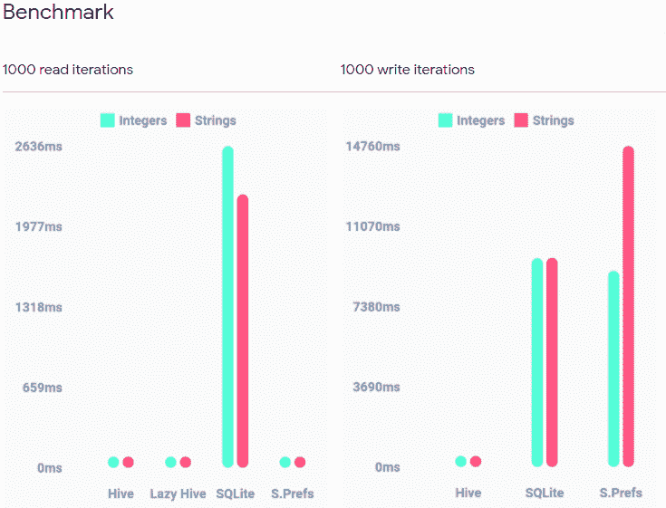
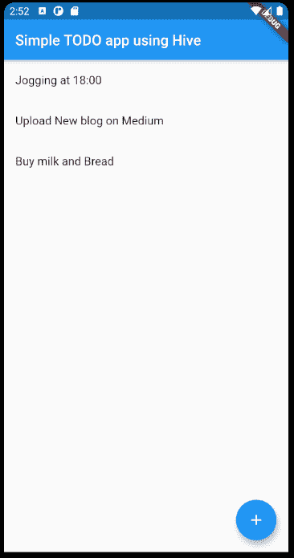
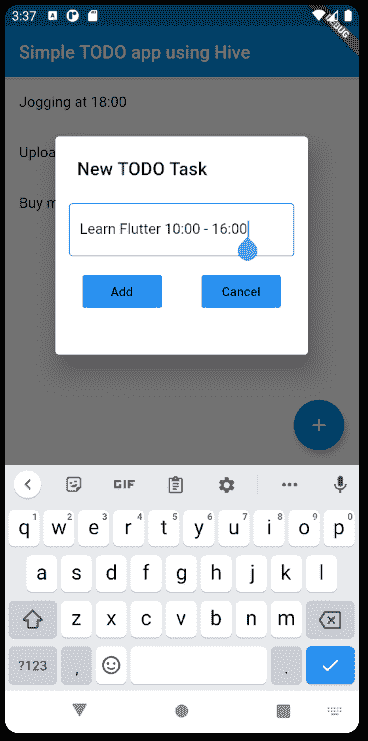

# 使用 Hive 数据库构建一个简单的待办事项颤振应用程序

> 原文：<https://betterprogramming.pub/build-a-simple-to-do-app-using-hive-database-2a61331c9e75>

## Hive 是最好的本地存储数据库吗？让我们找出答案。


照片由[openclipbart-Vectors](https://pixabay.com/users/openclipart-vectors-30363/)在 [Pixabay](https://pixabay.com/vectors/bee-beehive-hive-honey-honeycomb-2022492/) 上拍摄

我想在我的应用程序中添加一个本地数据库。所以我开始寻找一个优秀的库来实现我的应用程序。我还遇到过 [localstorage](https://pub.dev/packages/localstorage) Flutter 库，它使用 JSON 实现来存储数据。但是不像 Hive 那么费力。所以我开始在我的应用程序中实现 Hive。

在我们开始之前，我只是想告诉你，决不，我是一个在颤振方面的专家。我和你们一样在学习颤振。这只是我的一点小小的尝试，让初学者学习 Flutter 和 Hive 数据库更容易一点。所以如果你有任何建议，请在评论区写下。

# **什么是蜂巢？**

Hive 是一个用纯 Dart 编写的轻量级、速度极快的键值数据库，灵感来自于 [Bitcask](https://en.wikipedia.org/wiki/Bitcask) 。

更多信息可以在 Hive 的官方[文档](https://docs.hivedb.dev/#/)上找到。

# **为什么是蜂巢？**

它具有以下特点:

*   跨平台:移动、桌面、浏览器
*   高性能(参见[基准](https://pub.dev/packages/hive#benchmark))
*   简单、强大、直观的 API
*   内置强加密
*   没有本机依赖项
*   含电池



图片来自 Hive 官方[文档](https://pub.dev/packages/hive)

我爱上了 Hive 数据库，因为它简单、快速、高效。它也是一个本地存储数据库。因为简单所以学起来超级快。

我将在这篇博客中回顾下面的步骤，同时构建一个真正的应用程序。

*   在 Hive 数据库中读取和写入数据的一些有用指令的概述
*   项目设置
*   创建类型适配器
*   写入和读取数据
*   删除数据

在我们跳到这个例子之前，让我们快速浏览一下 Hive 提供的一些有用的指令。

# 先决条件

你应该对 Flutter 有基本的了解，比如如何创建一个 Flutter 项目，小部件是什么等等。

# 将数据写入数据库

Hive 将所有数据存储在盒子中。更简单地说，hive box 就像 SQL 中没有任何结构的表，它可以包含任何内容。我们可以创建多个盒子来组织数据，也可以存储加密数据来保护敏感数据。在大型 app 中是有优势的。

在我们开始往盒子里写东西之前，我们必须打开一个盒子。

```
var box = await Hive.openBox<E>(‘boxName’);
```

其中`E`是可选的类型参数。它提供了框中值的类型。

还有一种东西叫`Hive.openLazyBox()`。它用于大型数据库，因为它不会将所有数据加载到内存中。但是我们的例子很简单，所以我们将使用一个普通的盒子。但是您可以在 hive 文档中查看更多关于[懒惰盒](https://docs.hivedb.dev/#/advanced/lazy_box)的信息。

有多种方法可以用来将数据写入数据库。

您可能已经注意到，键必须是 String 或 int。

在我们的例子中，我们将使用`box.add()`指令。让 Hive 处理索引会更容易，我们可以处理输入数据。这使得通过 listview 构建器迭代所有数据变得更加容易。

# 从蜂箱数据库中读取

从数据库中读取数据非常简单，如下所示:

```
var box = Hive.box('myBox');// .get instruction return stored data at given key.// return default value incase of key does not existString name = box.get(‘key’, defaultValue: -1);// use for an existing indexString name = box.getAt(int index);
```

现在你应该明白我为什么要使用`box.add()`指令了，因为它会在每次添加数据时自动创建一个 int 索引。我们可以通过在`box.getAt()`中提供一个特定的索引来直接读取数据。当我们使用这个指令来添加和读取数据时，在示例中会更有意义。

# 从配置单元数据库中删除数据

删除数据也超级简单。

```
var box = Hive.box('myBox');// deletes the given key and databox.delete(‘key’);// deletes the nth key and databox.deleteAt(int index);
```

在示例中，我们将使用`box.deleteAt()`通过 listview builder 更有效地删除数据。

还有更多读取、写入和删除数据的指令。但是为了使这篇博客简短，我只提到了其中的几个。如果您对其他指令感兴趣，那么您可以查看 Hive [文档](https://docs.hivedb.dev/#/)。

# 使用 Hive 数据库的简单待办事项应用程序

学习新事物的最好方法是实践。因此，我们将使用 Hive 数据库构建一个简单或最简单的 TODO 应用程序。但是你可以随意添加更多的特性。请记住，我的重点更多的是展示如何使用 Hive 数据库，而不是如何构建 TODO 应用程序。

为了使我的解释更易于管理，我还将在代码中写一些描述作为注释。

因此，没有进一步的原因，让我们进入例子。

我假设你已经了解了一些关于 Flutter 的知识，比如如何创建一个新的 Flutter 项目，如何将包添加到项目的`pubspec.yaml`文件中，等等。

将以下几行添加到项目的`pubspec.yaml`文件中:

# 让我们开始编写 Todo 应用程序

在 Flutter 版本 1.20 中，如果我们在 main 函数中运行 async 函数，那么它将抛出“ *FlutterError(在绑定初始化之前访问了 servicesbinding . defaultbinarymenger*”。为了避免这个错误，你必须添加`WidgetsFlutterBinding.ensureInitialized()`作为主函数的第一行。

要初始化 Hive，我们需要给出它存储数据的目录的路径。这可以通过下面两行来完成:

```
*final* applicatonDocumentDir =await path_provider.getApplicationDocumentsDirectory();Hive.init(applicatonDocumentDir.path);
```

现在我们的主要函数看起来像这样:

如下所示，除了将标题从“Flutter Demo”更改为“Simple TODO App Using Hive”之外，我没有对预生成类的`MyApp`类进行任何重大更改

为了使这个例子简单，我将在一个名为`task_model.dart`的不同文件中创建一个介绍性的任务类，它只有一个名为 Task 的属性。

```
class Task{String task;Task({this.task});}
```

配置单元仅支持以下数据类型:

*   （同 Internationalorganizations）国际组织
*   线
*   目录
*   地图
*   日期时间

`Task`类只有一个属性，所以我们当然可以将直接任务存储到数据库中，正如我所说的 String 是一种受支持的数据类型。但是我假设`Task`是一个更重要的职业。将来您可能会添加更多的属性。

我们不能使用`*Hive.add(Task(task:’ goto gym’))*`将任务直接存储到数据库中。我们必须为类`Task`创建一个`TypeAdapter` 。还有另一种方法将对象转换成 JSON 字符串，但是我认为使用`TypeAdapter` 是更好的方法。

先造一个`TypeAdapter`吧。制作`TypeAdapter` 的最好方法是自动生成`TypeAdapter`代码，而不是手工编写。这样，我们可以避免许多打字错误，节省大量时间(这里它只是一个简单的类，但是在复杂的类中，自动生成非常方便)。

为了自动生成`TypeAdapter`，我们需要从`Hive_generator`包中获得帮助，我们已经将它添加到了`pubspec.yaml`中。现在我们必须向我们的`Task`类添加以下代码行:

唯一要记住的是，我们必须用 part 关键字编写完全相同的模型文件名称，然后给它添加一个“. g.dart”扩展名。我已经创建了一个名为`task_model.dart`的单独文件。因此我在这里写了`task_model.g.dart`。

这就是你在课堂上要做的一切。现在是魔法时间。在项目目录内的终端中运行以下命令:

```
flutter packages pub run build_runner build
```

该命令将自动生成一个新文件，该文件具有给定的文件名和' part '关键字。在我们的例子中，它被称为`task_model.g.dart`，如下所示:

仅仅生成`TypeAdapter` 是不够的，我们还必须在初始化 hive 后通过将`Hive.registerAdapter(TaskAdapter())`添加到主函数中来注册它，我还创建/打开了一个“TODOs”框来添加 todo 任务。现在，主函数将如下所示:

现在让我们设计并创建一个主页。主页将如下所示:



作者图片

如上图所示，我已经用我的主页的名字创建了一个有状态的小部件，它返回一个支架小部件。在 scaffold 小部件中，我添加了一个标题为“使用 Hive 的简单待办事项应用程序”的 appbar。在正文中，我添加了一个`ValueListenableBuilder`小部件。

如果我们只使用 use `Listview.Builder`，那么每次我们在数据库中添加一个新条目时，我们都必须手动重建 UI，这不是一个好主意。这就是我使用`ValueListenableBuilder`小部件的原因。

我注意到在其他没有更新的 Hive 教程中，人们使用了`WatchBoxBuilder`小部件。在最新版本的 Hive (hive 1.4.3)中已经贬值了。因此，我使用了`ValueListenableBuilder`小部件。

我认为使用`ValueListenableBuilder`小部件是一个很好的实践。它的性能效率更高，因为它只在更新`valueListenable`上的变量时才重建 UI。在我们的例子中，每次我们在数据库中添加一个新的待办事项条目。

如果您在`Hive.box<Task>(‘TODOs’).listenable()`得到一个错误，那么您可能忘记在您的`myHomePage`文件中导入`package:hive_flutter/hive_flutter.dart`。代码将如下所示:

您可能已经注意到，通过长按`ListTile`，我们可以删除 todo 任务(使用`todos.deleteAt()`)，并且我还添加了`FloatingActionButton`小部件。它将打开一个简单的对话框来编写待办任务，看起来像这样:



作者图片

我有点忘乎所以地设计了这个简单的对话框。`simpleDialog`的代码很简单。我添加了一个`SimpleDialog`小部件，在`SimpleDialog`小部件中，我添加了一个`TextField`小部件和两个`FlatButton`小部件。

当“添加”按钮被按下时，会调用`_addTodo`函数来添加一个新的待办任务。按下“取消”按钮，我们可以回到主屏幕。`_simpleDialog`和`_addTodo`功能(使用`todosBox.add()`将任务添加到“待办事项”框中)的代码如下:

现在我们编写了大部分的应用程序。所以，现在是清理的时候了:Hive 是一个只附加的数据存储。它写在盒子文件的末尾，导致盒子越来越大。为了克服这一点，我们可以手动使用`.compact()`方法，或者 Hive 可以自动处理它。

我已经覆盖了`dispose`方法来关闭 Openbox。这里我使用了`todosBox.close()`来指定一个特定的盒子。但是我们也可以使用`Hive.close()`，它可以在关闭页面之前关闭所有打开的框。

```
@override
  void dispose() {
    // remove the deleted index holes/slots from database
    // to free up the space
    todosBox.compact(); todosBox.close();
    super.dispose();
  }
```

所以，现在你添加任何任务，然后重启应用程序。它会自动打开主屏幕上的所有任务。

所有代码都可以在这里找到:

# 准备好迎接挑战了！

*   您可以通过添加复选框按钮来添加更多功能，也可以向应用程序添加主题和装饰。
*   更进一步，尝试实现一个笔记应用程序。杰·纳伊克在[https://medium . com/aubergine-solutions/creating-a-note-taking-app-in-flutter-dart-f 50852993 CD 0](https://medium.com/aubergine-solutions/creating-a-note-taking-app-in-flutter-dart-f50852993cd0)上给出了这个例子。他在这里使用了" [sqflite](https://pub.dev/packages/sqflite) "数据库，但是您可以尝试用一个 Hive 数据库来替换它。

# 结论

Hive 是一个优秀的、易于使用的、快速的和高效的数据库。它还有我们已经使用过的自定义`TypeAdapters` 。我将在我未来的项目中使用 Hive。我要特别感谢这个令人惊奇的包的作者西蒙·莱尔。

如果你有任何反馈或者在评论中发现难以理解，请告诉我。毕竟我们都是来学东西的。