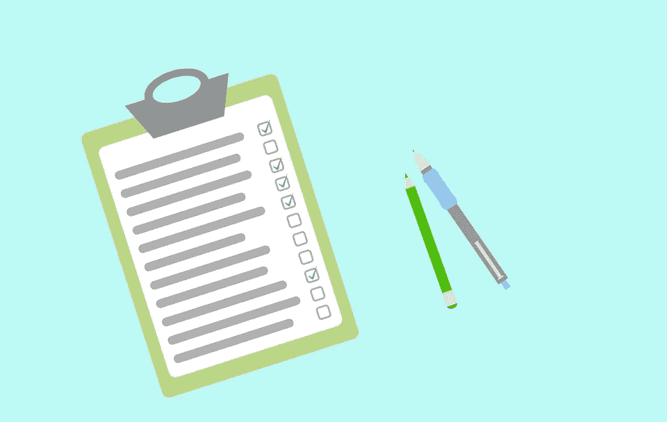
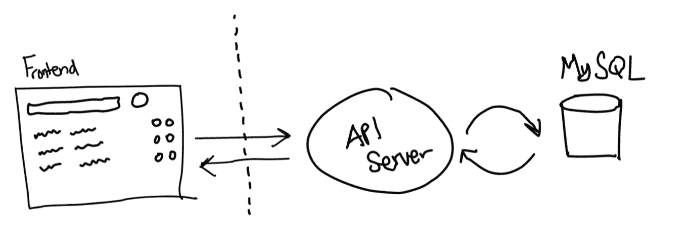
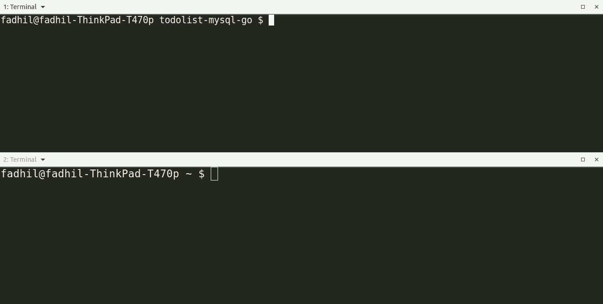
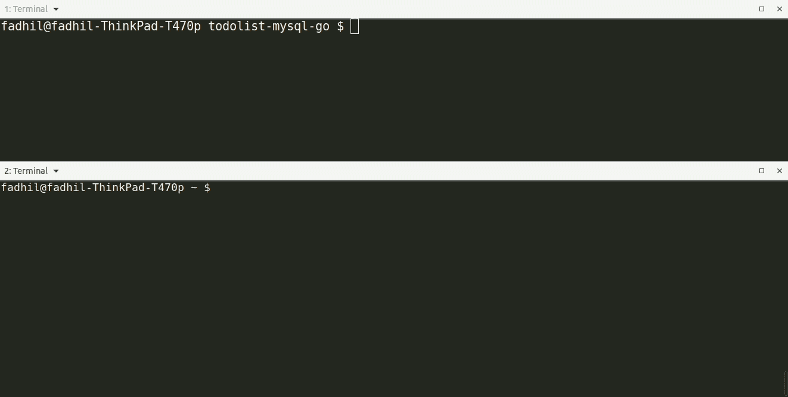
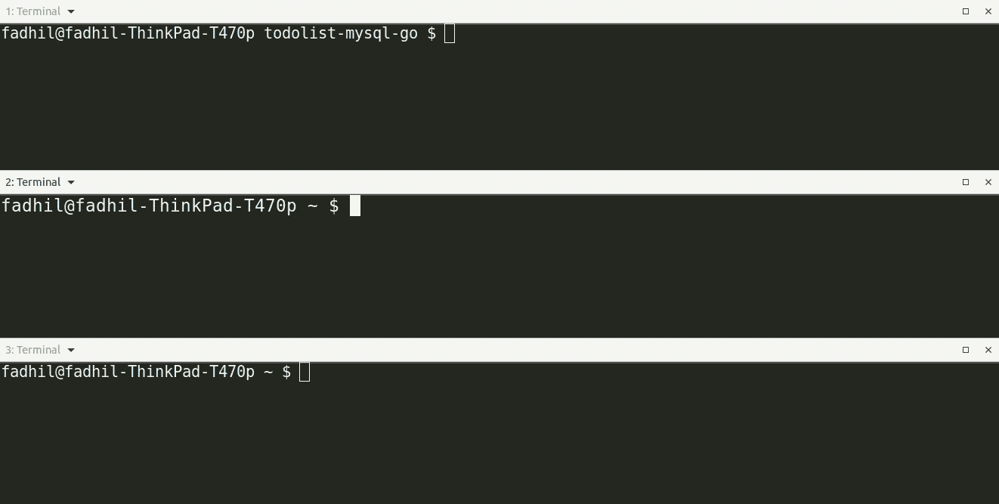
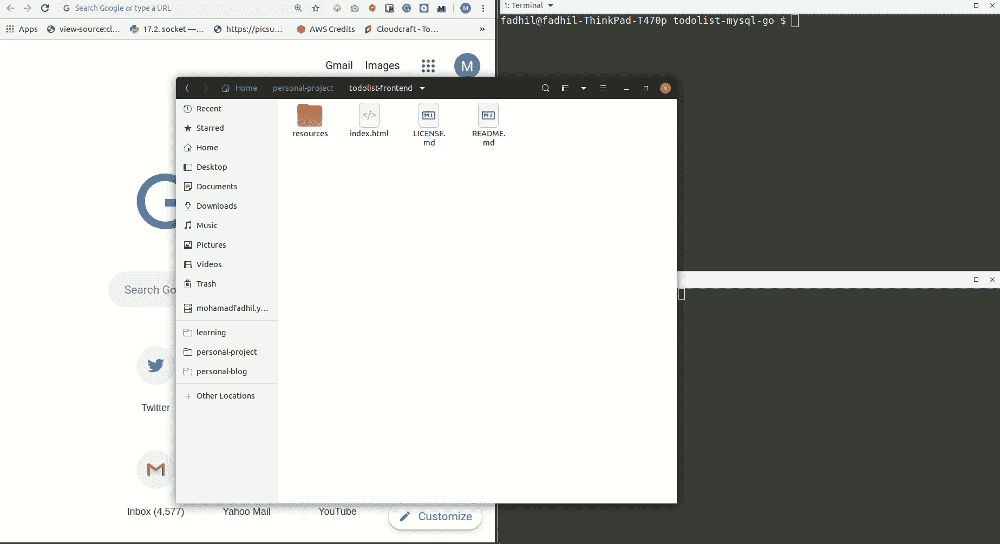

# 在 Golang 中构建一个简单的待办事项列表应用程序

> 原文：<https://betterprogramming.pub/build-a-simple-todolist-app-in-golang-82297ec25c7d>

## 理解一门新语言的最有教育意义的方法之一

这篇博客最初发表在[我的个人博客](https://fadhil-blog.dev/blog/golang-todolist/)上。



由[穆罕默德·哈桑](https://pixabay.com/users/mohamed_hassan-5229782/)在[皮克斯贝](https://pixabay.com/illustrations/to-do-list-business-checklist-form-4483048/)上插画

# 为什么是 Golang？

我很久以前就想学戈兰语了。根据堆栈溢出调查，Golang 是 2019 年第三大最受欢迎的编程语言。作为 Python 背景的人，学习 Golang 这样的新编程语言让我对如何编写代码有了一个独特的视角。

凯兰·斯考特的一篇很有帮助的教程给了我灵感。下面的教程受 Keiran 教程的影响很大，但作为我学习 Golang 的一部分，它使用了 MySQL 而不是 Mongo。

我个人认为 Golang 是新的 Java。许多开源项目(如 Jaeger、Kubernetes、Docker、InfluxDB、Serf 等。)现在都是用戈兰语写的。相比之下，较老的项目(如 Apache Kafka、Apache Hadoop 等。)都是用 Java 写的。我希望将来能参与并为 OSS Golang 项目做出贡献。

与其他语言相比，Golang 有许多优势，包括:

*   **Golang 是炽快的**
    [自己看](https://benchmarksgame-team.pages.debian.net/benchmarksgame/fastest/go.html)。
*   **Golang 是为并发性而构建的**
    Golang 附带了 goroutines，就是为了解决这个问题而设计的。当我第一次了解 Golang 时，我就被这个特性迷住了。不幸的是，在本教程中我们还看不到 goroutines 是如何工作的。
*   **Golang 是一种静态类型语言** 来自 Python 背景，一开始我觉得 Golang 的这个特性有点气人。然而，用静态类型的编程语言编写意味着你会引入更少的错误，因为你在解释和传递数据时会犯更少的错误。
*   **Go 将程序编译成一个二进制文件** 当你在 Go 中构建应用程序时，你可以随时随地运行你的应用程序。您不必担心它的依赖性，因为它们都是捆绑在一起的。
*   Golang 是一种固执己见的语言。这意味着人们应该如何用 Golang 编写代码的变化更少，这最终意味着代码的一致性、可读性和可维护性。对于一个大而复杂的项目，这是非常有帮助的。
*   你可以在这里阅读更多关于它的优点。

## 先决条件

*   系统上安装的 [Golang](https://golang.org/doc/install) 和 [Docker](https://docs.docker.com/install/)
*   Golang 和 JQuery 的基础知识

我为这个 app 准备了一个前端部分，你不用担心这个，可以专注于写 Golang 代码。您需要做的就是在步骤 7 中克隆存储库。

## 我们将建造什么

我们将构建一个连接到前端页面的经典而简单的 Golang API 服务器。我们的 Golang API 服务器将使用:

*   MySQL 作为我们的数据库
*   GORM 作为一个 ORM 与我们的数据库进行交互
*   使用`gorilla/mux`请求路由器
*   用于测井的测井曲线

## 我们的整个应用程序将如何工作



我们的应用程序将如何工作的图表

我们将构建图表右侧的内容。我们的 API 服务器的规格如下:

*   它监听`localhost`上的端口 8000
*   它有五个端点:`healthz`、`createItem`、`getCompletedItems`、`getIncompleteItems`、`updateItem`和`deleteItem`
*   `TodoItem`模型由`Id`、`Description`和`Completed`状态属性组成

我准备的 web 前端将对所有操作执行对`localhost:8000`的 AJAX 请求。首先检查这个 JS 脚本，看看它是如何工作的。最初的代码是由 [themaxsandelin](https://github.com/themaxsandelin) 制作的。

# 我们开始吧

## 1.启动一个项目

首先，让我们创建一个新目录，并在该目录中安装`gorilla/mux`和`logrus`包。

```
$ mkdir todolist-mysql-go
$ cd todolist-mysql-go
$ go get -u github.com/gorilla/mux
$ go get -u github.com/sirupsen/logrus
```

现在用以下内容创建一个`todolist.go`文件:

在第 3-8 行，我们导入了在前面的`go get -u`命令中得到的所有必需的包。请注意，在不实际使用 Go 代码的情况下导入任何包，都会导致编译错误。

在第 10-14 行，我们创建了一个`Healthz`函数，它将在每次被调用时响应客户端的`{"alive": true}`。

在第 16-19 行，我们设置我们的 init 函数来设置我们的`logrus`记录器设置。在 Golang 中，`init()`将在程序第一次开始时执行。你可以在这里阅读更多。

在第 21-26 行，我们用一个 walrus 操作符初始化我们的`gorilla/mux` HTTP 路由器。我们将`/healthz` HTTP GET 请求路由到`Health()`函数。路由器将监听端口 8000。

设置`Content-Type: application/json`很重要，这样客户端软件就能理解响应。

很简单，对吧？让我们看看目前为止都有什么。



太好了！我们的第一个端点现已上线。

## 2.连接到 MySQL 数据库

在将我们的 Go 应用程序连接到 MySQL 数据库之前，首先我们需要启动 MySQL 服务器。在本例中，我们将使用 Docker 来启动一个 MySQL 容器，并将端口 3306 暴露给`localhost`。我们将在 MySQL 容器中创建一个`todolist`数据库。

```
$ docker run -d -p 3306:3306 --name mysql -e MYSQL_ROOT_PASSWORD=root mysql
$ docker exec -it mysql mysql -uroot -proot -e 'CREATE DATABASE todolist'
```

回到我们的 Go 应用程序，我们需要安装 GORM 库和方言。

```
$ go get -u github.com/jinzhu/gorm
$ go get -u github.com/go-sql-driver/mysql
$ go get -u github.com/jinzhu/gorm/dialects/mysql
```

在我们的`todolist.go`代码中添加这些行:

将我们的新导入添加到第 8-10 行的导入列表中。在 Golang 中，如果你不打算使用这个变量，你必须把它命名为`_`。你可以在这里阅读更多。

接下来，我们将使用 GORM 初始化 MySQL 到数据库的连接。下面几行用于检查连接到数据库时是否有错误。如果有，记录下来。

`defer db.Close()`意味着当`main()`函数返回时，我们将关闭数据库连接。

## 3.自动迁移 TodoItem ORM 模型

GORM 附带了一个简洁的数据库自动迁移特性，它将根据代码中的结构定义创建一个数据库表。

我们的`TodoItem`结构将包括:

*   `Id int`:这将是我们的`primary_key`
*   `Description string`:这是我们将在前端 UI 中显示的内容
*   `Completed bool`:确定`TodoItem`是否完成

将这些行添加到您的 Go 代码中:

在第 7-11 行，我们定义了前面描述的`TodoItem`模型。这里的一切都是不言自明的。

在第 19-20 行，我们在启动 API 服务器后，立即对 MySQL 数据库运行自动迁移。请点击此处查看它的实际应用:



耶，我们的数据库准备好了。

## 4.创建 TodoItem 操作

在我们的`todolist.go`文件中添加以下几行:

在第 16 行，我们用`r.FormValue("parameter")`从 POST 操作中获得值。我们使用该值作为描述插入到我们的数据库中。之后，我们创建了`todo`对象并将其保存在数据库中。最后，我们查询数据库并将查询结果返回给客户端，以确保操作成功。

在第 32 行，我们用一个 HTTP POST 请求将新路由`/todo`注册到新的`CreateItem()`函数中。



## 5.继续剩余的 CRUD 操作

让我们继续其余的`Read`、`Update`和`Delete`操作。

我们应该能够在`TodoItem`上执行`Create`、`Read`、`Update`和`Delete`操作。

为了更新一个`TodoItem`对象，我们将首先查询我们的数据库以确保该项确实存在。为此，我创建了一个函数`GetItemById()`。等效的 SQL 查询是`SELECT * FROM todo_item_models WHERE Id = <Id> LIMIT 1;`。

在实际更新或删除之前，`UpdateItem()`和`DeleteItem()`功能将首先调用`GetItemById()`。

注意我在那里导入了`strconv`包。在我们运行 SQL 查询之前，这个包用于将`String`变量转换成`Integer`。

`GetCompletedItems()`和`GetIncompletedItems()`功能也是不言自明的。它将执行一个 SQL SELECT 查询，并在将其返回给客户机之前将其编码成 JSON。

## 6.与前端连接

为了将 API 服务器连接到前端页面，我们需要为响应提供 CORS 头。CORS 是一种机制，允许从提供第一资源的域之外的另一个域请求网页上的受限资源。

为此，您需要安装 Go `cors`包。

```
$ go get -u github.com/rs/cors
```

将这些行添加到您的 Go 代码中:

在第 28-32 行，我们将 CORS 处理程序包装在我们现有的应用程序中。

现在克隆我的这个围棋应用程序的前端网站。

```
$ git clone [https://github.com/sdil/todo.git](https://github.com/sdil/todo.git)
```

然后，在浏览器中打开`index.html`页面。这个简单的 jQuery 页面没有什么特别之处。我修改了由[themassandelin](https://github.com/themaxsandelin/)编写的原始代码，以便在你点击页面中的按钮时执行 AJAX 请求。检查`resources/js/main.js`文件，看看 web 前端是如何工作的。

## 7.构建包


现在我们完成了编码。现在可以编译代码了。

```
$ go build
$ ./todolist-mysql-go
```

# 一个小的端到端演示



恭喜你，你已经在 Golang 为自己建立了一个待办事项列表！

您可以在我的 GitHub 资源库中找到完整的源代码。如果你在本教程的任何一点上停滞不前，请随意参考那里。

[](https://github.com/sdil/learning/blob/master/go/todolist-mysql-go/todolist.go) [## sdil/学习

### 我的学习项目汇编。在 GitHub 上创建一个帐户，为 sdil/learning 开发做贡献。

github.com](https://github.com/sdil/learning/blob/master/go/todolist-mysql-go/todolist.go) 

# 不要停止学习

事实上，这只是 Golang 的一小部分。

接下来在 Golang 你可以探索更多的东西。你会有更多的理由去爱 Golang。我希望这篇教程能激发你去探索更多。