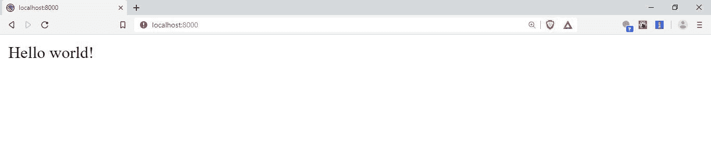
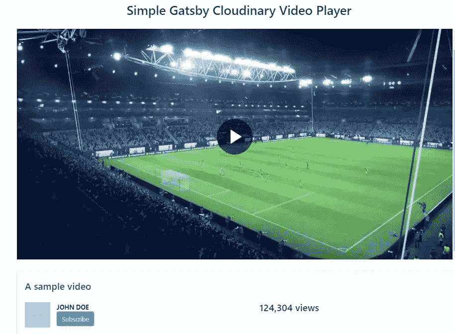

# 使用 Cloudinary 和 Gatsby 构建一个简单的视频播放器

> 原文：<https://betterprogramming.pub/build-a-simple-video-player-using-cloudinary-and-gatsby-eaf2659be086>

## 优化视频交付，同时保持出色的性能


照片由 [Unsplash](https://unsplash.com/s/photos/right-arrow?utm_source=unsplash&utm_medium=referral&utm_content=creditCopyText) 上的[尼克·费因斯](https://unsplash.com/@jannerboy62?utm_source=unsplash&utm_medium=referral&utm_content=creditCopyText)拍摄

# 介绍

视频总是比文本更好地传达信息，因此，在 web 和应用程序中，视频作为交流和娱乐的媒介，其重要性怎么强调都不为过。有一个高性能的视频播放器在我们的应用程序和网站上加载和播放视频是必不可少的。

在本帖中，我们将使用 [Cloudinary](https://cloudinary.com/) 和 [Gatsby.js](https://www.gatsbyjs.org/) 构建一个视频播放器。这种视频播放器将从云提供商那里获取优化的视频，并在保持出色性能的同时以最佳方式交付它们。它还将解决与网络视频相关的各种问题。

这些问题从交付方法到优化和质量流程，性能也是一个需要考虑的重要因素。用来实现所有这些的传统方法在大范围内被证明是低效的，并且难以维护，因此使用 Cloudinary 和 Gatsby 来构建一个伟大的视频播放器。

# 泰勒:博士

在本帖中，我们将:

*   使用 Gatsby CLI 在本地设置一个 Gatsby 站点
*   为 Gatsby 站点创建一致的布局
*   创建一个 Cloudinary 帐户来上传、操作和获取视频
*   构建视频播放器组件
*   构建索引页以显示视频播放器
*   在浏览器中显示视频播放器

# 应用:Cloudinary 视频播放器

这篇文章的主要目标是构建一个云视频播放器。根据[云文档](https://cloudinary.com/documentation/cloudinary_video_player)，

> “Cloudinary 视频播放器是一款基于 JavaScript 的 HTML5 视频播放器，捆绑了许多有价值的定制和集成功能，可用于货币化和分析。该播放器完全适用于任何设备或屏幕尺寸，并与 Cloudinary 的视频传输和处理解决方案相集成。”

根据官方文档，有各种方法可以创建一个云视频播放器。它可以使用 iframe 或通过使用普通的 JavaScript 嵌入到页面中。然而，由于没有像 Gatsby 使用 React 那样使用 ReactJS 实现视频播放器的指南，可用的方法是使用将视频播放器嵌入页面。

在接下来的章节中会有更多的介绍。

# 云雾缭绕

Cloudinary 是一家 SaaS(软件即服务)技术公司，提供基于云的图像和视频管理解决方案。它使用户能够为网站和应用程序上传、存储、管理、操作和交付图像和视频。

如今，超过 450，000 名 web 和移动应用程序开发人员使用 Cloudinary。Cloudinary 允许用户通过一组丰富的 API 上传任何规模和格式的任何媒体。它还可以安全地存储大量图像和视频，以交互方式管理媒体库，并即时转换图像和视频以适应任何屏幕设备。

Cloudinary 的另一个很酷的地方是，它可以用来给图像和视频添加效果。它还利用一个优质的全球内容交付网络，确保优化的视频和图像在任何位置都能快速交付。

# 为什么是盖茨比？

Gatsby 是一个使用 ReactJS 构建的静态站点生成器。它提供了构建高性能、安全且价格合理的可部署站点的能力。它还允许使用 React 组件轻松构建速度惊人的现代静态站点。

在这部作品中，Gatsby 和 Cloudinary 的出色之处将被结合起来，以创建一个视频播放器，该播放器可以加载和播放优化的视频，并可以使用 Cloudinary 适应不同的屏幕大小，这一切都是由 Gatsby 在一个快速网站上提供的。

# 使用 Gatsby CLI 在本地设置 Gatsby 站点

## 安装所需的软件包

要为这个 Gatsby 项目设置我们的开发环境，需要 Node 和它的包管理器 NPM。通过启动命令行界面并使用以下命令检查这两个工具的当前版本，验证它们是否安装在您的计算机上:

`node -v && npm -v`

否则，[安装节点](https://nodejs.org/en/)。

## 使用 Gatsby CLI

Gatsby CLI 工具允许您快速创建新的 Gatsby 支持的站点，并运行命令来开发 Gatsby 站点。这是一个已发布的 npm 包。

应该通过运行以下命令来全局安装 Gatsby CLI:

`npm install -g gatsby-cli`

要查看可用命令，请运行:

`gatsby --help`

## 创建盖茨比网站

安装的 Gatsby CLI 工具将用于创建 Gatsby 站点。使用该工具，可以下载 *starters* (带有一些默认配置的部分构建的站点)来尽快进入 Gatsby 站点的轨道。这里使用的 Hello World starter 是一个具有 Gatsby 站点所需的基本要素的 starter。这里创建的文件夹名为 gatsby-cloudinary-player。如果你愿意，你可以改变。打开您的终端并运行:

`gatsby new gatsby-cloudinary-player [https://github.com/gatsbyjs/gatsby-starter-hello-world](https://github.com/gatsbyjs/gatsby-starter-hello-world)`

该工具下载所需的文件并运行 npm install 来安装依赖项。速度可能会有所不同，这取决于您的互联网连接。

成功完成后，将目录切换到创建的文件夹，运行以下命令安装[布尔玛](https://bulma.io/):

`cd gatsby-cloudinary-player && cd npm i --save bulma`

布尔玛是一个轻量级的 CSS 样式框架。

安装布尔玛后，通过运行以下命令启动开发服务器:

`gatsby develop`

一旦开发服务器开始运行，在您的浏览器中打开一个新的选项卡，并导航到 [http://localhost:8000](http://localhost:8000)

页面看起来像这样:



盖茨比你好世界入门主页

## 创建布局组件

布局组件负责整个网站页面的一致外观。

在 Gatsby-cloud inary-player**文件夹中，继续打开 src 文件夹，创建一个名为 components 的新文件夹。**

**在 components 文件夹中创建一个名为 Layout.js 的新文件。打开它并导入所需的依赖项:**

**注意缩小的布尔玛 CSS 文件和 Layout.css 文件是如何导入的。**

**创建并导出布局组件，该组件可以将其他组件作为子组件{props.children}，子组件具有:**

```
const Layout = props => {return (<div> <div *className*="has-text-centered" *style*={{marginTop: "2rem",marginBottom: "2rem"}} > <h1 *className*="title is-3">Simple Gatsby Cloudinary Video     Player</h1> </div> <div *className*="columns is-centered"> <div *className*="column video-column is-8-widescreen is-10-desktop is-11-tablet"> <div *className*="image"> {props.children} </div> <br /> <div *className*="box"> <div *style*={{ fontSize: "1.5em", fontWeight: "500"}}>A  sample video
      </div> <br /> <article *className*="media"> <div *className*="media-left"> <figure *className*="image is-64x64">  </figure> </div> <div *className*="media-content"> <div *className*="content"> <div *className*="columns"> <div *className*="column is-6"> <p> <strong>JOHN DOE</strong> <br /> <a *href*="#" *className*="button is-primary">Subscribe</a> </p>
       </div> <div *className*="column is-6"> <nav *className*="nav"> <div *className*="container"> <div *className*="nav-right"> <a *className*="nav-item is-tab is-active"> <span *className*="title is-4">124,304 views</span> </a> </div> </div> </nav> </div> </div></div></div></article></div></div></div></div>)}export default Layout;
```

**下面是 Layout.css 文件，其中包括对布局组件的媒体查询:**

```
*/* Media Queries */*@media only screen and (max-width: 1200px) { .video-column { margin-left: 3.5%; }}@media only screen and (max-width: 500px) { .video-column { margin-left: 5.5%; }}
```

# **云视频托管**

## **云二进制帐户创建**

**要托管需要视频播放器播放的视频，Cloudinary 帐户是必不可少的。要创建一个，登录[https://www.cloudinary.com](https://www.cloudinary.com)并遵循以下步骤:**

*   **点击**报名**按钮。**
*   **用适当的信息填写字段。**
*   **将云名称编辑为首选名称，并勾选验证码框进行验证。**
*   **点击**创建账户**按钮提交注册表单。**
*   **弹出一个欢迎模式。选择适当的字段并继续。**

## **上传视频**

**上传文件有多种选择，在这里是视频。您可以从本地计算机拖放文件或浏览到视频文件本身。其他选项包括 URL 地址、社交媒体链接、Dropbox 地址和谷歌图片地址。**

*   **在仪表板中，选择**媒体库**选项卡。**
*   **选择**上传媒体**选项。**
*   **选择**高级**选项，输入视频公共 id 的唯一名称。公共 id 是视频的唯一标识符。**
*   **选择一个方便的视频上传选项:在这种情况下，拖放选项用于获取视频，因为它在本地可用。**

**完成最后一步后，视频会自动上传到 Cloudinary 服务器。**

# **云二进制视频播放器组件**

**根据 Cloudinary 视频播放器官方文档，使用视频播放器最简单快捷的方法就是使用将其嵌入。**

## **获取代码**

**要获得 iframe 代码，请前往 https://studio.cloudinary.com 的。视频播放器有多种定制选项，例如自动播放、循环、字幕、视频播放器响应、主题和字体。它还包括视频播放器控件，如音量、全屏、前进和后退控件、视频格式和传送类型。**

**按照以下步骤获取代码:**

*   **选择 **My Cloudinary Video** 作为视频源选项，因为视频将从您创建的帐户中获取。**
*   **输入您的**云名**和您上传的视频**公共 ID** ，点击**应用**。**
*   **点击**定制**选项卡，勾选**响应**作为视频播放器尺寸选项。**
*   **根据您的喜好将主题选项更改为**亮**或**暗**。**
*   **前往**高级**部分，勾选首选视频播放器功能。**
*   **选择**自适应**作为视频传送类型选项。**

**复制生成的代码，暂时保存在某个地方。这将用于创建视频播放器组件。**

## **构建视频播放器组件**

**要构建视频播放器组件，请在 src/components 文件夹中创建 VideoPlayer.js。这个组件将包含复制的嵌入代码来显示视频播放器。**

**首先，使用以下命令导入所需的依赖项和 VideoPlayer.css 文件:**

**然后使用以下内容创建并导出视频播放器组件:**

**注意参数:cloud_name 和 public_id。cloud_name 是用户在开立 Cloudinary 帐户时选择的名称。这是评估用户在 Cloudinary 上上传的视频所需要的，而 public_id 参数是用户上传的选择播放的视频的唯一名称。**

**以下是视频播放器组件的 VideoPlayer.css 文件:**

```
iframe { width: 100%; height: 580px;}*/* Media Queries */*@media only screen and (max-width: 1200px) { iframe { height: 500px; }}@media only screen and (max-width: 1024px) { iframe { height: 480px; }}@media only screen and (max-width: 768px) { iframe { height: 350px; }}@media only screen and (max-width: 500px) { iframe { height: 250px; }}@media only screen and (max-width: 380px) { iframe { width: 100%; height: 230px; }}
```

## **构建索引页以显示视频播放器**

**因为这是一个 Gatsby 项目，所以需要 src/pages 文件夹来显示布局和视频播放器组件。pages 文件夹中有一个默认的index.js 文件。它将被修改以显示布局和视频播放器组件。**

**打开index.js 文件，擦除它，用**

**layout 组件处理页面的布局和设计，而 VideoPlayer 组件负责视频播放器。**

**使用以下内容创建并导出 IndexPage 组件:**

**打开浏览器，在索引页上查看完整的视频播放器。**

**页面看起来像这样:**

****

**主页上显示的视频播放器**

# **结论**

**在这篇文章中，我们看到了 Cloudinary 的概述，它的视频特性，操作，定制和集成到网页中。**

**我们还使用 Cloudinary 和 Gatsby 构建了一个视频播放器。使用 Gatsby 是因为它使构建静态站点变得容易。使用 Gatsby 的另一个重要原因是它可以创建快速站点，因为它使得开发慢速站点变得非常困难。**

**你可以查看这个项目的代码或者在 [GitHub](https://github.com/ihollarmide/gatsby-cloudinary-player) 上投稿。您还可以查看[托管的网页](https://competent-bardeen-003fcf.netlify.com/)。**