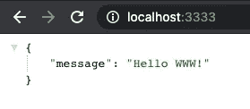
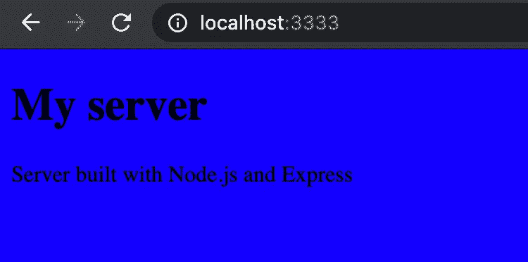

# 2021 年 Node.js + Express 教程—使用 Node.js 和 Express 构建 Web 服务器

> 原文：<https://betterprogramming.pub/build-a-simple-web-server-using-node-js-and-express-27f3d6eb4e86>

## JavaScript web 服务器框架入门


照片由[费伦茨·阿尔马西](https://unsplash.com/@flowforfrank?utm_source=medium&utm_medium=referral)在 [Unsplash](https://unsplash.com?utm_source=medium&utm_medium=referral) 上拍摄

带有 Express 的 Node.js 是一个受欢迎的组合，被世界各地的许多应用程序使用。本教程通过构建一个简单的 web 服务器来帮助您开始使用 Node.js 和 Express。

您的服务器将提供一个 HTML 页面，其他人可以访问该页面。在本文结束时，您将具备以下基本知识:

*   节点. js
*   表达
*   npm
*   创建快捷路线
*   提供 HTML
*   在 Express 中设置静态资产

专业提示:不要复制教程中的代码。自己写代码学习更好。

事不宜迟，让我们直入主题吧！

# 创建并初始化项目

教程的第一步是为项目创建一个空文件夹。您可以按常规方式创建一个，也可以从终端创建，如下所示:

```
mkdir express-server
cd express-server
```

现在您有了一个空项目，是时候通过运行以下命令来初始化它了:

```
npm init -y
```

上述命令创建了`package.json`文件，并用默认值对其进行初始化。如果您想要手动填充字段，请移除`-y`标志并按照说明进行操作。

# 添加快递

你有一个初始化的 Node.js 项目，但是到目前为止还没有 Express 的轨迹。因此，这将带您进入下一步——向项目中添加 Express。在 Node.js 中，通过运行`npm install packageName`来安装包。

要添加 Express 的最新稳定版本，请运行以下命令:

```
npm install express
```

现在已经安装了 Express，您的`package.json`文件应该如下所示:

您可以看到 Express 安装成功，因为它列在“依赖项”下现在让我们进入下一步——创建服务器。

# 创建 Express 服务器

在继续下一步之前，您需要为 web 服务器创建 JavaScript 文件。您可以通过在终端中运行以下命令来实现这一点:

```
touch index.js
```

打开文件，开始写下面几行:

```
const express = require('express');
const app = express();
```

这两条线是干什么的？

1.  在第一行中，您将 Express 导入到您的项目中，以便您可以使用它。每次您将包添加到项目中时，您都需要将它导入到您想要使用它的地方。
2.  在第二行中，您调用了`express`函数，它创建了一个新的应用程序，然后将结果赋给`app`常量。

## 创建路由并监听特定端口

用最简单的术语来说，路由代表人们可以访问的端点。一个路由与一个 HTTP 动词(例如 GET、POST 等)相关联，它采用一个 URL 路径。它还需要一个在访问端点时调用的函数。

在文件中编写以下代码:

```
app.get('/', (req, res) => {
    res.send({ message: 'Hello WWW!' });
});
```

让我们仔细分析一下上面的代码:

*   它与一个 HTTP 动词相关联——在本例中，它是 GET 动词。
*   它采用一个 URL 路径—在本例中，它是主页(`/`)。
*   它需要一个函数，当您访问端点时将调用该函数。

所以，当一个人对你的主页`localhost:3333`发出`GET`请求时，箭头功能被调用，会显示“你好 WWW！”

服务器工作的最后一步是设置一个监听器。您需要为应用程序设置一个特定的端口。在 JavaScript 文件的末尾编写以下代码。

```
app.listen(3333, () => {
    console.log('Application listening on port 3333!');
});
```

您需要调用方法`listen`来启动服务器。此外，您可以将端口号(3333)替换为您想要的任何数字。

## 在浏览器中访问应用程序

要启动应用程序，请在终端中运行`node index.js`。请注意，`index.js`是我为本教程选择的名称。不过，你可以把它命名为`app.js`或者任何你想要的名字。

现在服务器正在运行，您可以在浏览器中访问它。转到`http://localhost:3333/`，您应该会看到以下消息:



应用程序的屏幕截图

设置 Node.js + Express web 服务器做得很好！在下一节中，您将设置静态资产，例如 JavaScript、CSS、HTML、图像等。

# 静态资产

该应用程序目前看起来不太好。多一点结构和风格不是更好吗？但是你应该在哪里添加它们呢？

在本节中，您将看到如何设置和服务静态资产，如 HTML、CSS、JavaScript 和图像。

## 导入路径模块

您必须做的第一步是将 path 模块导入到您的应用程序中。您不需要安装任何东西，因为 path 在默认情况下是由 Node 提供的。

在文件的顶部，写下下面一行:

```
const path = require('path');
```

但是为什么需要这个模块呢？path 模块允许我们生成绝对路径，您需要它来服务静态资产。在应用程序中添加以下代码行(在定义路线之前):

```
app.use(express.static(path.join(__dirname, 'public')));
```

`path.join`需要两个参数:

*   当前工作目录(cwd)
*   第二个目录，也就是我们想加入 cwd 的目录

作为练习，试着在控制台`path.join(__dirname, 'public')`上打印出来，看看会得到什么。

到目前为止，您的服务器应该是这样的:

```
const path = require('path');
const express = require('express');
const app = express();app.use(express.static(path.join(__dirname, 'public')))app.get('/', (req, res) => {
    res.send({ message: 'Hello WWW!' });
});app.listen(3333, () => {
    console.log('Application listening on port 3333!');
});
```

## 创建公共文件夹并添加资产

下一步是创建`public`文件夹并添加一些资产。您可以创建一个空文件夹，并通过运行以下命令来更改它:

```
mkdir public
cd public
```

现在，让我们创建一些空文件，您将在其中添加 HTML、CSS 和 JavaScript。在您的终端中运行以下行:

```
touch app.js
touch index.html
touch styles.css
```

我们将保持`app.js`超级简单，只显示一个警告以确保它工作。因此，打开`app.js`并添加以下行:

```
alert('it works');
```

同样，我们也将保持`styles.css`简单。为了确保它的工作，让我们设置背景颜色为蓝色。您可以通过在`styles.css`中添加以下代码来实现:

```
html {
    background-color: blue;
}
```

最后，你需要写 HTML，这样你就可以在你的主页上显示它。打开文件`index.html`并添加以下 HTML 代码:

写完上面的代码，还剩下一步！请参见下一节。

# 提供 HTML 文件

你差不多完成了。剩下的就是服务 HTML 代码了。为此，您必须转到您的`index.js`文件，其中包含您的服务器代码。打开文件并编写以下代码:

```
app.get('/', (req, res) => {
    res.sendFile(`${__dirname}/public/index.html`);
});
```

如果您不是第一次使用 Node.js 和 Express，您可能会问方法`sendFile`有什么问题，为什么不使用`render`方法。由于你没有使用任何引擎(如帕格、EJS 等)，你不能使用`render`方法。因此，当人们访问你的主页时，你发送回一个 HTML 文件。

服务器代码的最终版本应该如下所示:

```
const path = require('path');
const express = require('express');
const app = express();app.use(express.static(path.join(__dirname, 'public')))app.get('/', (req, res) => {
    res.sendFile(`${__dirname}/public/index.html`);
});app.listen(3333, () => {
    console.log('Application listening on port 3333!');
});
COPY
```

现在，如果你去`http://localhost:3333`，你应该会看到一个蓝色背景的网页——当然，那是在你关闭烦人的弹出窗口之后。



应用程序的屏幕截图

上图显示了您应该在屏幕上看到的内容。

# 结论

恭喜你坚持到了文章的最后。到目前为止，您应该已经有了一个简单的 web 应用程序。

在本文中，您了解了:

*   关于 Node.js
*   关于 Express 以及如何使用它来创建一个小型的 web 应用程序
*   如何创建路线
*   如何在 Node.js + Express 应用程序中设置静态资产
*   如何在 Express 中提供一个简单的 HTML 文件

如果你喜欢这篇文章，如果你想在第 2 部分中添加一个数据库，比如 Mongo 或 Postgres，请在评论中告诉我！

> [学习 Node.js](https://rli.to/PhkSl) ，从零开始构建高级大型应用&被聘为后端开发人员