# 在 React for Better UX 中构建一个框架组件

> 原文：<https://betterprogramming.pub/build-a-skeleton-component-in-react-for-better-ux-b1dca9d783e6>

## 加载组件让用户在页面加载时可以看到一些东西


由[潘卡杰·帕特尔](https://unsplash.com/@pankajpatel?utm_source=medium&utm_medium=referral)在 [Unsplash](https://unsplash.com?utm_source=medium&utm_medium=referral) 拍摄的照片

你知道骨骼组件是干什么用的吗？它是一个在获取数据时呈现内容的组件。用户很容易对等待内容感到厌倦或厌烦。如果你只是给他们一个白屏，大多数人会离开你的网站，这是你不想要的。

在本文中，我将演示如何编写一个框架组件以及如何使用它。

# 先决条件

本文假设您知道 React。但是不要担心，如果你有使用 Vue、Angular 或任何其他 JavaScript 框架的经验，你会很容易理解这篇文章。

此外，我使用 CRA(创建-反应-应用程序)进行快速设置。

# 设置 React 项目

```
npx create-react-app skeleton
```

我使用 [CRA](https://github.com/facebook/create-react-app) 创建了简单的基本 React 项目。项目结构如下:

当我运行`npm start`时，页面看起来是这样的:

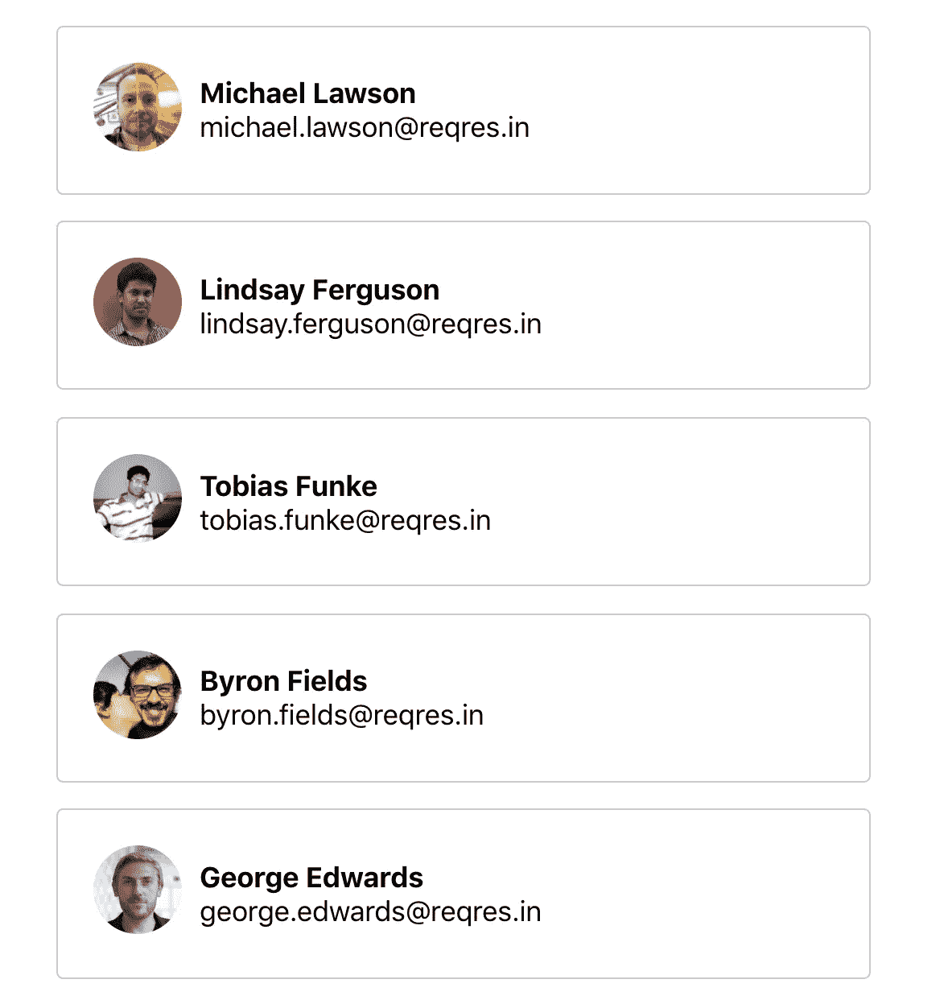

# 什么是骨架 UI？

框架 UI 指的是一个空的结构化 UI，放置在内容所在的位置。

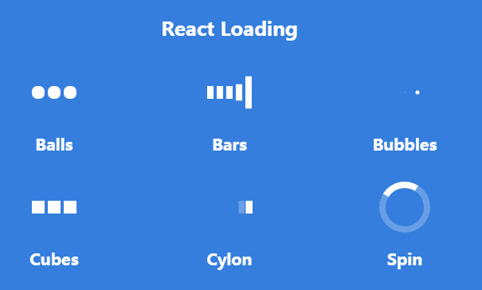

图像的原始来源是[反应样本](https://reactjsexample.com/react-component-for-loading-animations/)

你可能见过在访问网站时加载组件。它们也是用户友好的 UI 组件，因为它们通知用户正在后台获取数据。

通常，那些装载杆或旋转器不是唯一会发生的事情。通常背景也会变暗。显示数据正在加载的微调按钮或条是一个好策略，它们帮助用户理解页面或容器正在加载。

如今，许多网站向用户展示可选的 UI 组件，以减少无聊的等待时间。skeleton UI 最常见的模式是一个白色背景的小盒子和一些闪亮的 CSS 动画。

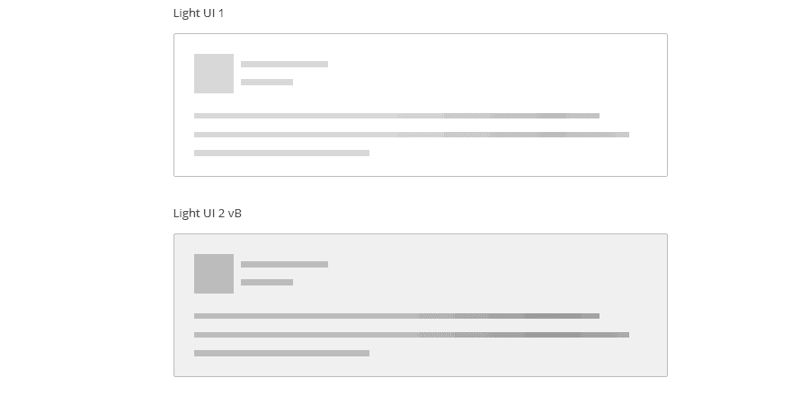

图像的原始来源是 [codemyui](https://codemyui.com/pure-css-skeleton-screen-gleam-animation-for-light-dark-and-grey-mode-card-ui/)

它们不仅填补了空白，而且用户可以与页面上的其他组件进行交互。

现在，我将通过一个例子向你展示如何制作它们。

# 1.构建框架用户界面

显然，这一步是制造空的骨架组件:

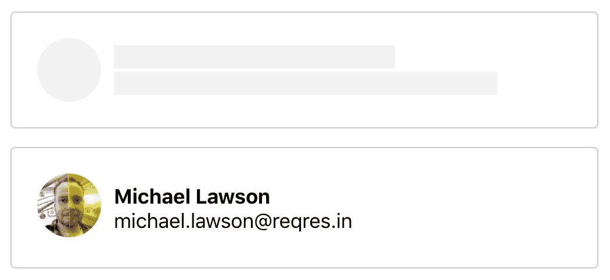

骨架应该尽可能看起来和内容一样

当你制作骨骼组件时，有一件事你应该小心。框架 UI 的目的是减少对数据的无聊等待，所以它们看起来不应该与真正的 UI 组件有太大的不同。如果它们差别太大，用户可能会觉得框架是另一个独立的 UI 组件。

# 2.CSS 动画

第二步是选择将穿过骨架的动画。有的人用纯 CSS 动画，有的人用一张图片。我个人更喜欢用图像，尤其是当动画包含一些渐变背景色的时候。

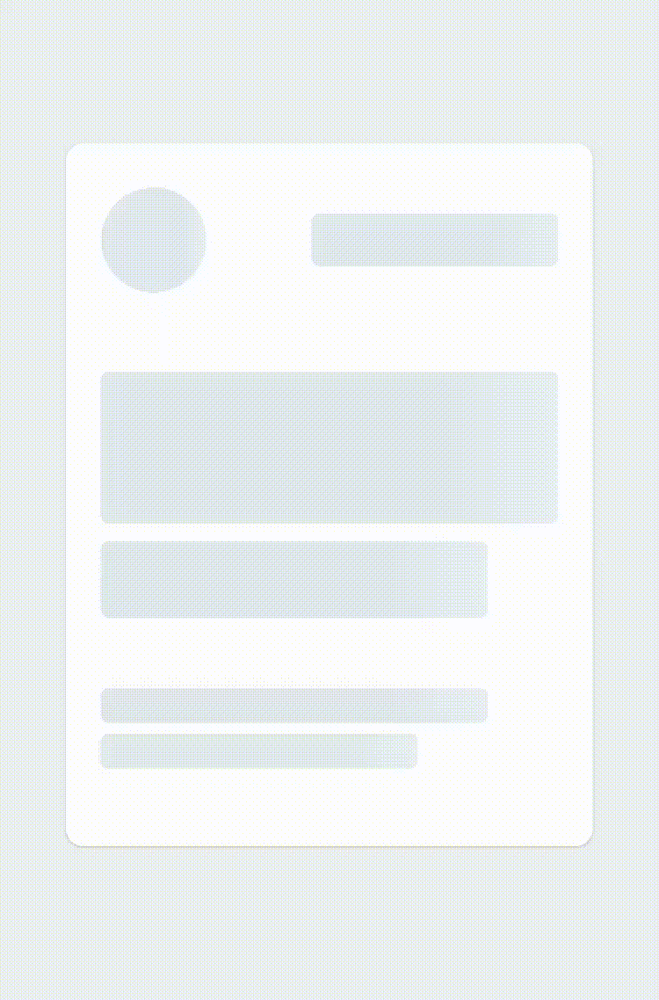

图像的原始来源是 [npm](https://www.npmjs.com/package/react-native-skeleton-content)

你看到从左到右穿过骨骼的白色渐变了吗？对于 CPU 来说，每 16.6 毫秒绘制一次是不必要的工作——它必须计算每个点上的每个渐变颜色值，并与 GPU 一起在屏幕上表现出来。为此，我更喜欢用一个形象。

然而，在这个例子中，我将使用纯 CSS 来展示如何做到这一点。并不总是能够使用图像。

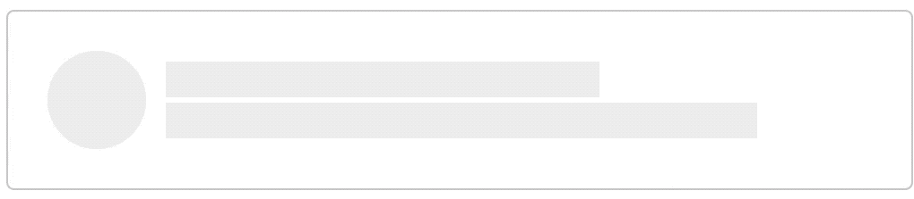

我给包裹所有内容的元素做了一个这样的渐变背景。但是，这看起来很奇怪——你可以看到整个梯度柱。我们只希望它显示在灰色区域。

为此，我们将伪类添加到每个灰色元素中。

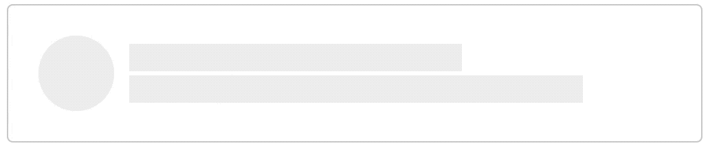

请记住，渐变背景所属的元素应该具有如下样式:

```
.element {
  overflow: hidden;
  position: relative;
}
```

# 比较

现在我们来比较两种不同的情况——骨架存在和不存在的情况。

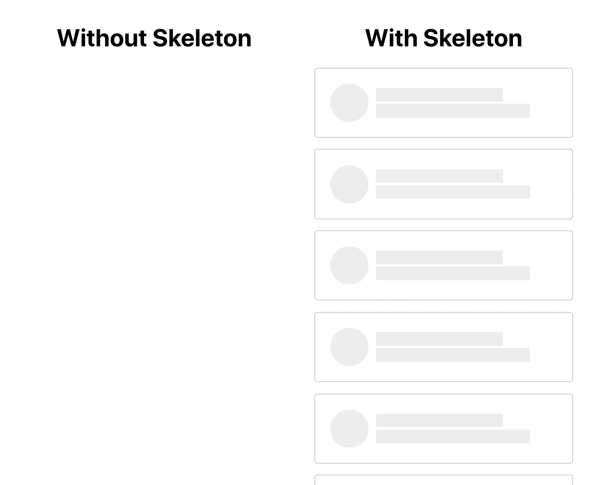

很明显，在获取数据时，骨架组件看起来比白色背景好得多。你可以带一个装载栏组件来代替白色背景。

# 沙盒中的代码

下面是这个例子的源代码。

# 其他示例

你可能想知道其他网站是如何采用 skeleton U 的。

## 松弛的

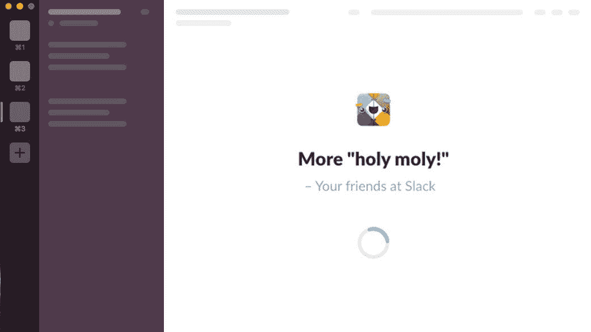

图片来源于 [css-tricks](https://css-tricks.com/building-skeleton-screens-css-custom-properties/)

Slack 向用户显示了加载栏和骨架组件。他们制作的一个有趣的东西是他们向用户显示一些随机的信息，比如“更多神圣的东西！”，这样人们就不会太无聊了，我觉得这是个好策略。

## 拼趣

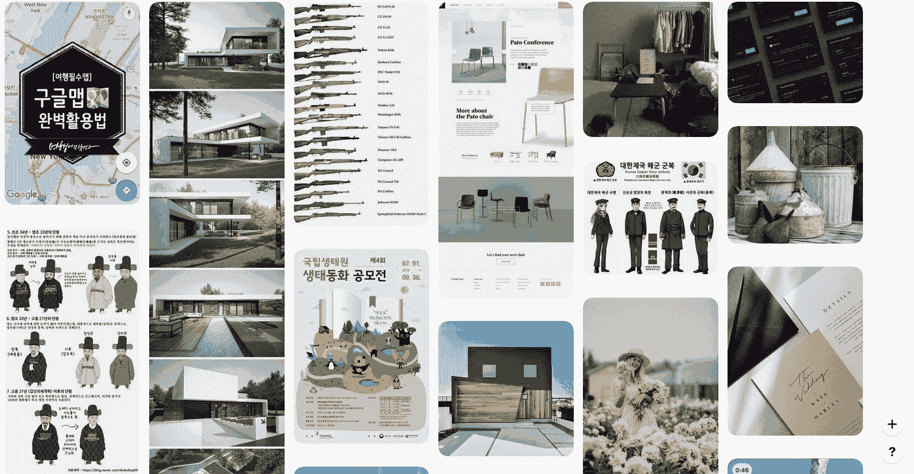

[Pinterest](https://www.pinterest.co.kr/) 骨架非常简单。它们的主要内容是图像，所以它们的骨架根本不需要复杂。取而代之的是，他们随机地给每个骨骼组件上色。

## Skyscanner

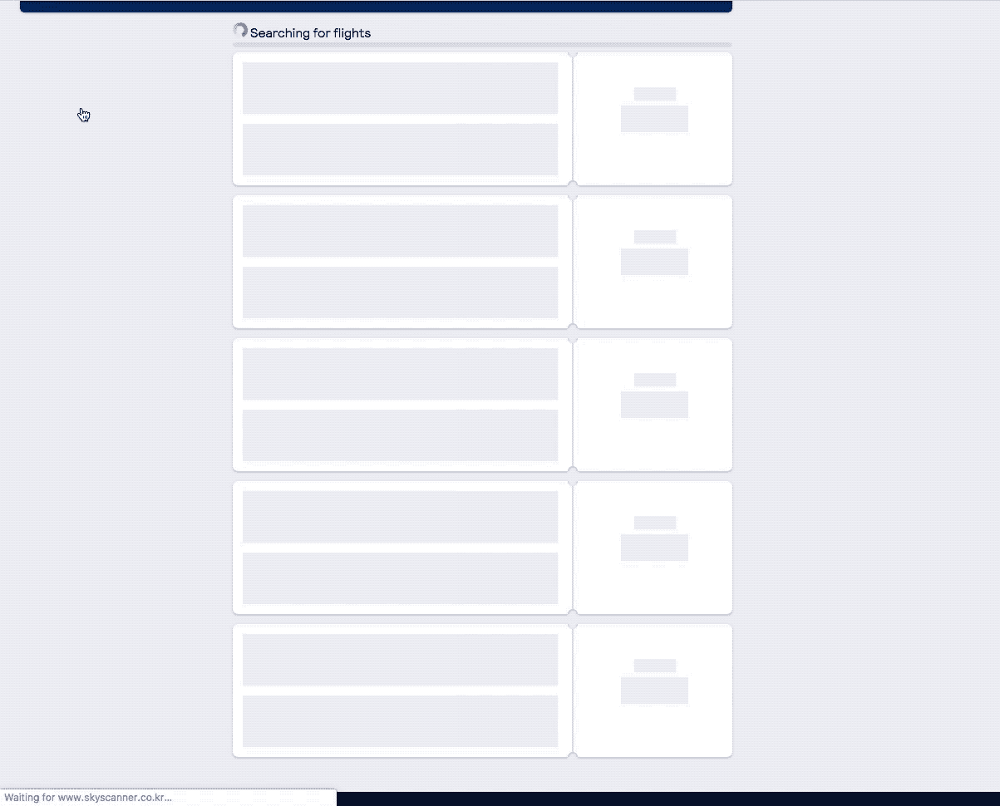

Skyscanner 有一个和我在这篇文章中的例子非常相似的框架用户界面。加载飞行数据可能需要很长时间，可能长达几秒钟。处理这种规模数据的开发人员应该始终小心不要失去客户的注意力。骨架或承重杆对他们来说很重要。

# 结论

当然，采用 skeleton UI 并不总是您的最佳解决方案。重要的是知道哪些 UI 组件在你的网站上看起来不错。有时一个装载杆就足够了，有时你可能需要更多。

# 资源

*   [CSS-Tricks 图片](https://css-tricks.com/building-skeleton-screens-css-custom-properties/)
*   [React-Native-Skeleton-Content 图片](https://www.npmjs.com/package/react-native-skeleton-content)
*   [Code-My-UI 图片](https://codemyui.com/pure-css-skeleton-screen-gleam-animation-for-light-dark-and-grey-mode-card-ui/)
*   [React-JS-示例图片](https://reactjsexample.com/react-component-for-loading-animations/)