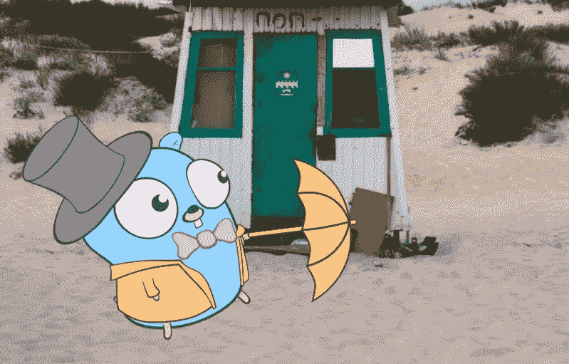
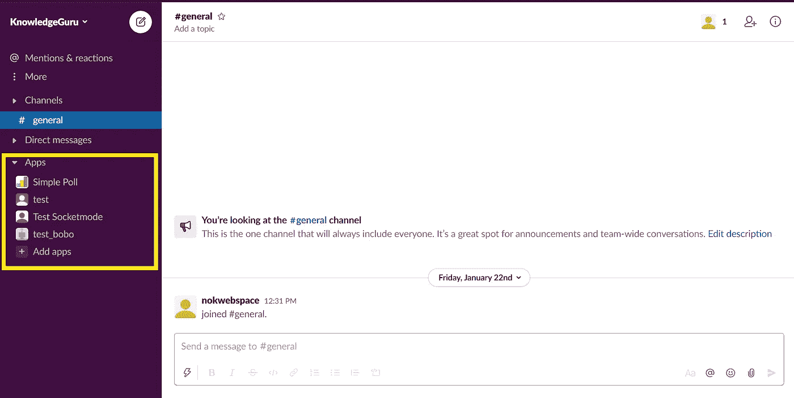
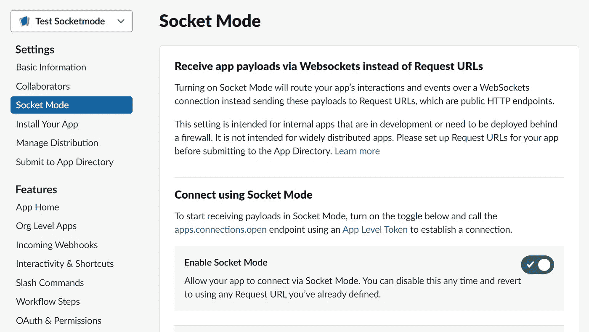
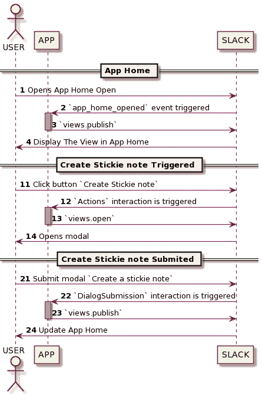
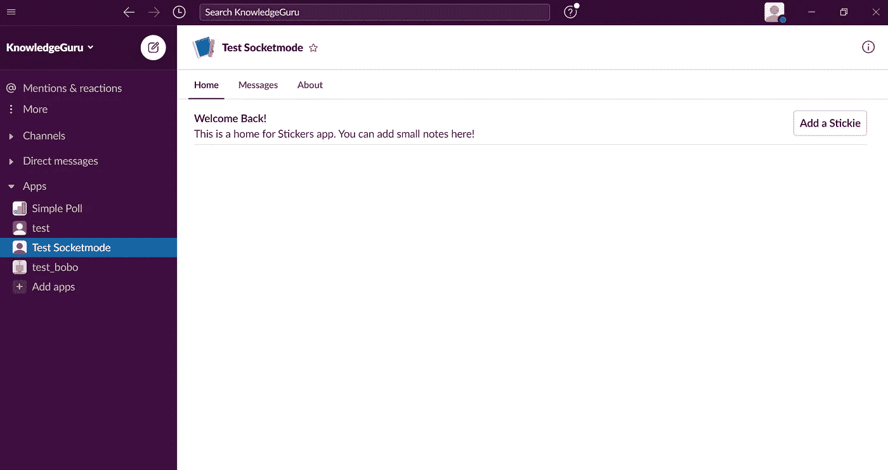
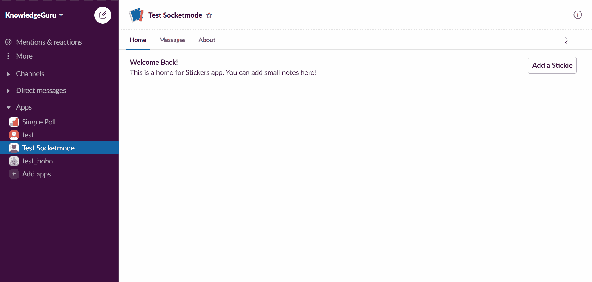
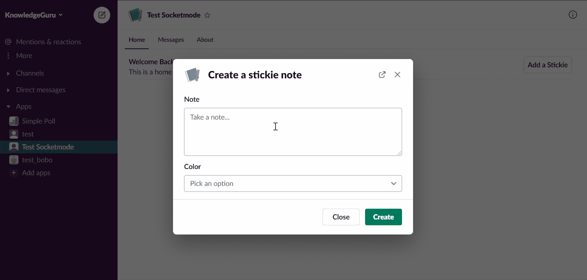

# 使用套接字模式在 Golang 中构建您的 Slack 应用程序主页

> 原文：<https://betterprogramming.pub/build-a-slack-app-home-in-golang-using-socket-mode-aff7b855bb31>

## GOLANG SLACKBOT 教程

## 为您的应用构建一个家——在 Go 中重温



[Olia Nayda](https://unsplash.com/@olianayda?utm_source=medium&utm_medium=referral) 在 [Unsplash](https://unsplash.com?utm_source=medium&utm_medium=referral) 上的照片， [Egon Elbre](https://github.com/egonelbre) 的 Gopher。

本教程是关于用 [slack-go](https://github.com/slack-go/slack) 库和 [Slack 的 Socket 模式](https://api.slack.com/apis/connections/socket)在 Golang 中实现一个 [App Home](https://api.slack.com/start/overview#app_home) 。本指南的灵感来自于 Slack 文档中的一篇文章。

应用程序主页是显示在对话列表中应用程序部分下方的空间，带有您的应用程序名称。这是一个完全可定制的空间，用于提供文档和与应用程序的交互。



作者照片。

“为什么是套接字模式？”你可能会问。

使用套接字模式，您不需要一个具有公开可用 IP 地址的服务器。换句话说，你的笔记本电脑，你的 Raspberry Pi，或者一个私人服务器都可以托管你的机器人。套接字模式非常适合您不打算通过[应用程序目录](https://slack.com/apps)发布的小型应用程序。

# 配置应用程序

要开始本教程，您需要一个 Slack 应用程序，并激活适当的权限和套接字模式。您可以参考[本文档](https://api.slack.com/tutorials/app-home-with-modal#building-a-home-for-your-app---learn-how-to-create-the-app-home-view-and-use-the-modals__setting-up-your-app)来创建您的应用程序并添加权限。我还写了一篇专门的文章来简化设置步骤:

[](https://medium.com/geekculture/build-slack-application-in-golang-using-socket-mode-setting-up-57f454e63c0a) [## 使用套接字模式在 Golang 中构建松弛应用程序—设置

### 每个 Slack 应用程序都是从几个简单的步骤开始的。

medium.com](https://medium.com/geekculture/build-slack-application-in-golang-using-socket-mode-setting-up-57f454e63c0a) 

不要忘记在适当的部分激活套接字模式。



# 步骤 1:创建项目存储库

首先，创建一个新的 Go 项目并导入 [slack-go](https://github.com/slack-go/slack) :

```
go mod init 
go get -u github.com/slack-go/slack
```

在本教程中，我使用我的 slack-go 分支，因为我用来处理事件的主要特性还没有合并( [#PR904](https://github.com/slack-go/slack/pull/904) )。

要使用 fork，我们需要在`go.mod`中添加一个`replace`语句:

```
replace github.com/slack-go/slack => github.com/xnok/slack master
```

然后，我们强制考虑这种变化:

```
go mod tidy
```

接下来，您可以创建以下项目结构，或者在我们继续学习本教程时参考它:

```
+ controllers
|`- appHomeController.go
+ drivers
|`- slack.go
+ views
|`+ appHomeViewsAssets
| |`- AppHomeView.json
| | - CreateStickieNoteModal.json
| | - NoteBlock.json
|`- apphomeViews.go
+ main.go
```

# 步骤 2:创建驱动因素-> slack.go

在`drivers/slack.go`中，我们使用环境变量`SLACK_APP_TOKEN`和`SLACK_BOT_TOKEN`创建了一个实用函数来初始化我们的 Slack 客户端。此外，添加一些验证也是一个好主意。Slack 提供了两种类型的令牌:

```
SLACK_APP_TOKEN=xapp-xxxxxxxxx 
SLACK_BOT_TOKEN=xoxb-xxxxxxxxx
```

因此，我验证令牌是否存在以及令牌的开头，以防止错误地反转。

完整代码见 [slack.go](https://github.com/xNok/slack-go-demo-socketmode/blob/main/drivers/slack.go) 。

# 步骤 3:创建控制器-> appHomeController.go

我创建了一个[序列图](https://github.com/xNok/slack-go-demo-socketmode/blob/main/controllers/appHomeController.puml)(灵感来自[朋美·井村的](https://api.slack.com/tutorials/app-home-with-modal#building-a-home-for-your-app---learn-how-to-create-the-app-home-view-and-use-the-modals__setting-up-your-app))来表示我们将要进行的可视化编码。我相信将这样的图放在我的代码旁边是很方便的。这应该会使遵循本教程变得容易得多。此外，我在代码中添加了对图的引用作为注释。



使用 [PlantUML](https://plantuml.com/) 创建。

## 处理事件

首先，在`controllers/appHomeController.go`中，创建一个代表我们的控制器的结构来处理依赖注入。到目前为止，我们只需要`socketmode.SocketmodeHandler`来注册我们想要处理的 Slack 事件。但是在更广泛的应用程序中，您可能有其他依赖项，比如处理数据库请求的存储库。

```
type AppHomeController struct { 
  EventHandler *socketmode.SocketmodeHandler 
}
```

其次，为我们的控制器创建一个初始化函数。这个函数负责注册我们想要接收哪个事件，以及哪个函数应该处理它。如果参考[序列图](https://github.com/xNok/slack-go-demo-socketmode/blob/main/controllers/appHomeController.puml)，该控制器需要监听三个事件:

*   一个名为`app_home_opened` (2)的事件 API。
*   带有创建按钮(12)的`interaction`。
*   带有模态提交按钮(22)的`interaction`。

要用`EventHandler`注册一个事件，您首先需要确定我们需要处理什么类型的事件。至此，你应该熟悉了 Slack 的术语，包括*事件 API* 、*交互*、*阻塞动作*。

这些处理函数的工作方式都是一样的。您提供了您期望的事件类型(使用自动完成功能找到您需要的类型)和一个回调函数。回调函数需要:

1.  指向事件的指针(`*socketmode.Event`)。
2.  指向套接字模式客户端的指针(`*socketmode.Client`)。

例如，这是一个有效的函数:

```
func callback(evt *socketmode.Event, clt *socketmode.Client) {}
```

更好的选择是使用属于`AppHomeController`的`method`。这样，我们可以从`AppHomeController`中注入的依赖关系中获益:

```
func (c *AppHomeController) callback(evt *socketmode.Event, clt *socketmode.Client) {}
```

为了结束这一节，下面是我的初始化构造函数:

此时，我们的控制器已经准备好了。我们只需要实现三个事件处理方法中的每一个:

*   `publishHomeTabView`
*   `openCreateStickieNoteModal`
*   `createStickieNote`

## 实现 publishHomeTabView

此功能的目标是显示应用程序主页选项卡:



我们所有的处理程序都有大致相同的结构:

1.  将`socketmode.Event`转换成所需的类型。`socketmode.Event`是所有事件的通用结构，但是我们在注册这个处理程序时指定了我们期望的事件类型。因此，允许转换该结构。
2.  创建视图。我们还没有实现任何视图，所以现在创建占位符函数。我更喜欢在最后一节介绍如何创建视图。
3.  将视图发送到时差。

## 实现 openCreateStickieNoteModal

每当用户点击`Add a Stickie`时，该方法打开一个模态。



这与`publishHomeTabView`的结构相同，除了我们必须确认我们收到了事件。否则，我们的用户将会看到一个错误符号。

## 实现 createStickieNote

最后一部分是当用户通过模式提交信息时更新应用程序主页。



同样的结构。我们`acknowledge`这个事件是因为它是一个交互。我发现提取值来创建便笺有点棘手。

Slack 在 UI 中需要一个惟一的 ID 来标识块和动作。为了最小化任何错误，我创建了常数:

*   `views.ModalDescriptionBlockID`
*   `views.ModalDescriptionActionID`
*   `views.ModalColorBlockID`
*   `views.ModalColorActionID`

这些常量在`views/appHomeViews.go`中定义。我们将在下一节再次讨论它们。

# 步骤 4:视图> appHomeViews.go

对于所有视图，我们将充分利用 [Slack 的块套件](https://api.slack.com/block-kit)的全部功能。因此，我们通过将 Block Kit 提供的`json payload`存储到文件中来创建视图。然后我们可以在需要的时候加载它们。为此，我决定使用最新的 Golang 1.16 特性来帮助管理静态资产:`[embed](https://github.com/akmittal/go-embed)`。

这样，我们就像管理一个简单的 web MVC 应用程序一样管理我们的 slack 应用程序，视图被存储为静态资产。使用块套件和复制粘贴的结果，使我们的应用程序更新更容易。

*注:我在另一篇文章* *中详细介绍了这个过程。*

下面是`views/appHomeViews.go`的基本结构:

您可以看到与块 ID 和动作 ID 相关的常量的定义，表示粘性的对象，以及使用`“embed”`来管理我们的资产。

## 发布应用程序主页视图

将[滑车套件](https://app.slack.com/block-kit-builder/T0B5XJYR2#%7B%22type%22:%22home%22,%22blocks%22:%5B%7B%22type%22:%22section%22,%22text%22:%7B%22type%22:%22mrkdwn%22,%22text%22:%22*Welcome!*%20%5CnThis%20is%20a%20home%20for%20Stickers%20app.%20You%20can%20add%20small%20notes%20here!%22%7D,%22accessory%22:%7B%22type%22:%22button%22,%22action_id%22:%22add_note%22,%22text%22:%7B%22type%22:%22plain_text%22,%22text%22:%22Add%20a%20Stickie%22%7D%7D%7D,%7B%22type%22:%22divider%22%7D%5D%7D)有效载荷保存在`views/appHomeViewsAssets/AppHomeView.json`中。

然后创建一个读取`AppHomeView.json`并解组到`slack.HomeTabViewRequest`的函数，这样我们就可以通过 Slack API 发送它。

## 打开模式对话框

将模态[模块套件](https://app.slack.com/block-kit-builder/T0B5XJYR2#%7B%22title%22:%7B%22type%22:%22plain_text%22,%22text%22:%22Create%20a%20stickie%20note%22,%22emoji%22:true%7D,%22submit%22:%7B%22type%22:%22plain_text%22,%22text%22:%22Create%22,%22emoji%22:true%7D,%22type%22:%22modal%22,%22blocks%22:%5B%7B%22type%22:%22input%22,%22block_id%22:%22note01%22,%22element%22:%7B%22type%22:%22plain_text_input%22,%22placeholder%22:%7B%22type%22:%22plain_text%22,%22text%22:%22Take%20a%20note...%20%22%7D,%22multiline%22:true%7D,%22label%22:%7B%22type%22:%22plain_text%22,%22text%22:%22Note%22%7D%7D,%7B%22type%22:%22input%22,%22element%22:%7B%22type%22:%22static_select%22,%22action_id%22:%22color%22,%22options%22:%5B%7B%22text%22:%7B%22type%22:%22plain_text%22,%22text%22:%22yellow%22%7D,%22value%22:%22yellow%22%7D,%7B%22text%22:%7B%22type%22:%22plain_text%22,%22text%22:%22blue%22%7D,%22value%22:%22blue%22%7D%5D%7D,%22label%22:%7B%22type%22:%22plain_text%22,%22text%22:%22Color%22%7D%7D%5D%7D)有效载荷保存到`views/appHomeViewsAssets/CreateStickieNoteModal.json`中。你必须小心那些`action_id` 和`block_id`。它们必须与常量中定义的相匹配。

然后，创建一个读取`CreateStickieNoteModal.json`并解组到`slack.ModalViewRequest`的函数，这样我们就可以通过 Slack API 发送它。

## 更新应用程序主视图

将便笺[块套件](https://app.slack.com/block-kit-builder/T0B5XJYR2#%7B%22type%22:%22home%22,%22blocks%22:%5B%7B%22type%22:%22context%22,%22elements%22:%5B%7B%22type%22:%22mrkdwn%22,%22text%22:%222021-04-05%2017:57:07%20-0400%20EDT%22%7D%5D%7D,%7B%22type%22:%22section%22,%22text%22:%7B%22type%22:%22mrkdwn%22,%22text%22:%22Test%22%7D,%22accessory%22:%7B%22type%22:%22image%22,%22image_url%22:%22https://cdn.glitch.com/0d5619da-dfb3-451b-9255-5560cd0da50b%252Fstickie_yellow.png%22,%22alt_text%22:%22Test%20stickie%20note%22%7D%7D,%7B%22type%22:%22divider%22%7D%5D%7D)有效载荷保存为`views/appHomeViewsAssets/NoteBlock.json`。

这个视图稍微复杂一些，因为它是动态生成的。

首先，这个视图是由`views/appHomeViewsAssets/CreateStickieNoteModal.json`和`views/appHomeViewsAssets/NoteBlock.json`组合而成的。

其次，我们收集了模态信息，并将其存储在一个名为`views.StickieNote`的结构中。我们希望这些信息出现在我们的帖子上。因此，我们为此使用了 [Go 模板](https://golang.org/pkg/text/template/)。占位符`{{ .Timestamp }}`、`{{ .Description }}`和`{{ .Color }}`被添加到`NoteBlock.json`中内容应该是动态的地方。

下面的函数生成我们的最终视图。如果需要更详细的解释，可以阅读[的专用文章](https://couedeloalexandre.medium.com/manage-static-assets-with-embed-golang-1-16-75c89c3eea39)。

# 后续步骤

## 尝试应用程序

成功完成教程后，您可以运行您的应用程序:

```
go run ./main.go
```

也可以直接克隆[我的库](https://github.com/xNok/slack-go-demo-socketmode)提前试一试。

## 能改善吗？

我在这里只讨论了基本原理，所以还可以做更多的事情。例如，你可能已经注意到你一遍又一遍地覆盖同一个便笺条。不理想吧？

## 了解 Slack 应用程序的其他用法

*   [每个 Slack 应用程序都从几个简单的步骤开始](https://medium.com/geekculture/build-slack-application-in-golang-using-socket-mode-setting-up-57f454e63c0a?sk=03196a8c492a76cd7ef9a73628fe4524)
*   [使用套接字模式在 Golang 中构建您的 Slack 应用程序主页](/build-a-slack-app-home-in-golang-using-socket-mode-aff7b855bb31?sk=b8b1f7f3c03972793b26bec02dc3d2cc)
*   [使用 Socket 模式适当欢迎 Slack 中的用户使用 Golang](https://levelup.gitconnected.com/properly-welcome-users-in-slack-with-golang-using-socket-mode-9a206d30a34a?sk=24fb8c44c1128cc3ef366d51d4a48812)
*   [用 Golang 使用套接字模式执行松弛斜线命令](https://levelup.gitconnected.com/implement-slack-slash-command-in-golang-using-socket-mode-ac693e38148c?sk=33e90a65aded42cd4737ff6a137762cc)

你想在媒体上无限制地访问我和许多其他作者的内容吗？今天就考虑用我的会员链接 [*成为中等会员*](https://alexandre-couedelo.medium.com/membership) *！也可以在*[*Twitter*](https://twitter.com/AlexCouedelo)*和*[*Linkedin*](https://www.linkedin.com/comm/mynetwork/discovery-see-all?usecase=PEOPLE_FOLLOWS&followMember=alexandre-couedelo)*上关注我。*