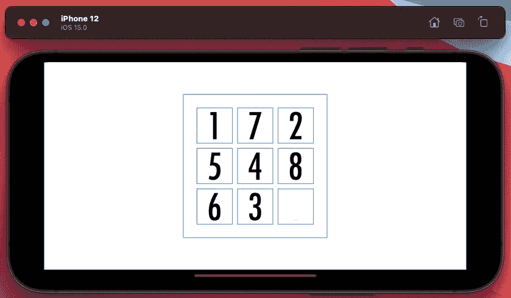
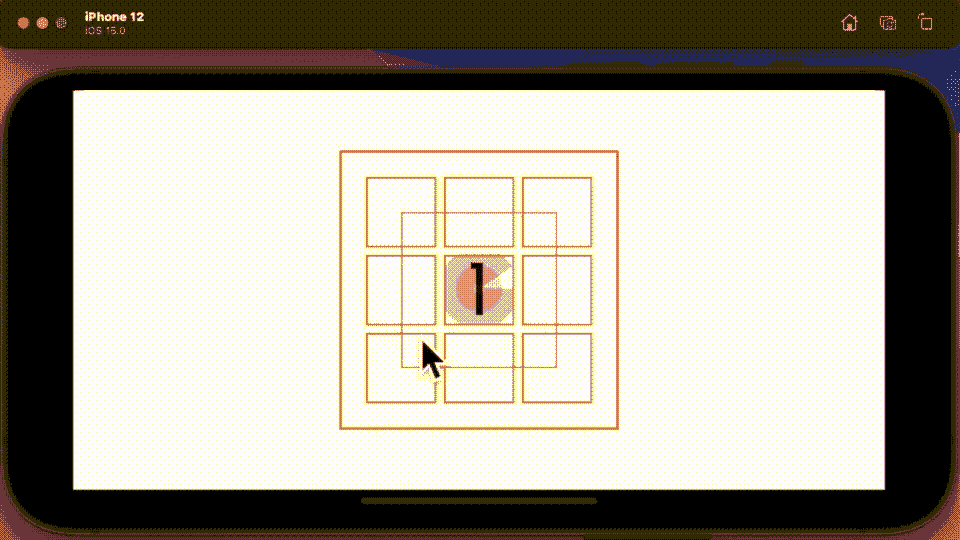
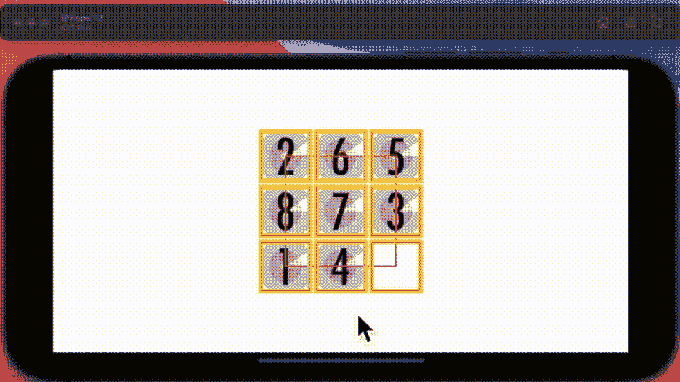
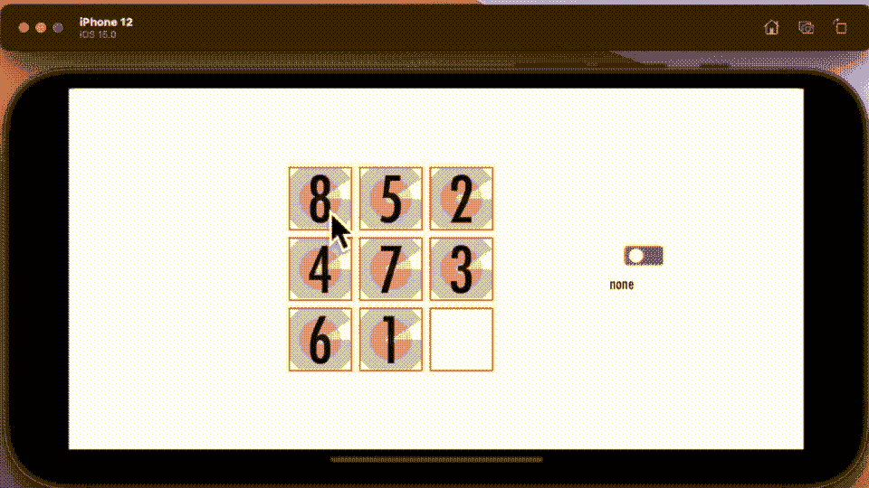

# 用 SwiftUI 构建一个滑动益智游戏

> 原文：<https://betterprogramming.pub/build-a-sliding-puzzle-game-with-swiftui-60a76be88bb5>

## 难题 9 使用对齐和匹配几何

[阿什坎·弗鲁扎尼](https://unsplash.com/@ashkfor121?utm_source=medium&utm_medium=referral)在 [Unsplash](https://unsplash.com?utm_source=medium&utm_medium=referral) 拍摄的照片

事后看来说起来容易，但我确实觉得如果苹果在 1.0 版本中推出了`matchedGeomtryEffect`原语，SwiftUI 会有一个更好的开始。

因为 UIKit 经验丰富的程序员面对 SwiftUI 的最大挑战，我认为是布局。

一个比 matchedGeometry 更有意义的范例。和我一起在 iOS 15 中使用 Swift 来构建一个拼图 9 的游戏，使用它和一些`UnitPoint`排列等等。

# 做简报

他们说一张图胜过千言万语——现在你有了——我在这里展示了一个简单的游戏，目标是移动瓷砖，使它们有序排列。我们在这里从 1 开始，位置是正确的，但是我认为在这个截图中每隔一个图块都是错误的位置。

显然，如果你可以简单地拖动瓷砖到瓷砖上，那就太简单了，这个想法是你需要通过空瓷砖。

# 代码简介

好了，你知道目标了，让我们来谈谈实现吧，我们将在这里使用 SwiftUI，在画布上显示数字。我可以使用一个文本对象，但我也设想用图像来尝试，所以让我们用画布。这是一个网格，所以这里有`LazyVGrid`。计划是使用拖动手势来触发移动，并使用匹配的几何图形来执行实际的移动。最好是在结束时，它可以/应该告诉你完成了，也许可以报告你花了多长时间，这样你就可以练习并变得更好，最终可以有某种记分牌来完成事情。

# 概念证明

首先，我创建了一个概念证明，包括您在这里看到的基本动态。当然只有一个数字，一半的移动是无效的——但是原理是存在的。我在这里做的是改变画布视图之间的对齐，我使用这篇文章[中的一些代码构建了画布视图。它看起来像是在九个方块之间移动，但在幕后，方块网格没有参与其中。我正在更改数字与中心红色方块的对齐方式。我在这里没有实现拖动——只是点击手势。](/implementing-swiftui-canvas-view-in-ios-15-b7909eac207)

手势和锚定值之间的链接使用基于组合框架的发布器来发送更改。

# 后续步骤

所以接下来我需要更多的数字，在网格上随机排列。为此，我参考了这篇[文章](/5-swift-extensions-to-generate-randoms-87401ccc60f)来弄清楚如何在一个集合中获取一个随机整数，并提出了一个如下所示的 SwiftUI 解决方案。

简而言之，这只是从一个集合中随机选取一个成员，保存它的决定，确保下一次我调用它时得到一个不同的数字。当我构建它时，我在画布视图中调用这个方法。现在给你一个警告。我怀疑，与数独板一样，你不能简单地随机选择一组数字，这个问题我们将回头讨论。

# 下一阶段

接下来的部分，我承认有点挑战性。我暂时不告诉你我找到的捕捉画布的解决方案——但请放心，我已经这样做了，并将我的所有八个数字存储到图像中，随后我将这些图像放置在一个网格中，留下最后一个框。

在反复试验之后，我明白了如何使用匹配的`geometryEffect`来得到我需要的结果。我的每个图像都有它的布局锚值和一个变量`freeSpace`,这个变量包含了未使用的正方形的对齐方式。小时的代码看起来像这样:

在两个循环中都提到了两次。将图像布局成 9x9 的正方形后，`matchedGeometryEffect`标签负责控制图像相对于我在其中绘制的一个矩形的布局。红色矩形在之前和之后的动画 gif 上可见。

我现在继续使用点击手势，因为这样更容易。它的工作方式很简单。你点击一个方块，它就进入自由空间。

看起来不错——虽然眼尖的你可能注意到了我在这里作弊解这个方。你可以看到，没有规定说一个方块需要靠近`freespace`才能移动到那里——现在它对所有人都是免费的。这是如果你喜欢游戏的简单选项。

# 实施规则

bon——按照规则——我画了一份我需要的草图。并决定建立三个等级，硬等级将限制你只能垂直和水平的邻居，中等等级，这将让你做对角线移动，和容易等级，对所有人免费。

我将规则编码到一个数组字典中，每个数组记录了相关自由方块允许的有效移动。然后，当您请求移动时，我简单地添加了一个检查，以确保它是有效的。

添加完规则后，我还需要一个开关来选择我想要使用的规则。我决定使用一个三路开关，这是我基于之前发布的一些代码创建的[这里](/styling-the-toggle-in-swiftui-f19a2d70c379)。

所有这些使我不得不结束这篇论文，因为我已经完全超出了我的一千字的限制。你可以在最后一张 GIF 中看到游戏的运行。

没有规则，我可以将数字 8 对角移动。

根据一些规则，我仍然可以做接近对角线的移动，但是不能做穿过其他方块的移动。

最后，按照常规规则，我只能从相邻的方格水平和垂直移动到自由的方格。

现在所有东西背后的代码都在 bitbucket 上，我在这里展示了项目的链接[。如果你访问它有困难，请留下你的评论，我会试着整理出来。](https://bitbucket.org/wizard1066/workspace/projects/PUZ)

# 未来的步骤

我需要结束这里的事情，所以我没有完全勾选所有的要求。我错过了什么？

*   我没有实现拖动，最终没有意义？
*   我没有实现计时器
*   我没有做排行榜
*   我没有做任何排序完成消息/警报
*   我没有研究将照片加载到我的图像中的选项

老实说，最重要的是，如果我想把这个上传到应用程序商店，一个引人注目的事实是，你不能像我一样随机创建一个拼图 9 方块，因为如果你这样做，完全有可能创建一个不可能的。这仍然是一个必须解决的问题。