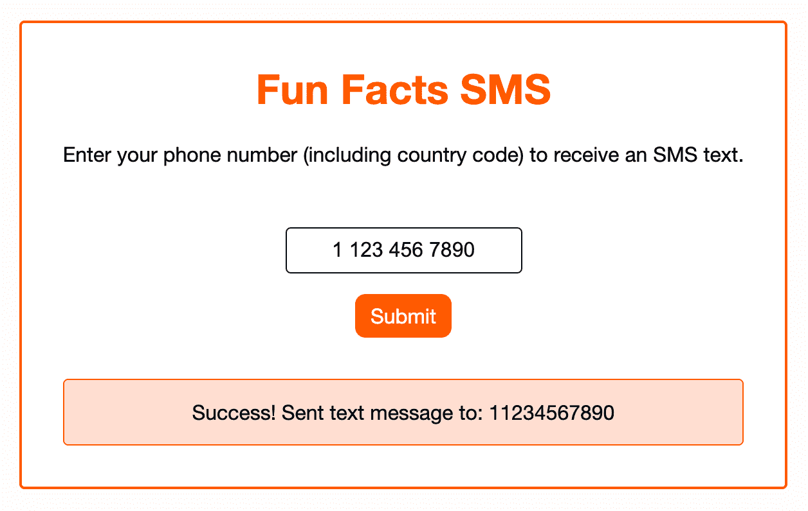
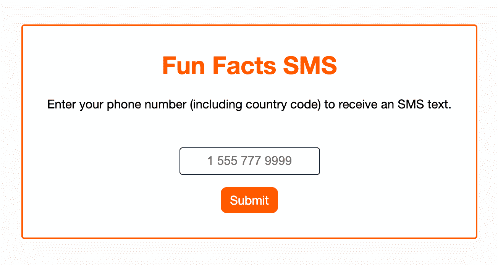
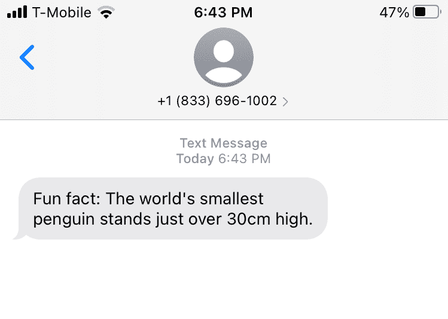

# 使用 JavaScript 和云 API 构建 SMS Web 应用程序

> 原文：<https://betterprogramming.pub/build-a-sms-web-app-with-javascript-and-cloud-apis-26237f80d7d3>

## 向你的用户发送有趣的信息！

有趣的事实短信演示应用

短信是与用户联系的一种强有力的方式。世界各地的企业都使用短信发送预约提醒、发货通知、客户满意度调查等。对于网速较慢的国家或客户，短信甚至可以作为应用内聊天功能的可行替代。

在本文中，我们将展示 SMS 的强大功能，并展示开始使用它是多么容易。我们将一起构建一个“每日趣事”网络应用程序，允许用户输入他们的电话号码来接收带有趣事的短信。我们将使用来自云通信平台 [Infobip](https://www.infobip.com/) 的 SMS API 来提供这一功能。

我们开始吧！

# 演示应用概述

演示应用程序:输入您的电话号码接收短信

我们的演示应用程序在后端使用 Node.js 和 Express 构建，在前端使用简单的 HTML、CSS 和 JavaScript 构建。

演示应用程序:短信发送成功

用户可以在这个最小化的界面中输入他们的电话号码，然后点击提交按钮来接收由 [Infobip API](https://www.infobip.com/docs/sms/api) 触发的文本。

关于企鹅有趣事实的短信

就这么简单！

让我们回顾一下我们是如何构建它的。我们将在本文的其余部分包含一些代码片段，但是您可以随意查看 GitHub repo 以获得完整的示例代码。

# 创建注册表单

让我们从注册表单的前端代码开始。表单由典型的 HTML 表单元素构成:`<form>`、`<label>`、`<input>`和`<button>`:

当用户输入他们的电话号码并提交表单时，JavaScript 向 Node.js 服务器上的一个端点发起一个 API 请求:

# 使用 Infobip SMS API

现在转到我们的后端代码，我们的 Express 路由器接收来自前端的请求，并启动自己的 API 请求，这次是对 Infobip SMS API 的请求:

你问为什么要做服务器端 API 请求？主要是因为我们想对我们的 API 密匙保密。Infobip SMS API 使用一个[授权头](https://www.infobip.com/docs/essentials/api-authentication#api-key-header)，它要求我们提供 API 密钥，我们不希望所有用户在其浏览器的网络请求中完全看到这个密钥。因此，我们可以通过将 API 密匙存储在一个`.env`文件中来保护它，并且只从服务器而不是客户端访问它。

这样，Infobip SMS API 向用户提供的电话号码发送一条文本，浏览器的 UI 显示一条确认消息。我们成功地向某人发送了一个有趣的事实！

# 结论和进一步的探索

在我们相处的短暂时间里，我们已经开发了一个简单的应用程序，但是我们还可以做更多的事情。我们可以允许用户选择每天接收一个有趣的事实，而不仅仅是发送一个文本。我们可以从每个注册的人那里创建一个客户目录。我们甚至可以要求用户在订阅我们有趣的每日事实服务之前进行双重身份验证，以验证他们的电话号码。API 为短信发送提供的[选项非常广泛，你甚至可以设置](https://www.infobip.com/docs/api#channels/sms/send-sms-message) [webhooks 来报告](https://www.infobip.com/docs/api#channels/sms/receive-outbound-sms-message-report)出站消息。

好消息是 Infobip 让这一切变得简单。无论您是直接使用他们的 API、他们的 SDK，还是他们平台的 GUI，与您的用户保持联系都是轻而易举的事情。