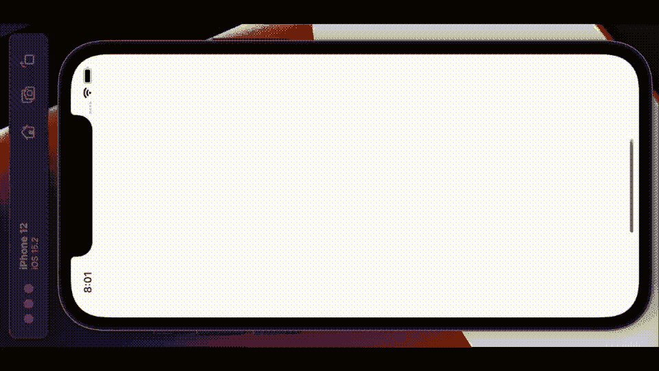
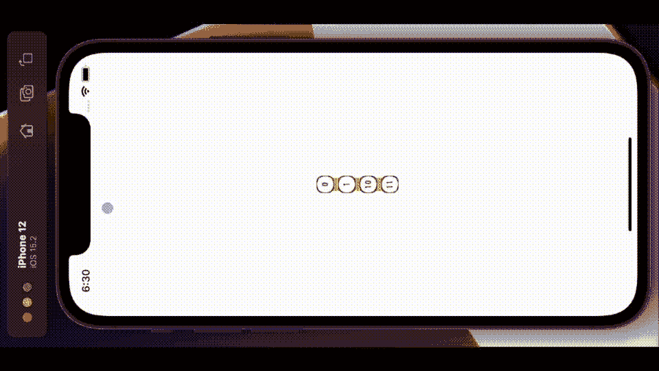

# 使用 GeometryReader 在 SwiftUI 中构建一个贪吃蛇游戏

> 原文：<https://betterprogramming.pub/build-a-snake-game-in-swiftui-using-geometryreader-c6785cfc7b59>

## 了解如何利用首选项协议


照片由 [Riho Kroll](https://unsplash.com/@rihok?utm_source=medium&utm_medium=referral) 在 [Unsplash](https://unsplash.com?utm_source=medium&utm_medium=referral) 上拍摄

尽管我相当肯定公元前 450 年左右的孔子不是程序员，但他关于学习编程的一些建议再正确不过了。

> 告诉我，我会忘记；
> 给我看，我可能会记得；让我参与进来，我就会明白。

因此，请和我一起来看看如何构建一个简单的蛇形游戏。在这段代码中，我将涉及 SwiftUI 中的首选项协议、`GeometryReader`等。

# 游戏

你可能已经猜到了，我没有设计一个从左到右运行的游戏——但是我需要滚动到一边给你看。所以把你的屏幕转到右边看就对了。



您看到的是形状的 for each 循环，它通过首选项协议与线条的 for each 循环相连接。当我拖动头部时，我使用延迟来移动不同的部分，因为这样看起来更好。从左到右传递的形状开始是你需要抓住的圆圈。如果做不到这一点，当它们出现在屏幕中间时，就会变成星星。你不想抓住的星星。当你抓到一个圆圈时，蛇就长了一段。偶然抓到一颗星或者完全错过一圈【就成了星】，蛇就缩了一段。结束游戏是当蛇没有更多的部分可以失去。

# 设计

上周我发表了一篇关于我刚刚开发的另一款游戏的文章，你可以在这里找到。它也依赖于圆圈和线条；但是我做的很不一样。为了在其中构建类似图形的结构，我预先定义了所有的坐标。但是在这种情况下，我需要能够动态地构建它，这就是我转向 SwiftUI 首选项协议的原因。

# 概念证明

动画 GIF 展示了一个包含所有必要元素的 POC 我有一条蛇，传递要抓或不要抓的东西，以及一些正在进行的评分，下一步去哪里。我脑海中最深刻的是“少即是多”这句话。

*   大多数游戏都有一些需要完成的阶段或挑战。
*   大多数游戏都有你可以加入的关卡——需要做的事情。
*   大多数游戏都有各种各样的排行榜——这是必须的。

# 更多挑战

邦，在这一点上，我有“浆果”，如果你愿意，以恒定的速度下降。如果蛇在屏幕中间错过了他们，那么他需要避开他们。有哪些轻松取胜的方法？以下是我的一些想法，如何在不增加太多代码的情况下让游戏更具挑战性。

*   我可以介绍他需要完全避免的“浆果”？
*   我可以介绍以不同速度下落的“浆果”，有些快，有些慢？
*   我可以介绍一些“浆果”,它们会在旅途中的某个时刻改变皮肤？
*   我可以让一些“浆果”比其他的更有价值，并有一些评分机制。
*   我可以让“浆果”以不同的速度落下？
*   从蛇的角度来看，改变线段的形状是控制难度的一个很好的方法；黑鱼越大，越容易捕捉到「浆果」？
*   随着蛇越来越大，我可以减缓它的滑行速度。
*   我可以让他的身体成为当前的弱点。没有什么发生在头脑之外。
*   回到浆果的价值，我可以让蛇长得更快或更慢。

# 概念验证第 2 部分

好的，这看起来像什么？蛇的格式有了一点变化，但或多或少是一样的——除了尾巴的动画随着它变长而变得更慢。浆果现在有四种口味；越黑的想抓，越轻的不想抓。他们现在也在以不同的速度前进。



同样的规则也适用:抓住一个浆果，尾巴变长，丢掉一个，尾巴变短。抓错浆果，尾巴变短。这是一个比 POCI 快得多的游戏。

# 给我看看代码

Bon —足够的文字和图片—我是怎么做到的。正如我所说的，关键在于实现如下所示的 SwiftUI 首选项协议。

我创建了一个结构，其中存储了一个索引值和`CGRect`。我将该结构命名为保存在 preferences 协议模板中，然后创建了第三个结构来使用它。
除此之外，我将`PreferenceViewSetter`结构作为蛇段的背景。有了这段代码。

```
RoundedRectangle(cornerRadius: 8)
  .stroke(Color.black, lineWidth: 2)
  .frame(width: 24, height: 24)
  .background(PreferenceViewSetter(idx: idx))
```

我在一个循环中调用的代码，表示我需要多少段。这是一个循环，它的大小随着游戏的进行而变化。我把这段代码放在循环的外面，画出了线段。

```
.onPreferenceChange(TextPreferenceKey.self) { preferences in
  for p in preferences {
    self.rects[p.viewIdx] = p.rect
  }
```

当每一段被绘制到一个外部数组中时，它保存了`CGRect`,我随后在绘制段的同一次运行中用这个结构再次引用了这个外部数组。

在一个循环中再次调用，这个例程在每个蛇段之间画一条线。综合起来，看起来是这样的。`SnakeView`此处绘制了更新 reacts 数组的段更新首选项——一个返回到线条绘制的数组。

实现 berry drops 要简单得多，只需使用一个计时器来触发一组 berry 数据进行操作。

所有这些都让我想到了这篇短文的结尾。从 bitbucket 下载完整的代码库，点击链接参与其中，就像孔子建议的那样。以此为基础，构建自己的贪吃蛇游戏！