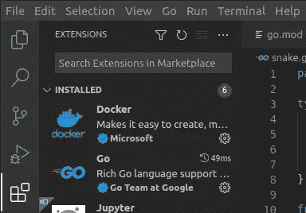
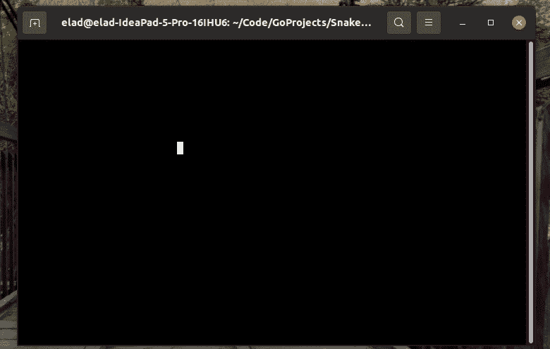
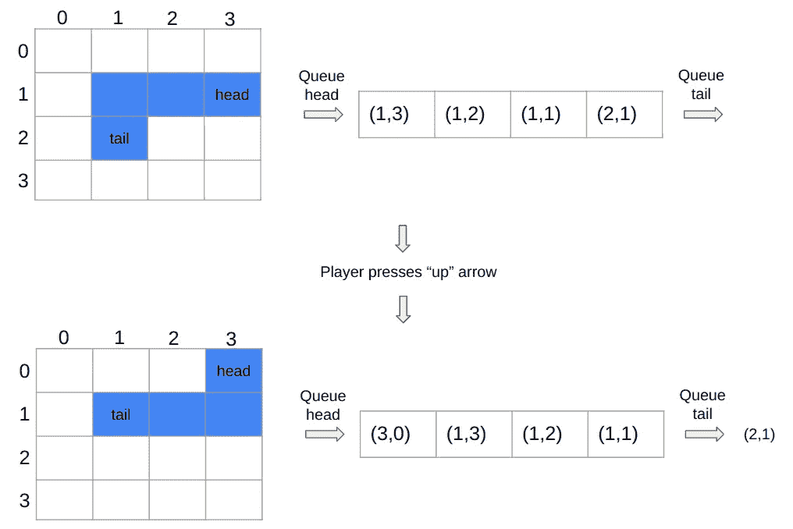
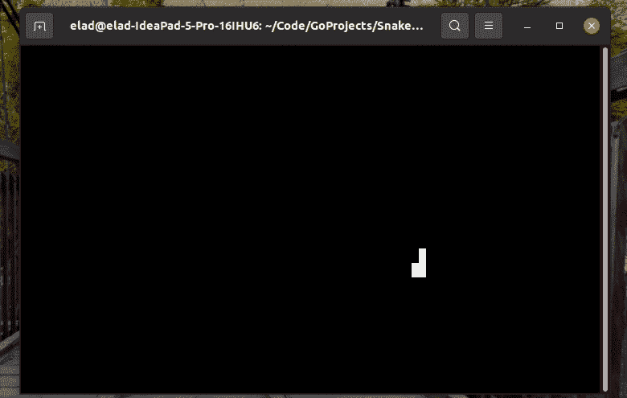
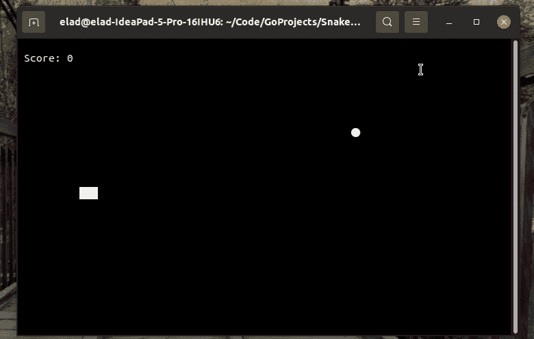

# 使用 Go 构建一个贪吃蛇游戏

> 原文：<https://betterprogramming.pub/build-a-snake-game-using-in-go-b4186e21d011>

## 一步一步地学习围棋


照片由[卡尔·劳](https://unsplash.com/@carltraw?utm_source=medium&utm_medium=referral)在 [Unsplash](https://unsplash.com?utm_source=medium&utm_medium=referral) 拍摄

在本文中，我们将使用 Go 来构建经典的贪吃蛇游戏。这是我的第一个围棋项目，还有什么更好的机会与你分享我的学习经验，并希望能帮助你学习围棋？

这个项目的完整代码(分成几个部分)在这个 [GitHub repo](https://github.com/erap129/SnakeInGo)

这篇文章的概要如下:

*   第 1 部分——何苦呢？
*   第 2 部分—设置我们的环境
*   第 3 部分—在 Go 中实现蛇
    —第 3.1 部分—移动的斑点
    —第 3.2 部分—移动的蛇
    —第 3.3 部分—添加食物和点数

# **第 1 部分——何苦呢？**

为什么要学习一门新语言？为什么不遵循官方教程，然后就到此为止呢？

*   学习一门新语言让我们成为更好的程序员。每种编程语言都有自己的优势和特性，对我们以前没有见过的语言开放可以让我们接触到新的想法和编程范例，还可以为我们的工具链添加另一种工具。
*   还有什么比游戏更好的学习方式呢？我个人认为这比遵循说明书有趣多了。

那为什么要去呢？

Go 是谷歌创造的一种语言，其 1.0 版本于 2012 年向公众发布。从那以后，Go 得到了发展，并在开发者中获得了很大的影响力。Go 以快速和易于学习而闻名，它非常注重高效的并发性(阅读关于 [goroutines](https://golangbot.com/goroutines/) [2】的更多信息)。我认为这样一种流行和流行的语言值得我关注，即使我不打算在不久的将来使用它做任何实际的事情，因此本教程诞生了！

# 第 2 部分—设置我们的环境

安装部分只与 Linux 相关。请注意，它将安装一个旧版本的 Go(在撰写本文时是 1.13)，但对于我们的项目来说已经足够了。

**安装:**使用以下命令安装 Go:`sudo apt install golang-go`。完成安装后，通过运行`go version`检查您的系统是否安装了 Go。您的输出应该是这样的:`go version go1.13.8 linux/amd64`(取决于您安装的版本)。完成后，我们可以创建我们的第一个项目！

**创建项目:**我们将使用 Visual Studio 代码(vscode)作为我们的 IDE(您仍然可以使用其他 IDE)。为我们的项目创建一个名为 Snake 的新文件夹，并在该文件夹中打开 IDE。如果使用 vscode，您应该通过 Extensions 选项卡安装 Go 扩展。



vscode — Go 扩展

打开终端(可以直接在 VS 代码中完成)，键入`go mod init Snake`，回车。

这将在您的当前目录(Snake 目录)中创建一个新文件`go.mod`。如果我们把这个项目作为一个模块发布，我们会用一个有效的 URL 替换`Snake`，比如我们的 GitHub 库，但是因为这只是一个玩具项目，我们不关心这个。

让我们编写一个简单的“Hello World”项目，看看一切都正常运行。在 Snake 目录中创建一个名为`main.go`的新文件，并输入以下代码:

```
package mainimport "fmt"func main() { fmt.Println("Hello World!")}
```

在这段代码中，我们导入并使用了处理命令行输入和输出的标准`fmt`包。在终端运行`go run main.go`。你应该看到`Hello World!`打印在你的终端上，程序应该退出。如果这一步完成了，我们就可以进入下一步了——构建一个贪吃蛇游戏！

当你想运行一个由几个文件组成的项目时(就像在这个游戏中)，从包含你的代码的目录中运行`**go run *.go**`。接下来将会发生的是，你的主函数将会在知道项目中其他文件的情况下运行(如果你只是运行`go run main.go`，它将会忽略所有其他文件，并且由于缺少依赖关系而中断)。

# 第 3 部分—在 Go 中实现 Snake

这一实现受到了 Josh Aletto 创作的 [Pong Go 教程](https://earthly.dev/blog/pongo/)【3】的启发并基于该教程。

## **第 3.1 部分——移动的斑点**

在第一部分中，我们将在屏幕上创建一个键盘控制的 blob。我们以此开始，因为这是一个相对简单的逻辑任务，它将允许我们专注于语言的基础和我们将使用的基于终端的 GUI 框架— `[tcell](https://github.com/gdamore/tcell)` [4]。

第一部分由三个文件组成—

*   `main.go`将包含 UI 循环，它将监听用户输入并相应地更新相关的数据结构。它还将启动`game.go.`中的子程序
*   处理主游戏循环——更新游戏中不同元素的状态，并将它们绘制在终端屏幕上。
*   `snake.go`处理蛇对象的内部状态(目前只是它的速度和位置)

让我们来看看这些文件:

`main.go` —

*   在第 11–18 行中，我们从`tcell`获取`screen`对象，并在屏幕抓取失败时做一些错误处理。
*   在第 23–33 行，我们定义了两个对象`game`和`SnakeBody`，并用一些初始参数初始化它们。
*   在第 34 行，我们运行了一个`goroutine`，它在一个不同的线程中启动了`game`的主循环。我们稍后将查看游戏循环。
*   在第 35–53 行，我们处理用户输入。要么用户按下`ctrl+c`，然后我们退出程序，要么用户按下其中一个箭头键，然后我们向`game.SnakeBody`对象发送相关信号，以改变运动方向。

`game.go` —

*   第 21–27 行定义了主游戏循环。在每一步开始时，我们清空屏幕，然后更新`snakeBody`位置并将其绘制在屏幕上。之后，我们执行`time.Sleep`来保持屏幕上的前一帧(否则移动速度太快，我们无法视觉感知)。最后，我们在屏幕上绘制新的框架。

`snake.go` —

*   这个文件定义了我们的 snake 对象(目前只是一个 blob ),并使用当前速度处理方向的改变和当前位置的更新。注意，如果蛇消失在屏幕的一边，我们希望它在另一边重新出现，这就是第 16–23 行的复杂性。

这部分的游戏玩法应该是这样的:



游戏性—第一部分

## **第 3.3 部分——一条移动的蛇**

要实现一条移动的蛇，我们首先需要定义作为一条“蛇”意味着什么。在这个上下文中，它表示由几个部分组成的实体，其中每个部分都有自己的 X 和 Y 坐标。注意到蛇的移动可以用队列来建模，我们可以用一种简单而优雅的方式来实现它，如下图所示。



以队列形式实现蛇形移动

我们的大部分更改将发生在文件`snake.go`中，在这里将实现队列逻辑(Go 没有内置队列，所以我们将使用片来实现它们)。在`main.go`和`game.go`中也会发生一些小的变化，主要是为了支持前者的变化。

`main.go` —

*   在第 23–36 行中，向构成蛇的初始构建块的`snakeParts`对象添加了一个初始化。

`game.go` —

*   增加了`drawParts`功能，该功能将在游戏循环的每次迭代中将蛇的部分绘制到屏幕上。

`snake.go` —

*   增加了`Update`功能，实现了蛇的队列式移动。在这个函数的每次激活中，一个新的头部被加入队列(取决于蛇的方向),而尾部被出队。

这部分的游戏玩法应该是这样的:



游戏性—第二部分

## **第 3.3 部分—添加食物和点数**

在这一部分，我们将为游戏添加重要的逻辑，包括:

*   收集食物和赚取积分的能力
*   如果蛇收集食物，就让它变长
*   探测蛇头与蛇身的碰撞
*   一个“游戏结束”的屏幕，可以选择重播或退出

让我们讨论一下这三个文件中每个文件所需的更改:

`snake.go` —

*   第 21–23 行:检查`longerSnake`参数是否作为 true 传递。如果是这样，不要在蛇的身体上执行出列，从而使它长一个图块。
*   为方便起见，增加了`ResetPos`函数(该函数将从`main.go`调用)

`game.go` —

*   增加了在屏幕上绘制文本的`drawText`功能。取自[另一个使用单元格](https://github.com/liweiyi88/gosnakego)【5】的 snake 实现。
*   增加`checkCollision`功能，接收零件列表和另一个零件。对于零件列表中的每个零件，它会检查是否与其他零件冲突。我们用这个函数来检查 1)蛇头是否与食物发生了碰撞，2)蛇头是否与蛇身发生了碰撞。
*   在主循环中添加了逻辑(我将详细说明不太重要的添加内容):
    1)第 72–76 行:检查与食物的碰撞，如果检测到碰撞，则更新分数。此外，在一个随机的位置重新绘制食物。第 86–88 行:屏幕上的游戏。请注意，在显示分数后，该子程序将终止(在`main.go`中，用户将选择用新游戏开始另一个 goroutine)

`main.go` —

*   第 43–47 行:这些行处理游戏结束的情况。如果检测到游戏结束(使用`game`中的`GameOver`按钮)，用户可以选择按下`y`或`n`，游戏将相应地重启或终止。我们只需启动另一个 goroutine 即可重启游戏。

这部分的游戏玩法应该是这样的:



游戏性—第三部分

我们已经完成了实现！您的贪吃蛇游戏已经开始运行，您可以邀请朋友参加锦标赛:)

# 未来的想法

我希望你喜欢在 Go 中实现 Snake，我知道我喜欢。我认为 goroutines 是一个超级酷的特性，我不知道在其他语言中执行并行化是如此容易。虽然这个游戏相当简单，但我仍然喜欢将队列实现移动作为一个小的脑力练习。如果我不得不使用这种语言做任何实际的事情，这种经历也会缩短学习曲线，并且在我的腰带下有另一种工具总是好的。

如果我有更多的时间，我会延长这个游戏，给我的蛇添加一些很酷的能量，比如粒子射击能力，速度变化，以及其他好东西。我还会添加单元测试，以确保在添加这些功能后不会出现任何问题。

感谢阅读，下次见！

# 参考

[1] —完整项目代码:[https://github.com/erap129/SnakeInGo](https://github.com/erap129/SnakeInGo)

[2]—戈罗廷斯:[https://golangbot.com/goroutines/](https://golangbot.com/goroutines/)

[3] — Pong 围棋教程:[https://earthly.dev/blog/pongo/](https://earthly.dev/blog/pongo/)

[4] — tcell Go 包:[https://github.com/gdamore/tcell](https://github.com/gdamore/tcell)

[5] —使用【https://github.com/liweiyi88/gosnakego】的`tcell` : [的另一个 snake 实现](https://github.com/liweiyi88/gosnakego)