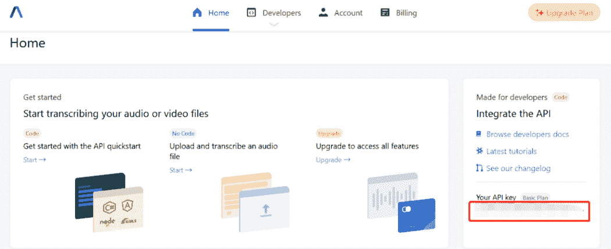

# 使用 Python 构建语音内容安全检测工具

> 原文：<https://betterprogramming.pub/build-a-speech-content-safety-detection-tool-using-python-e4419f6c593>

## 识别音频/视频记录中的敏感内容


[埃斯凯·林](https://unsplash.com/@eskaylim?utm_source=unsplash&utm_medium=referral&utm_content=creditCopyText)在 [Unsplash](https://unsplash.com/s/photos/filter-speech?utm_source=unsplash&utm_medium=referral&utm_content=creditCopyText) 上的照片

内容审核是指在平台上主动监控用户生成的内容，以确定该内容是否允许在平台上发布或使用。这主要是为了防止和过滤掉任何潜在的攻击性或无关的内容，以免影响用户在平台上的体验。

整个内容审核过程相当复杂，因为它需要某种形式的预定义规则和准则，以过滤掉平台上无关的文本、图像、视频和音频。内容审核最常见的领域有:

*   色情描写
*   仇恨言论
*   恐怖主义
*   假新闻

内容审核的示例用例包括播客监控或像 Twitter Spaces 这样的语音社区审核。

在本教程中，让我们探索如何在 Python 中轻松设置语音内容安全检测。本教程基于 AssemblyAI 提供的外部[语音转文本 API](https://www.assemblyai.com/) 。

# 设置

建议在继续安装之前创建一个新的虚拟环境。

## 要求

您将需要`requests`包来进行 HTTP API 调用。您可以安装如下:

```
pip install requests
```

## API 密钥

此外，前往下面的[注册页面](https://app.assemblyai.com/signup)注册一个新的免费试用账户。它每月提供 3 小时的转录，之后你必须充值。



作者图片

记下 API 键，因为它很重要，以后以编程方式调用 API 时会用到它。

# 履行

整个工作流程如下:

*   为您的音频/视频文件获取一个可访问的 URL。你可以通过任何形式的在线存储或将文件上传到 AssemblyAI 的服务器上。
*   用`audio_url`和`content_safety`参数对转录 API 进行 POST 调用。这将开始转录。
*   对转录 API 进行 GET 调用，以检查该过程是否完成。转录完成后，您应该会得到最终的输出。

## 上传本地音频文件(可选)

如果您没有可访问的 URL，您可以使用以下步骤将本地音频文件上传到 AssemblyAI 提供的在线存储。

在您的工作目录中，创建一个名为`upload_file.py`的新文件。然后，用下面的代码片段填充它(根据您的用例替换`api_key`和`filename`变量):

继续在您的终端上运行以下命令:

```
python upload_file.py
```

它会将您的音频文件作为块上传到服务器，并在上传完成后返回一个 JSON 输出。

```
{"upload_url": "https://cdn.assemblyai.com/upload/ccbbbfaf-f319-4455-9556-272d48faaf7f"}
```

稍后您将使用这个可访问的 URL 进行转录。

## 对脚本 API 进行 POST 调用

接下来，继续创建一个名为`transcribe.py.`的新 Python 文件，附加以下代码，该代码通过 [AssemblyAI 的脚本 API](https://docs.assemblyai.com/api-ref/v2-transcript) 进行 POST 调用。记得更换`api_key`和`audio_url`变量。需要注意的一点是，`content_safety`参数必须显式设置为`True`才能启用内容审核。

除此之外，您可以控制内容审核的阈值。默认情况下，它被设置为 50，但您可以通过向`data`字典添加一个额外的`content_safety_confidence`参数来轻松修改它:

```
data = {
  "audio_url": "...",
  "content_safety": True,
  "content_safety_confidence: 75
}
```

通过运行以下命令启动转录过程:

```
python transcribe.py
```

您应该得到 JSON 格式的输出，如下所示:

```
{ "id": "o6x66w9882-8075-4f74-b6c0-b63e9ce8596a"
  "language_model": "assemblyai_default",
  "acoustic_model": "assemblyai_default",
  "language_code": "en_us",
  "status": "queued",
  "audio_url": "https://bit.ly/3qDXLG8",
  "content_safety": true, ...
}
```

最重要的键值对是:

*   `id` —代表您的流程的唯一标识符。当稍后调用 GET API 以获得最终输出时，这个 id 是必需的
*   `status` —表示您的转录进度

如果您获得了`error`状态，可能是由于以下原因之一:

*   不支持的音频文件格式
*   音频文件不包含音频数据
*   音频文件太短(< 200 毫秒)
*   无法访问音频文件的 URL
*   API 端的错误

## 对脚本 API 进行 GET 调用

您需要通过 GET HTTP 对同一个脚本 API 进行另一个 API 调用。这是为了检查转录过程，如果完成了，您将获得带有内容审核信息的最终输出。

此外，根据文件的长度，转录过程可能需要 10 分钟。使用以下代码创建一个名为`transcribe_file.py`的新 Python 文件:

相应地替换`api_key`和`id`变量，并运行以下命令:

```
python transcribe_file.py
```

JSON 输出将包含带有以下项目的`content_safety_labels`键:

```
content_safety_labels": {
    "status": "success",
    "results": [
      {
        "text": "Yes, that's it. Why does that happen? By calling off the Hunt, your brain can stop persevering on the ugly sister. Giving the correct set of neurons a chance to be activated. Tip of the tongue, especially blocking on a person's name, is totally normal. 25 year olds can experience several tip of the tongues a week, but young people don't sweat them, in part because old age, memory loss and Alzheimer's are nowhere on their radars.",
        "labels": [
          {
            "label": "health_issues",
            "confidence": 0.8165678381919861,
            "severity": 0.1607203334569931
          }
        ],
        "timestamp": {
          "start": 390066,
          "end": 420714
        }
      }
    ],
    "summary": {
      "health_issues": 0.8558240338157502
    },
    "severity_score_summary": {
      "health_issues": {
        "low": 0.5602263590800425,
        "medium": 0.4397736409199575,
        "high": 0
      }
    }
  }, ...
```

*   `status`:不是`success`就是`unavailable`
*   `result`:以下项目的字典列表(文本、标签、时间戳)。`text`代表内容审核下的音频转录。同时，`labels`是带有以下键值对(标签、置信度、严重性)的标记内容列表。`timestamp`包含相应转录的开始和结束时间(毫秒)。
*   `summary`:每个检测到的标签的字典。每个包含浮点的标签代表与整个音频文件相关的**置信度得分**。
*   `severity_score_summary`:每个检测到的标签的字典。每个包含浮点的标签代表与整个音频文件相关的**严重性分数**。

在撰写本文时，API 目前支持以下标签:

*   事故
*   酒精
*   公司财务
*   犯罪暴力
*   药
*   投机
*   仇恨言论
*   健康问题
*   日本漫画
*   大麻
*   天灾
*   负面新闻
*   NSFW(成人内容)
*   色情描写
*   亵渎
*   敏感的社会问题
*   恐怖主义
*   烟草
*   武器

请注意，尽管置信度得分和严重性得分都从 0 到 1，但它们是不同的。

置信度得分代表由 AI 模型做出的预测的感知准确性，而严重性得分是标签的极值。例如，自然灾害或造成大量人员伤亡的事故会产生较高的严重度分数(0.8 到 1.0)，而轻微的车祸可能只会产生较高的严重度分数(0.1 到 0.2)。

因此，您可以使用 API 提供的信息来调节平台上与音频/视频相关的内容。

# 结论

让我们回顾一下你今天所学的内容。

本教程首先简要介绍了内容审核。

接下来，它介绍了安装过程，包括在 AssemblyAI 平台中设置一个新的免费试用帐户。

它继续详细解释了上传现有本地音频文件所需的步骤。返回的可访问 URL 意味着通过 POST call 调用脚本 API。最后，深入解释了 API 返回的内容审核结果。

感谢你阅读这篇文章。祝你有美好的一天！

# 参考

1.  [AssemblyAI —文档(内容审核)](https://docs.assemblyai.com/audio-intelligence#content-moderation)