# 构建和部署 Jekyll 网站

> 原文：<https://betterprogramming.pub/build-a-static-website-with-jekyll-and-automatically-deploy-it-to-aws-s3-using-circle-ci-26c1b266e91f>

## 使用 Jekyll 创建一个静态网站，并使用 CircleCI 将其自动部署到 AWS S3


扎克·赖纳在 [Unsplash](https://unsplash.com/s/photos/jekyll?utm_source=unsplash&utm_medium=referral&utm_content=creditCopyText) 上的照片

# 概观

在这篇文章中，我将解释使用 Jekyll 构建我的网站所使用的高级架构，并使用 [CircleCI](https://circleci.com/) 到 [AWS S3](https://aws.amazon.com/s3/) 自动部署它。

除了存储图像或文件，S3 还可以托管由 HTML、CSS 和 JavaScript 组成的静态网站。

亚马逊在 S3 为您提供 5GB 的免费存储层，这意味着托管该解决方案没有任何成本。如果你想让你的网站使用一个特定的 URL，你只需要为 Route 53 域名付费。

# 吉基尔博士

Jekyll 是一个简单的、支持博客的静态站点生成器，非常适合个人、项目或组织站点。可以把它想象成一个基于文件的 CMS，没有所有的复杂性。

Jekyll 获取你的内容，渲染 markdown 和 liquid 模板，然后吐出一个完整的静态网站。Jekyll 是 GitHub 页面背后的引擎，您可以使用它来托管来自 GitHub 存储库的站点。

# 切尔莱西

> “CircleCI 的持续集成和交付平台通过自动化构建、测试和部署流程，帮助软件团队自信地快速发布代码。
> 
> CircleCI 提供了一个平台，让团队快速发展，轻松扩展，并每天自信地构建。”——*出自*[*https://circleci.com/about/*](https://circleci.com/about/)

# 高层视图

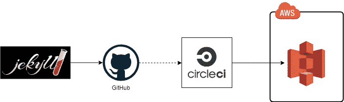

Jekyll 用于构建网站和生成静态内容。Git 用于将代码提交给 GitHub(如果您不知道 Git 和 GitHub 之间的区别，请查看未来关于这方面的帖子)。

GitHub 向 CircleCI 发送一个请求(web hook ), circle ci 将提取代码、构建、运行测试，并部署到 AWS S3 登台环境。一旦代码经过测试和验证，CircleCI 上的手动批准就会开始构建过程，并将其部署到生产环境中。

# 入门指南

让我们开始吧。首先安装[杰基尔](https://jekyllrb.com/)，你需要[红宝石](https://www.ruby-lang.org/en/)来安装宝石。

```
$ gem install bundler jekyll
```

创建新网站:

```
$ jekyll new my-awesome-site 
$ cd my-awesome-site
```

Jekyll 将创建一个基本的网站结构。

构建网站并使其在本地服务器上可用:

```
$ bundle exec jekyll serve
```

本地网址:[本地主机:4000](http://localhost:4000) 。

第一部分完成了！哲基尔跑了！

# 暂存和生产存储桶

现在，我们将为暂存和生产存储区设置带有 web 主机的 S3 文件夹。

*   登录您的 AWS 帐户，如果您没有帐户，请创建一个新帐户。如果您使用免费服务，将不会被收费。点击了解有关免费层[的更多信息。](https://aws.amazon.com/free/)
*   点击 S3 -> *创建桶*。
*   为您的存储桶指定一个唯一的名称，并在末尾添加`-staging`:【唯一名称】-staging。
*   选择离您最近的*区域*并点击*创建*。
*   点击你新创建的文件夹->选择*属性*和*启用静态*网站托管。

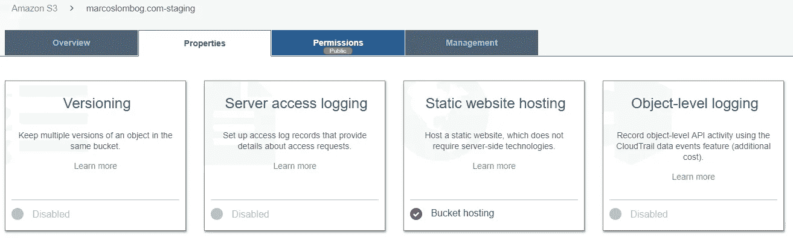

*   选择*权限*、*公共权限设置*、*编辑*，取消勾选所有复选框*并保存*。

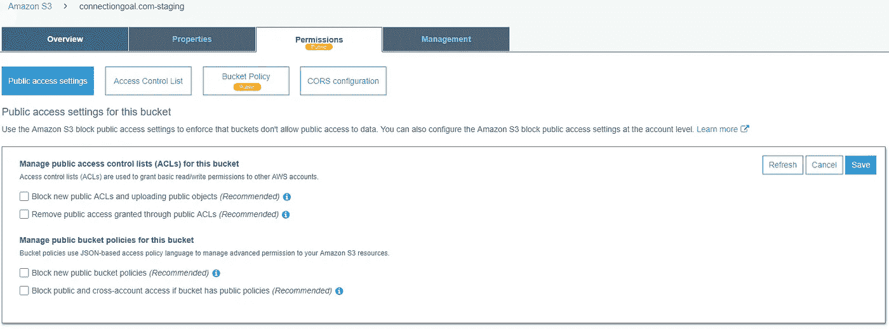

*   选择*存储桶策略*并包含以下策略以允许`GetObject`。

*   重复上面的过程，创建一个新的 bucket，在最后添加`-production`:【唯一名称】——production。
*   现在让我们测试这些桶:TK
*   创建一个简单的`index.html`并上传到两个 S3 存储桶。

```
<p>Hello World</p>
```

现在，我们将创建 CloudFront 发行版。Amazon CloudFront 是一种快速内容交付网络(CDN)服务，它在一个对开发人员友好的环境中，以低延迟、高传输速度向全球客户安全地交付数据、视频、应用程序和 API。

*   从 AWS 仪表板中，选择 *CloudFront* 。
*   点击 web 选项下的*创建发行版*和*开始*。


*   在*源域名*选项中，选择您之前创建的 S3 暂存桶，并点击*创建分发。*
*   从 CloudFront 发行版列表中，单击您新创建的发行版。复制*域名* `XXXXX.cloudfront.net`并粘贴到新的浏览器标签页中。您应该会看到您的 HTML 页面。
*   重复这个过程，并创建您的生产分布

恭喜你！

桶已创建！

# 贮藏室ˌ仓库

源代码将存储在 [GitHub](https://github.com/) 上。为了向 GiHub 提交代码，我们将使用 [Git](https://git-scm.com/)

## 下载并安装 Git

登录您的 GitHub 帐户，如果您没有，请创建一个新帐户。如果你的库是公开的，GitHub 不会向你收费。创建一个名字很棒的新存储库。

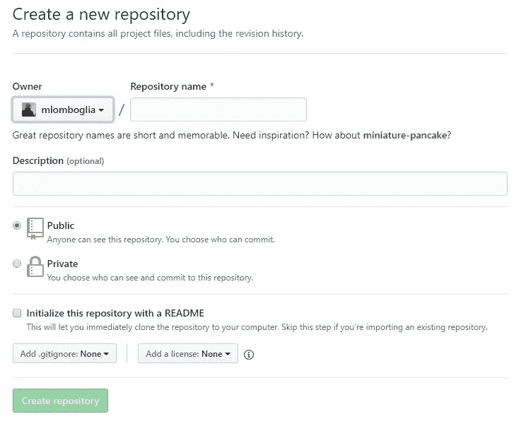

复制新创建的 GitHub 存储库的地址。

初始化你的 Jekyll 文件夹。

*   前往您的网站文件夹:

```
$ cd my-awesome-site
```

*   运行以下命令初始化 Git 文件夹:

```
$ git init 
$ git remote add origin git@github.com:your github repository
```

在你的网站根目录下创建一个名为`.gitignore`的新文件。这个文件将指示 Git 忽略某些不会被推送到存储库的文件。

*   将您的代码添加、提交并推送到存储库:

```
$ git add .
$ git commit -m "description"
$ git push -u origin master
```

您可能需要在此阶段输入您的密码。

转到您的 GitHub 库，您应该会看到文件列表。现在，我们准备创建一个连续的部署过程。

# 部署

部署过程通过 CircleCI 运行。

当 *develop* 分支与 *master* 合并时，它会自动提示 CircleCI 中的一个工作流来构建网站并将其部署到【staging URL】。

一旦您测试了更改(在移动和桌面上，以及所有浏览器上，包括 IE11)，单击工作流中的`confirm_deploy`按钮，部署将开始。

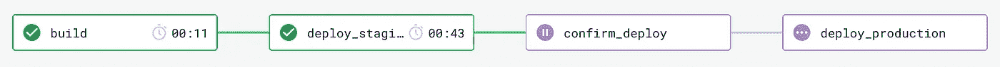

# CircleCI 本地配置

CircleCI 配置存储在位于`~/.circleci/config.yml`的单个 YAML 文件中，其中`~`是项目目录的根目录。

由于使用 CircleCI 的大部分工作都发生在该文件中，因此了解 YAML 格式的基础知识非常重要。YAML 是所有编程语言的人性化数据序列化标准。

它是另一种数据序列化语言 JSON 的严格超集。这意味着它能做 JSON 能做的一切…甚至更多。

我们将在`config.yml`配置四项工作:

## **构建**

1.  检查代码。
2.  安装 Jekyll。
3.  建立网站。
4.  坚持到`_site`文件夹。

## **部署 _ 暂存**

1.  安装 AWS CLI。
2.  添加 AWS 凭据。
3.  部署到 S3 集结地。
4.  清除 CloudFront 临时缓存。

## **确认 _ 部署**

1.  在试运行环境中测试后手动批准。

## **部署 _ 生产**

1.  安装 AWS CLI。
2.  添加 AWS 凭据。
3.  部署到 S3 生产。
4.  清除 CloudFront 生产缓存。

创建文件`config.ym` l，复制下面的内容并保存在`~/.circleci/`文件夹中:

用第一篇文章中创建的 bucket 和 CloudFront IDs 替换`YOUR BUCKET`和`YOUR CLOUDFRONT ID`。

你可以在 CircleCI 网站上找到大量的文档。

# 部署

部署过程通过 CircleCI 运行。

当 *develop* 分支与 *master* 合并时，它会自动提示 CircleCI 中的一个工作流来构建网站并将其部署到【staging URL】。

一旦您测试了更改(在移动和桌面上，以及所有浏览器上，包括 IE11)，单击工作流中的`confirm_deploy`按钮，部署将开始。


登录 [CircleCI](https://circleci.com/docs/2.0/) 仪表盘或使用您的 GitHub 帐户创建一个新帐户。这将整合 CircleCI 和 GitHub。

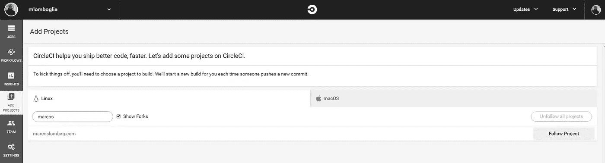

点击*添加项目*，然后*跟随项目。*

保持操作系统为 Linux，选择 *Ruby* 作为语言，点击*开始构建*。这将开始构建过程，但它将失败，因为我们还没有包括我们的 AWS 变量。

登录 AWS 控制台，进入 *IAM* (身份和访问管理)。AWS 身份和访问管理(IAM)使您能够安全地管理对 AWS 服务和资源的访问。

使用 IAM，您可以创建和管理 AWS 用户和组，并使用权限来允许和拒绝他们对 AWS 资源的访问。

让我们创建一个新用户，使用严格的策略将内容上传到 S3 并清空 CloudFront 缓存。

选择*添加用户*并授予其编程访问权限。

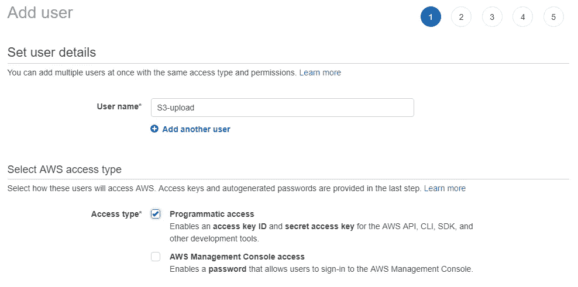

点击*下一步*，然后选择*直接附加已有策略*，选择 *CloudFrontFullAccess* 选项。

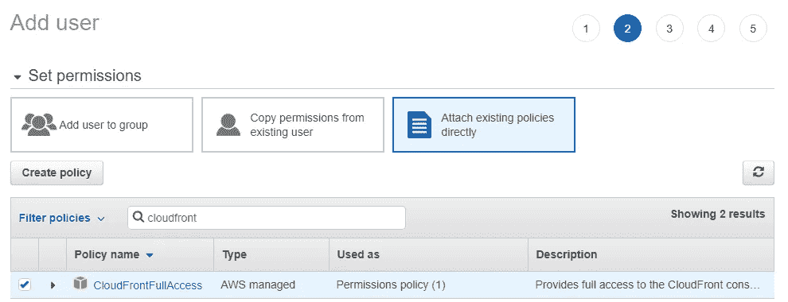

点击*下一步*，插入您想要的任何标签，然后再次点击*下一步*。查看您的项目并点击*创建用户。*

**现在非常重要:**下载您的 CSV 凭证(您的访问密钥 ID 和秘密访问密钥)或将其记在某个安全的地方。

现在，选择您的用户并点击*添加内嵌策略*。选择 *JSON 选项卡*，并将以下内容复制到您的策略中。用上面创建的存储桶替换存储桶的名称。

这将允许该用户仅向策略中列出的特定存储桶添加对象。为策略提供一个名称，并点击*创建策略。*

恭喜你！您已经创建了您的 IAM 用户。

现在，让我们回到 CircleCI 并添加 AWS 键。登录 CircleCI 仪表盘，点击*工作流程*，然后齿轮高亮显示如下:

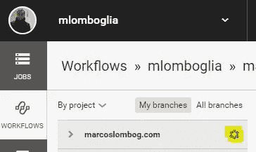

选择*环境变量*选项并添加两个变量:

*   `AWS_ACCESS_KEY_ID`，以及
*   `AWS_SECRET_ACCESS_KEY`用来自用户凭证的值。

现在，我们将在网站中提交一些更改，这将自动触发 CircleCI 构建并将其部署到 AWS 中。使用以下命令对代码进行任何更改并提交:

```
$ git add .
$ git commit -m "description"
$ git push
```

您可能需要在此阶段输入您的密码。

重新登录 CircleCI，点击*工作流*，您应该会看到您的任务正在运行:

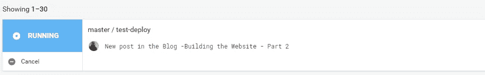

单击任务，它将扩展到您的工作流项目:

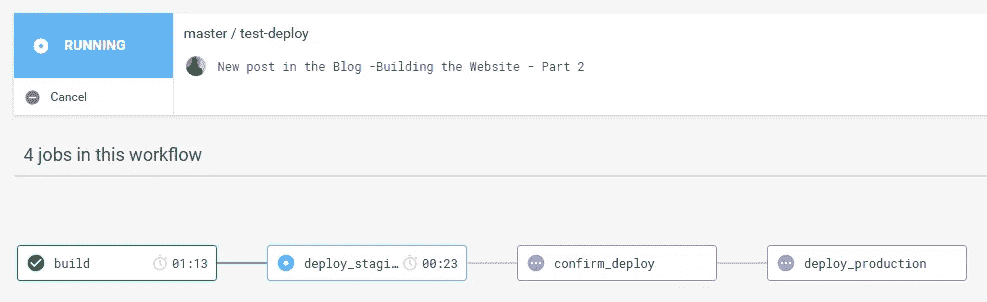

点击工作，它会详细说明步骤。工作流将在 *confirm_deploy 停止。*

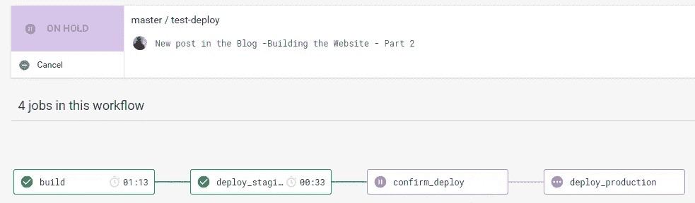

现在，转到您的 CloudFront staging URL，您将看到您部署的网站。如果一切正常，点击*确认 _ 部署*批准部署。

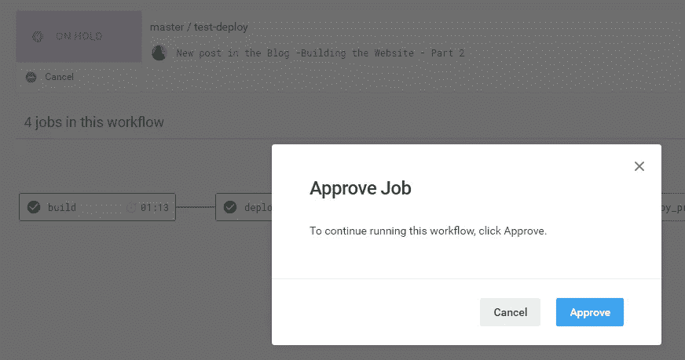

这将继续该过程，并将其部署到生产环境中。

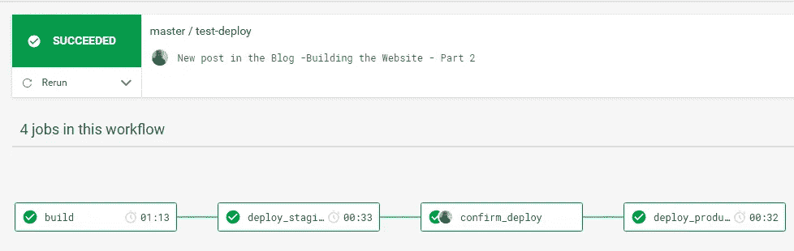

现在可以重复这个过程，每次提交都会触发构建并部署到登台环境。