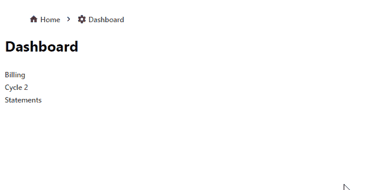
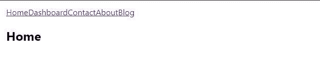
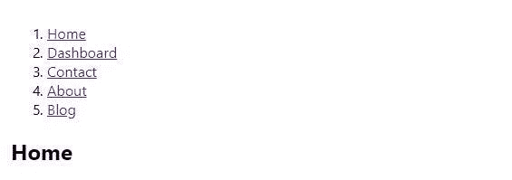
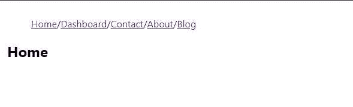
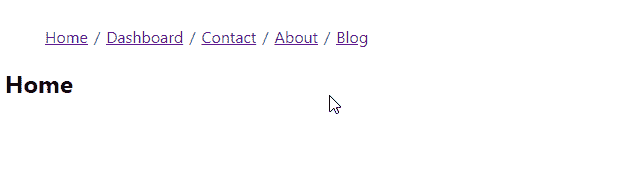

# 在 React 中构建一个令人惊叹的 Breadcrumb 组件

> 原文：<https://betterprogramming.pub/build-a-stunning-breadcrumb-component-in-react-with-plain-css-414c68db293>

## 现在是让 React 做大事的时候了


你有没有在个人设备上浏览过一个网站，发现自己不知道自己在网站的哪个位置？别担心，你不是一个人。

你认为还有多少用户有过类似的经历？

这是开发人员现在在他们的 web 应用程序中改善用户体验时考虑的一个常见场景。

现在，如果你像我一样，你会发现*面包屑*在谈到界面时是一个非常尴尬的术语。如果你是第一次尝试，让我来帮你理清*面包屑*的概念。

Dictionary.com 给了我们两个[定义](https://www.dictionary.com/browse/breadcrumb):

1.  干的或软的面包屑。
2.  *网站或基于网络的应用程序的当前页面上的一系列文本链接，通常位于顶部，显示页面在内容层次结构或浏览历史中的位置，并提供方便的导航工具。*

我们是在谈论用美味的膳食纤维来源来保持健康，以帮助我们作为 web 开发人员长期保持高效吗？没有。你可能已经猜到了，我们正在讨论第二个定义。

像 Craigslist 这样的网站在他们的应用程序中使用面包屑组件来描述用户的位置，并且以一些令人惊讶的方式改善了他们的用户体验。

您可能已经开发了一个如下所示的导航栏:


这并没有错，但是如果你想知道你还可以在这个非常尴尬的空白空间放置什么，面包屑组件实际上可以很好地完成这项工作！

在本教程结束时，您应该能够学习如何创建一个面包屑组件，如下所示:



或者这个:


甚至是这个:


值得一提的是，您将创建一个 breadcrumb *组件*，它将允许您在将 *breadcrumb* 插入到接口中的组件时附加一个*逻辑* *实现。然而，*实现面包屑*的逻辑* *稍微复杂一点。如果你想看如何实现这个逻辑的源代码，你可以在这里查看例子。*

现在，让我们开始吧！

在本教程中，我们将使用 create-react-app 快速生成一个 react 项目。

(如果你想从 github 获得一份库的副本，点击[这里](https://github.com/jsmanifest/breadcrumb))。

继续使用下面的命令创建一个项目。对于本教程，我将我们的项目称为 *breadcrumb* 。

```
npx create-react-app breadcrumb
```

完成后，进入目录:

```
cd breadcrumb
```

在主条目`src/index.js`中，我们将对其进行一点清理，这样我们可以只关注组件:

> *src/index.js*

现在创建`src/App.js`:

> *src/App.js*

```
import React from 'react'const App = () => <div />export default App
```

我们将使用`App.js`来呈现面包屑组件。我们还将使用它来定义一些示例路线，以便稍后可以看到实际操作中的面包屑。

我们将创建一个`src/pages`目录，并通过为每个路径创建文件来添加示例路径:

接下来，我们将它们导入到我们的`App.js`组件中，并在一个*路由器*中呈现它们，这样我们的 breadcrumb 组件就可以对它们进行操作。您可以使用任何路由库，但是对于本教程，我将使用 [@reach/router](https://reach.tech/router) :

> *src/App.js*

下面是我的开始 *css 样式*:

> *src/styles.css*

接下来，我们将创建 *Breadcrumb* 组件，这样我们就可以呈现每个路径路径中的 Breadcrumb 项目:

> *src/Breadcrumb.js*

现在您可以从`App.js`导入它，并在它的 render 方法中渲染它。

我还将一些路由定义为一个数组，这样我就可以在 breadcrumb 组件中呈现它们。(注意:在实际场景中，您将提供子路由，这些子路由会随着浏览器位置在层次结构中的下移而呈现——但是我们在这里仅使用顶级路由来展示 breadcrumb 界面的实际实现)

> *src/App.js*

您现在应该会看到类似这样的内容:



开始像面包屑了！在目前的状态下，它在 90 年代可能已经足够了——但是我们必须不断想办法改进它。

我们可以从在每个面包屑项目周围提供一个*包装器*开始。此外，当我们将这些项目呈现为一个列表时，我们可以将元素转换为一个*有序列表，*这样我们会更正式一些:

> *src/Breadcrumb.js*

而对于`BreadcrumbItem` 组件，我们可以在顶部这样定义:

```
const BreadcrumbItem = ({ children, ...props }) => (
  <li className='breadcrumb-item' {...props}>
    {children}
  </li>
)
```

这是它现在的样子:



因为我们将一个*有序列表*和一个*列表项目*元素列表应用到了我们的 breadcrumb 组件，我们必须改变项目所面对的*方向*。我们还需要删除数字字符。

我们可以用*普通 css* 来完成这个任务:

> *src/styles.css*

```
ol {
  list-style: none;
  display: flex;
  align-items: center;
}
```


在 breadcrumb 组件中，您可能已经注意到了一件奇怪的事情，那就是这一行:

```
let children = React.Children.toArray(props.children)
```

这是有充分理由的。当我们将项目呈现为 breadcrumb 组件的直接子组件时，我们是这样做的:

React 将直接在其下渲染的每个组件视为一个*数组，*，只要有多个组件。

当我们使用各种方法(例如 *slice* )操作这个组件“数组”时，react 每次都需要一个*键*传递给它们。当我们使用*反应时。Children.toArray* 为了包装我们的孩子，react [自动将所有的关键需求](https://reactjs.org/docs/react-api.html#reactchildren)分配和处理给原始的孩子，以供后续使用。*完美*！我们不必将不必要的丑陋代码应用到我们的组件代码中。谢谢你的反应！

面包屑通常使用一个*分隔符*来分隔它们的每一项，这样它们更容易使用和阅读。当你使用一个分隔符(最常见的是像*/*这样的斜线)时，用户将能够分辨出哪些部分是相互分离的。有时候——在某些屏幕上——你会发现你的单词出乎意料地彼此靠得太近，所以这有助于解决这些可见性问题。

接下来我们将继续添加一个*。将*减少到子项，以便我们可以应用逻辑将这些分隔符放置到位:

> *src/Breadcrumb.js*



(注意:我们实现了一个条件检查，这样我们就不会不必要地在面包屑的末尾添加一个斜杠)

从截图中我们可以清楚地看到，我们分离了每个面包屑项目。然而，回到我之前的评论，一些用户不能清楚地看到单词，因为单词在一些屏幕上变得非常近，现在分隔符又出现了同样的问题。

因此，我们将为分隔符应用一个包装器，并将一个 *className* prop 附加到 *li* 元素上，这样我们就可以稍微控制一下间距:

> *src/Breadcrumb.js*

```
const BreadcrumbSeparator = ({ children, ...props }) => (
  <li className='breadcrumb-separator' {...props}>
    {children}
  </li>
)
```

> *src/styles.css*

```
.breadcrumb-separator {
  color: #333;
  margin: auto 6px;
  user-select: none;
}
```

现在，我们只需要用新的包装组件包装我们的分离器:


完美！

然而，有时候作为一名开发人员，我们可能想要切换使用哪种分隔符——比如一个*箭头*。我们可以通过允许调用者传入一个自定义分隔符作为属性来进行自定义:

> *src/Breadcrumb.js*

> *src/App.js*


> *src/App.js*



面包屑变得太长会发生什么？

在大规模应用程序中最常见的是，可能有大量的路由会使面包屑的长度超过它应有的长度。

如果我们想解决这个问题，一个已知的解决方案是使用*折叠器*。

我们将创建一个 collapser 组件。

首先创建`src/BreadcrumbCollapser.js`。这将用于从界面中*折叠*项，以便 breadcrumb 组件可以隐藏它的一些项:

> *src/bread crumb collapser . js*

> *src/styles.css*

当我们引入任何形式的“崩溃器”时，我们需要它知道*何时*或*何时不*崩溃。赋予用户控制该行为的能力是增强折叠器用户体验的一个好方法。

我将创建一个名为`useBreadcrumb.js`的自定义钩子，并设置一个名为*扩展*的*状态*。接口将需要这个信息，所以它是从自定义钩子返回的:

> *src/useBreadcrumb.js*

在一个单独的文件中创建一个定制的 react 钩子可能有些多余，但是我喜欢它给我的开发流程带来的额外的组织习惯！这完全是可选的，你可以直接在 *breadcrumb 组件*中设置状态。

接下来，我从`Breadcrumb.js`文件中导入了定制钩子和 breadcrumb collapser:

> *src/Breadcrumb.js*

```
import React from 'react'
import useBreadcrumb from './useBreadcrumb'
import BreadcrumbCollapser from './BreadcrumbCollapser'
```

使用自定义挂钩:

```
const Breadcrumb = ({ separator, ...props }) => {
  let children = React.Children.toArray(props.children) const { expanded, open } = useBreadcrumb()
```

提供一个自定义属性可能会有所帮助，调用者可以传入该属性来控制折叠或显示的项目数量，因此我们允许调用者传入一个自定义的*折叠*属性，我们可以用它来应用到 breadcrumb collapser:

这将确保呼叫者有能力控制*要看什么，如果需要的话，对其进行裁剪，使其与他们的 UI 更加兼容。*

最后，将折叠器应用于渲染子对象:

以下是我们迄今为止的完整面包屑实现:

> *src/Breadcrumb.js*


这些链接需要一点点的定制，因为它们是非常基本和古老的。让我们改变这一点:

```
a {
  text-decoration: none;
  font-weight: 400;
  color: #424548;
}a:hover {
  color: #1da2b3;
}
```


如果你是一个功能型的人，而我们的组件对你来说不是很有吸引力，那么把它重构得更有吸引力一点是很好的:

> *src/Breadcrumb.js*


这里要记住的是，如果我们*没有*使用`React.Children.toArray`来包装我们的孩子，我们将会在控制台中得到键错误，用于呈现孩子列表，而没有提供一个键给他们。

想知道如何在两者之间渲染图标？有多种方法可以实现这一点，但其中一种方法可能是这样的:

> *src/App.js*


最后，我前面提到过，在现实世界场景中，我们会在 breadcrumb 组件中呈现子路由——通过层次结构。在本教程中，我们使用了顶级路由，这并不理想，但我想展示接口是如何实现的。使用本教程中的策略可以实现更真实的界面:


漂亮！

# 结论

本教程到此结束！如果你一直在看我以前的帖子，你可能已经意识到我在结论中没有说太多——因为一切都已经在上面说过了！

下次再见，期待更多高质量的帖子！