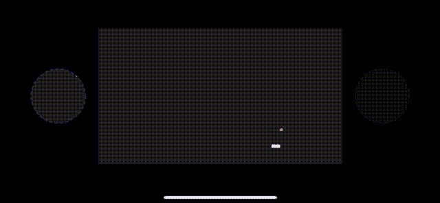

# 使用声明性域范例在 Swift 中构建一个贪吃蛇游戏

> 原文：<https://betterprogramming.pub/build-a-swift-snake-game-using-declarative-domain-paradigm-7eb34a139017>

## 永恒而有趣


[JESHOOTS.COM](https://unsplash.com/@jeshoots?utm_source=medium&utm_medium=referral)在 [Unsplash](https://unsplash.com?utm_source=medium&utm_medium=referral) 上拍照

在本文中，我想向您展示如何在 Swift 中实现贪吃蛇游戏，并且——您可能以前从未听说过——向您介绍我将使用的声明域(DD)范式。

目标是在追求最高质量的同时快速有效地制作游戏。



贪吃蛇游戏

为此，DD 的设计目标是允许创建尽可能简单的代码。

现在，我应该提到，我在这里使用的“简单”一词是“复杂”一词的反义词。

如果你看着这段代码并认为“这不简单”，你实际上的意思很简单。简单或复杂是对一个结构的绝对描述，而简单和困难是从每个人的独特视角来看的相对经验，因为它是经验、知识和好奇心的函数。为了进一步澄清简单和容易之间的区别，我强烈推荐 Rich Hickey 的“简单变得容易”，这是每个开发人员的必看之作。

# 声明性领域范例的工具集

我们经常使用术语范式，但对它的实际含义没有任何共同的理解。对于本文来说，范式是一组关于如何构建软件的想法，这些想法通过约束强加给编码人员。以下是一些例子:

*   理解代码应该是结构良好的导致了 goto 语句的消亡和结构化编程的引入
*   函数式编程通过使用不可变的全局状态来修正可变的全局状态
*   面向对象编程通过隐藏可变状态解决了同样的问题

声明性域范例使用以下约束:

*   声明性编码代替命令性编码:告诉编译器*需要做什么*，而不是*如何做*
*   完全不可变的模型和状态；可变性只用于局部函数范围或系统的边缘
*   因为类是可变的复杂类型(任意数量的方法；没有执行路径的概念——导致对[无数模式](/object-oriented-programming-the-trillion-dollar-disaster-92a4b666c7c7)的需求；继承摧毁黑拳，…)，它们不会用在架构的中心。
*   基于类型的特定领域语言用于连接模块和组件，并对行为进行编码。

如我所说，类不属于我们架构的中心；相反，我将使用一种称为部分应用的技术，其中一个函数被执行并返回另一个函数或一组函数。那些可以被存储并在任何时候被调用。内部函数可以访问外部函数体——它们从外部函数体使用的任何东西都将被保留，因为函数是闭包。下面是一些让我们开始的代码:

上面的代码显示了一个加法器函数，其中`value`是状态。执行完`createAdder()`后，只能通过调用返回的`add()`函数来访问和更改。

上面的`createStack()`从返回的元组中返回一个通过调用`push`和`pop`使用的堆栈——如果你面前没有`Stack`的声明，你无法将它与一个类实例区分开来。

我将部分应用的函数用作模块——模块是一种数据结构，通过它提供代码执行路径——具有一个输入和输出。

当然，我想保持函数参数列表简单，但定义不同的消息；因此，我将使用 DSL 对行为进行类型编码。让我们来看看:

这里，`Change`是 DSL。它允许对`.move(.forward)`、`.move(.left)`、`.move(.right)`等动作进行编码，并通过`.grow`告诉蛇增加一段长度。

使用以下代码修改(重新创建)Snake:

```
let snake = snake.alter(.move(.right)) //andlet snake = snake.alter(.grow)
```

不可变的 Snake 数据结构

在从`alter()`调用的`move()`中，我们将简单地切换`Move ⨯ Facing`的所有可能组合，并创建一个反映变化的蛇的新版本。

这就是完整的`Snake`数据类型实现:一个`head`，一个`tail`，一个方向 it`facing`，以及改变它的方法，返回它自身的新版本。为了对行为进行编码，使用了枚举。

由于这些是可嵌套的，并且可以在 Swift 中注释模型，这就是我创建 DSL 所需要的全部。这个蓝图适用于任何不可变的模型类型。

现在我需要一个模块来实现这个游戏，通过用户输入来移动这条蛇。代码如下:

游戏宣言

`Game`被声明为一个函数元组:

*   返回游戏中的蛇
*   `size()`返回纸板尺寸
*   游戏还在进行吗？
*   `target()`是要采集的坐标
*   `command()`接受移动或重置命令
*   `register()`实现一个简单的观察者模式，用于连接用户界面

它是通过以下方式实现的:

游戏实现

当被调用时，它将执行`run()`，一个本地定义的子函数，它将调用子函数`setTargetEventCallback`、`executeTargetEvent()`、`executeStepEvent()`。

这样会设置两个`Ticks`，它们会在特定的时间触发:`stepTick`会触发蛇移动一步，而`targetTick`用来放置新的目标。你注意到他们递归地调用自己。如果`state`或`snake`被更新，所有观察者都会得到通知。

`Tick`是一个使用`Timer`触发事件的类。它使用类似的 DSL 进行配置，就像我们在`Snake`中看到的那样，但是这次它不是不可变的，状态是可变的。

由于`Tick`是一个位于系统边缘的依赖项，这很好，尽管它也可以实现为部分应用的元组，如前所述，并且可能是不可变的，但我想展示这个实现，因为这允许您与现有代码和依赖项进行交互。

`executeStepEvent()`通过设置新计算的触发间隔和设置回调来配置`stepTick`对象。

当这个回调在状态正在进行时被执行时，它将递归地调用`executeStepEvent()`。如果状态为`.ended`，`stepTick`失效。

# 最后缺失的部分:UI

对于这个项目，我使用 swift ui——但是代码是真正解耦的(更好:耦合最小)；它可以连接到 UIKit 或任何其他 UI 系统。

注意`SnakeBoard`没有使用二维网格来表示棋盘，只是迭代蛇的身体和目标来绘制到上下文中。这意味着，对于不同的电路板尺寸，运行时间和内存使用都不会受到显著影响。简单的代码仍然是聪明的。

如果按下按钮，要么触发运动，要么重置

```
callback: game.state() == .ongoing
 ? { game.command(.move(.left)) }
 : { game.command(.reset) }
```

UI 只能通过向`game`发送命令来改变行为。它被通知查看一个将自己注册为观察者的`ViewState`对象，如下所示:

# 结论

只有两个想法——DSL 和部分应用程序——我能够在很短的时间内以一种几乎没有错误的风格创建一个游戏。这里有一个总结:

*   设计上不可改变的事情不可能被意外改变——崩溃的幅度是不可能存在的。
*   使用 DSL 允许非常可读的代码。枚举本身是静态和无状态的——这是另一个很难想象错误的领域。
*   代码易于测试，测试尽可能简单，[检查测试库](https://gitlab.com/vikingosegundo/declarative-snake/-/blob/main/SnakeTests/SnakeTests.swift)。注意，我使用了 [Quick](https://github.com/Quick/Quick) 和 [Nimble](https://github.com/Quick/Nimble) 进行测试，尽管简单的 XCTests 也会非常简单。
*   UI 尽可能地去耦合:只有一个函数是公开的，UI 可以用它来改变系统。没有任何其他方法，这也意味着在 UI 中执行的调用必须与在单元测试中执行的调用相同。

特别是最后一点很重要，我们知道很长一段时间(大约 60 年)，任何架构都必须将 UI 作为客户端或依赖来处理。然而，在许多代码库中，这并没有被真正考虑进去。

上述项目的完整源代码可在[这里](https://gitlab.com/vikingosegundo/declarative-snake/)获得。

感谢阅读。如果您喜欢您所阅读的内容，并希望更好地构建您的应用程序以用于生产，您可能需要查看以下故事:

[](https://decodemeester.medium.com/fully-declarative-swift-for-real-world-projects-9b6ee9403f4c) [## 用于真实项目的完全声明式 Swift

decodemeester.medium.com](https://decodemeester.medium.com/fully-declarative-swift-for-real-world-projects-9b6ee9403f4c)