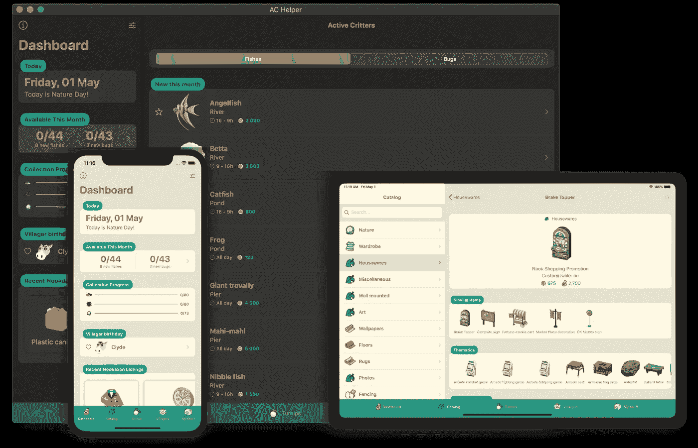
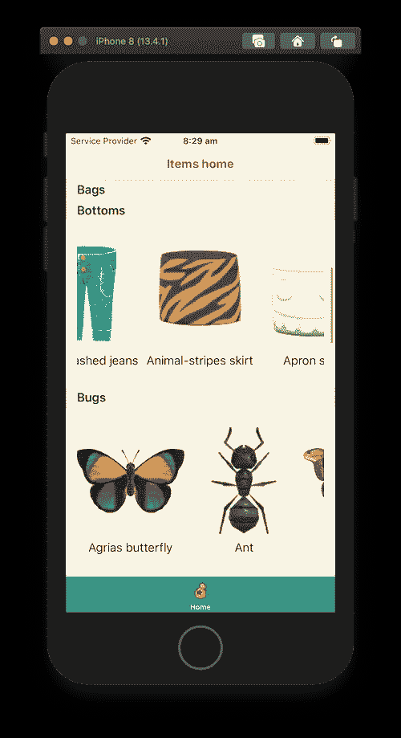
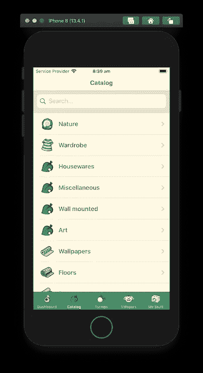
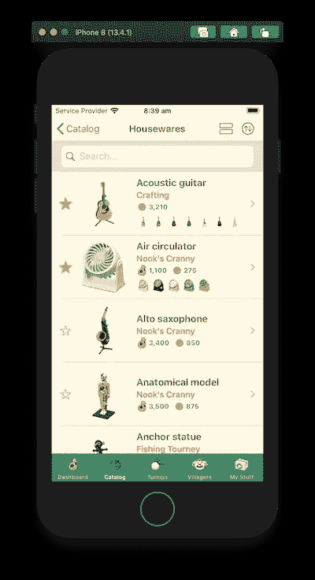

# 构建 SwiftUI 动物穿越应用程序(第 1 部分)

> 原文：<https://betterprogramming.pub/build-a-swiftui-animal-crossing-application-part-1-aaf3528c1df>

## 组合、服务、模型和环境对象

作者照片。

在这个新的系列文章中，我将指导你完成我最新的[开源项目](https://github.com/Dimillian/ACHNBrowserUI)。

这又是一个完全开源、完全 SwiftUI 的应用程序。

而这一次，它甚至可以在 App Store 上使用！这证明了我的观点，即您可以在生产中使用 SwiftUI 代码。

 [## 交流助手

### AC Helper 是《动物穿越:新视野》的配套 app。你将获得所有你需要的信息来捕捉…

apps.apple.com](https://apps.apple.com/us/app/ac-helper/id1508764244?ls=1) 

但与 MovieSwiftUI 不同的是，它没有使用 Redux 架构，而是使用了我过去已经介绍过的 SwiftUI 内置数据流的核心。如果你需要介绍或复习，你应该阅读[这篇文章](https://medium.com/better-programming/understanding-swiftui-data-flow-79429a49ae35)。

我使用了视图、视图模型和一些环境对象的组合。通过阅读这一系列文章，您将能够完全掌握一个非常简单而有效的 SwiftUI 应用程序架构。

让我们从服务和模型层开始，因为为了让应用程序有趣，我们首先需要收集、计算和获取一些数据，放入我们的数据源。我们将使用 Combine，这是苹果公司的一个新的(WWDC 19)框架，它允许用户以一种反应的方式漂亮地处理数据。

 [## 结合

### Combine 框架提供了一个声明性的 Swift API，用于随时处理值。这些值可以代表许多…

developer.apple.com](https://developer.apple.com/documentation/combine) 

对于不熟悉*动物穿越*的人来说，这个游戏就是每天玩一点。游戏使用实时时钟来进行。它是关于收集物品，家具来装饰你的房子和岛屿，还捕捉小动物，鱼，昆虫和化石。那取决于一天中的时间和日期。

这就是说*动物穿越*是制作应用程序的完美游戏，因为它以信息、图像等形式拥有大量数据(超过 5000 个项目可供分类、显示和玩)。这是一个很好的候选，可以用来制作一个漂亮有趣的应用程序，而不仅仅是一个美化了的 REST 客户端。

# 结合部分

所以先从数据说起。社区做了令人难以置信的工作，直到今天，它仍然在转储、组织和编辑主电子表格。这是一个不可思议的工作，包含了游戏的所有数据。电子表格对于应用程序来说并不方便，所以 Nook Plaza 的所有者做了一个很棒的管道来将电子表格转换成一个非常简单的 JSON API。

然后我转储了这个 API，并将 [JSON 直接放在 Xcode](https://github.com/Dimillian/ACHNBrowserUI/tree/master/ACHNBrowserUI/Resources/json) 项目中。它将允许我们使用 Swift 的[可编码](https://developer.apple.com/documentation/swift/codable)协议直接将 JSON 实例化为本地 Swift 对象。

因此，让我们首先创建读取 JSON 并将其解码为对象的服务:

该函数返回一个发布者，您可以订阅该发布者以获得解码结果。对象的最终类型由该函数的用户来推断。在 JSON 中处理您需要的任何类型都是通用的。我们只需要知道泛型类型符合`Codable`。我们甚至可以指定 Decodable，因为我们不需要把它编码回来(目前)。

如果我们阅读联合收割机链，它看起来像这样:

1.  首先，我们尝试从包资源中获取 JSON URL。
2.  然后我们试着把它读入`Data`。
3.  然后我们使用我们的静态`JSONDecoder`将对象解码成类型。
4.  如果我们在上面的代码中得到任何错误，我们会将错误发布到一个已知的`APIError`类型中，并附上消息。
5.  最后，我们希望一旦订户开始工作，所有这些都在特定的后台队列中发生。

我认为这看起来比没有联合收割机时要干净得多。即使在这种情况下使用 Combine 并不完全合理，但这与其说是充分发挥它的潜力，不如说是一次熟悉它的练习。

现在让我们来看一下消费者类别，将使用该服务的前端，以及我们将如何使用它。我们仍将使用 Combine，这将是我们的第一个`EnvironmentObject`——它存储那些 JSON 文件中的所有项目(所有解码的对象):

数据被分成不同的类别，所以我们将在一个枚举中引用它。在应用程序中，这个枚举有很多功能(例如，为用户界面返回正确的标签和图标)。

这里也是我们的`Codable`对象的摘录，它代表了存储在我们的 JSON 文件中的内容:

最后是`Items`类:

这是我们的`Items`类，它将按类别存储所有项目。这是一个拥有一处`Published`房产的`ObservableObject`。SwiftUI 视图将能够订阅该对象，并在更新时重新加载其主体。

在这个类中，我们消费我们的 API 服务，并为每个类别调用`fetch`函数。我们现在不想处理这个错误，所以我们用一个空的`ItemResponse`来替换它。然后我们只提取结果(Item 对象的数组)。我们指定希望接收主队列中的最终数据。这很重要，因为我们将更新我们发布的属性，因此很可能会更新 UI。你不能在后台线程上这样做。记住，我们指定我们的服务应该在后台队列中完成所有的工作。

最后，我们使用`sink`，它允许我们在订阅者收到最终转换后的值时获得一个闭包。然后，我们将解码后的项目列表存储到相应的类别中。

# SwiftUI 部分

现在我们已经准备好在应用程序中使用我们的项目，让我们使它们对 UI 可用。因为我们将在各种视图中重用这些项目，因为我们希望它们在任何地方都可用。所以我们将使用`[EnvironmentObject](https://developer.apple.com/documentation/swiftui/environmentobject)`，一个 SwiftUI 属性包装器，它允许我们从环境中恢复一个对象。

为了将我们的项目添加到应用程序环境中，我们需要将它附加到视图层次结构的根视图中。最好的地方是在`SceneDelegate`:

在第 7 行，当我们创建我们的`TabbarView`时，我们向环境中添加了一个`Items`的实例。只要我们的应用程序进程还活着，这个实例就会一直存在。然后我们使用`TabbarView`作为应用程序的根视图(第 11 行)。

现在让我们构建一个这些物品类别的列表和一个来自这个`EnvironmentObject`的物品列表。

让我们先来看看我们的根视图，`TabbarView`:

为你的`Tab`建立一个枚举是一个很好的实践。由于 SwiftUI 中的`TabView`需要一个绑定，您将需要一个`@State`属性包装器来存储您当前选择的选项卡。它会随着你触摸 Tabbar 的标签而改变。这是一条双行道，所以以后您可能会想要一种 UIState，将选中的选项卡作为一个`@Published`属性，然后将它存储在一个`EnvironmentObject`中。它允许你在应用程序的任何地方以编程的方式交换标签。

这是我在整个项目中实际做的，但是我想在本文中简化它。

最后，我们的`TabedView`现在只有一个标签。这是`HomeView`:

正如我们之前看到的，我们使用`@EnvironmentObject`属性包装器读取我们的 Items 环境对象。

然后我在视图(categories)上做了一个方便的动态属性，它返回一个 tuple ( `(Category, Items)`)。这和 SwiftUI 的`ForEach`一起使用会容易很多。

如果你看一下我们的`HomeView`的主体，我们有一个`List`，对于每个类别，我们将创建一个包含十个项目的滚动`HStack`部分。

瞧！

这并不漂亮，但我们有一个 SwiftUI 应用程序的原型。而且功能齐全。它使用各种 SwiftUI 数据流属性包装器来读取和发布实时后端数据到您的应用程序中。

下面是应用程序对类别和项目的外观:

当然，在这篇文章中，我把它简化了很多。如果我想向您展示完整的应用程序，那么要嵌入的代码太多了。但是您可以在这里查看完整的存储库并自己构建它:

 [## 迪米利安/阿欣布罗斯鲁伊

### 这是一个完全在 SwiftUI 中的全功能动物穿越助手应用程序。仪表板跟踪你的鱼，虫子…

github.com](https://github.com/Dimillian/ACHNBrowserUI) 

我还想谈一件事:视图模型。视图模型是基本 SwiftUI 应用程序的重要组成部分。它是后端服务、原始模型和视图之间的一层。它允许你把所有不应该在你的视图中的业务逻辑放进去，只暴露你的视图所需要的。您不希望在 SwiftUI 视图的主体中直接包含繁重的计算或类似的内容。

这里是对`ItemsViewModel`的一个观察，它是处理一个项目列表的视图模型(正如你在上面的截图中看到的):

正如屏幕有各种功能一样，这种视图模型也有。它将包含一个条目列表，还包含我们直接绑定在作为搜索栏的`TextField`中的搜索文本(搜索的条目等)。).

下面是我们在当前流程中的使用方法:

类别列表将打开一个`ItemsListView`，其中的`ItemsViewModel`作用于所选的类别。现在你知道了！

这稍微复杂一点，但是它可以让您了解在实际应用程序中可以做什么的要点。

让我知道你对新系列的第一篇文章的看法。我尽量保持简单，嵌入所有的代码，这样你就可以自己做一些工作，而不用过多地查看存储库。对于本系列的其余部分，您想要更深入的内容还是更多的代码来让它自己工作？

如果你想有所贡献，我们非常欢迎。我们已经有一些贡献者，如果你想尝试 SwiftUI，这真的是一个很棒的项目。所以克隆它，打开你的第一个 PR。我们不会咬人的！

# 结论

感谢您阅读本文！

我希望您喜欢这第一部分，我们将在第二部分再见，在第二部分我们将更深入地研究视图模型和视图。我们将尝试构建更复杂的视图、一些动画，并探索内部状态管理。

 [## 构建 SwiftUI 动物穿越应用程序(第 2 部分)

### 对视图和视图模型的深入研究

medium.com](https://medium.com/better-programming/build-a-swiftui-animal-crossing-application-part-2-82b4ac6695e6)