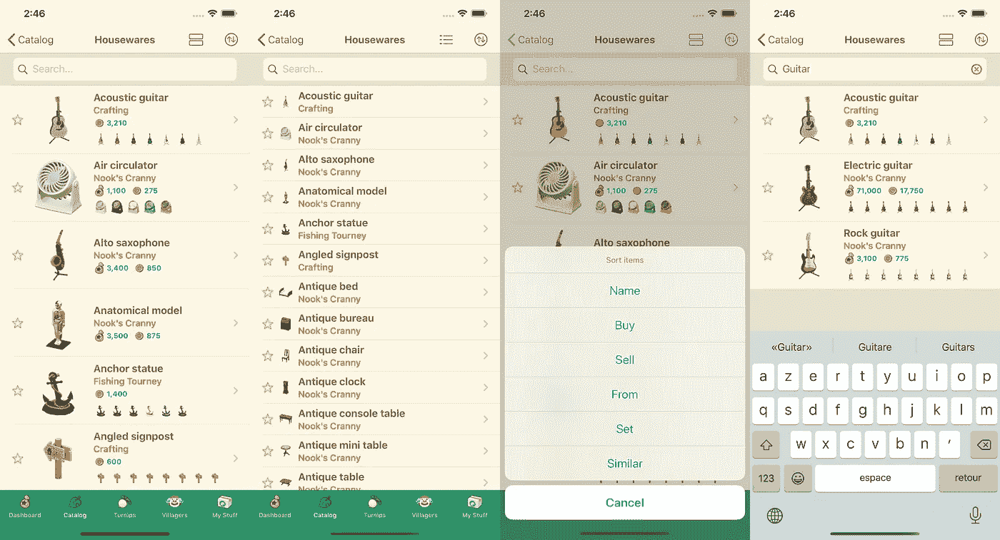
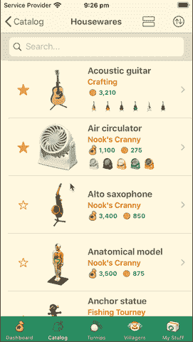
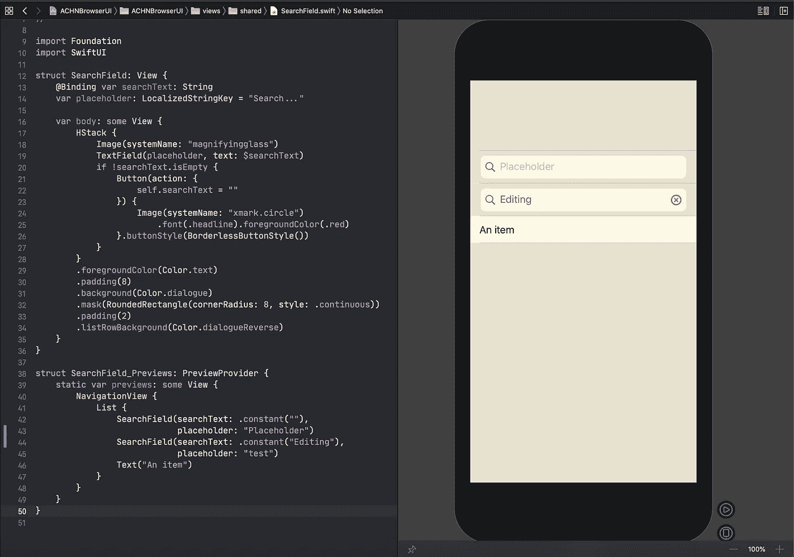
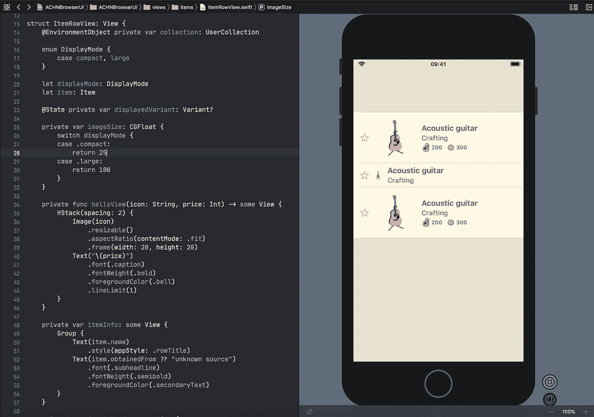
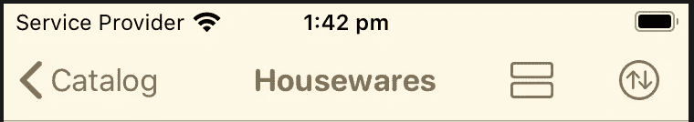

# 构建 SwiftUI 动物穿越应用程序(第 2 部分)

> 原文：<https://betterprogramming.pub/build-a-swiftui-animal-crossing-application-part-2-82b4ac6695e6>

## 对视图和视图模型的深入研究



作者照片。

本系列文章的第一部分向您介绍了应用程序的本质及其架构的核心。

在这一章中，我们将深入了解组成应用程序的各种视图，以及它们如何与我们的数据源和视图模型一起工作。

# 案例研究

让我们来看看`ItemsListView`和`ItemsViewModel`。这里有一个简短的视频，让你看看这个屏幕的所有功能:



项目列表视图

我们需要考虑屏幕的几个特性:

*   它显示特定项目类别中的项目列表。
*   它提供了两种显示模式:紧凑行和大行。
*   我们可以根据物品的不同属性对它们进行分类。
*   我们可以从该列表中搜索项目。

# ItemsViewModel

列出所有这些之后，我们现在可以开始制作我们的`ItemsViewModel`,目标是从我们的后端/数据源准备和获取我们需要的所有数据(在这种情况下，从特定类别中获取项目),然后计算这些数据，使它们准备好被我们的视图显示。

让我们从视图模型开始。因为我们知道 SwiftUI 视图将使用它，所以我们将其设为`ObservableObject`。这意味着我们现在可以将属性包装在一个`[Published](https://developer.apple.com/documentation/combine/published)`属性包装器中。SwiftUI 视图将能够订阅这些属性，并在它们发生变化时更新相关视图。

正如我们在特性列表中看到的，视图模型需要为我们提供一个列表`Items`、一个列表`sortedItems`和一个列表`searchedItems`。它还需要保存我们将绑定到用于搜索界面的 TextField 的`searchText`。

`itemCancellable`和`searchCancellable`来自联合收割机的`Cancellable`。我们将使用它们来保存我们的`Subscriber`,我们将从后端获取数据。

现在让我们看看在我们的`ItemsViewModel`的初始化器中发生了什么:

在初始化器中，我们将把两个`subscribers`都连接到它们的`publisher`。

对于`searchCancellable`，我们想认购我们的`searchText` `String`房产。为什么？因为它允许我们在`TextField`中接收用户输入的新值。让我们看看联合收割机流程:

1.  我们想先`debounce`一下。这意味着我们希望等待发布者暂停事件的交付。我们希望只在用户停止输入 300 毫秒后接收事件。
2.  然后我们删除重复的。如果我们多次收到相同的文本，我们不希望在数据源中触发对相同值的搜索。
3.  如果文本为空，我们也不想触发任何搜索。
4.  最后，我们使用`map`执行非常简单的搜索功能。我们的函数将接受文本输入并过滤我们的项目，只返回一个具有匹配名称的项目:

```
private func items(with string: String) -> [Item] {
     items.filter {
        $0.name.lowercased().contains(string.lowercased())
     }
}
```

5.我们使用`sink`(我们也可以使用`assign`)将收到的最终值赋给我们的`ItemsViewModel` `searchItems` published 属性。

6.UI 中使用视图模型中的`searchItems`的部分将得到更新。

我们的第二个`Cancellable`，实际获取所有项目的那个，要简单得多。我们有一个名为 Items 的共享对象，它有一个 published `categories`属性，如下所示:

```
public class Items: ObservableObject {
      public static let shared = Items()
      @Published public var categories: [Category: [Item]] = [:]
```

发布的部分很重要，因为它是一个服务/ `observableObject`，我们不知道它何时何地会被更新。因此，我们希望确保收到最新的值。

这就是为什么，在我们的`ItemsViewModel`中，我们订阅了`categories`，并在收到的值发生变化时对其赋值(无论如何，我们都会在第一次订阅时收到它)。

我花时间解释所有的`Combine`流程，因为它最终也会帮助我。这是一种与更标准的编程技能截然不同的心态。一开始我觉得一点也不自然。但是最后，它看起来比链接函数或完成闭包要干净得多。我们可以一次清楚地看到整个订户操作——从初始值到转换，直到赋值。

我们还遗漏了一个部分:排序。大部分都很无聊，我就不花时间在这上面了。但是我把`ItemsViewModel`留在这里作为完整的要点，这样你就可以看到它是如何完成的。这很重要，因为我们将在下一部分的`View`中使用它:

# 项目列表视图

现在我们对视图模型有了相当准确的理解，让我们开始视图:

```
struct ItemsListView: View {
    @ObservedObject var viewModel: ItemsViewModel
    @State private var showSortSheet = false
    @State private var itemRowsDisplayMode: ItemRowView.DisplayMode = .large
```

正如我们在屏幕的案例研究中所提到的，我们需要在视图模型上添加一些东西。`showShortSheet`状态跟踪分拣单。稍后点击排序按钮时，我们会将其设置为`true`。并且`itemRowsDisplayMode`跟踪当前行的显示模式:`Compact`或`Large`。

在顶部，我们还有我们的`ItemsViewModel`。在应用程序的当前流程中，我们有一个类别屏幕，它负责用适当的`ItemsViewModel`创建`ItemsListView`，因为父类将提供类别。

所以你可以想象我们有一个看起来像这样的`CategoryRowView`:

现在回到我们的`ItemsListView`。为了显示适当的项目，我们有一个计算属性:`currentItems`。每当我们的视图模型的发布属性改变时，我们的视图体将被计算并使用适当的项目，因为`currentItems`:

让我们来看看我们的`View`的身体:

这里有一些新的东西。我们使用`List`，因为它是合适的组件，我们在案例研究中看到了这一点。包装在`ScrollView`中的`VStack`不适合使用。因为这是一个很长的条目列表，我们想使用`List`(目前由 UITableView 支持)。它重用它的行，并且只在需要的时候才让它们出队(当它将要显示在屏幕上的时候)。

我知道这听起来对你们几乎所有人来说都是显而易见的，但是由于 SwiftUI 允许完全的自由，提醒一下这一点可能是个好主意。

正如我们看到的，我们需要一个`TextField`来进行搜索。由于我们希望它看起来像一个搜索栏(由于某种原因，SwiftUI 缺少一个到`UISearchBar`的桥梁)，我将它包装在一个名为`SearchField`的视图中。

视图看起来像这样:



借助 SwiftUI 及其预览的强大功能，拥有自包含视图并预览其所有状态变得超级简单。在这种情况下，正如你在上面的截图中看到的，我预览了正常状态和编辑状态。

预览是一个非常强大的工具。我不经常使用它们，但是对于那些独立的视图，比如我们的搜索栏，使用它们是很有意义的。然后，您可以非常快速地在 UI 上迭代各种状态。

回到我们的`ItemsListView`。下一部分是对我们的计算属性`currentItems`使用`ForEach`。正如我之前说过的，只要用户触发了对`currentItems`的更改(因为用户开始搜索或排序项目)，就会触发我们身体的重新加载(因为我们的`ItemsViewModel`已经发布了属性)。因此，我们的列表将始终显示正确和相关的项目。

然后我们显示我们的`ItemRowView`，这个视图将显示列表中的一个条目。



有了预览功能，并且因为我们在案例研究中看到该行应该有一个紧凑模式和一个大模式，所以我们可以同时显示这两种模式。当你在 UI 上工作时非常方便。

对于`[ItemRowView](https://github.com/Dimillian/ACHNBrowserUI/blob/master/ACHNBrowserUI/ACHNBrowserUI/views/items/ItemRowView.swift)`，我就不多赘述了。你可以在我们的 GitHub 上找到代码。仔细看看 enum `DisplayMode`就知道了。`ItemRowView`具有这种类型的属性，因此父视图可以决定其显示模式。

回到`ItemsListView`的身上。您会注意到我们在`NavigationLink`中包装了我们的行。因此，当点击该行时，它将打开带有选定项目的`ItemDetailView`:

```
NavigationLink(destination: ItemDetailView(item: item)) {
    ItemRowView(displayMode: self.itemRowsDisplayMode, item: item)
  }
}
```

如你所见，我们使用`ItemsListView`的当前`displayMode`。

## 但是我们如何改变显示模式呢？

借助`State`属性包装器的强大功能，我们之前已经看到:

```
@State private var itemRowsDisplayMode: ItemRowView.DisplayMode
```

所以现在缺少的部分是触发变化。如果你回头看看我们的`ItemsListView`的身体，你会注意到这样的东西:

```
.navigationBarItems(trailing: HStack(spacing: 16) { 
                                 layoutButton 
                                 sortButton 
                               }
                    )
```

有了列表中的这个修饰符，我们将添加两个我们需要的按钮:改变显示模式和排序按钮到我们当前视图的导航栏中。



让我们看看两个计算视图`layoutButton`和`sortButton`的代码:

每当您觉得您的视图体变得阻塞时，不要犹豫提取视图的一部分作为计算属性或者创建一个新的视图结构。你的身体应该始终保持小巧易读。在 SwiftUI 中制作独立的组件/视图比在 UIKit 中要容易和快速得多。

这两个按钮中的操作非常简单。`sortButton`将切换控制我们排序表的`Bool`，如果你回头看看我们的视图体，我们有这样一行:

```
.actionSheet(isPresented: $showSortSheet, content: { self.sortSheet })
```

因此它将显示由属性`sortSheet`计算的`ActionSheet`，如下所示:

它构造并返回我们的排序`ActionSheet`。每当我们在这个`ActionSheet`中选择一个动作时，它将在我们的`ItemsViewModel`上设置排序，这将在这个视图模型中设置我们的`sortedItems`发布属性，并触发我们的`currentItems`的更新。这就是你的排序逻辑。

而`layoutButton`就简单多了。它只是将当前的`displayMode`更改为另一个。它将触发所有行的更新，并以新的显示模式显示它们。

大概就是这样。以下是整个`ItemsListView`的要点，供参考:

# 结论

感谢阅读！

我希望您喜欢这个系列的第二部分，并欢迎您的所有反馈。我试图解释一切，以便对 iOS 编程和 SwiftUI 的初学者以及想在这里抓住一些花边新闻的老手有所帮助。

第 3 部分应该是关于更复杂的视图布局和动画——一个稍微高级一点的主题。

回头见！