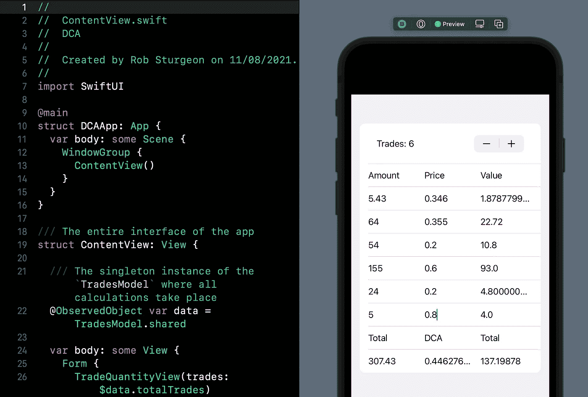

# 构建 SwiftUI 应用程序来跟踪您的加密货币交易

> 原文：<https://betterprogramming.pub/build-a-swiftui-app-for-tracking-your-cryptocurrency-trades-f81e4c83ad38>

## 创建一个 DCA 计算器应用程序来跟踪您的投资组合

图片来自 [Pixabay](https://pixabay.com/?utm_source=link-attribution&utm_medium=referral&utm_campaign=image&utm_content=1015125)

我们将首先创建一个保存单笔交易数据的结构。

一笔交易由一个`amount`、一个`price`和一个`value`组成。所有的交易都存储在`TradesModel`中，这将进行 DCA(美元成本平均)所需的所有计算。

使用了`didSet`属性观察器，以便当用户想要增加显示的交易数量时，给`trades`数组一个新的空交易。

这使数组的大小与我们期望在屏幕上看到的数字保持一致，消除了索引超出范围错误的可能性。

# 构建用户界面

该界面将采用表格的形式，包含三列:金额、价格和价值。这些与交易的属性相对应，每个属性都将使用自定义的`TextField`来设置，这个自定义的`TextField`将被称为`NumberTextField`。

在开始之前，我们需要创建一个简单的标题行，为每一列提供一个标题。如果我们不能清楚地看出哪一个是哪一个，就没有别的办法来区分数量和价格或价值。

您可能会注意到上面的整个 HStack 将`disabled`修改器设置为`true`。这使得每个`TextField`和应用程序中的其他标题具有相同的外观，但是用户不能随意编辑这些标题。

# 创建自定义文本字段

`NumberTextField`在使用`String`输入的`TextField`和我们想要的数据格式`Double`之间架起了桥梁。

`TextField`有一个十进制键盘，因此传统的字母数字键盘将不会显示。这极大地减少了可能的字符数量，但是仍然没有任何东西阻止用户输入多个点。这不会成功转换成`Double`，所以我们不希望这成为可能。

`String`的扩展提供了一个计算属性，允许您轻松地检查是否有多个点，这存储在`valid`属性中。

当输入无效时，`TextField`会将输入显示为红色，不会尝试将值转换为`Double`。如果有效，该值将被设置并发送回`Binding`。

# 选择交易数量并显示计算结果

`TotalRowView`计算所有交易金额的总和，这样你就可以看到你拥有多少。这里还计算并显示了总成本。介于两者之间的是美元平均成本，其计算方法是将总价值除以总金额。这些值中的每一个都显示为一个不可编辑的`TextField`中的常量字符串，因此它们与应用程序的其余部分具有相同的样式。

`TradeQuantityView`允许您控制行数。因为每一行代表一个交易，你需要在交易的时候添加新的交易。这一行只是一个显示交易数量的`Stepper`。

不幸的是`Stepper`需要一个封闭的可能值范围，所以交易的最大数量必须硬编码。这个最大值可以是您想要的任何值，但是指定一个没有最大值的范围是不可能的。

# 允许您设置单笔交易值的行

在某些方面，这是最重要的视图，因为它允许您输入数据，以便进行平均成本计算。当金额或价格`TextField`被编辑时，`onChange`闭包调用`setValue`函数。

这将再次计算值，这只是另外两个数字的乘法。然后在 trades 数组中更新交易，该数组作为一个`@Binding`属性传入。进行检查以确保预期的索引存在于数组中，防止索引超出范围错误。

然而，由于更新数组中不存在的交易是一种意外行为，我仍然添加了一个`fatalError`来解释为什么这是一种失败状态。

# 将这一切结合在一起

主应用程序只是迄今为止在 SwiftUI `Form`中创建的所有行的组合。这使它的外观很像 iOS 的设置应用程序，当屏幕上有太多行时，它会自动填充任何设备的屏幕并滚动。

视图只传递它们需要的信息，比如`TradeQuantityView`的交易总数和`TotalRowView`的总金额和值。

一个`ForEach`用于显示每个数字的一个交易，直到由`TradeQuantityView`选择的交易总数，并且索引被传入，以便当发生变化时可以更新数组。

它应该是这样的:

这一次到此为止。感谢阅读。