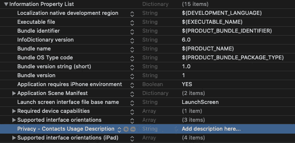
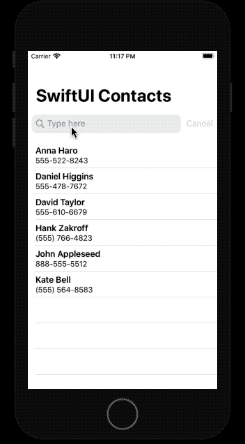

# 构建 SwiftUI 联系人搜索应用程序

> 原文：<https://betterprogramming.pub/build-a-swiftui-contacts-search-application-d41b414fe046>

## 利用 SwiftUI 的强大功能及其与 UIKit 的互操作性

马库斯·温克勒在 [Unsplash](https://unsplash.com/s/photos/search?utm_source=unsplash&utm_medium=referral&utm_content=creditCopyText) 上拍摄的照片

随着 SwiftUI 完成一年，WWDC 2020 有很多值得期待的地方。拥有一个现成的搜索栏功能应该是每个人的愿望。

在那之前，我们可以利用 SwiftUI-UIKit 互操作性来构建一个定制的搜索栏。

在接下来的部分中，我们将构建一个用于搜索联系人的 SwiftUI 应用程序。

# 行动（或活动、袭击）计划

*   使用联系人框架来获取您的电话联系人。
*   在 SwiftUI 列表中填充它们。
*   使用`UIViewRepresentable`协议为 SwiftUI 创建一个`UISearchBar`包装器。
*   根据搜索文本过滤 SwiftUI 联系人列表。

# 开始—添加隐私描述

联系人框架让您无需做任何更改即可读取信息。为了在您的应用程序中访问它，我们首先需要在`info.plist`文件中设置隐私使用描述。只需添加带有字符串值的`NSContactsUsageDescription`键，解释对权限的需求。

# 用 UIViewRepresentable 和 Coordinators 包装 UISearchBar

SwiftUI 没有内置搜索栏功能。因此，我们需要使我们的结构符合`UIViewRepresentable`协议，并在其中初始化 UIKit 的`UISearchBar`实例，如下所示:

`makeCoordinator()`函数让我们创建一个`Coordinator`类，它负责从我们的 UIKit 视图向 SwiftUI 接口传递更改。让我们定义`Coordinator`类，它也声明了`UISearchBarDelegate`协议:

# 创建一个用于获取联系人的 ObservableObject 类

`ObservableObject`协议是 Combine 框架的一部分，用于通过`@Published` 属性包装器在 SwiftUI 视图中宣布变更。

在下面的代码中，我们在确保权限被授予后获取联系人，然后将他们存储在一个`Published`属性包装数组中:

SwiftUI 需要一种唯一识别每个联系人的方法。为了做到这一点，我们在末尾创建了一个符合`Identifiable`协议的扩展。

现在，我们已经准备好在 SwiftUI 视图中集成搜索栏包装器和`ObservableObject`类实例。让我们开始吧。

# 构建 SwiftUI 视图

我们将使用一个`@EnvironmentObject`来检索联系人。属性包装器允许您访问整个应用程序中的共享数据。

在下面的代码中，通过使用 SwiftUI 列表，我们能够填充联系人，并基于`searchText`值的变化使用`filter`更新他们。

下面是我们在一个包含一些虚拟触点的模拟器上运行应用程序时的情况:

# 结论

尽管 SwiftUI 不支持内置搜索栏，但我们还是很快成功地建立了一个具有搜索功能的 SwiftUI 联系人应用程序。

用`UITableView`和`UISearchBar`做同样的事情会花费大量的时间、精力和代码。我们希望在 2020 年 WWDC 奥运会上看到 SwiftUI 2.0 增加新功能。

您可以从 [Github 资源库](https://github.com/anupamchugh/iowncode/tree/master/SwiftUIContactSearch)下载完整的源代码。

这一次到此为止。感谢阅读。