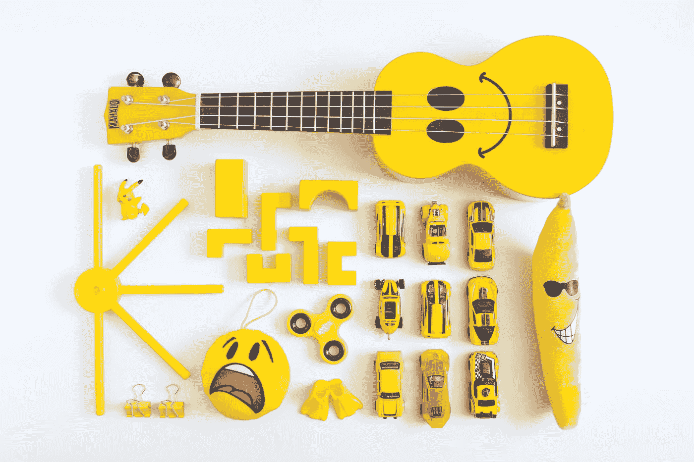
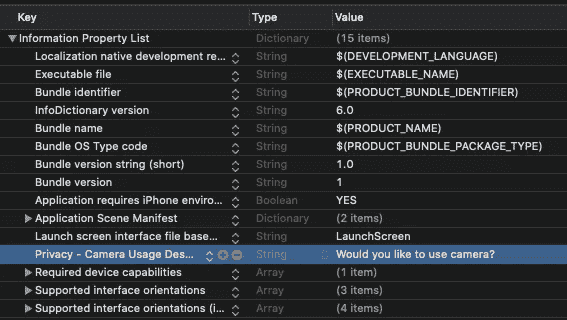
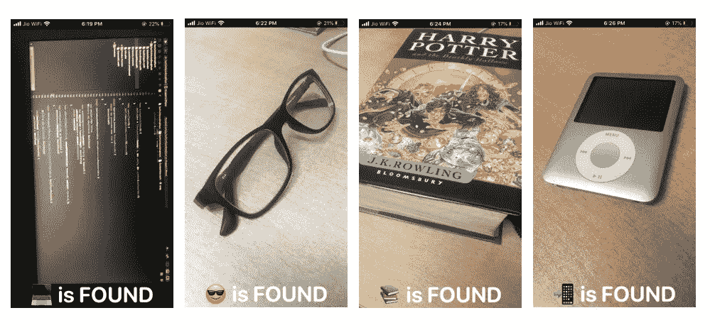
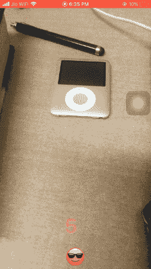

# 为 iOS 构建一个 SwiftUI + Core ML 表情符号狩猎游戏

> 原文：<https://betterprogramming.pub/build-a-swiftui-core-ml-emoji-hunt-game-for-ios-eb4465ec4153>

## 让我们创建一个有趣的机器学习 iOS 相机应用程序，让你在家里搜索类似表情符号的东西



由[凡妮莎·布切里](https://unsplash.com/@vbcreative?utm_source=medium&utm_medium=referral)在 [Unsplash](https://unsplash.com?utm_source=medium&utm_medium=referral) 拍摄的照片

手机上机器学习的出现为一系列新机会打开了大门。虽然它允许 ML 专家进入移动领域，但等式的另一端实际上是出风头者。让移动应用程序开发人员涉足机器学习实际上已经使移动应用程序开发变得如此令人兴奋。

最好的事情是，你不必为了训练或运行模型而成为机器学习专家。苹果的机器学习框架 Core ML 提供了一个易于使用的 API，让你可以在设备上运行推理(模型预测)、微调模型或者重新训练*。*

另一方面，Create ML 允许您使用拖放式 macOS 工具或在 Swift Playgrounds 中创建和训练定制的机器学习模型(目前支持图像、对象、文本、推荐系统和线性回归)。

如果这没有让你感到惊讶，那么考虑一下 [SwiftUI](https://developer.apple.com/xcode/swiftui/) ，这款新的声明式 UI 框架在 2019 年 WWDC 期间向 iOS 社区发布时引起了一场风暴。鉴于快速构建用户界面是多么容易，仅这一点就导致了大量开发人员学习 Swift 和 iOS dev。

只有 SwiftUI、Core ML 和[Vision](https://developer.apple.com/documentation/vision)(Core ML 之前的苹果计算机视觉框架)一起才能产生基于智能人工智能的应用。但这还不是全部...你也可以利用机器学习的力量来构建有趣的游戏。

在接下来的几个部分中，我们将构建一个基于摄像头的 iOS 应用程序，让您在家中搜寻表情符号，就像寻宝一样，这必须是我们现在正在玩的流行室内游戏之一，因为我们发现自己被隔离了。

# 行动（或活动、袭击）计划

*   我们将使用一个`[MobileNet](https://github.com/tensorflow/models/blob/master/research/slim/nets/mobilenet_v1.md)`核心 ML 模型来对来自相机帧的对象进行分类。如果您想阅读更多关于 MobileNet 架构的内容，请阅读这篇文章[以获得详细的概述。](https://machinethink.net/blog/googles-mobile-net-architecture-on-iphone/)
*   为了设置摄像头，我们将使用 AVFoundation，这是苹果自己的音频视频框架。在`UIViewRepresentable`的帮助下，我们将把它集成到我们的 SwiftUI 视图中。
*   我们将使用 Vision 框架驱动我们的核心 ML 模型，将模型的推理与正确的表情符号相匹配(因为每个表情符号都有一个含义)。
*   我们的游戏将包括一个计时器，用户将相机对准给定区域周围的不同对象，以找到与表情符号匹配的对象。

# 入门指南

启动 Xcode，选择 SwiftUI 作为 iOS 应用的 UI 模板。接下来，转到`info.plist`文件，添加带有描述的摄像机隐私权限。



# 使用 AVFoundation 创建自定义摄像机视图

SwiftUI 不提供 AVFoundation 的原生支持。幸运的是，我们可以利用 SwiftUI 与 UIKit 的互操作性。在此之前，让我们先设置一个自定义的摄像机视图控制器。我们最终会用 SwiftUI `struct`把它包起来。

总的来说，上面的代码做了四件事:

*   创建捕获会话。
*   获取并配置必要的捕获设备。我们会用后面的摄像头。
*   使用捕获设备设置输入。
*   配置显示摄像机帧的输出对象。

此外，我们还添加了一个自定义协议:`EmojiFoundDelegate`，当找到表情符号的等效图像时，它最终会通知 SwiftUI 视图。这是协议的代码:

```
protocol EmojiFoundDelegate{
func emojiWasFound(result: Bool)
}
```

您还会注意到在类声明中定义的协议:`AVCaptureVideoDataOutputSampleBufferDelegate`。为了符合这一点，我们需要实现`captureOutput(_:didOutputSampleBuffer:from)`函数，其中我们可以访问提取的帧缓冲区，并将它们传递给 Vision-Core ML 请求。

# 使用 Vision 和 CoreML 处理摄像机画面

既然我们的相机已经设置好了，让我们提取帧并实时处理它们。我们将把帧传递给运行核心 ML 模型的 Vision 请求。

在我们上面定义的`CameraVC`类中添加下面这段代码:

*   我们将我们的`CoreML`模型(从这里下载 [MobileNet 版本](https://developer.apple.com/machine-learning/models/)，或者您可以在本文末尾的 GitHub 资源库中找到它)包装在一个`VNCoreMLRequest`中。
*   `captureOutput`函数将从实时摄像机帧中获取的`CGSampleBuffer`转换为`CVPixelBuffer`，最终传递给`updateClassification`函数。
*   `VNImageRequestHandler`负责将输入图像转换成核心 ML 模型所需的约束——从而将我们从一些样板代码中解放出来。
*   在`processClassifications`函数中，我们将由核心 ML 模型识别的图像与`emojiString`进行比较(这是从 SwiftUI 主体接口传递过来的，我们很快就会看到)。一旦有匹配，我们就调用代理来更新 SwiftUI 视图。

既然困难的部分已经过去了，让我们跳到 SwiftUI。

# 构建我们的 SwiftUI 游戏

我们的游戏由四种状态组成:`emoji found`、`not found`、`emoji search`和`game over`。由于 SwiftUI 是一个状态驱动的框架，我们将创建一个`@State` enum 类型，它在上述状态之间切换，并相应地更新用户界面。下面是保存表情数据的`enum`和`struct`的代码:

```
enum EmojiSearch{
    case found
    case notFound
    case searching
    case gameOver
}struct EmojiModel{
    var emoji: String
    var emojiName: String
}
```

在下面的代码中，我们设置了一个给定秒数的`Timer`(在我们的例子中为 10 秒)，在此期间，用户需要搜索一个类似表情符号的图像。根据用户是否能够做到这一点，用户界面会相应地更新:

调用以下两个函数来重置每一级的定时器:

```
func instantiateTimer() {self.timer = Timer.publish(every: 1, on: .main, in: .common).autoconnect()
}func cancelTimer() {
  self.timer.upstream.connect().cancel()
}
```

现在，SwiftUI 在使用`body`中的 switch 语句时并没有真正发挥出最佳效果——除非您将它们包装在一个通用参数`AnyView`中。相反，我们将 switch 语句放在函数`emojiResultText`中，如下所示:

最后，我们需要为最初创建的`CameraVC`创建一个包装器结构。下面的代码实现了这一点，并通过了`emojiString`，它最终与 ML 模型的分类结果相匹配:

在`Coordinator`类中定义的`@Binding`属性包装器允许您从`CustomCameraRepresentable`结构更新 SwiftUI 状态。基本上,`Coordinator`类充当了 UIKit 和 SwiftUI 之间的桥梁——允许您通过使用委托和绑定属性包装器从一个更新另一个。

让我们看看 SwiftUI 游戏的一些实际输出:



这是在一堆不同对象上运行的应用程序的屏幕截图:



# 结论

我们很快就能够使用 SwiftUI、Core ML 和 Vision 构建一个小型表情符号猎人游戏。当找到表情符号等同的图像时，您可以通过添加音频来进一步改善这种体验。此外，通过使用这个神奇的库 [Smile](https://github.com/onmyway133/Smile) ，你可以快速搜索表情符号的关键字名称，反之亦然。

随着 WWDC 2020 即将到来，看看苹果如何给 Core ML 和 SwiftUI 开发者带来惊喜将会很有趣。AVFoundation 与 SwiftUI 的简单集成以及核心 ML 模型层的扩展将有助于在设备上训练更多种类的 ML 模型。

例如，RNN 的层，如 LSTM，将为基于股票市场预测的应用开辟可能性(也许现在只是为了娱乐目的。—做投资决策时不要用它们)。这是 iOS 社区热切期待的。

你可以从这个 [GitHub 库](https://github.com/anupamchugh/iowncode/tree/master/SwiftUIVisionEmojiHunt)下载完整的项目。

这一次到此为止。我希望你喜欢😎