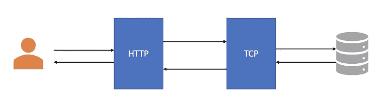
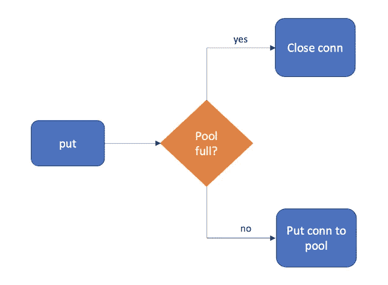
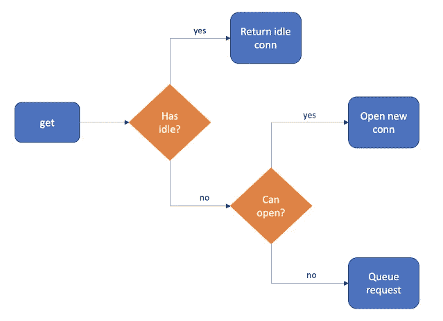
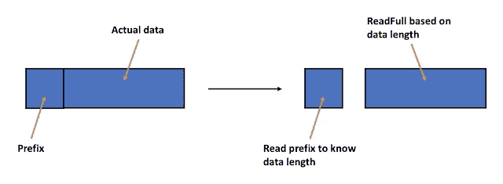

# 使用 Go 从头开始构建 TCP 连接池

> 原文：<https://betterprogramming.pub/build-a-tcp-connection-pool-from-scratch-with-go-d7747023fe14>

## 这里有一些关于如何处理可伸缩软件系统之间的连接的基本想法


由[马腾·范登赫维尔](https://unsplash.com/@mvdheuvel?utm_source=unsplash&utm_medium=referral&utm_content=creditCopyText)在 Unsplash 上拍摄

我作为初级软件工程师的入门任务是用 Go 实现一个用户注册系统。

听起来很简单，对吧？但是，存在性能要求和设计限制。

首先，我需要将所有业务逻辑放在一个 TCP 服务器中，并让一个面向客户端的 HTTP 服务器通过网络连接与之交互。



HTP-TCP 服务器架构

最重要的是，我不允许使用任何**远程过程调用(RPC)** 框架，比如 Go 的`[net/rpc](https://pkg.go.dev/net/rpc)`或者 Google 的`[gRPC](https://grpc.io/)`。我需要创建自己的逻辑来处理两台服务器之间的连接。

其次，整个系统预计支持每秒 1000 个并发HTTP 请求和 3000 个登录请求，没有缓存。数据库中还需要有 1000 万现有用户。

破解这个入口任务的关键是正确管理 HTTP 和 TCP 服务器之间的网络连接。如果可用的连接太少，您最终会得到缓慢的请求。如果太多，您的服务器将会面临连接问题。

在本文中，我将与您分享我是如何构建一个自定义连接池来实现正确的平衡的。我将用代码片段解释设计概述。我们开始吧！🏃‍♂️

# 什么是连接池？

连接池是服务器中的一组缓存连接，将来可以再次使用。

通常，打开一个新的网络连接是昂贵的。以 TCP 连接为例，客户端和服务器需要执行[三次握手](https://www.techopedia.com/definition/10339/three-way-handshake)。这是一种昂贵的操作，会消耗数据带宽并导致往返延迟。

通过使用连接池，我们可以让连接在等待处理另一个请求时保持空闲，而不是在使用后关闭它。这节省了创建新连接所需的资源。

然而，任何东西太多都是不好的。维护打开的连接也会占用服务器资源。在开放连接和重用旧连接之间需要一个恰当的平衡。

连接池需要知道何时创建、保持或删除连接。

在本文中，我们将重点关注用两个核心方法构建一个简单的连接池，`get`和`put`。

`put`的方法很简单。一旦服务器完成了一个连接，连接池就试图“保存”空闲的连接。如果池已经满了，它会关闭连接。



put 逻辑

`get`方法稍微复杂一些。除了重用空闲连接和打开新连接之外，如果连接不能立即返回，该方法还可以将连接请求排队。



获取逻辑

# Go 中的 TCP 连接

在我们开始之前(双关语)，让我展示一些关于如何在 Go 中用`[net](https://pkg.go.dev/net)`包建立 TCP 连接的快速代码片段。

我们可以使用`[Dial](https://pkg.go.dev/net#Dial)`函数创建一个从客户端到服务器的连接。

同时，`[Listen](https://pkg.go.dev/net#Listen)`函数启动一个连接服务器。`Accept`方法等待传入的请求并返回一个连接。我们可以用 Goroutines 同时处理多个请求。

我们可以从底层连接中读取数据。`[bufio.ReadBytes](https://pkg.go.dev/bufio#Reader.ReadBytes)`和`[io.ReadFull](https://pkg.go.dev/io#ReadFull)`是许多方法中的两种。

将数据写入连接甚至更容易。我们可以使用`[conn.Write](https://pkg.go.dev/net#IPConn.Write)`方法。

这些功能足够让我们入门了！现在，我们可以继续构建我们的功能性 TCP 连接池。

# 建造游泳池

在其核心，连接池必须有两个配置设置:`maxIdleCount`和`maxOpenCount`。

`maxOpenCount`限制连接池可以打开的连接总数，而`maxIdleCount`控制连接池中空闲连接的数量。这两个设置一起设置了打开新连接和重用旧连接之间的平衡。

下面是我的连接池作为 Go 结构的样子。

注意，我使用了`tcpConn`来表示 TCP 连接。它是一个定制的包装器，包含底层的`[net.Conn](https://pkg.go.dev/net#Conn)`和对池的引用。

我们现在可以开始编写我们的`get`和`put`方法了。

在`put`方法中，我们首先检查连接池是否达到了空闲连接的最大数量。如果是，我们关闭连接并递减`numOpen`计数器。如果没有，我们将连接放入池中。

另一方面，`get`方法很棘手，因为它需要在连接请求不能立即满足时对它们进行排队。

我们可以利用 Go 的渠道来满足这个要求。让我介绍一个叫做`connRequest`的新结构。它包含一个在请求完成时接收`tcpConn`的通道。然后，我们还向池中添加了一个名为`requestChan`的新字段，这是一个连接请求队列。

如果这仍然令人困惑，请不要担心。让我们一部分一部分地实现`get`方法。首先，我们处理池中有空闲连接的最简单的情况。

接下来，当不再有空闲连接并且无法打开更多连接时，我们创建一个连接请求。同样，我们利用 go 通道来创建请求队列。

一旦我们将连接请求发送到队列中，代码就会阻塞，直到其中一个案例完成。如果连接被接收，我们返回它。否则，我们返回一个错误。

最后，当不再有空闲连接并且打开的连接数量少于允许的最大数量时，我们打开一个新的连接。

注意我是如何在创建新的 TCP 连接之前递增`numOpen`计数器的。这是因为打开新连接可能会有延迟。为了不阻塞其他请求，代码首先假定一个成功的连接，这样它就可以释放互斥体。如果连接未能打开，我们递减计数器并返回一个错误。

这就结束了我们的`get`方法。现在的问题是，应该如何满足连接请求？

为此，我们将创建一个新方法`handleConnectionRequest`。它作为一个**工人**应该永远在一个单独的 goroutine 中运行。让我来演示一下。

工作线程不断地监听队列中的传入请求。当有一个，它开始一个 3 秒钟的超时。然后，它尝试满足请求，直到超时或请求完成。

默认情况和我们之前的`get`逻辑很像。我们只需要将连接传递到`connChan`中，并在成功时将`requestDone`设置为 true。如果不成功，我们进入下一个循环，并重试该过程，直到超时。

当工人就位后，请求连接的 goroutine 将得到来自`connChan`和`errChan`的响应。最后，我们可以创建一个函数来初始化池，并在一个 goroutine 中启动 worker。

厉害！这就结束了我们对 TCP 连接池的讨论。还有一个未解决的问题，我们如何正确地从 TCP 连接中读取数据？

# 协议

是的，我确实跟你说过`ReadFull`和`ReadBytes`。这些读取函数的问题是我们无法预先知道**我们需要读取多少**数据。

以`ReadFull`为例。我们需要传递给它一个预先定义好的数据长度的字节片，在读取之前接收方是不知道的。此外，创建一个非常大的切片是对空间的浪费，并且希望它能覆盖所有可能长度的数据。

`ReadBytes`怎么样？使用特定字符作为分隔符有漏洞。你永远不知道这个字符什么时候会出现在你的数据中间。**不能保证**所选择的分隔符标记了字节流的结束。

最终，我们需要一种协议，它能为传输多少数据提供强有力的保证。同时，它需要足够的可扩展性来支持不同的数据格式，如 JSON 和 T21 协议缓冲区。

为了解决这个问题，我们需要做的就是让接收者知道他们期望接收多少数据。该信息可以作为前缀**添加到要发送的实际数据中。**



协议

这个前缀的字节数是固定的。我这里是 4 字节，可以存储`uint32`，最大值 4294967295。这足以说明我的用例中的数据长度。

例如，如果我们发送 8 个字节的数据，前缀应该存储数字 12，即 4 个字节的前缀加上 8 个字节的数据。通过首先读取前缀，我们知道我们需要提供`ReadFull`来读取实际数据的字节片的大小！

让我们创建一个助手函数，为数据添加前缀。请注意，所使用的`[binary](https://pkg.go.dev/encoding/binary)`包是一个官方库，可以在数字和字节之间进行转换。

要读取数据，我们只需要在读取实际数据之前先读取前缀。这仅用`io.ReadFull`就可以做到。

将数据写入连接就像调用`conn.Write`一样简单。我们只需要使用`createTcpBuffer`来确保前缀存在。

协议到此为止！虽然简单，但只要客户机和服务器同意相同的前缀大小，就足以确保读取正确的数据量。

# 改进的余地

我描述的连接池好到足以通过我的入门任务需求(耶！).但是，这并不意味着它不能进一步改进。

## 最大空闲时间

还记得我提到过在池中保持空闲连接会消耗服务器资源吗？如果在一段时间内没有传入连接，这是一种浪费。为了节省资源，我们可以关闭那些**打开时间过长**的空闲连接。

我们可以通过向我们的池中添加一个名为`maxIdleTime`的新配置设置来实现这一点。当一个连接被放入池中时，可以启动一个个人计时器。当到达`maxIdleTime`时，连接应自动关闭。

## 关闭故障连接

读写错误时有发生。当出现这种错误时，我们应该假设连接有故障。我们可以关闭它，而不是把它放回游泳池。

## 正常关机

正常关闭 Go 服务器是一个很好的做法，可以确保在关闭服务器连接之前，所有正在进行的请求都被正确终止。这可以防止损害用户体验并可能导致数据丢失的突然关机。

Go 服务器可以通过首先捕获 SIGINT 和 SIGTERM 信号，然后采取相应的行动来正常关闭。该池可以为服务器提供一个清理功能，以便在关闭时调用。

不需要太多的细节，清理过程可以在关闭连接之前等待连接不再被使用。还需要有一个超时，以防连接被卡住，需要“硬关闭”。

# 最后的想法

本文到此为止！如果您希望了解更多关于连接池的细节，我强烈推荐您阅读 Go 的`[sql](https://github.com/golang/go/blob/master/src/database/sql/sql.go)`包的源代码。

希望您和我一样喜欢这篇文章，并对连接池的工作原理有所了解。感谢阅读。

```
**Want to Connect With the Author?**You can find me on [LinkedIn](https://www.linkedin.com/in/jonathanseow5177/).
```