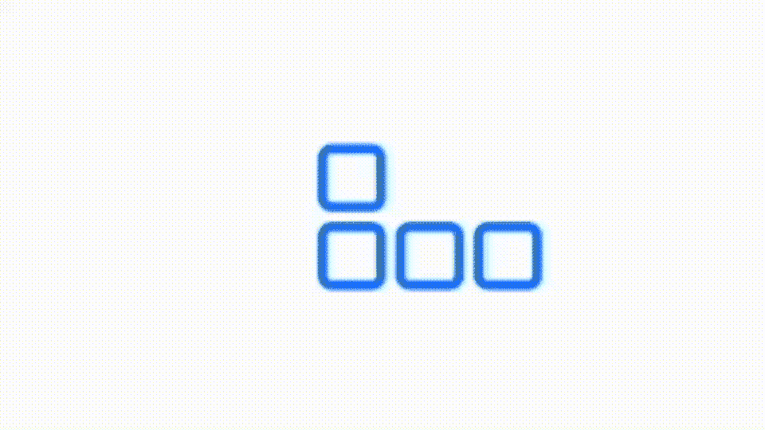
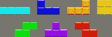
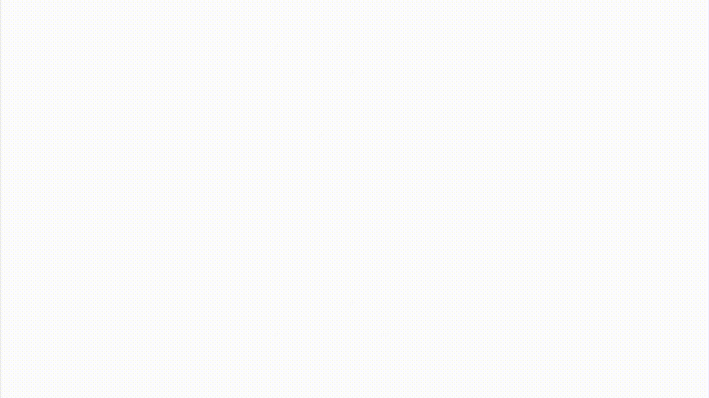
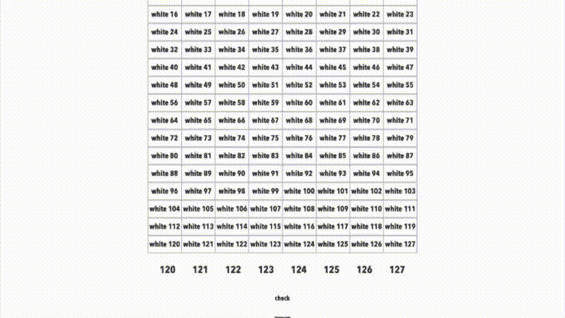
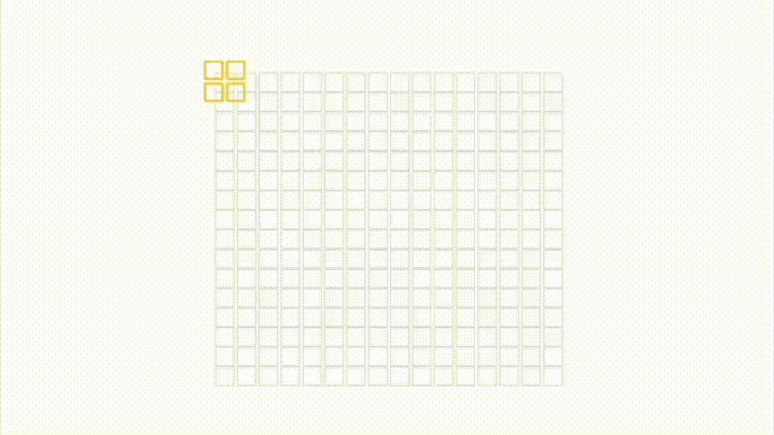
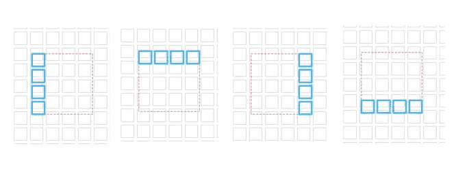
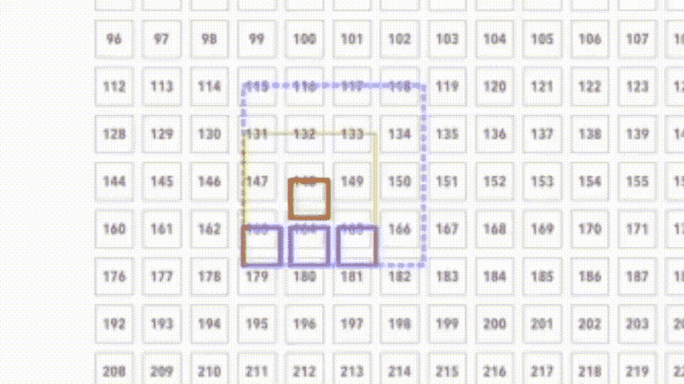
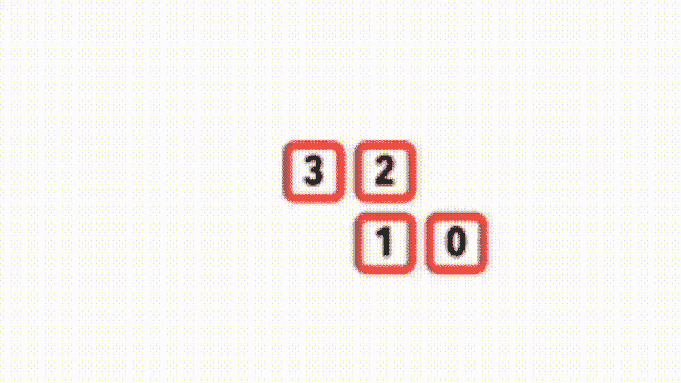

# 使用 SwiftUI 构建一个俄罗斯方块游戏

> 原文：<https://betterprogramming.pub/build-a-tetris-game-using-swiftui-c8c9b1722259>

## 用代码创建你自己版本的经典游戏



标准俄罗斯方块的动画

1979 年，阿莱克西·帕杰诺夫创造了一个游戏，他称之为俄罗斯方块。这款游戏将成为 2D 的经典之作，拥有庞大的追随者，至今仍活跃在人们的视野中。一个有着巨大编码挑战的游戏。请和我一起尝试使用 SwiftUI 构建俄罗斯方块。

# 游戏部分

bon——那么这个游戏的规则是什么——这是最基本的；不同形状的方块出现在屏幕的顶部，然后慢慢落到底部。玩家可以旋转并向左或向右移动砖块，这样当他们到达那里时，他们将会组合在一起。

当玩家完成一行时，它会消失，降低它上面的所有方块。游戏的目标是确保方块线永远不会到达屏幕顶部。官方的[维基百科]方块形状是这样的。



# 旅行

当你阅读这篇文章时，请注意；解决方案需要几经周折；在你复制任何东西之前，阅读所有的东西。

# 细胞

我从一个简单的 SwiftUI 网格开始，网格有 128 个单元——横向 8 个单元，纵向 16 个单元。



几乎是 SwiftUI 下运行的 connect-4 的游戏

细胞的颜色是通过一条信息来管理的，这条信息表示细胞变成了红色。

单元本身将在半秒钟后变回原样，除非在消息中明确告知不要这样做。

一个计时器管理消息的触发，一个数组跟踪每行的最后一个单元格。

除了自动操作之外，我还在代码中添加了一个拖动手势，我在这里使用它来更改激活的单元格传递下来的列。

## 线

粘合-下一阶段是检测和移除完成线。



一个动画 GIF 展示了俄罗斯方块的取消

我放大了一点，并改变了输出，以使发生的事情更加明显。现在，每个块都有一个显示其索引和值的标签。一旦不再是基本单元格，黑色单元格编号线就会变为蓝色。

将所有盒子下移一格并改变黑/蓝市场的代码如下所示。

```
for i in stride(from: 119, through: 0, by: -1) {
  blocks[i + 8] = blocks[i]
}for i in 0...7 {
  if lastLine[i] < 120 {
    lastLine[i] += 8
  }
}
c2hanger.send()
```

这里的最后一条指令是`passthroughSubject`，它触发了单元结构中的这一行简单的代码。

```
.onReceive(c2hanger, perform: { _ in
  color = blocks[item]
}
```

我改变了我如何管理瓷砖，因为我把第二阶段在一起。在最初的构建中，我使用了一个 passthrough 主题来改变磁贴的颜色，用消息来寻址各个磁贴。这是一个扩展性不好的解决方案，如果我试图在一个紧凑的循环中改变所有 128 个图块，就会丢失图块。在第二版中，我使由组合消息触发的动作尽可能短，首先改变数据库，然后改变显示。

# 重新启动

整个事情感觉就像我在用汇编语言写它；当然，我可以使用 SwiftUI 原语，如 rotate。

我回到绘图板，从不同的角度来看解决这个问题。请注意，正如我所做的，“官方设置”都是由四个正方形组成的，这不是巧合；我敢说——也许是我建造它所需要的代码的线索。

## 结构

我使用几何阅读器重新起草了一个新项目，在其中添加了一组俄罗斯方块形状。
这是第一稿的动画 GIF。



重新启动显示俄罗斯方块的形状，一项工作正在进行中

我使用网格作为我的形状动画点的数据库。既然我现在有了形状，我就可以用 SwiftUI `rotateEffect`来做这件事。它解决了我在第一次实现时面临的一个主要难题。

现在有了一系列新的问题——排列和堆叠。最明显的问题看起来像对齐。没有一个形状相互对齐；真是一团糟。在开始这段代码之前，我就应该看到这一点。

## 对齐形状

我写了一整篇文章来介绍我在这里使用的解决方案:SwiftUI 中的对齐参考线和框架。我首先关注的是`ZStack`，以及一个支架。

然后我给每个形状添加了一条边。这里用红色显示了一个结构。效果很好。现在所有的形状都一样大，并且在网格的底部互相对齐。


但是，一如既往，细节决定成败。正如你从这一系列图像中看到的，旋转图形产生了新的挑战。



青色块是最有问题的。当我旋转青色方块时，它们无法在底部排成一行。

第二张图片显示了最糟糕的违规者，它与其他物体发生了碰撞。

在这个特殊形状的例子中，在一次旋转中也有大量的运动，这是第二个问题，当你从左向右旋转它时，有效地穿过两个街区。

作为一个坚忍不拔的人，我一直保持低调，用更多的 SwiftUI 对齐方式解决了这个挑战，将形状从左边移到中间，从高到低。


添加 SwiftUI 对齐后的青色形状。

看起来好像我赢了，直到我试着排列下一个形状，紫色的。



紫色的形状(在我使用任何代码尝试对齐它之前)。

这是相当具有挑战性的，因为不像我在一条边上对齐图像的那条线，将所有形状对齐到一个边界是行不通的，因为它改变了正方形的排列。我必须在两个水平和垂直平面上对齐它——这是一项定制对齐的工作。

## 变化

当我想出如何对我的紫色形状进行更复杂的对齐时，我突然意识到，改变我一直小心对齐的形状的要求是我没有足够仔细考虑的下一个挑战。我需要把青色的形状变短，所以我有三个版本。紫色的形状可能会失去一个方块，一个双方块，甚至所有三个方块。他们都不一样。呀！

我需要设计一种方法，使每个形状中的单个方块可消耗，而不仅仅是不可见。这样做无疑意味着我将不得不重新审视我刚刚实施的校准解决方案——我已经向前迈了一步，又向后退了两步。

这个版本变成了一个大白象，是吗？

## 重新想象

考虑到这个问题和解决方案，我决定在更大范围内使用自定义对齐。正如我对第一个版本所做的那样，我将把整个东西建立在正方形的基础上，而不是形状。广场，我会使用自定义对齐定位，所以第一个和第二个版本的混合。

# 最终实施

我从定制代码开始对齐形状，这一次，集中在用一个正方形和一个形状完成所有需求；仅此而已——所有要求。

*   为了能够在屏幕上缓慢移动一个或多个方格
*   为了能够根据命令向左或向右移动所述方块
*   能够创建一个可寻址的方块集合来组成不同的形状
*   以四种不同的配置旋转所述形状，而不重建所述形状。
*   能够找到一个正方形或直线并让它消失
*   重新排列剩下的积木，没有太多的痛苦。

我怀疑我可以用大量的代码和调整来完成第一个版本的需求——我希望我可以用更少的代码使用 alignment 来完成这些需求。



旋转形状的示例

我画了一个正方形，在这个正方形内我会排列几十个小得多的正方形。我创造的每个形状都是由四个小方块组成的；一组自定义对齐控制着它们的位置。

我为每个形状编写了自定义布局，就像我在第一个版本中一样。然后，我需要改变多达四个额外的设置时，所说的形状旋转布局。这是我在代码中的做法。

我通过给方块编号使工作变得更容易；如 GIF 所示，这些图形反映了它们在数组块中的位置。

当然，当我旋转图形时，我需要担心与其他方块冲突的方块也发生了变化。因此，我必须在代码中添加额外的规则来考虑这一点。


正在进行的最后一场比赛

我用高亮显示的瓷砖标出我编码的形状，使这项工作变得更容易，这里用浅红色显示。

最后，我组装了一个各种各样的“机器人”来查看我的数据库中已完成的线条，添加代码将它们更改为空容器(我第一次使用它们时)，并更改其余形状的对齐规则。

我对最终的解决方案很满意。它可以在纵向或横向模式下[动态]与您的设备配合使用，并且可以轻松更新以适应不同大小的设备。在我结束之前，这里有一个 SwiftUI 中单个俄罗斯方块的截图。以及那些自定义的对齐方式，以使其处于受控状态。

# 结论

这是一个漫长而艰难的旅程，最终我设法制作了我自己的俄罗斯方块。事实上，在这个过程中，我甚至有了一些关于如何更新游戏来创造新挑战的想法。